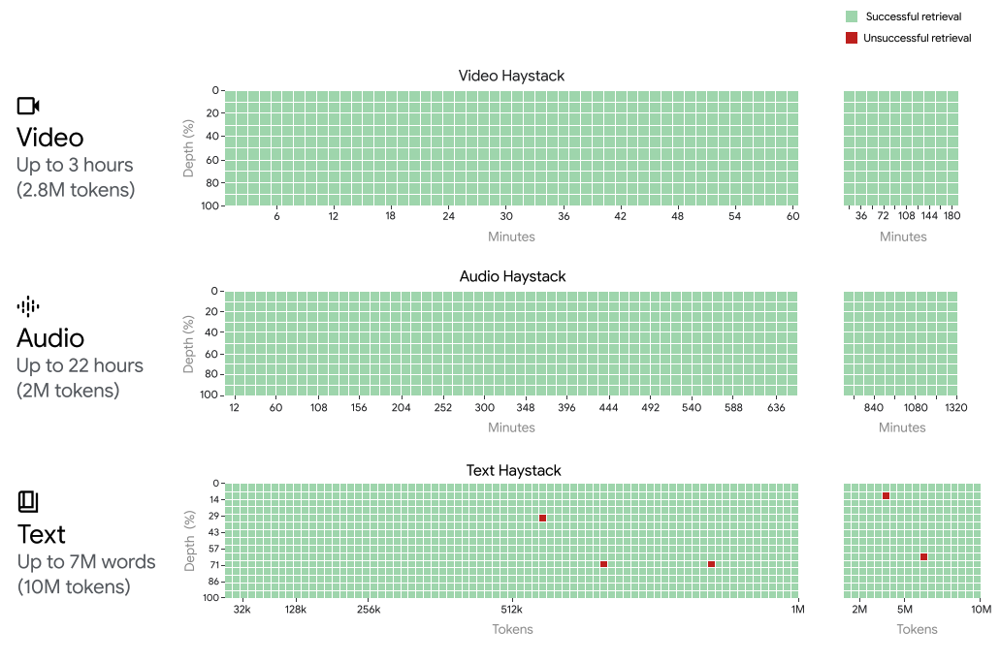
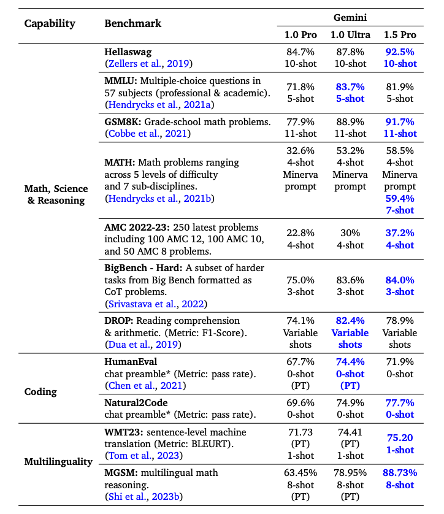
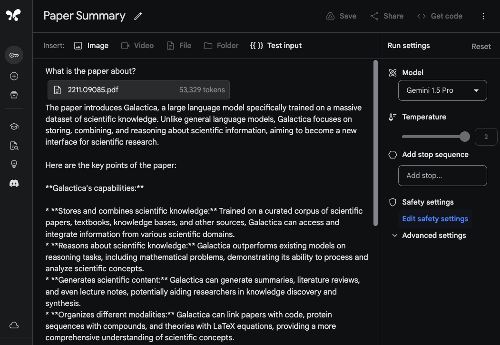
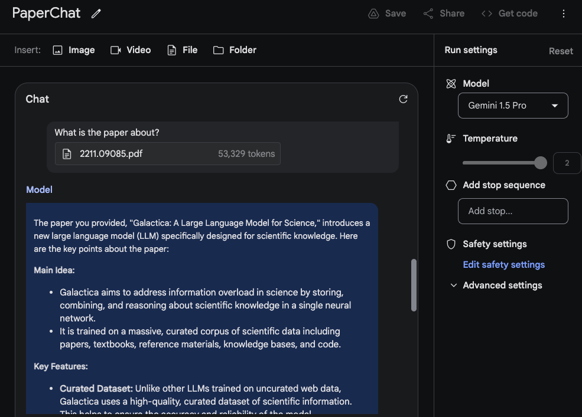
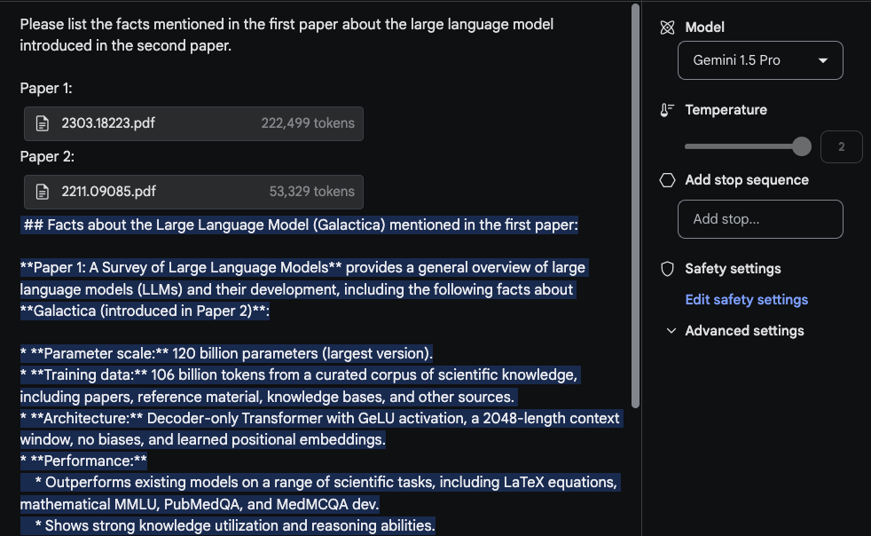
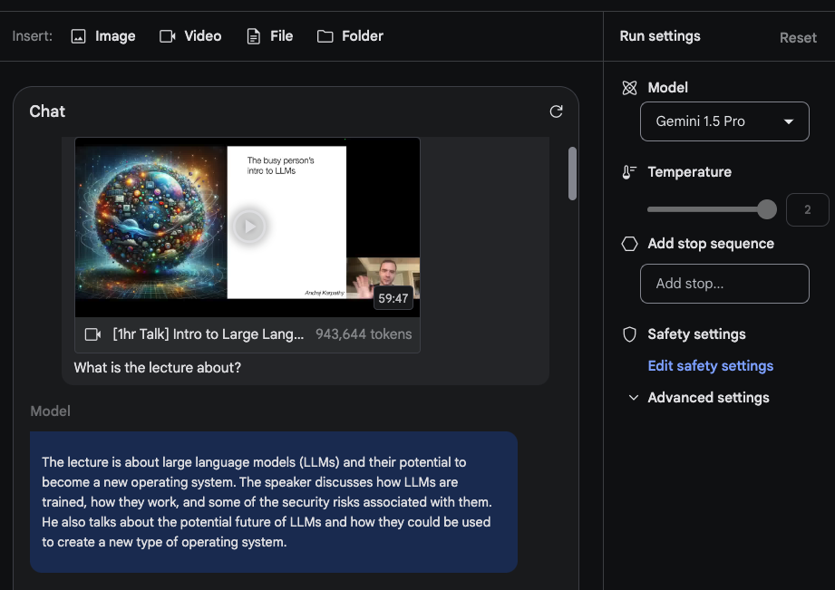
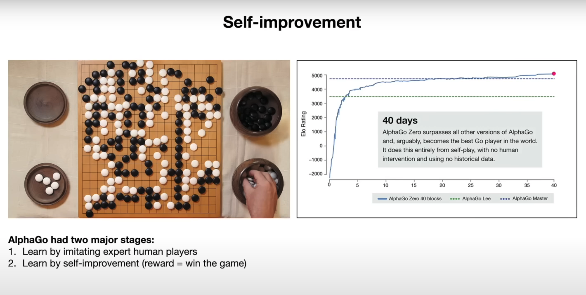
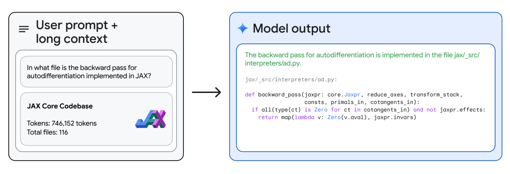
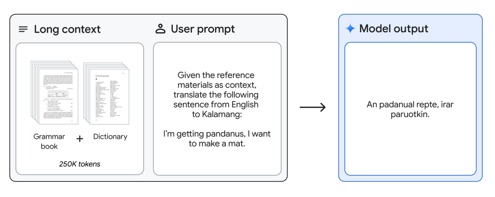

# Gemini 1.5 Pro

Google introduces Gemini 1.5 Pro, a compute-efficient multimodal mixture-of-experts model. This AI model focuses on capabilities such as recalling and reasoning over long-form content. Gemini 1.5 Pro can reason over long documents potentially containing millions of tokens, including hours of video and audio. Gemini 1.5 Pro improves the state-of-the-art performance in long-document QA, long-video QA, and long-context ASR. Gemini 1.5 Pro matches or outperforms Gemini 1.0 Ultra across standard benchmarks and achieves near-perfect retrieval (>99%) up to at least 10 million tokens, a significant advancement compared to other long context LLMs. 

As part of this release, Google is also featuring a new experimental 1 million token context window model which will be available to try out in Google AI Studio. To put it in context, 200K is the largest context window to date of any available LLM. With the 1 million context window, Gemini 1.5 Pro aims to unlock all sorts of use cases that include Q&A over large PDFs, code repositories, and even lengthy videos as prompts in Google AI Studio. It supports a mix of audio, visual, text, and code inputs in the same input sequence.

## Architecture
Gemini 1.5 Pro is a sparse mixture-of-experts (MoE) Transformer based model built on Gemini 1.0's multimodal capabilities. The benefit of MoE is that the total parameters of the model can grow while keeping the number of parameters that are activated constant. There aren't too many details in the [technical report](https://storage.googleapis.com/deepmind-media/gemini/gemini_v1_5_report.pdf), but it's reported that Gemini 1.5 Pro uses significantly less training compute, is more efficient to serve, and involves architecture changes that enable long-context understanding (up to 10 million tokens). The model is pre-trained on data including different modalities and instructions tuned with multimodal data, with further tuning based on human preference data.


## Results
Gemini 1.5 Pro achieves near-perfect "needle" recall of up to 1 million tokens in all modalities, i.e., text, video, and audio. To put the context window support of Gemini 1.5 Pro into perspective, Gemini 1.5 Pro can process and maintain recall performance when extending to:

- ~22 hours of recordings
- 10 x 1440 pages book
- entire codebases
- 3 hours of video at 1 fps



Gemini 1.5 Pro surpasses Gemini 1.0 Pro on the majority of benchmarks with significant performance in Math, Science, Reasoning, Multilinguality, Video Understanding, and Code. Below is a table summarizing the results of the different Gemini models. Gemini 1.5 Pro also outperforms Gemini 1.0 Ultra on half of the benchmarks despite using significantly less training compute. 



## Capabilities

The remaining subsections highlight a range of capabilities possible with Gemini 1.5 Pro, ranging from analyzing large amounts of data to long-context multimodal reasoning. Some of the capabilities have been reported in the paper, by the community, and from our experiments.

### Long Document Analysis

To demonstrate Gemini 1.5 Pro abilities to process and analyze documents, we start with a very basic question answering task. the Gemini 1.5 Pro model in the Google AI Studio supports up to 1 million tokens so we are able to upload entire PDFs. The example below shows that a single PDF has been uploaded along with a simple prompt `What is the paper about?`:



The model's response is accurate and concise as it provides an acceptable summary of the [Galactica paper](https://arxiv.org/abs/2211.09085). The example above uses a freeform prompt within Google AI Studio but you can also use the chat format to interact with an uploaded PDF. This is a useful feature if you have many questions you would like to get answered from the provided document/s.



To leverage the long context window, let's now upload two PDFs and ask a question that spans both PDFs. 



The response is reasonable and the interesting part is the information extracted from the first paper, which is a [survey paper on LLMs](https://arxiv.org/abs/2303.18223), comes from a table. The "Architecture" information also looks correct. However, the "Performance" section doesn't belong there because it's not found in the first paper. For this task, it was important to put the prompt `Please list the facts mentioned in the first paper about the large language model introduced in the second paper.` at the top and label the papers with tags such as `Paper 1` and `Paper 2`. Another related follow-up task to this experiment would be to write a related work section by uploading a set of papers and the instructions for how to summarize them. Another fun one would be to ask the model to incorporate newer LLM papers into the survey.

### Video Understanding

Gemini 1.5 Pro is trained with multimodal capabilities from the ground up and it also demonstrates video understanding capabilities. We tested a few prompts with one of the [recent lectures on LLMs by Andrej Karpathy](https://www.youtube.com/watch?v=zjkBMFhNj_g&ab_channel=AndrejKarpathy). 

For this short demo, we created a `Chat prompt` and uploaded the YouTube video containing Karpathy's lecture. The first question is `What is the lecture about?`. Nothing too fancy here but the response is acceptable as it accurately summarizes the lecture.



The second task we prompt the model to perform is to provide a concise outline (one-page length) of the lecture. The response is as follows (edited for brevity):

```markdown
## Large Language Models: A New Operating System?
Introduction:

- LLMs are trained on massive amounts of text data and can generate human-quality text.
- They are becoming increasingly powerful and are being used for a wide range of tasks, such as writing, translation, and coding.

How LLMs Work:

- LLMs are neural networks that predict the next word in a sequence.
- They learn by iteratively adjusting their parameters to make better predictions.
- While we can measure their performance, we don't fully understand how the billions of parameters collaborate to achieve it.

Training LLMs:

- Requires massive amounts of data and computing power.
- Can be thought of as "compressing the internet" into a single file.
- For example, training LLaMA 2 70B required 6,000 GPUs for 12 days and cost ~$2 million.

LLM Security:

- LLM security is a new and rapidly evolving field.
- Some key security risks include:
    - Jailbreaking: bypassing safety mechanisms to generate harmful content.
    - Prompt injection: injecting malicious code into prompts to control the LLM's output.
    - Data poisoning / Backdoor attacks: inserting crafted text into the training data to influence the LLM's behavior.
...
```

The summary is very concise and represents a good outline of the lecture along with the key points. We didn't assess the entire output for accuracy but it's interesting to see the model output informative bits like `"training LLaMA 2 70B required 6,000 GPUs for 12 days and cost ~$2 million."`

When the specific details are important, keep in mind the model may at times "hallucinate" or retrieve the wrong information for various reasons. For instance, when we prompted the model `What are the FLOPs reported for Llama 2 in the lecture?` it responded with `The lecture reports that training Llama 2 70B required approximately 1 trillion FLOPs.` which is not accurate. The correct response should be `~1e24 FLOPs`. The technical report contains many instances of where these long context models fail when asked specific questions about the video.

The next task involves extracting table information from the video. The example shows the prompt and response. We can observe that the model generated a table and it got a few details right and some wrong. For instance, the table columns are correct but one of the row labels is wrong (i.e., `Concept Resolution` should be `Coref Resolution`). We tested a few of these extraction tasks with other tables and other different elements like text boxes and we noticed similar inconsistencies. 

An interesting example documented in the technical report is the ability of the model to retrieve details from the video based on specific scenes or timestamps. In the first example, we prompted the model to answer with where a specific section starts.

Prompt:
```
At what timestamp does the LLM OS section start?
```

Output:
```
The LLM OS section starts at 42:17.
```

The response is correct. 

In the next example, we ask the model to explain a chart found in the slides. 

Prompt:
```
Can you explain the chart (on the right-hand side) on the self-improvement slide?
```

Output:
```
The chart shows the performance of AlphaGo Zero over time, as measured by its Elo rating. The Elo rating is a measure of a player's skill in a game, with higher ratings indicating stronger players. The chart shows that AlphaGo Zero's performance improved rapidly over the course of 40 days, eventually surpassing the performance of all other versions of AlphaGo, including the version that defeated the world champion Go player Lee Sedol. This improvement was achieved entirely through self-play, with no human intervention or historical data.
```

The model seems to make good use of the information provided to explain the results in the chart. Below is a snapshot of the corresponding slide:



### Code Reasoning
With its long-context reasoning, Gemini 1.5 Pro is can answer questions about the codebase. Using Google AI Studio, Gemini 1.5 Pro allows up to 1 million tokens, so we can upload an entire codebase and prompt it with different questions or code-related tasks. The technical report provides an example where the model is given the entire JAX codebase in context (~746K tokens) and asked to identify the location of a core automatic differentiation method. 



### English to Kalamang Translation
Gemini 1.5 Pro can be provided a grammar manual (500 pages of linguistic documentation, a dictionary, and ~400 parallel sentences) for Kalamang, a language spoken by fewer than 200 speakers worldwide, and translates English to Kalamang at the level of a person learning from the same content. This showcases the in-context learning abilities of Gemini 1.5 Pro enabled through long context.




Figures source: [Gemini 1.5: Unlocking multimodal understanding across millions of tokens of context](https://storage.googleapis.com/deepmind-media/gemini/gemini_v1_5_report.pdf)

## References

- [Gemini 1.5: Unlocking multimodal understanding across millions of tokens of context](https://storage.googleapis.com/deepmind-media/gemini/gemini_v1_5_report.pdf)
- [Gemini 1.5: Our next-generation model, now available for Private Preview in Google AI Studio](https://developers.googleblog.com/2024/02/gemini-15-available-for-private-preview-in-google-ai-studio.html)