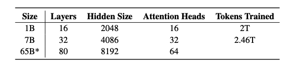
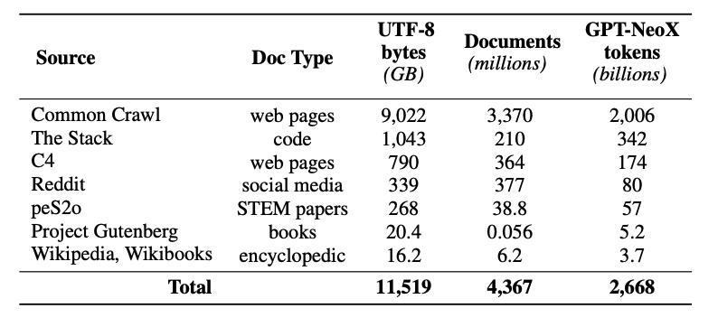
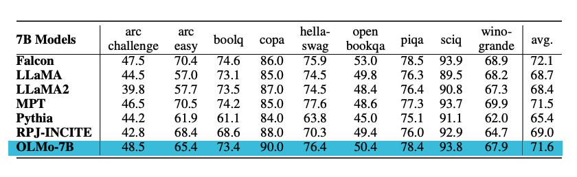

# OLMo

In this guide, we provide an overview of the Open Language Mode (OLMo), including prompts and usage examples. The guide also includes tips, applications, limitations, papers, and additional reading materials related to OLMo.

## Introduction to OLMo

The Allen Institute of AI has [released](https://blog.allenai.org/olmo-open-language-model-87ccfc95f580) a new open language model and framework called OLMo. This effort is meant to provide full access to data, training code, models, evaluation code so as to accelerate the study of language models collectively. 

Their first release includes four variants at the 7B parameter scale and one model at the 1B scale, all trained on at least 2T tokens. This marks the first of many releases which also includes an upcoming 65B OLMo model.

The releases includes:

- full training data, including the [code](https://github.com/allenai/dolma) that produces the data
- full models weights, [training code](https://github.com/allenai/OLMo), logs, metrics, and inference code
- several checkpoints per model
- [evaluation code](https://github.com/allenai/OLMo-Eval)
- fine-tuning code 

All the code, weights, and intermediate checkpoints are released under the [Apache 2.0 License](https://github.com/allenai/OLMo#Apache-2.0-1-ov-file).

## OLMo-7B 

Both the OLMo-7B and OLMo-1B models adopt a decoder-only transformer architecture. It follows improvements from other models like PaLM and Llama:

- no biases
- a non-parametric layer norm
- SwiGLU activation function
- Rotary positional embeddings (RoPE)
- a vocabulary of 50,280

## Dolma Dataset

This release also includes the release a pre-training dataset called [Dolma](https://github.com/allenai/dolma) -- a diverse, multi-source corpus of 3 trillion token across 5B documents acquired from 7 different data sources. The creation of Dolma involves steps like language filtering, quality filtering, content filtering, deduplication, multi-source mixing, and tokenization.

The training dataset includes a 2T-token sample from Dolma. The tokens are concatenated together after appending a special `EOS` token to the end of each document. The training instances include groups of consecutive chunks of 2048 tokens, which are also shuffled. 

More training details and hardware specifications to train the models can be found in the paper. 

## Results

The models are evaluated on downstream tasks using the [Catwalk](https://github.com/allenai/catwalk). The OLMo models are compared to other several publicly available models like Falcon and Llama 2. Specifically, the model is evaluated on a set of tasks that aim to measure the model's commonsense reasoning abilities. The downstream evaluation suite includes datasets like `piqa` and `hellaswag`. The authors perform zero-shot evaluation using rank classification (i.e., completions are ranked by likelihood) and accuracy is reported. OLMo-7B outperforms all other models on 2 end-tasks and remains top-3 on 8/9 end-tasks. See a summary of the results in the chart below.

## Prompting Guide for OLMo

Coming soon...

---

Figures source: [OLMo: Accelerating the Science of Language Models](https://allenai.org/olmo/olmo-paper.pdf)

## References

- [OLMo: Open Language Model](https://blog.allenai.org/olmo-open-language-model-87ccfc95f580)
- [OLMo: Accelerating the Science of Language Models](https://allenai.org/olmo/olmo-paper.pdf)