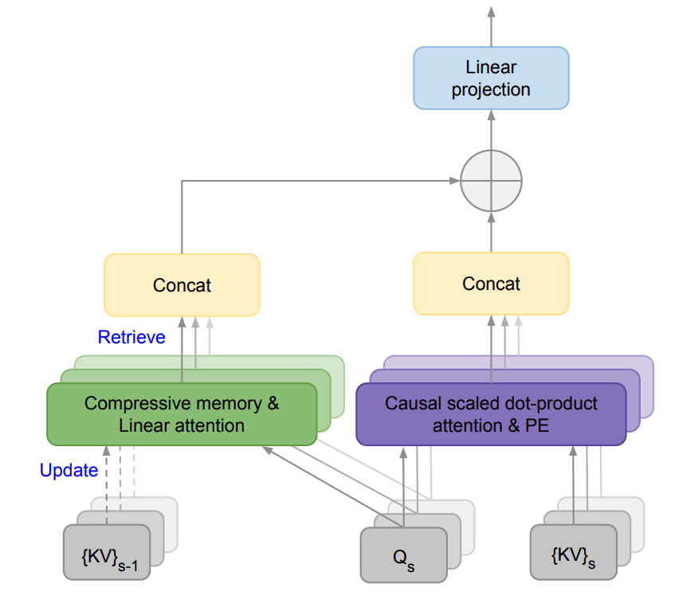

# Efficient Infinite Context Transformers

import {Bleed} from 'nextra-theme-docs'

<iframe width="100%"
  height="415px"
  src="https://www.youtube.com/embed/tOaTaQ8ZGRo?si=pFP-KiLe63Ppl9Pd" allow="accelerometer; autoplay; clipboard-write; encrypted-media; gyroscope; picture-in-picture"
  allowFullScreen
  />

A new [paper](https://arxiv.org/abs/2404.07143) by Google integrates compressive memory into a vanilla dot-product attention layer. 

The goal is to enable Transformer LLMs to effectively process infinitely long inputs with bounded memory footprint and computation.

They propose a new attention technique called Infini-attention which incorporates a compressive memory module into a vanilla attention mechanism. 

It builds in both masked local attention and long-term linear attention into a single Transformer block. This allows the Infini-Transformer model to efficiently handle both long and short-range contextual dependencies. 

This approach outperforms baseline models on long-context language modeling with a 114x compression ratio of memory!

They also show that a 1B LLM can naturally scale to a 1M sequence length and a 8B model achieves a new SoTA result on a 500K length book summarization task.

Given how important long-context LLMs are becoming having an effective memory system could unlock powerful reasoning, planning, continual adaption, and capabilities not seen before in LLMs.
