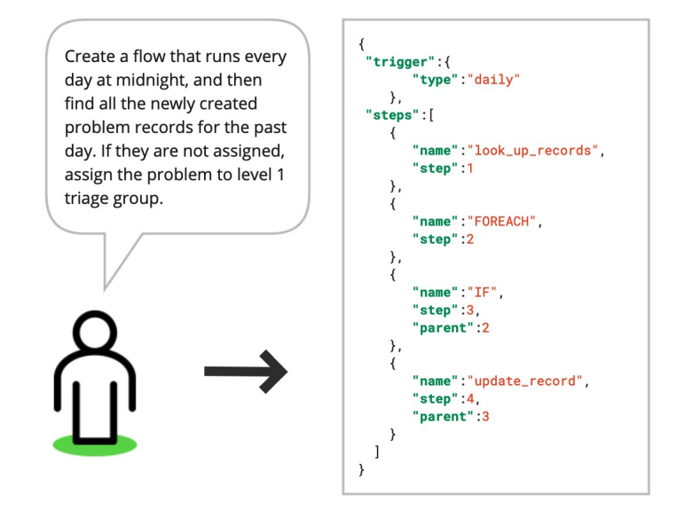

# Reducing Hallucination in Structured Outputs via RAG

import {Bleed} from 'nextra-theme-docs'

<iframe width="100%"
  height="415px"
  src="https://www.youtube.com/embed/TUL5guqZejw?si=Doc7lzyAY-SKr21L" allow="accelerometer; autoplay; clipboard-write; encrypted-media; gyroscope; picture-in-picture"
  allowFullScreen
  />

Researchers at ServiceNow shared a [new paper](https://arxiv.org/abs/2404.08189) where they discuss how to deploy an efficient RAG system for structured output tasks.

The RAG system combines a small language model with a very small retriever. It shows that RAG can enable deploying powerful LLM-powered systems in limited-resource settings while mitigating issues like hallucination and increasing the reliability of outputs.

The paper covers the very useful enterprise application of translating natural language requirements to workflows (formatted in JSON). So much productivity can come from this task but there is a lot of optimization that can be further achieved (eg., using speculative decoding or using YAML instead of JSON).

The paper provides some great insights and practical tips on how to effectively develop RAG systems for the real world.
