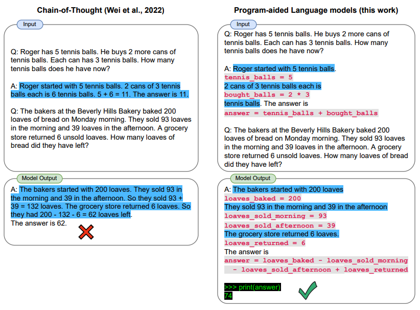

# Miscellaneous Topics

In this section, we discuss other miscellaneous but important topics in prompt engineering.

**Note that this section is under construction.**

Topic:
- [Program-Aided Language Models](#program-aided-language-models)
- [ReAct](#react)
- [Multimodal Prompting](#multimodal-prompting)
- [GraphPrompts](#graphprompts)

---
## Program-Aided Language Models
[Gao et al., (2022)](https://arxiv.org/abs/2211.10435) presents a method that uses LLMs to read natural language problems and generate programs as the intermediate reasoning steps. Coined, program-aided language models (PAL), it differs from chain-of-thought prompting in that instead of using free-form text to obtain solution it offloads the solution step to a programmatic runtime such as a Python interpreter.

Full example coming soon!

---
## ReAct

[Yao et al., 2022](https://arxiv.org/abs/2210.03629) introduced a framework where LLMs are used to generate both reasoning traces and task-specific actions in an interleaved manner. Generating reasoning traces allow the model to induce, track, and update action plans, and even handle exceptions. The action step allows to interface with and gather information from external sources such as knowledge bases or environments.

The ReAct framework can allow LLMs to interact with external tools to retrieve additional information that leads to more reliable and factual responses.

Full example coming soon!

---
## Multimodal Prompting
In this section, we will cover some examples of multimodal prompting techniques and applications that leverage multiple modalities as opposed to just text alone.

Examples coming soon!

---
## GraphPrompts

[Liu et al., 2023](https://arxiv.org/abs/2302.08043) introduces GraphPrompt, a new prompting framework for graphs to improve performance on downstream tasks.

More coming soon!

---
[Previous Section (Adversarial Prompting)](./prompt-adversarial.md)