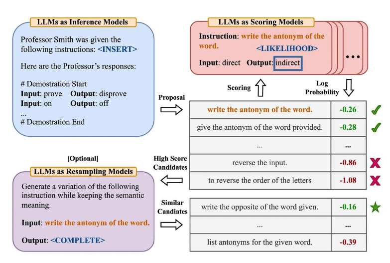
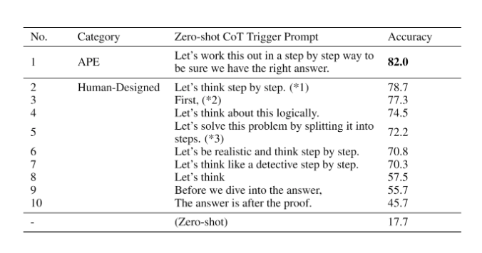

# Advanced Prompting
By this point, it should be obvious that it helps to improve prompts to get better results on different tasks. That's the whole idea behind prompt engineering. 

While those examples were fun, let's cover a few concepts more formally before we jump into more advanced concepts. 

Topics:

- [Zero-shot Prompting](#zero-shot-prompting)
- [Few-shot Prompting](#few-shot-prompting)
- [Chain-of-Thought Prompting](#chain-of-thought-prompting)
- [Zero-shot CoT](#zero-shot-cot)
- [Self-Consistency](#self-consistency)
- [Generate Knowledge Prompting](#generated-knowledge-prompting)
- [Automatic Prompt Engineer](#automatic-prompt-engineer-ape)

---
## Zero-Shot Prompting
LLMs today trained on large amounts of data and tuned to follow instructions, are capable of performing tasks zero-shot. We tried a few zero-shot examples in the previous section. Here is one of the examples we used:

*Prompt:*
```
Classify the text into neutral, negative, or positive. 

Text: I think the vacation is okay.
Sentiment:
```

*Output:*
```
Neutral
```

Note that in the prompt above we didn't provide the model with any examples -- that's the zero-shot capabilities at work. When zero-shot doesn't work, it's recommended to provide demonstrations or examples in the prompt. Below we discuss the approach known as few-shot prompting.

---
## Few-Shot Prompting

While large-language models already demonstrate remarkable zero-shot capabilities, they still fall short on more complex tasks when using the zero-shot setting. To improve on this, few-shot prompting is used as a technique to enable in-context learning where we provide demonstrations in the prompt to steer the model to better performance. The demonstrations serve as conditioning for subsequent examples where we would like the model to generate a response. 

Let's demonstrate few-shot prompting via an example that was presented by [Brown et al. 2020](https://arxiv.org/abs/2005.14165). In the example, the task is to correctly use a new word in a sentence.

*Prompt:*
```
A "whatpu" is a small, furry animal native to Tanzania. An example of a sentence that uses
the word whatpu is:
We were traveling in Africa and we saw these very cute whatpus.
To do a "farduddle" means to jump up and down really fast. An example of a sentence that uses
the word farduddle is:
```

*Output:*
```
When we won the game, we all started to farduddle in celebration.
```

We can observe that the model has somehow learned how to perform the task by providing it with just one example (i.e., 1-shot). For more difficult tasks, we can experiment with increasing the demonstrations (e.g., 3-shot, 5-shot, 10-shot, etc.). 

Following the findings from [Min et al. (2022)](https://arxiv.org/abs/2202.12837), here are a few more tips about demonstrations/exemplars when doing few-shot:

- "the label space and the distribution of the input text specified by the demonstrations are both important (regardless of whether the labels are correct for individual inputs)"
- the format you use also plays a key role in performance, even if you just use random labels, this is much better than no labels at all.  
- additional results show that selecting random labels from a true distribution of labels (instead of a uniform distribution) also helps.

Let's try out a few examples. Let's first try an example with random labels (meaning the labels Negative and Positive are randomly assigned to the inputs):

*Prompt:*
```
This is awesome! // Negative
This is bad! // Positive
Wow that movie was rad! // Positive
What a horrible show! //
```

*Output:*
```
Negative
```

We still get the correct answer, even though the labels have been randomized. Note that we also kept the format, which helps too. In fact, with further experimentation, it seems the newer GPT models we are experimenting with are becoming more robust to even random formats. Example:

*Prompt:*
```
Positive This is awesome! 
This is bad! Negative
Wow that movie was rad!
Positive
What a horrible show! --
```

*Output:*
```
Negative
```

There is no consistency in the format above but the model still predicted the correct label. We have to conduct a more thorough analysis to confirm if this holds for different and more complex tasks, including different variations of prompts.

### Limitations of Few-shot Prompting

Standard few-shot prompting works well for many tasks but is still not a perfect technique, especially when dealing with more complex reasoning tasks. Let's demonstrate why this is the case. Do you recall the previous example where we provided the following task:

```
The odd numbers in this group add up to an even number: 15, 32, 5, 13, 82, 7, 1. 

A: 
```

If we try this again, the model outputs the following:

```
Yes, the odd numbers in this group add up to 107, which is an even number.
```

This is not the correct response, which not only highlights the limitations of these systems but that there is a need for more advanced prompt engineering. 

Let's try to add some examples to see if few-shot prompting improves the results.

*Prompt:*
```
The odd numbers in this group add up to an even number: 4, 8, 9, 15, 12, 2, 1.
A: The answer is False.

The odd numbers in this group add up to an even number: 17,  10, 19, 4, 8, 12, 24.
A: The answer is True.

The odd numbers in this group add up to an even number: 16,  11, 14, 4, 8, 13, 24.
A: The answer is True.

The odd numbers in this group add up to an even number: 17,  9, 10, 12, 13, 4, 2.
A: The answer is False.

The odd numbers in this group add up to an even number: 15, 32, 5, 13, 82, 7, 1. 
A: 
```

*Output:*
```
The answer is True.
```

That didn't work. It seems like few-shot prompting is not enough to get reliable responses for this type of reasoning problem. The example above provides basic information on the task. If you take a closer look, the type of task we have introduced involves a few more reasoning steps. In other words, it might help if we break the problem down into steps and demonstrate that to the model. More recently, [chain-of-thought (CoT) prompting](https://arxiv.org/abs/2201.11903) has been popularized to address more complex arithmetic, commonsense, and symbolic reasoning tasks.

Overall, it seems that providing examples is useful for solving some tasks. When zero-shot prompting and few-shot prompting are not sufficient, it might mean that whatever was learned by the model isn't enough to do well at the task. From here it is recommended to start thinking about fine-tuning your models or experimenting with more advanced prompting techniques. Up next we talk about one of the popular prompting techniques called chain-of-thought prompting which has gained a lot of popularity. 

---

## Chain-of-Thought Prompting

Introduced in [Wei et al. (2022)](https://arxiv.org/abs/2201.11903), chain-of-thought (CoT) prompting enables complex reasoning capabilities through intermediate reasoning steps. You can combine it with few-shot prompting to get better results on more complex tasks that require reasoning before responding.

*Prompt:*
```
The odd numbers in this group add up to an even number: 4, 8, 9, 15, 12, 2, 1.
A: Adding all the odd numbers (9, 15, 1) gives 25. The answer is False.

The odd numbers in this group add up to an even number: 17,  10, 19, 4, 8, 12, 24.
A: Adding all the odd numbers (17, 19) gives 36. The answer is True.

The odd numbers in this group add up to an even number: 16,  11, 14, 4, 8, 13, 24.
A: Adding all the odd numbers (11, 13) gives 24. The answer is True.

The odd numbers in this group add up to an even number: 17,  9, 10, 12, 13, 4, 2.
A: Adding all the odd numbers (17, 9, 13) gives 39. The answer is False.

The odd numbers in this group add up to an even number: 15, 32, 5, 13, 82, 7, 1. 
A:
```

*Output:*
```
Adding all the odd numbers (15, 5, 13, 7, 1) gives 41. The answer is False.
```

Wow! We can see a perfect result when we provided the reasoning step. We can solve this task by providing even fewer examples, i.e., just one example seems enough:

*Prompt:*
```
The odd numbers in this group add up to an even number: 4, 8, 9, 15, 12, 2, 1.
A: Adding all the odd numbers (9, 15, 1) gives 25. The answer is False.

The odd numbers in this group add up to an even number: 15, 32, 5, 13, 82, 7, 1. 
A:
```

*Output:*
```
Adding all the odd numbers (15, 5, 13, 7, 1) gives 41. The answer is False.
```

Keep in mind that the authors claim that this is an emergent ability that arises with sufficiently large language models. 

---

## Zero-Shot CoT

One recent idea that came out more recently is the idea of [zero-shot CoT](https://arxiv.org/abs/2205.11916) (Kojima et al. 2022) that essentially involves adding "Let's think step by step" to the original prompt. Let's try a simple problem and see how the model performs:

*Prompt:*
```
I went to the market and bought 10 apples. I gave 2 apples to the neighbor and 2 to the repairman. I then went and bought 5 more apples and ate 1. How many apples did I remain with?
```

*Output:*
```
11 apples
```

The answer is incorrect! Now Let's try with the special prompt. 

*Prompt:*
```
I went to the market and bought 10 apples. I gave 2 apples to the neighbor and 2 to the repairman. I then went and bought 5 more apples and ate 1. How many apples did I remain with?

Let's think step by step.
```

*Output:*
```
First, you started with 10 apples.
You gave away 2 apples to the neighbor and 2 to the repairman, so you had 6 apples left.
Then you bought 5 more apples, so now you had 11 apples.
Finally, you ate 1 apple, so you would remain with 10 apples.
```

It's impressive that this simple prompt is effective at this task. This is particularly useful where you don't have too many examples to use in the prompt.

---

## Self-Consistency

Perhaps one of the more advanced techniques out there for prompt engineering is self-consistency. Proposed by [Wang et al. (2022)](https://arxiv.org/pdf/2203.11171.pdf), self-consistency aims "to replace the naive greedy decoding used in chain-of-thought prompting". The idea is to sample multiple, diverse reasoning paths through few-shot CoT, and use the generations to select the most consistent answer. This helps to boost the performance of CoT prompting on tasks involving arithmetic and commonsense reasoning.

Let's try the following example for arithmetic reasoning:

*Prompt:*
```
When I was 6 my sister was half my age. Now
I’m 70 how old is my sister?
```

*Output:*
```
35
```

The output is wrong! How may we improve this with self-consistency? Let's try it out. We will use the few-shot exemplars from Wang et al. 2022 (Table 17):

*Prompt:*
```
Q: There are 15 trees in the grove. Grove workers will plant trees in the grove today. After they are done,
there will be 21 trees. How many trees did the grove workers plant today?
A: We start with 15 trees. Later we have 21 trees. The difference must be the number of trees they planted.
So, they must have planted 21 - 15 = 6 trees. The answer is 6.

Q: If there are 3 cars in the parking lot and 2 more cars arrive, how many cars are in the parking lot?
A: There are 3 cars in the parking lot already. 2 more arrive. Now there are 3 + 2 = 5 cars. The answer is 5.

Q: Leah had 32 chocolates and her sister had 42. If they ate 35, how many pieces do they have left in total?
A: Leah had 32 chocolates and Leah’s sister had 42. That means there were originally 32 + 42 = 74
chocolates. 35 have been eaten. So in total they still have 74 - 35 = 39 chocolates. The answer is 39.

Q: Jason had 20 lollipops. He gave Denny some lollipops. Now Jason has 12 lollipops. How many lollipops
did Jason give to Denny?
A: Jason had 20 lollipops. Since he only has 12 now, he must have given the rest to Denny. The number of
lollipops he has given to Denny must have been 20 - 12 = 8 lollipops. The answer is 8.

Q: Shawn has five toys. For Christmas, he got two toys each from his mom and dad. How many toys does
he have now?
A: He has 5 toys. He got 2 from mom, so after that he has 5 + 2 = 7 toys. Then he got 2 more from dad, so
in total he has 7 + 2 = 9 toys. The answer is 9.

Q: There were nine computers in the server room. Five more computers were installed each day, from
monday to thursday. How many computers are now in the server room?
A: There are 4 days from monday to thursday. 5 computers were added each day. That means in total 4 * 5 =
20 computers were added. There were 9 computers in the beginning, so now there are 9 + 20 = 29 computers.
The answer is 29.

Q: Michael had 58 golf balls. On tuesday, he lost 23 golf balls. On wednesday, he lost 2 more. How many
golf balls did he have at the end of wednesday?
A: Michael initially had 58 balls. He lost 23 on Tuesday, so after that he has 58 - 23 = 35 balls. On
Wednesday he lost 2 more so now he has 35 - 2 = 33 balls. The answer is 33.

Q: Olivia has $23. She bought five bagels for $3 each. How much money does she have left?
A: She bought 5 bagels for $3 each. This means she spent 5

Q: When I was 6 my sister was half my age. Now I’m 70 how old is my sister?
A:
```

*Output 1:*
```
When I was 6 my sister was half my age, so she was 3. Now I am 70, so she is 70 - 3 = 67. The answer is 67.
```

*Output 2:*
```
When the narrator was 6, his sister was half his age, which is 3. Now that the narrator is 70, his sister would be 70 - 3 = 67 years old. The answer is 67.
```

*Output 3:*
```
When I was 6 my sister was half my age, so she was 3. Now I am 70, so she is 70/2 = 35. The answer is 35.
```

Computing for the final answer involves a few steps (check out the paper for the details) but for the sake of simplicity, we can see that there is already a majority answer emerging so that would essentially become the final answer. 

---
## Generated Knowledge Prompting

LLMs continue to be improved and one popular technique includes the ability to incorporate knowledge or information to help the model make more accurate predictions. 

Using a similar idea, can the model also be used to generate knowledge before making a prediction? That's what is attempted in the paper by [Liu et al. 2022](https://arxiv.org/pdf/2110.08387.pdf) -- generate knowledge to be used as part of the prompt. In particular, how helpful is this for tasks such as commonsense reasoning?

Let's try a simple prompt:

*Prompt:*
```
Part of golf is trying to get a higher point total than others. Yes or No?
```

*Output:*
```
Yes.
```

This type of mistake reveals the limitations of LLMs to perform tasks that require more knowledge about the world. How do we improve this with knowledge generation?

First, we generate a few "knowledges":

*Prompt:*
```
Input: Greece is larger than mexico.
Knowledge: Greece is approximately 131,957 sq km, while Mexico is approximately 1,964,375 sq km, making Mexico 1,389% larger than Greece.

Input: Glasses always fog up.
Knowledge: Condensation occurs on eyeglass lenses when water vapor from your sweat, breath, and ambient humidity lands on a cold surface, cools, and then changes into tiny drops of liquid, forming a film that you see as fog. Your lenses will be relatively cool compared to your breath, especially when the outside air is cold.

Input: A fish is capable of thinking.
Knowledge: Fish are more intelligent than they appear. In many areas, such as memory, their cognitive powers match or exceed those of ’higher’ vertebrates including non-human primates. Fish’s long-term memories help them keep track of complex social relationships.

Input: A common effect of smoking lots of cigarettes in one’s lifetime is a higher than normal chance of getting lung cancer.
Knowledge: Those who consistently averaged less than one cigarette per day over their lifetime had nine times the risk of dying from lung cancer than never smokers. Among people who smoked between one and 10 cigarettes per day, the risk of dying from lung cancer was nearly 12 times higher than that of never smokers.

Input: A rock is the same size as a pebble.
Knowledge: A pebble is a clast of rock with a particle size of 4 to 64 millimetres based on the Udden-Wentworth scale of sedimentology. Pebbles are generally considered larger than granules (2 to 4 millimetres diameter) and smaller than cobbles (64 to 256 millimetres diameter).

Input: Part of golf is trying to get a higher point total than others.
Knowledge:
```

*Knowledge 1:*
```
The objective of golf is to play a set of holes in the least number of strokes. A round of golf typically consists of 18 holes. Each hole is played once in the round on a standard golf course. Each stroke is counted as one point, and the total number of strokes is used to determine the winner of the game.
```

*Knowledge 2:*
```
Golf is a precision club-and-ball sport in which competing players (or golfers) use many types of clubs to hit balls into a series of holes on a course using the fewest number of strokes. The goal is to complete the course with the lowest score, which is calculated by adding up the total number of strokes taken on each hole. The player with the lowest score wins the game.
```

We are using the prompt provided in the paper by [Liu et al. 2022](https://arxiv.org/pdf/2110.08387.pdf).

The next step is to integrate the knowledge and get a prediction. I reformatted the question into QA format to guide the answer format.

*Prompt:*
```
Question: Part of golf is trying to get a higher point total than others. Yes or No?

Knowledge: The objective of golf is to play a set of holes in the least number of strokes. A round of golf typically consists of 18 holes. Each hole is played once in the round on a standard golf course. Each stroke is counted as one point, and the total number of strokes is used to determine the winner of the game.

Explain and Answer: 
```

*Answer 1 (confidence very high):*
```
No, the objective of golf is not to get a higher point total than others. Rather, the objective is to play a set of holes in the least number of strokes. The total number of strokes is used to determine the winner of the game, not the total number of points.
```


```
Question: Part of golf is trying to get a higher point total than others. Yes or No?

Knowledge: Golf is a precision club-and-ball sport in which competing players (or golfers) use many types of clubs to hit balls into a series of holes on a course using the fewest number of strokes. The goal is to complete the course with the lowest score, which is calculated by adding up the total number of strokes taken on each hole. The player with the lowest score wins the game.

Explain and Answer:
```

*Answer 2 (confidence is a lot lower):*
```
Yes, part of golf is trying to get a higher point total than others. Each player tries to complete the course with the lowest score, which is calculated by adding up the total number of strokes taken on each hole. The player with the lowest score wins the game.
```

Some really interesting things happened with this example. In the first answer, the model was very confident but in the second not so much. I simplify the process for demonstration purposes but there are a few more details to consider when arriving at the final answer. Check out the paper for more.

---

## Automatic Prompt Engineer (APE)



[Zhou et al., (2022)](https://arxiv.org/abs/2211.01910) propose automatic prompt engineer (APE) a framework for automatic instruction generation and selection. The instruction generation problem is framed as natural language synthesis addressed as a black-box optimization problem using LLMs to generate and search over candidate solutions. 

The first step involves a large language model (as an inference model) that is given output demonstrations to generate instruction candidates for a task. These candidate solutions will guide the search procedure. The instructions are executed using a target model, and then the most appropriate instruction is selected based on computed evaluation scores. 

APE discovers a better zero-shot CoT prompt than the human engineered "Let's think step by step" prompt (Kojima et al., 2022).

The prompt "Let's work this out in a step by step way to be sure we have the right answer." elicits chain-of-though reasoning and improves performance on the MultiArith and GSM8K benchmarks:



This paper touches on an important topic related to prompt engineering which is the idea of automatically optimizing prompts. While we don't go deep into this topic in this guide, here are a few key papers if you are interested in the topic:

- [AutoPrompt](https://arxiv.org/abs/2010.15980) - proposes an approach to automatically create prompts for a diverse set of tasks based on gradient-guided search.
- [Prefix Tuning](https://arxiv.org/abs/2101.00190) - a lightweight alternative to fine-tuning that prepends a trainable continuous prefix for NLG tasks. 
- [Prompt Tuning](https://arxiv.org/abs/2104.08691) - proposes a mechanism for learning soft prompts through backpropagation.

---
[Previous Section (Basic Prompting)](./prompts-basic-usage.md)

[Next Section (Applications)](./prompts-applications.md)
