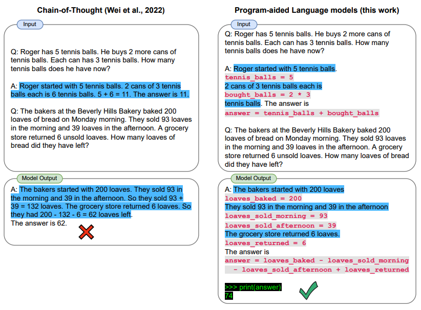

# Prompt Applications

In this guide, we will cover some advanced and interesting ways we can use prompt engineering to perform useful and more advanced tasks. 

**Note that this section is under heavy development.**
Topics:
- [Generating Data](#generating-data)
- [Program-Aided Language Models](#pal-program-aided-language-models)
- [Python Notebooks](#python-notebooks)


---
## Generating Data
LLMs have strong capabilities to generate text. Using effective prompt strategies can steer the model to produce better, more consistent, and more factual responses. LLMs can also be especially useful for generating data which is useful to run all sorts of experiments. For example, we can use it to generate quick samples for a sentiment classifier like so:

*Prompt:*
```
Produce 10 exemplars for sentiment analysis. Examples are categorized as either positive or negative. Produce 2 negative examples and 8 positive examples. Use this format for the examples:
Q: <sentence>
A: <sentiment>
```

*Output:*
```
Q: I just got the best news ever!
A: Positive

Q: We just got a raise at work!
A: Positive

Q: I'm so proud of what I accomplished today.
A: Positive

Q: I'm having the best day ever!
A: Positive

Q: I'm really looking forward to the weekend.
A: Positive

Q: I just got the best present ever!
A: Positive

Q: I'm so happy right now.
A: Positive

Q: I'm so blessed to have such an amazing family.
A: Positive

Q: The weather outside is so gloomy.
A: Negative

Q: I just got some terrible news.
A: Negative
```

This is very useful. We use this example for a different test in another section of the guides.

---

## PAL (Program-Aided Language Models)
 
[Gao et al., (2022)](https://arxiv.org/abs/2211.10435) presents a method that uses LLMs to read natural language problems and generate programs as the intermediate reasoning steps. Coined, program-aided language models (PAL), differ from chain-of-thought prompting in that instead of using free-form text to obtain a solution it offloads the solution step to a programmatic runtime such as a Python interpreter.



Let's look at an example using LangChain and OpenAI GPT-3. We are interested to develop a simple application that's able to interpret the question being asked and provide an answer by leveraging the Python interpreter. 

Specifically, we are interested to create a function that allows the use of the LLM to answer questions that require date understanding. We will provide the LLM a prompt that includes a few exemplars that are adopted from [here](https://github.com/reasoning-machines/pal/blob/main/pal/prompt/date_understanding_prompt.py).  

These are the imports we need:

```python
import openai
from datetime import datetime
from dateutil.relativedelta import relativedelta
import os
from langchain.llms import OpenAI
from dotenv import load_dotenv
```

Let's first configure a few things:

```python
load_dotenv()

# API configuration
openai.api_key = os.getenv("OPENAI_API_KEY")

# for LangChain
os.environ["OPENAI_API_KEY"] = os.getenv("OPENAI_API_KEY")
```

Setup model instance:

```python
llm = OpenAI(model_name='text-davinci-003', temperature=0)
```

Setup prompt + question:

```python
question = "Today is 27 February 2023. I was born exactly 25 years ago. What is the date I was born in MM/DD/YYYY?"

DATE_UNDERSTANDING_PROMPT = """
# Q: 2015 is coming in 36 hours. What is the date one week from today in MM/DD/YYYY?
# If 2015 is coming in 36 hours, then today is 36 hours before.
today = datetime(2015, 1, 1) - relativedelta(hours=36)
# One week from today,
one_week_from_today = today + relativedelta(weeks=1)
# The answer formatted with %m/%d/%Y is
one_week_from_today.strftime('%m/%d/%Y')
# Q: The first day of 2019 is a Tuesday, and today is the first Monday of 2019. What is the date today in MM/DD/YYYY?
# If the first day of 2019 is a Tuesday, and today is the first Monday of 2019, then today is 6 days later.
today = datetime(2019, 1, 1) + relativedelta(days=6)
# The answer formatted with %m/%d/%Y is
today.strftime('%m/%d/%Y')
# Q: The concert was scheduled to be on 06/01/1943, but was delayed by one day to today. What is the date 10 days ago in MM/DD/YYYY?
# If the concert was scheduled to be on 06/01/1943, but was delayed by one day to today, then today is one day later.
today = datetime(1943, 6, 1) + relativedelta(days=1)
# 10 days ago,
ten_days_ago = today - relativedelta(days=10)
# The answer formatted with %m/%d/%Y is
ten_days_ago.strftime('%m/%d/%Y')
# Q: It is 4/19/1969 today. What is the date 24 hours later in MM/DD/YYYY?
# It is 4/19/1969 today.
today = datetime(1969, 4, 19)
# 24 hours later,
later = today + relativedelta(hours=24)
# The answer formatted with %m/%d/%Y is
today.strftime('%m/%d/%Y')
# Q: Jane thought today is 3/11/2002, but today is in fact Mar 12, which is 1 day later. What is the date 24 hours later in MM/DD/YYYY?
# If Jane thought today is 3/11/2002, but today is in fact Mar 12, then today is 3/1/2002.
today = datetime(2002, 3, 12)
# 24 hours later,
later = today + relativedelta(hours=24)
# The answer formatted with %m/%d/%Y is
later.strftime('%m/%d/%Y')
# Q: Jane was born on the last day of Feburary in 2001. Today is her 16-year-old birthday. What is the date yesterday in MM/DD/YYYY?
# If Jane was born on the last day of Feburary in 2001 and today is her 16-year-old birthday, then today is 16 years later.
today = datetime(2001, 2, 28) + relativedelta(years=16)
# Yesterday,
yesterday = today - relativedelta(days=1)
# The answer formatted with %m/%d/%Y is
yesterday.strftime('%m/%d/%Y')
# Q: {question}
""".strip() + '\n'
```

```python
llm_out = llm(DATE_UNDERSTANDING_PROMPT.format(question=question))
print(llm_out)
```

```python
exec(llm_out)
print(born)
```

This will output the following: `02/27/1998`

---
## Python Notebooks

|Description|Notebook|
|--|--|
|Learn how to use the Python interpreter in combination with the language model to solve tasks.|[Program-Aided Language Models](../notebooks/pe-pal.ipynb)|

---

More examples coming soon!

[Previous Section (Advanced Prompting)](./prompts-advanced-usage.md)

[Next Section (ChatGPT)](./prompts-chatgpt.md)