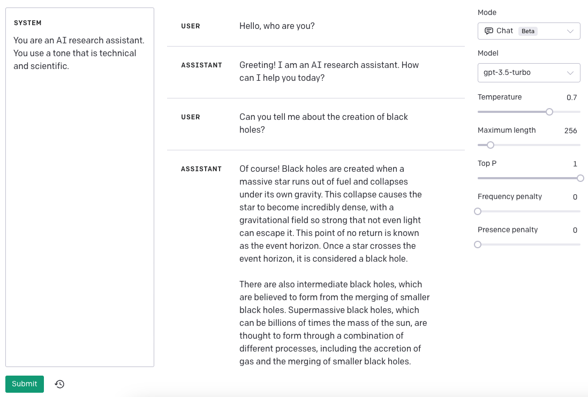
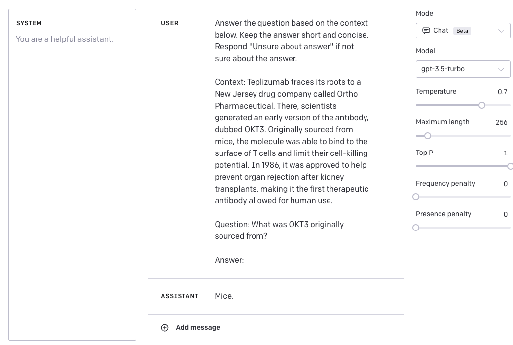

# ChatGPT Prompt Engineering

In this section, we cover the latest prompt engineering techniques for ChatGPT, including tips, applications, limitations, papers, and additional reading materials.

**Note that this section is under heavy development.**

---
## ChatGPT Introduction

ChatGPT is a new model [trained by OpenAI](https://openai.com/blog/chatgpt) that has the capability to interact in a conversational way. This model is trained to follow instructions in a prompt to provide appropriate responses in the context of a dialogue. ChatGPT can help with answering questions, suggest recipes, write lyrics in a certain style, generate code, and much more.

ChatGPT is trained using Reinforcement Learning from Human Feedback (RLHF). While this model is a lot more capable than previous GPT iterations (and also trained to reduce harmful and untruthful outputs), it still comes with limitations. Let's cover some of the capabilities and limitations with concrete examples. 

You can use the research preview of ChatGPT [here](chat.openai.com) but for the examples we will use the Chat mode on the OpenAI Playground.

---
## Conversation

In one of the previous guides, we covered a bit about conversation capabilities and role prompting. We covered how to instruct the LLM to have a conversation in a specific style, with a specific intent, behavior, and identity.

Let's review our previous basic example where we created a conversational system that's able to generate more technical and scientific responses to questions. 

*Prompt:*
```
The following is a conversation with an AI research assistant. The assistant tone is technical and scientific.

Human: Hello, who are you?
AI: Greeting! I am an AI research assistant. How can I help you today?
Human: Can you tell me about the creation of blackholes?
AI:
```

From the example above, you can see two important components:
- the **intent** or explanation of what the chatbot is
- the **identity** which instructs the style or tone the chatbot will use to respond

The simple example above works well with the text completion APIs that uses `text-davinci-003`. More recently, OpenAI [announced the ChatGPT APIs](https://openai.com/blog/introducing-chatgpt-and-whisper-apis), which is a more powerful and cheaper model called `gpt-3.5-turbo` was specifically built for this type of functionality (chat completions). In fact, OpenAI recommends this is as their best model even for non-chat use cases.  Other benefits of using the ChatGPT APIs are the significant cost reduction (90%) and efficiency. 

Big companies like Snap Inc. and Instacart are already integrating conversational features powered by ChatGPT on their products that range from personalized recommendations to open-ended shopping goals.

---
## Conversations with ChatGPT
To begin demonstrating the capabilities of ChatGPT, we will use the chatbot assistant example above and discuss results. Compared to `text-davinci-003`, the `gpt-3.5-turbo` model that powers ChatGPT uses a chat format as input. The model expects a series of messages as input, and uses those to generate a response. 

*Input:*
```
SYSTEM: You are an AI research assistant. You use a tone that is technical and scientific.
USER: Hello, who are you?
ASSISTANT: Greeting! I am an AI research assistant. How can I help you today?
USER: Can you tell me about the creation of black holes?
```

*Output:*
```
ASSISTANT: Of course! Black holes are created when a massive star runs out of fuel and collapses under its own gravity. This collapse causes the star to become incredibly dense, with a gravitational field so strong that not even light can escape it. This point of no return is known as the event horizon. Once a star crosses the event horizon, it is considered a black hole...
```

Note that in the example above, I have simplified the input and output but the ChatGPT chat completion API requires messages to be in a specific format. I have added a snapshot below of how this example would look using the `Chat Mode` in the OpenAI Playground:



The more formal API call for our example would look something like the example below:

```python
import openai

openai.ChatCompletion.create(
  model="gpt-3.5-turbo",
  messages=[
        {"role": "system", "content": "You are an AI research assistant. You use a tone that is technical and scientific."},
        {"role": "user", "content": "Hello, who are you?"},
        {"role": "assistant", "content": "Greeting! I am an AI research assistant. How can I help you today?"},
        {"role": "user", "content": "Can you tell me about the creation of black holes?"}
    ]
)
```


The chat format enables multi-turn conversations but it also supports single-turn tasks similar to what we used with `text-davinci-003`. This means we can use ChatGPT to perform similar tasks as what we have demonstrated for the original GPT models. For example, let's try to perform the following question answering task using ChatGPT:

*Input:*
```
USER: Answer the question based on the context below. Keep the answer short and concise. Respond "Unsure about answer" if not sure about the answer.

Context: Teplizumab traces its roots to a New Jersey drug company called Ortho Pharmaceutical. There, scientists generated an early version of the antibody, dubbed OKT3. Originally sourced from mice, the molecule was able to bind to the surface of T cells and limit their cell-killing potential. In 1986, it was approved to help prevent organ rejection after kidney transplants, making it the first therapeutic antibody allowed for human use.

Question: What was OKT3 originally sourced from?

Answer:
```

*Output:*
```
ASSISTANT: Mice.
```

Keep in mind that I am adding the `USER` and `ASSISTANT` labels to better demonstrate how the task can be performed using ChatGPT. Here is the example using the Playground:



More formally, this is the API call (I've only included the message component of the request):

```python
[
  {"role": "user", "content": 'Answer the question based on the context below. Keep the answer short and concise. Respond "Unsure about answer" if not sure about the answer.
  
  Context: Teplizumab traces its roots to a New Jersey drug company called Ortho Pharmaceutical. There, scientists generated an early version of the antibody, dubbed OKT3. Originally sourced from mice, the molecule was able to bind to the surface of T cells and limit their cell-killing potential. In 1986, it was approved to help prevent organ rejection after kidney transplants, making it the first therapeutic antibody allowed for human use
  
  Question: What was OKT3 originally sourced from?
  
  Answer:'}
]
```

---
Other use cases to cover:
- More coming soon!


---
### References

- [UZH_CLyp at SemEval-2023 Task 9: Head-First Fine-Tuning and ChatGPT Data Generation for Cross-Lingual Learning in Tweet Intimacy Prediction](https://arxiv.org/abs/2303.01194) (Mar 2023)
- [Can ChatGPT Assess Human Personalities? A General Evaluation Framework](https://arxiv.org/abs/2303.01248) (Mar 2023)
- [Cross-Lingual Summarization via ChatGPT](https://arxiv.org/abs/2302.14229) (Feb 2023)
- [Dr ChatGPT, tell me what I want to hear: How prompt knowledge impacts health answer correctness](https://arxiv.org/abs/2302.13793) (Feb 2023)
- [An Independent Evaluation of ChatGPT on Mathematical Word Problems (MWP)](https://arxiv.org/abs/2302.13814) (Feb 2023)
- [ChatGPT: A Meta-Analysis after 2.5 Months](https://arxiv.org/abs/2302.13795) (Feb 2023)
- [Let's have a chat! A Conversation with ChatGPT: Technology, Applications, and Limitations](https://arxiv.org/abs/2302.13817) (Feb 2023)
- [Check Your Facts and Try Again: Improving Large Language Models with External Knowledge and Automated Feedback](https://arxiv.org/abs/2302.12813) (Feb 2023)
- [On the Robustness of ChatGPT: An Adversarial and Out-of-distribution Perspective](https://arxiv.org/abs/2302.12095) (Feb 2023)
- [How Generative AI models such as ChatGPT can be (Mis)Used in SPC Practice, Education, and Research? An Exploratory Study](https://arxiv.org/abs/2302.10916) (Feb 2023)
- [Can ChatGPT Understand Too? A Comparative Study on ChatGPT and Fine-tuned BERT](https://arxiv.org/abs/2302.10198) (Feb 2023)
- [A Prompt Pattern Catalog to Enhance Prompt Engineering with ChatGPT](https://arxiv.org/abs/2302.11382) (Feb 2023)
- [Zero-Shot Information Extraction via Chatting with ChatGPT](https://arxiv.org/abs/2302.10205) (Feb 2023)
- [ChatGPT: Jack of all trades, master of none](https://arxiv.org/abs/2302.10724) (Feb 2023)
- [A Pilot Evaluation of ChatGPT and DALL-E 2 on Decision Making and Spatial Reasoning](https://arxiv.org/abs/2302.09068) (Feb 2023)
- [Netizens, Academicians, and Information Professionals' Opinions About AI With Special Reference To ChatGPT](https://arxiv.org/abs/2302.07136) (Feb 2023)
- [Linguistic ambiguity analysis in ChatGPT](https://arxiv.org/abs/2302.06426) (Feb 2023)
- [ChatGPT versus Traditional Question Answering for Knowledge Graphs: Current Status and Future Directions Towards Knowledge Graph Chatbots](https://arxiv.org/abs/2302.06466) (Feb 2023)
- [What ChatGPT and generative AI mean for science](https://www.nature.com/articles/d41586-023-00340-6) (Feb 2023)
- [Applying BERT and ChatGPT for Sentiment Analysis of Lyme Disease in Scientific Literature](https://arxiv.org/abs/2302.06474) (Feb 2023)
- [ChatGPT for Good? On Opportunities and Challenges of Large Language Models for Education](https://www.edu.sot.tum.de/fileadmin/w00bed/hctl/_my_direct_uploads/ChatGPT_for_Good_.pdf) (Jan 2023)
- [Techniques to improve reliability - OpenAI Cookbook](https://github.com/openai/openai-cookbook/blob/main/techniques_to_improve_reliability.md)
- [Awesome ChatGPT Prompts](https://github.com/f/awesome-chatgpt-prompts)
- [Introducing ChatGPT](https://openai.com/blog/chatgpt) (Nov 2022)