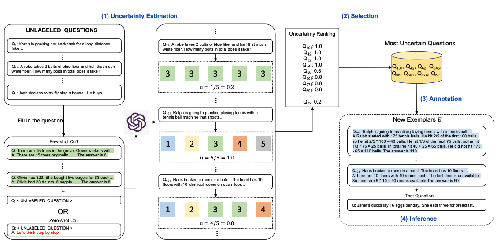
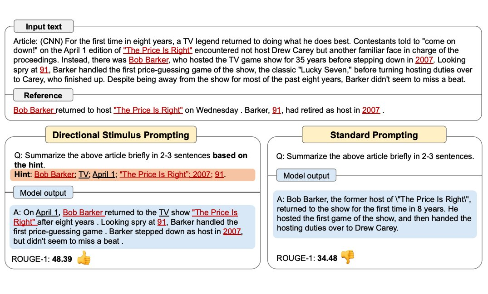
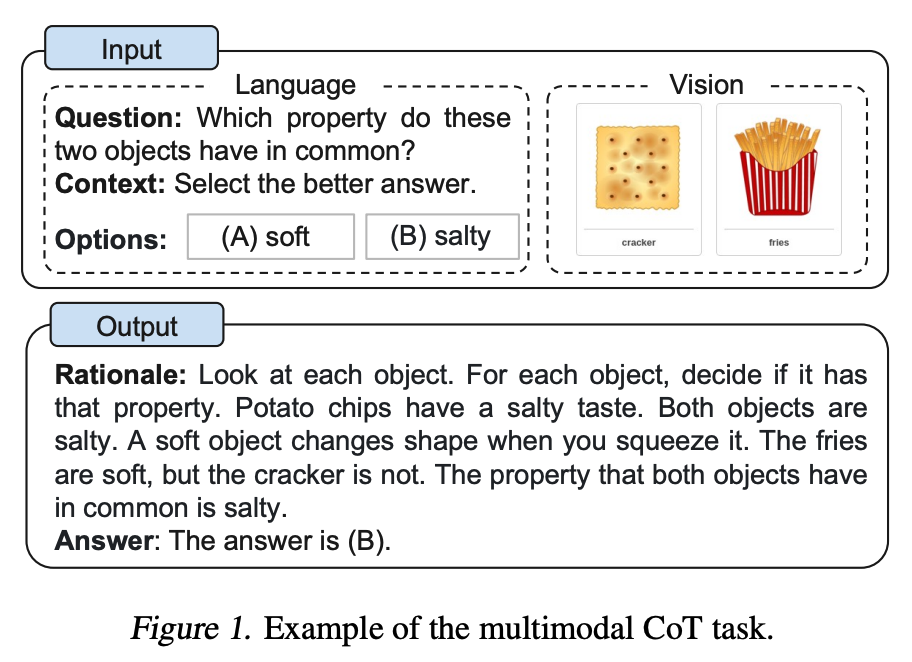

# Miscellaneous Topics

In this section, we discuss other miscellaneous and uncategorized topics in prompt engineering. It includes relatively new ideas and approaches that will eventually be moved into the main guides as they become more widely adopted. This section of the guide is also useful to keep up with the latest research papers on prompt engineering.

**Note that this section is under heavy development.**

Topic:
- [Active Prompt](#active-prompt)
- [Directional Stimulus Prompting](#directional-stimulus-prompting)
- [ReAct](#react)
- [Multimodal CoT Prompting](#multimodal-prompting)
- [GraphPrompts](#graphprompts)
- ...

---

## Active-Prompt

Chain-of-thought (CoT) methods rely on a fixed set of human-annotated exemplars. The problem with this is that the exemplars might not be the most effective examples for the different tasks. To address this, [Diao et al., (2023)](https://arxiv.org/pdf/2302.12246.pdf) recently proposed a new prompting approach called Active-Prompt to adapt LLMs to different task-specific example prompts (annotated with human-designed CoT reasoning).

Below is an illustration of the approach. The first step is to query the LLM with or without a few CoT examples. *k* possible answers are generated for a set of training questions. An uncertainty metric is calculated based on the *k* answers (disagreement used). The most uncertain questions are selected for annotation by humans. The new annotated exemplars are then used to infer each question. 

---
## Directional Stimulus Prompting
[Li et al., (2023)](https://arxiv.org/abs/2302.11520) proposes a new prompting technique to better guide the LLM in generating the desired summary.

A tuneable policy LM is trained to generate the stimulus/hint. Seeing more use of RL to optimize LLMs.

The figure below shows how Directional Stimulus Prompting compares with standard prompting. The policy LM can be small and optimized to generate the hints that guide a black-box frozen LLM.

Full example coming soon!

---
## ReAct

[Yao et al., 2022](https://arxiv.org/abs/2210.03629) introduced a framework where LLMs are used to generate both reasoning traces and task-specific actions in an interleaved manner. Generating reasoning traces allow the model to induce, track, and update action plans, and even handle exceptions. The action step allows to interface with and gather information from external sources such as knowledge bases or environments.

The ReAct framework can allow LLMs to interact with external tools to retrieve additional information that leads to more reliable and factual responses.

Full example coming soon!

---
## Multimodal CoT Prompting

[Zhang et al. (2023)](https://arxiv.org/abs/2302.00923) recently proposed a multimodal chain-of-thought prompting approach. Traditional CoT focuses on the language modality. In contrast, Multimodal CoT incorporates text and vision into a two-stage framework. The first step involves rationale generation based on multimodal information. This is followed by the second phase, answer inference, which leverages the informative generated rationales.

The multimodal CoT model (1B) outperforms GPT-3.5 on the ScienceQA benchmark.

Further reading:
- [Language Is Not All You Need: Aligning Perception with Language Models](https://arxiv.org/abs/2302.14045) (Feb 2023)

---
## GraphPrompts

[Liu et al., 2023](https://arxiv.org/abs/2302.08043) introduces GraphPrompt, a new prompting framework for graphs to improve performance on downstream tasks.

More coming soon!

---
[Previous Section (Reliability)](./prompts-reliability.md)