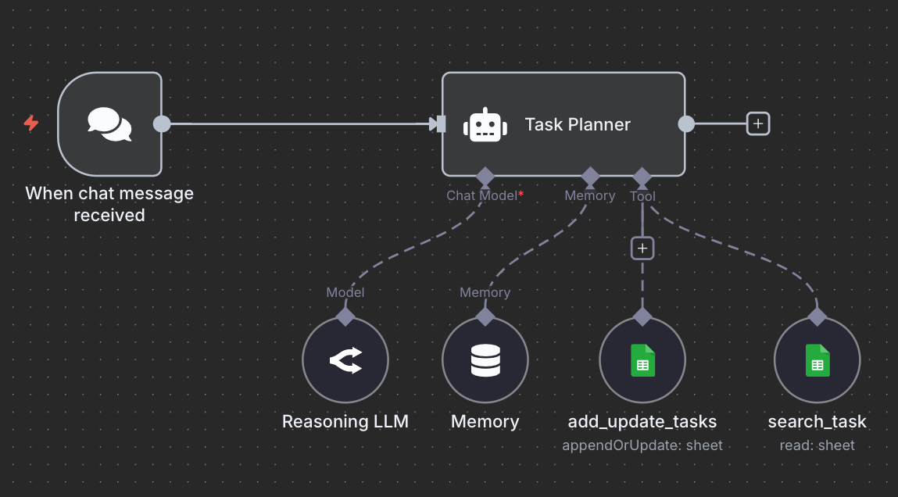
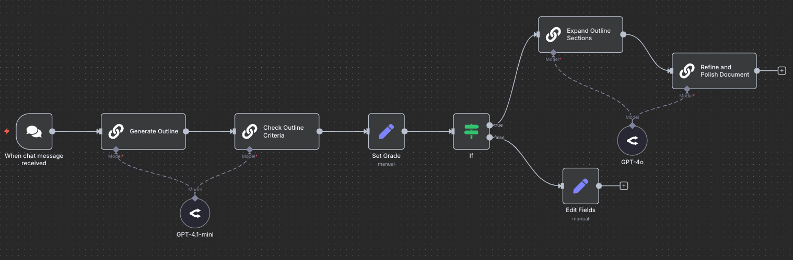
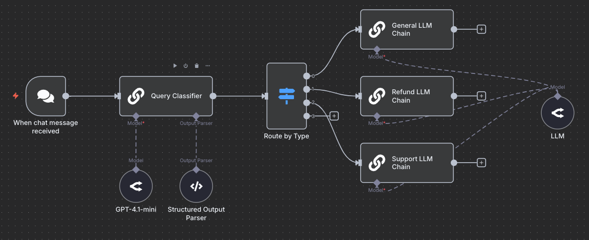
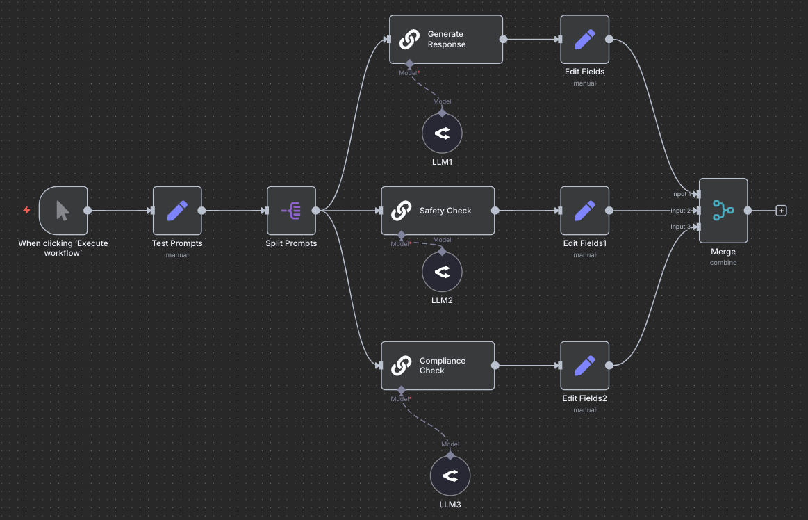

# AI Workflows vs. AI Agents

import { Callout } from 'nextra/components'

Agentic systems represent a paradigm shift in how we orchestrate Large Language Models (LLMs) and tools to accomplish complex tasks. This guide explores the fundamental distinction between **AI workflows** and **AI Agents**, helping you understand when to use each approach in your AI applications.

<Callout type="info" emoji="📚">
This content is based on our new course ["Building Effective AI Agents with n8n"](https://dair-ai.thinkific.com/courses/agents-with-n8n), which provides comprehensive insights, downloadable templates, prompts, and advanced tips into designing and implementing agentic systems.
</Callout>

## What Are Agentic Systems?

Agentic systems can be categorized into two main types:

### 1. AI Workflows

**AI workflows** are systems where LLMs and tools are orchestrated through **predefined code paths**. These systems follow a structured sequence of operations with explicit control flow.

**Key Characteristics:**

Key characteristics of AI workflows include:

- Predefined steps and execution paths
- High predictability and control
- Well-defined task boundaries
- Explicit orchestration logic

**When to Use Workflows:**

Use AI workflows in the following scenarios:

- Well-defined tasks with clear requirements
- Scenarios requiring predictability and consistency
- Tasks where you need explicit control over execution flow
- Production systems where reliability is critical

### 2. AI Agents

**AI agents** are systems where LLMs **dynamically direct their own processes** and tool usage, maintaining autonomous control over how they accomplish tasks.

**Key Characteristics:**

Key characteristics of AI agents include:

- Dynamic decision-making
- Autonomous tool selection and usage
- Reasoning and reflection capabilities
- Self-directed task execution

**When to Use Agents:**

Use AI agents in the following scenarios:

- Open-ended tasks with variable execution paths
- Complex scenarios where the number of steps is difficult to define upfront
- Tasks requiring adaptive reasoning
- Situations where flexibility outweighs predictability

## Common AI Workflow Patterns

### Pattern 1: Prompt Chaining

Prompt chaining involves breaking down a complex task into sequential LLM calls, where each step's output feeds into the next.

**Example: Document Generation Workflow**

This workflow demonstrates a prompt chaining pattern for document generation that begins when a chat message is received. The system first uses GPT-4.1-mini to generate an initial outline, then checks the outline against predefined criteria. A manual "Set Grade" step evaluates the quality, followed by a conditional "If" node that determines the next action based on the grade. If the outline passes validation, it proceeds to expand the outline sections using GPT-4o and then refines and polishes the final document. If the outline fails validation, the workflow branches to an "Edit Fields" step for manual adjustments before continuing, ensuring quality control throughout the multi-stage document creation process.

**Prompt Chaining Use Cases:**
- Content generation pipelines
- Multi-stage document processing
- Sequential validation workflows

### Pattern 2: Routing

Routing directs different requests to specialized LLM chains or agents based on query classification.

**Example: Customer Support Router**

This workflow illustrates a routing pattern for intelligent query distribution in a customer support system. When a chat message is received, it's first processed by a Query Classifier using GPT-4.1-mini along with a Structured Output Parser to categorize the request type. Based on the classification, a "Route by Type" switch directs the query to one of three specialized LLM chains: a General LLM Chain for basic inquiries, a Refund LLM Chain for payment-related issues, or a Support LLM Chain for technical assistance. Each query type receives specialized handling while maintaining a unified response system, optimizing both accuracy and efficiency in customer service operations.

**Routing Use Cases:**
- Customer support systems
- Multi-domain question answering
- Request prioritization and delegation
- Resource optimization by routing to appropriate models

**Benefits:**
- Efficient resource utilization
- Specialized handling for different query types
- Cost optimization through selective model usage

### Pattern 3: Parallelization

Parallelization executes multiple independent LLM operations simultaneously to improve efficiency.

**Example: Content Safety Pipeline**

**Parallelization Use Cases:**
- Content moderation systems
- Multi-criteria evaluation
- Concurrent data processing
- Independent verification tasks

**Advantages:**
- Reduced latency
- Better resource utilization
- Improved throughput

## AI Agents: Autonomous Task Execution

AI agents combine LLMs with autonomous decision-making capabilities, enabling them to perform complex tasks through reasoning, reflection, and dynamic tool usage.

**Example: Task Planning Agent**

**Scenario**: User asks "Add a meeting with John tomorrow at 2 PM"

This workflow demonstrates an autonomous Task Planner agent that showcases agent behavior with dynamic decision-making capabilities. When a chat message is received, it's routed to a Task Planner agent that has access to three key components: a Chat Model (Reasoning LLM) for understanding and planning, a Memory system for maintaining context across interactions, and a Tool collection. The agent can autonomously select from multiple tools including add_update_tasks (to append or update tasks in a Google Sheet) and search_task (to read and search existing tasks from the sheet). Unlike predefined workflows, the agent independently determines which tools to use, when to use them, and in what sequence based on the user's request, exemplifying the flexibility and autonomy that distinguishes AI agents from traditional AI workflows.

<Callout type="warning" emoji="💡">
**Key Insight**: The agent determines which tools to use and in what order, based on the request context—not on predefined rules.
</Callout>

**AI Agent Use Cases:**

- Deep research systems
- Agentic RAG systems
- Coding agents
- Data analysis and processing
- Content generation and editing
- Customer support and assistance
- Interactive chatbots and virtual assistants

**Core Components:**

Here is a list of key components for building AI Agents:

1. **Tool Access**: Integration with external systems (Google Sheets, search APIs, databases)
2. **Memory**: Context retention across interactions for continuity
3. **Reasoning Engine**: Decision-making logic for tool selection and task planning
4. **Autonomy**: Self-directed execution without predefined control flow

### How Agents Differ from Workflows

| Aspect | AI Workflows | AI Agents |
|--------|-------------|-----------|
| **Control Flow** | Predefined, explicit | Dynamic, autonomous |
| **Decision Making** | Hard-coded logic | LLM-driven reasoning |
| **Tool Usage** | Orchestrated by code | Self-selected by agent |
| **Adaptability** | Fixed paths | Flexible execution |
| **Complexity** | Lower, more predictable | Higher, more capable |
| **Use Cases** | Well-defined tasks | Open-ended problems |

## Design Considerations

### Choosing Between Workflows and Agents

**Use AI Workflows when:**
- Task requirements are clear and stable
- Predictability is essential
- You need explicit control over execution
- Debugging and monitoring are priorities
- Cost management is critical

**Use AI Agents when:**
- Tasks are open-ended or exploratory
- Flexibility is more important than predictability
- The problem space is complex with many variables
- Human-like reasoning is beneficial
- Adaptability to changing conditions is required

### Hybrid Approaches

Many production systems combine both approaches:
- **Workflows for structure**: Use workflows for reliable, well-defined components
- **Agents for flexibility**: Deploy agents for adaptive, complex decision-making
- **Example**: A workflow routes requests to specialized agents, each handling open-ended subtasks

We will introduce an example of this in an upcoming article.

## Best Practices

### For AI Workflows

1. **Clear Step Definition**: Document each stage in the workflow
2. **Error Handling**: Implement fallback paths for failures
3. **Validation Gates**: Add checks between critical steps
4. **Performance Monitoring**: Track latency and success rates per step

### For AI Agents

1. **Tool Design**: Provide clear, well-documented tools with explicit purposes
2. **Memory Management**: Implement effective context retention strategies
3. **Guardrails**: Set boundaries on agent behavior and tool usage
4. **Observability**: Log agent reasoning and decision-making processes
5. **Iterative Testing**: Continuously evaluate agent performance on diverse scenarios

We will discuss these more extensively in future articles.

## Conclusion

Understanding the distinction between AI workflows and AI agents is crucial for building effective agentic systems. Workflows provide control and predictability for well-defined tasks, while agents offer flexibility and autonomy for complex, open-ended problems.

The choice between workflows and agents—or a combination of both—depends on your specific use case, performance requirements, and tolerance for autonomous decision-making. By aligning your system design with task characteristics, you can build more effective, efficient, and reliable AI applications.

<Callout type="info" emoji="📚">
This content is based on our new course ["Building Effective AI Agents with n8n"](https://dair-ai.thinkific.com/courses/agents-with-n8n), which provides comprehensive insights, downloadable templates, prompts, and advanced tips into designing and implementing agentic systems.
</Callout>

## Additional Resources

- [Anthropic: Building Effective Agents](https://www.anthropic.com/research/building-effective-agents)
- [Prompt Engineering Guide](https://www.promptingguide.ai/)
- [Building Effective AI Agents with n8n](https://dair-ai.thinkific.com/courses/agents-with-n8n)
