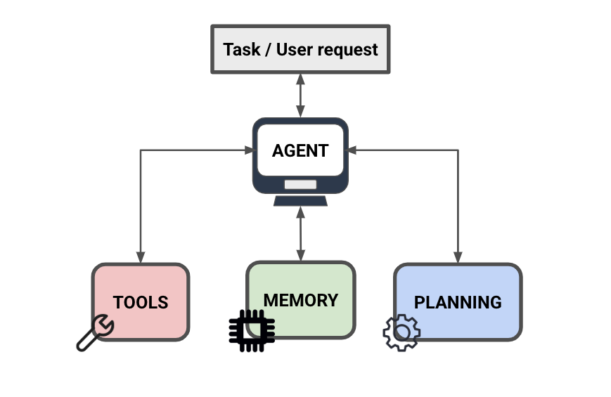

# Agent Components

import { Callout } from 'nextra/components'

AI agents require three fundamental capabilities to effectively tackle complex tasks: planning abilities, tool utilization, and memory management. Let's dive into how these components work together to create functional AI agents.

## Planning: The Brain of the Agent

At the core of any effective AI agent is its planning capability, powered by large language models (LLMs). Modern LLMs enable several crucial planning functions:

- Task decomposition through chain-of-thought reasoning
- Self-reflection on past actions and information
- Adaptive learning to improve future decisions
- Critical analysis of current progress

While current LLM planning capabilities aren't perfect, they're essential for task completion. Without robust planning abilities, an agent cannot effectively automate complex tasks, which defeats its primary purpose.

<Callout type= "info" emoji="🎓">
Learn how to build with AI agents in our new course. [Join now!](https://dair-ai.thinkific.com/courses/introduction-ai-agents)
Use code PROMPTING20 to get an extra 20% off.
</Callout>

## Tool Utilization: Extending the Agent's Capabilities

The second critical component is an agent's ability to interface with external tools. A well-designed agent must not only have access to various tools but also understand when and how to use them appropriately. Common tools include:

- Code interpreters and execution environments
- Web search and scraping utilities
- Mathematical calculators
- Image generation systems

These tools enable the agent to execute its planned actions, turning abstract strategies into concrete results. The LLM's ability to understand tool selection and timing is crucial for handling complex tasks effectively.

## Memory Systems: Retaining and Utilizing Information

The third essential component is memory management, which comes in two primary forms:

1. Short-term (Working) Memory
   - Functions as a buffer for immediate context
   - Enables in-context learning
   - Sufficient for most task completions
   - Helps maintain continuity during task iteration

2. Long-term Memory
   - Implemented through external vector stores
   - Enables fast retrieval of historical information
   - Valuable for future task completion
   - Less commonly implemented but potentially crucial for future developments

Memory systems allow agents to store and retrieve information gathered from external tools, enabling iterative improvement and building upon previous knowledge.

The synergy between planning capabilities, tool utilization, and memory systems forms the foundation of effective AI agents. While each component has its current limitations, understanding these core capabilities is crucial for developing and working with AI agents. As the technology evolves, we may see new memory types and capabilities emerge, but these three pillars will likely remain fundamental to AI agent architecture.
