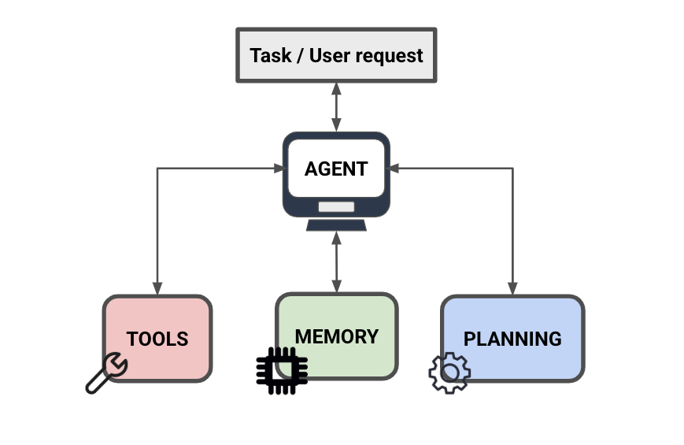

# Agent 组件

import { Callout } from 'nextra/components'

AI  agent (agents)要有效应对复杂任务，需具备三项核心能力：规划能力 、工具使用能力 和 记忆管理能力 。下面我们将深入探讨这些组件如何协同工作以构建功能完备的 AI  agent 。

## 规划能力：Agent 的“大脑”

任何有效的 AI Agent 的核心都是其规划能力 ，而这一能力主要由大型语言模型（LLMs）驱动。现代 LLM 提供了若干关键的规划功能：

- 通过链式思维推理进行任务分解
- 对过往行为和信息进行自我反思
- 实现自适应学习以优化未来决策
- 对当前进展进行关键性分析

尽管目前 LLM 的规划能力尚不完美，但它们对于任务完成至关重要。缺乏强大的规划能力，Agent 将无法高效地自动化处理复杂任务，从而失去其存在的核心价值。

<Callout type= "info" emoji="🎓">
如需了解如何构建 AI Agent，请查看我们的新课程：[立即加入！](https://dair-ai.thinkific.com/courses/introduction-ai-agents)
使用优惠码 PROMPTING20 可额外享受 20% 折扣。
</Callout>

## 工具使用能力：拓展 Agent 的功能边界

第二项关键组件是 agent 与外部工具交互的能力。一个设计良好的 agent 不仅要能够访问各种工具，还必须理解在何时以及如何正确使用它们。常见的工具包括：

- 代码解释器与执行环境
- 网络搜索与爬取工具
- 数学计算引擎
- 图像生成系统

这些工具使 agent 能够执行其制定的计划，将抽象策略转化为具体结果。LLM 在理解何时选择何种工具方面的表现，对于高效处理复杂任务至关重要。

## 记忆系统：信息的存储与调用

第三项核心组件是记忆管理系统 ，主要包括两种形式：

1. 短期记忆（工作记忆）
   - 充当即时上下文的缓冲区
   - 支持上下文内学习（in-context learning）
   - 足以应对大多数任务需求
   - 有助于在任务迭代过程中保持连贯性
2. 长期记忆
   - 通常通过外部向量存储系统实现
   - 支持快速检索历史信息
   - 对未来任务完成具有重要参考价值
   - 当前实现较少，但在未来发展潜力巨大

记忆系统使 agent 能够存储并检索从外部工具中获取的信息，从而实现持续改进和知识积累 。

规划能力、工具使用能力和记忆系统之间的协同作用构成了有效 AI agent 的基础。虽然每个组件都有其当前的局限性，但了解这些核心功能对于开发和使用 AI agent 至关重要。随着技术的发展，我们可能会看到新的记忆类型和功能出现，但这三个支柱可能仍然是 AI agent 体系结构的基础。