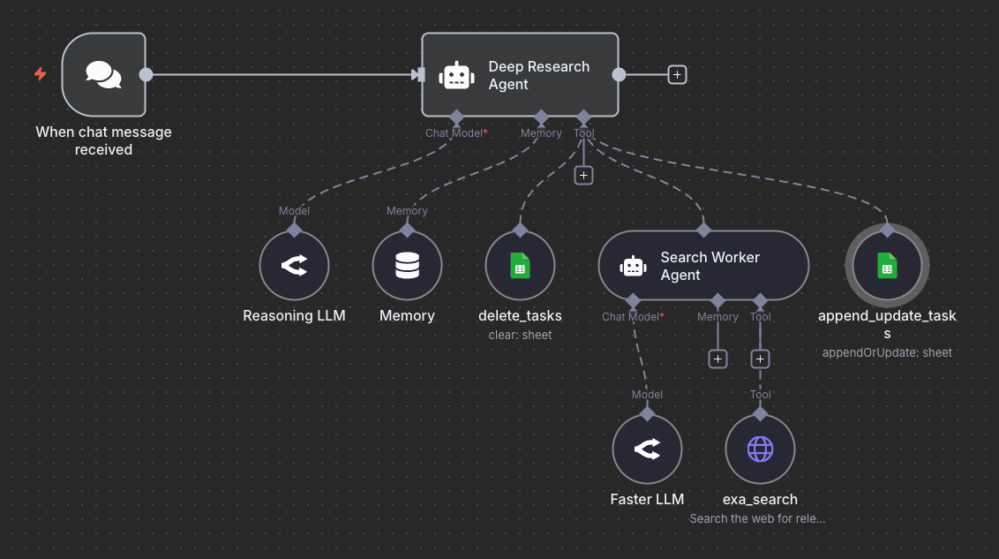

# Why Context Engineering?

import { Callout } from 'nextra/components'

[Context engineering](https://www.promptingguide.ai/guides/context-engineering-guide) is a critical practice for building reliable and effective AI agents. This guide explores the importance of context engineering through a practical example of building a deep research agent.

Context engineering involves carefully crafting and refining the prompts, instructions, and constraints that guide an AI agent's behavior to achieve desired outcomes.

<Callout type="info" emoji="📚">
This content is based on our new course ["Building Effective AI Agents with n8n"](https://dair-ai.thinkific.com/courses/agents-with-n8n), which provides comprehensive insights, downloadable templates, prompts, and advanced tips into designing and implementing agentic systems.
</Callout>

## What is Context Engineering?

[Context engineering](https://www.promptingguide.ai/guides/context-engineering-guide) is the process of designing, testing, and iterating on the contextual information provided to AI agents to shape their behavior and improve task performance. Unlike simple prompt engineering for single LLM calls, context engineering for agents involves (but not limited to):

- **System prompts** that define agent behavior and capabilities
- **Task constraints** that guide decision-making
- **Tool descriptions** that clarify when and how to use available functions/tools
- **Memory management** for tracking state across multiple steps
- **Error handling** patterns for robust execution

## Building a Deep Research Agent: A Case Study

Let's explore context engineering principles through an example: a minimal deep research agent that performs web searches and generates reports.



### The Context Engineering Challenge

When building the first version of this agent system, the initial implementation revealed several behavioral issues that required careful context engineering:

#### Issue 1: Incomplete Task Execution

**Problem**: When running the agentic workflow, the orchestrator agent often creates three search tasks but only executes searches for two of them, skipping the third task without explicit justification.

**Root Cause**: The agent's system prompt lacked explicit constraints about task completion requirements. The agent made assumptions about which searches were necessary, leading to inconsistent behavior.

**Solution**: Two approaches are possible:

1. **Flexible Approach** (current): Allow the agent to decide which searches are necessary, but require explicit reasoning for skipped tasks
2. **Strict Approach**: Add explicit constraints requiring search execution for all planned tasks

Example system prompt enhancement:

```text
You are a deep research agent responsible for executing comprehensive research tasks.

TASK EXECUTION RULES:
- For each search task you create, you MUST either:
  1. Execute a web search and document findings, OR
  2. Explicitly state why the search is unnecessary and mark it as completed with justification

- Do NOT skip tasks silently or make assumptions about task redundancy
- If you determine tasks overlap, consolidate them BEFORE execution
- Update task status in the spreadsheet after each action
```

#### Issue 2: Lack of Debugging Visibility

**Problem**: Without proper logging and state tracking, it was difficult to understand why the agent made certain decisions.

**Solution**: For this example, it helps to implement a task management system using a spreadsheet or text file (for simplicity) with the following fields:

- Task ID
- Search query
- Status (todo, in_progress, completed)
- Results summary
- Timestamp

This visibility enables:
- Real-time debugging of agent decisions
- Understanding of task execution flow
- Identification of behavioral patterns
- Data for iterative improvements

### Context Engineering Best Practices

Based on this case study, here are key principles for effective context engineering:

#### 1. Eliminate Prompt Ambiguity

**Bad Example:**
```text
Perform research on the given topic.
```

**Good Example:**
```text
Perform research on the given topic by:
1. Breaking down the query into 3-5 specific search subtasks
2. Executing a web search for EACH subtask using the search_tool
3. Documenting findings for each search in the task tracker
4. Synthesizing all findings into a comprehensive report
```

#### 2. Make Expectations Explicit

Don't assume the agent knows what you want. Be explicit about:
- Required vs. optional actions
- Quality standards
- Output formats
- Decision-making criteria

#### 3. Implement Observability

Build debugging mechanisms into your agentic system:
- Log all agent decisions and reasoning
- Track state changes in external storage
- Record tool calls and their outcomes
- Capture errors and edge cases

<Callout type="warning" emoji="⚠️">
Pay close attention to every run of your agentic system. Strange behaviors and edge cases are opportunities to improve your context engineering efforts.
</Callout>

#### 4. Iterate Based on Behavior

Context engineering is an iterative process:

1. **Deploy** the agent with initial context
2. **Observe** actual behavior in production
3. **Identify** deviations from expected behavior
4. **Refine** system prompts and constraints
5. **Test** and validate improvements
6. **Repeat**

#### 5. Balance Flexibility and Constraints

Consider the tradeoff between:
- **Strict constraints**: More predictable but less adaptable
- **Flexible guidelines**: More adaptable but potentially inconsistent

Choose based on your use case requirements.

## Advanced Context Engineering Techniques

### Layered Context Architecture

Context engineering applies to all stages of the AI agent build process. Depending on the AI Agent, it's sometimes helpful to think of context as a hierarchical structure. For our basic agentic system, we can organize context into hierarchical layers:

1. **System Layer**: Core agent identity and capabilities
2. **Task Layer**: Specific instructions for the current task
3. **Tool Layer**: Descriptions and usage guidelines for each tool
4. **Memory Layer**: Relevant historical context and learnings

### Dynamic Context Adjustment

Another approach is to dynamically adjust context based on the task complexity, available resources, previous execution history, and error patterns. Based on our example, we can adjust context based on:

- Task complexity
- Available resources
- Previous execution history
- Error patterns

### Context Validation

Evaluation is key to ensuring context engineering techniques are working as they should for your AI agents. Before deployment, validate your context design:

- **Completeness**: Does it cover all important scenarios?
- **Clarity**: Is it unambiguous?
- **Consistency**: Do different parts align?
- **Testability**: Can you verify the behavior?

## Common Context Engineering Pitfalls

Below are a few common context engineering pitfalls to avoid when building AI agents:

### 1. Over-Constraint

**Problem**: Too many rules make the agent inflexible and unable to handle edge cases.

**Example**:
```text
NEVER skip a search task.
ALWAYS perform exactly 3 searches.
NEVER combine similar queries.
```

**Better Approach**:
```text
Aim to perform searches for all planned tasks. If you determine that tasks are redundant, consolidate them before execution and document your reasoning.
```

### 2. Under-Specification

**Problem**: Vague instructions lead to unpredictable behavior.

**Example**:
```text
Do some research and create a report.
```

**Better Approach**:
```text
Execute research by:
1. Analyzing the user query to identify key information needs
2. Creating 3-5 specific search tasks covering different aspects
3. Executing searches using the search_tool for each task
4. Synthesizing findings into a structured report with sections for:
   - Executive summary
   - Key findings per search task
   - Conclusions and insights
```

### 3. Ignoring Error Cases

**Problem**: Context doesn't specify behavior when things go wrong.

**Solution**: In some cases, it helps to add error handling instructions to your AI Agents:
```text
ERROR HANDLING:
- If a search fails, retry once with a rephrased query
- If retry fails, document the failure and continue with remaining tasks
- If more than 50% of searches fail, alert the user and request guidance
- Never stop execution completely without user notification
```

## Measuring Context Engineering Success

Track these metrics to evaluate context engineering effectiveness:

1. **Task Completion Rate**: Percentage of tasks completed successfully
2. **Behavioral Consistency**: Similarity of agent behavior across similar inputs
3. **Error Rate**: Frequency of failures and unexpected behaviors
4. **User Satisfaction**: Quality and usefulness of outputs
5. **Debugging Time**: Time required to identify and fix issues

It's important to not treat context engineering as a one-time activity but an ongoing practice that requires:

- **Systematic observation** of agent behavior
- **Careful analysis** of failures and edge cases
- **Iterative refinement** of instructions and constraints
- **Rigorous testing** of changes

We will be covering these principles in more detail in upcoming guides. By applying these principles, you can build AI agent systems that are reliable, predictable, and effective at solving complex tasks.


<Callout type="info" emoji="🎓">
Learn how to build production-ready AI agents in our comprehensive course. [Join now!](https://dair-ai.thinkific.com/courses/agents-with-n8n)
Use code PROMPTING20 to get an extra 20% off.
</Callout>
