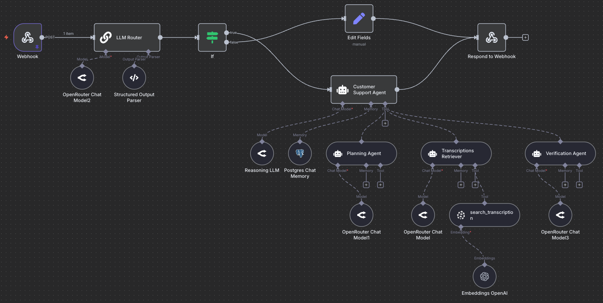
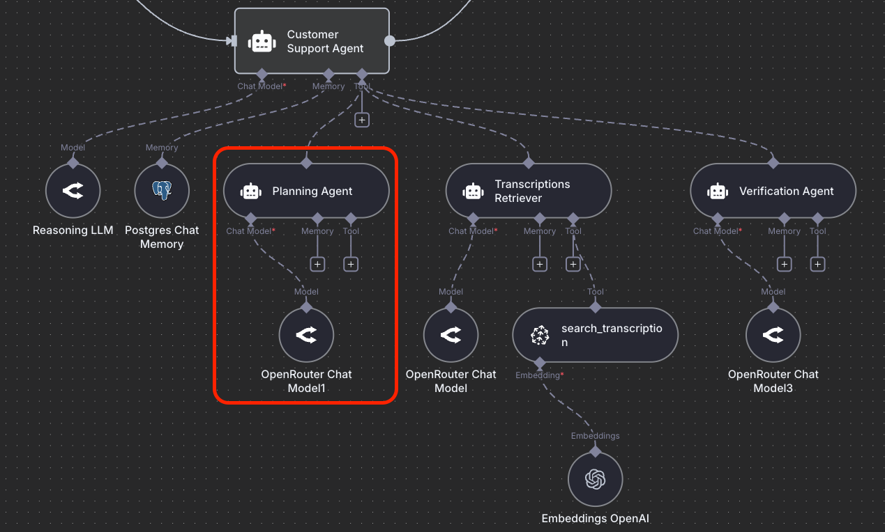
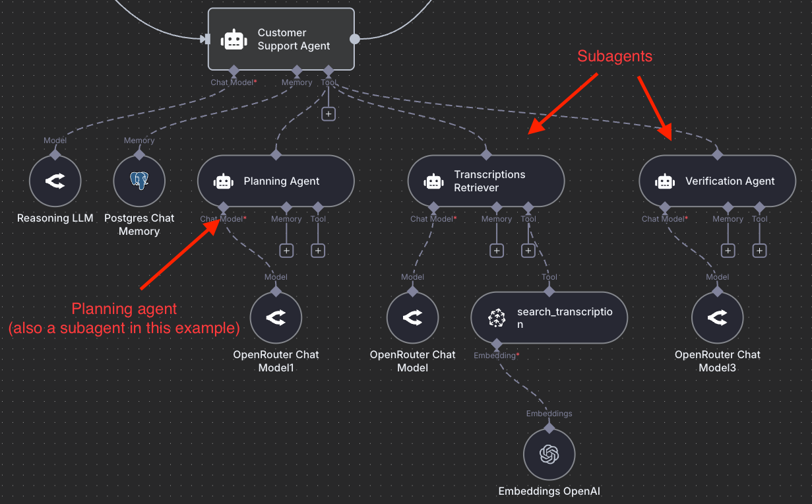
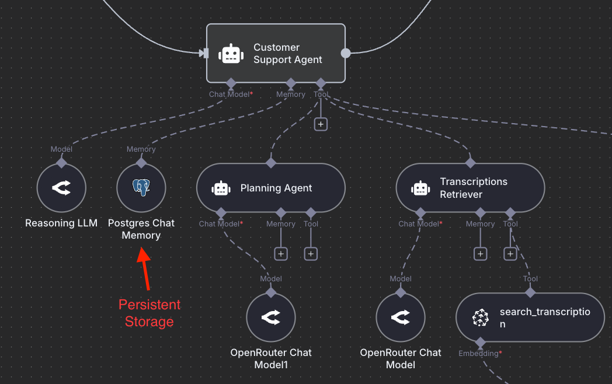
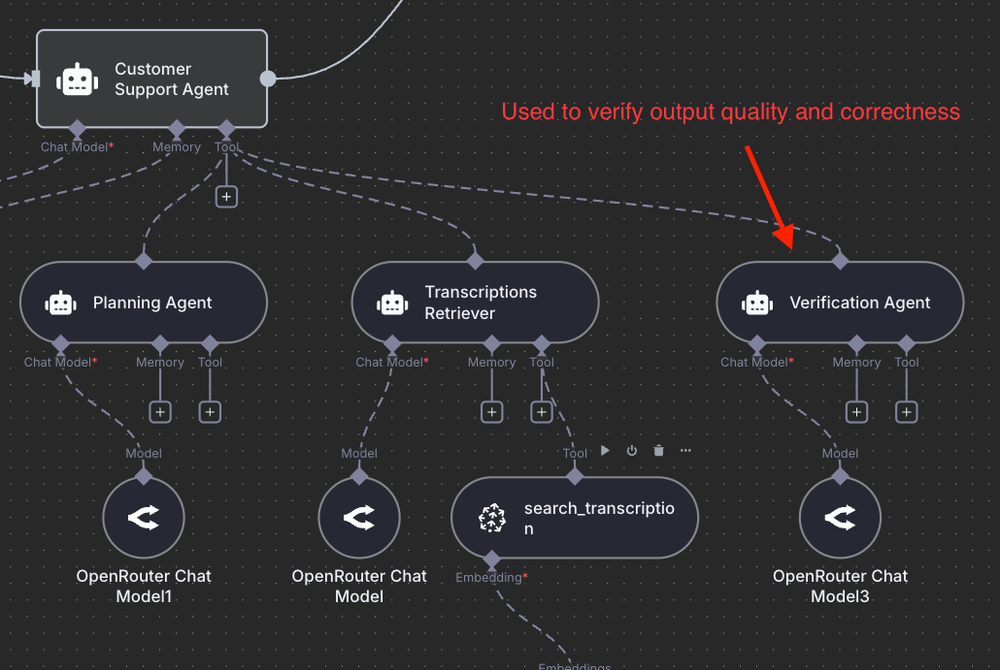

# Deep Agents

import { Callout } from 'nextra/components'

Most agents today are shallow.

They easily break down on long, multi-step problems (e.g., deep research or agentic coding).

That’s changing fast!

We’re entering the era of "Deep Agents", systems that strategically plan, remember, and delegate intelligently for solving very complex problems.

We at the [DAIR.AI Academy](https://dair-ai.thinkific.com/) and other folks from [LangChain](https://docs.langchain.com/labs/deep-agents/overview), [Claude Code](https://www.anthropic.com/engineering/building-agents-with-the-claude-agent-sdk), as well as more recently, individuals like [Philipp Schmid](https://www.philschmid.de/agents-2.0-deep-agents), have been documenting this idea.

Here is an example of a deep agent built to power the [DAIR.AI Academy's](https://dair-ai.thinkific.com/) customer support system intended for students to ask questions regarding our trainings and courses:

<Callout type="info" emoji="📚">
This post is based on our new course ["Building Effective AI Agents with n8n"](https://dair-ai.thinkific.com/courses/agents-with-n8n), which provides comprehensive insights, downloadable templates, prompts, and advanced tips into designing and implementing deep agents.
</Callout>

Here’s roughly the core idea behind Deep Agents (based on my own thoughts and notes that I've gathered from others):

## Planning

Instead of reasoning ad-hoc inside a single context window, Deep Agents maintain structured task plans they can update, retry, and recover from. Think of it as a living to-do list that guides the agent toward its long-term goal. To experience this, just try out Claude Code or Codex for planning; the results are significantly better once you enable it before executing any task. 

We have also written recently on the power of brainstorming for longer with Claude Code, and this shows the power of planning, expert context, and human-in-the-loop (your expertise gives you an important edge when working with deep agents). Planning will also be critical for long-horizon problems (think agents for scientific discovery, which comes next).

## Orchestrator & Sub-agent Architecture

One big agent (typically with a very long context) is no longer enough. I've seen [arguments](https://cognition.ai/blog/dont-build-multi-agents) against multi-agent systems and in favor of monolithic systems, but I'm skeptical about this. 

The orchestrator-sub-agent architecture is one of the most powerful LLM-based agentic architectures you can leverage today for any domain you can imagine. An orchestrator manages specialized sub-agents such as search agents, coders, KB retrievers, analysts, verifiers, and writers, each with its own clean context and domain focus. 

The orchestrator delegates intelligently, and subagents execute efficiently. The orchestrator integrates their outputs into a coherent result. Claude Code popularized the use of this approach for coding and sub-agents, which, it turns out, are particularly useful for efficiently managing context (through separation of concerns).

I wrote a few notes on the power of using orchestrator and subagents [here](https://x.com/omarsar0/status/1960877597191245974) and [here](https://x.com/omarsar0/status/1971975884077965783).

## Context Retrieval and Agentic Search

Deep Agents don’t rely on conversation history alone. They store intermediate work in external memory like files, notes, vectors, or databases, letting them reference what matters without overloading the model’s context. High-quality structured memory is a thing of beauty. 

Take a look at recent works like [ReasoningBank](https://arxiv.org/abs/2509.25140) and [Agentic Context Engineering](https://arxiv.org/abs/2510.04618) for some really cool ideas on how to better optimize memory building and retrieval. Building with the orchestrator-subagents architecture means that you can also leverage hybrid memory techniques (e.g., agentic search + semantic search), and you can let the agent decide what strategy to use.

## Context Engineering

One of the worst things you can do when interacting with these types of agents is underspecified instructions/prompts. Prompt engineering was and is important, but we will use the new term [context engineering](https://www.promptingguide.ai/guides/context-engineering-guide) to emphasize the importance of building context for agents. The instructions need to be more explicit, detailed, and intentional to define when to plan, when to use a sub-agent, how to name files, and how to collaborate with humans. Part of context engineering also involves efforts around structured outputs, system prompt optimization, compacting context, evaluating context effectiveness, and [optimizing tool definitions](https://www.anthropic.com/engineering/writing-tools-for-agents).

Read our previous guide on context engineering to learn more: [Context Engineering Deep Dive](https://www.promptingguide.ai/guides/context-engineering-guide)

## Verification

Next to context engineering, verification is one of the most important components of an agentic system (though less often discussed). Verification boils down to verifying outputs, which can be automated (LLM-as-a-Judge) or done by a human. Because of the effectiveness of modern LLMs at generating text (in domains like math and coding), it's easy to forget that they still suffer from hallucination, sycophancy, prompt injection, and a number of other issues. Verification helps with making your agents more reliable and more production-ready. You can build good verifiers by leveraging systematic evaluation pipelines.

## Final Words

This is a huge shift in how we build with AI agents. Deep agents also feel like an important building block for what comes next: personalized proactive agents that can act on our behalf. I will write more on proactive agents in a future post. 

I've been teaching these ideas to agent builders over the past couple of months. If you are interested in more hands-on experience for how to build deep agents check out the new course in our academy: https://dair-ai.thinkific.com/courses/agents-with-n8n

The figures you see in the post describe an agentic RAG system that students need to build for the course final project.

<Callout type="info" emoji="📚">
This post is based on our new course ["Building Effective AI Agents with n8n"](https://dair-ai.thinkific.com/courses/agents-with-n8n), which provides comprehensive insights, downloadable templates, prompts, and advanced tips into designing and implementing deep agents.
</Callout>

*Written by Elvis Saravia (creator of the Prompting Engineering Guide and co-founder of the DAIR.AI Academy)*