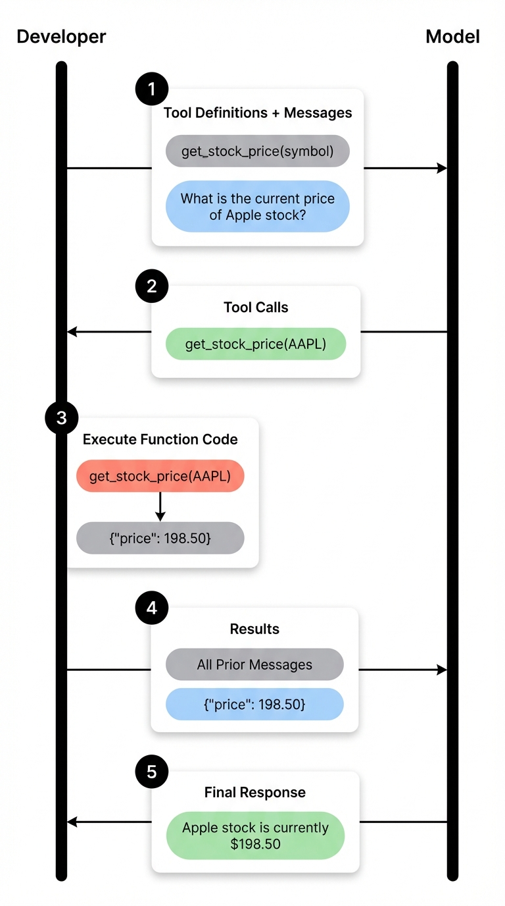

# Function Calling in AI Agents

import { Callout } from 'nextra/components'

Function calling (also known as tool calling) is one of the core capabilities that powers modern LLM-based agents. Understanding how function calling works behind the scenes is essential for building effective AI agents and debugging them when things go wrong.

## Topics

- [What is Function Calling?](#what-is-function-calling)
- [How Function Calling Powers AI Agents](#how-function-calling-powers-ai-agents)
- [The Role of Tool Definitions](#the-role-of-tool-definitions)
- [The Agent Loop: Actions and Observations](#the-agent-loop-actions-and-observations)
- [Debugging Function Calls](#debugging-function-calls)
- [Best Practices for Tool Definitions](#best-practices-for-tool-definitions)

## What is Function Calling?

At its core, function calling enables LLMs to interact with external tools, APIs, and knowledge bases. When an LLM receives a query that requires information or actions beyond its training data, it can decide to call an external function to retrieve that information or perform that action.

Consider a simple example: if you ask an AI agent "What is the weather in Paris?", the LLM alone cannot answer this question accurately since it doesn't have access to real-time weather data. However, with function calling, the LLM can recognize that it needs to call a weather API, generate the appropriate function call with the correct parameters (in this case, the city "Paris"), and then use the returned data to formulate a response.

This capability is what transforms a basic LLM from a text generator into a powerful agent that can interact with the real world.

## How Function Calling Powers AI Agents



LLM-based agents rely on two key capabilities to solve complex tasks: tool calling and reasoning. These capabilities allow agents to be augmented with external tools, connect to MCP (Model Context Protocol) servers, and access knowledge bases.

The function calling flow works as follows:

1. **User Query**: The user sends a request to the agent (e.g., "What is the weather in Paris?")

2. **Context Assembly**: The system message, tool definitions, and user message are combined to form the complete context sent to the model

3. **Tool Decision**: The LLM analyzes the context and determines whether it needs to call a tool. If yes, it outputs a structured response indicating which tool to call and with what parameters

4. **Tool Execution**: The developer's code receives the tool call request and executes the actual function (e.g., calling a weather API)

5. **Observation**: The tool returns its results, which become the "observation" in agent terminology

6. **Response Generation**: The observation is passed back to the model along with all prior messages, allowing it to generate a final response

The key insight here is that the model always maintains full context of everything that has happened in the conversation. This context awareness is what enables the agent to make intelligent decisions about what to do next and how to incorporate tool results into its final response.

## The Role of Tool Definitions

Tool definitions are arguably the most critical component of function calling. They are the only way the LLM knows what tools are available and when to use them.

A tool definition typically includes:

- **Name**: A clear identifier for the function
- **Description**: An explanation of what the tool does and when to use it
- **Parameters**: The inputs the function accepts, including their types and descriptions

Here's an example of a weather tool definition:

```python
tools = [
    {
        "type": "function",
        "function": {
            "name": "get_current_weather",
            "description": "Get the current weather in a given location. Use this when the user asks about weather conditions in a specific city or region.",
            "parameters": {
                "type": "object",
                "properties": {
                    "location": {
                        "type": "string",
                        "description": "The city and state, e.g. San Francisco, CA"
                    },
                    "unit": {
                        "type": "string",
                        "enum": ["celsius", "fahrenheit"],
                        "description": "The temperature unit to use"
                    }
                },
                "required": ["location"]
            }
        }
    }
]
```

The description field is particularly important. It helps the model understand not just what the tool does, but when it should be used. When you have multiple tools available, clear and specific descriptions become even more critical for the model to make the right tool selection.

<Callout type="info" emoji="💡">
Tool definitions become part of the context on every LLM call. This means they consume tokens and affect cost and latency. Be concise but descriptive in your tool definitions.
</Callout>

## The Agent Loop: Actions and Observations

Understanding the agent loop is fundamental to debugging and optimizing AI agents. The loop consists of repeated cycles of:

1. **Action**: The agent decides to take an action (call a tool)
2. **Environment Response**: The external tool or API returns a result
3. **Observation**: The agent receives and processes the result
4. **Decision**: The agent decides whether to take another action or respond to the user

Let's trace through a concrete example. When you ask an agent "Latest news from OpenAI", here's what happens:

```
User: "Latest news from OpenAI"

Agent thinks: I need current information about OpenAI news.
              I should use the web_search tool.

Action: web_search(query="OpenAI latest news announcements")

Observation: [Search results with recent OpenAI articles...]

Agent thinks: I now have the information needed to answer.
              Let me summarize these results for the user.

Response: "Here are the latest updates from OpenAI..."
```

The observation is simply what the environment (in this case, the search engine or API) returns after the agent's action. This observation becomes part of the context for the next iteration, allowing the agent to build upon what it has learned.

In more complex scenarios, an agent might need multiple tool calls before it can answer a question. Each call adds to the context, and the agent uses this accumulated knowledge to make decisions about what to do next.

## Debugging Function Calls

When building AI agents, you'll inevitably encounter situations where the agent doesn't behave as expected. Maybe it's calling the wrong tool, passing incorrect arguments, or failing to call a tool when it should. This is where understanding the internals of function calling becomes invaluable.

In workflow automation tools like n8n, you can enable "Return Intermediate Steps" to see exactly what's happening behind the scenes. This reveals:

- **Which tools were called**: The sequence of tool invocations
- **Arguments passed**: The exact parameters sent to each tool
- **Observations received**: What each tool returned
- **Token usage**: How many tokens each step consumed

Here's what the intermediate steps might look like for a research query:

```json
{
  "intermediateSteps": [
    {
      "action": {
        "tool": "web_search",
        "toolInput": {
          "query": "OpenAI latest announcements 2025"
        }
      },
      "observation": "1. OpenAI announces new reasoning model... 2. GPT-5 rumors surface..."
    },
    {
      "action": {
        "tool": "update_task_status",
        "toolInput": {
          "taskId": "search_1",
          "status": "completed"
        }
      },
      "observation": "Task updated successfully"
    }
  ]
}
```

This visibility is crucial for debugging. If your agent is producing incorrect results, you can trace through each step to identify where things went wrong. Common issues include:

- **Incorrect tool selection**: The model chose the wrong tool for the task
- **Bad arguments**: The model passed incorrect or incomplete parameters
- **Missing context**: The tool definition didn't provide enough guidance
- **Observation handling**: The model misinterpreted the tool's response

<Callout type="warning" emoji="⚠️">
Some platforms may not expose the full prompt context due to abstraction layers. When debugging, try to get as close to the raw API calls as possible to understand exactly what context the model is receiving.
</Callout>

## Best Practices for Tool Definitions

Based on practical experience building agents, here are key recommendations for effective tool definitions:

**Be Specific in Descriptions**

Instead of "Search the web", use "Search the web for current information. Use this when the user asks about recent events, news, or data that may have changed since training."

**Include Usage Context in System Prompts**

While tool definitions include descriptions, adding explicit guidance in the system prompt about when and how to use tools provides additional context. This may seem repetitive, but it helps the LLM make better decisions, especially with multiple tools.

```
You have access to the following tools:
- web_search: Use this for any questions about current events or recent information
- calculator: Use this for mathematical calculations
- knowledge_base: Use this to search internal documentation

Always prefer the knowledge_base for company-specific questions before using web_search.
```

**Define Clear Parameter Constraints**

Use enums when possible to constrain parameter values. Provide examples in descriptions to guide the model.

```python
"unit": {
    "type": "string",
    "enum": ["celsius", "fahrenheit"],
    "description": "Temperature unit. Use 'celsius' for most countries, 'fahrenheit' for US."
}
```

**Handle Tool Failures Gracefully**

Your tools should return informative error messages that help the agent recover or try alternative approaches.

```python
def search_database(query: str) -> str:
    results = db.search(query)
    if not results:
        return "No results found for this query. Try broadening your search terms or using alternative keywords."
    return format_results(results)
```

<Callout type="info" emoji="🎓">
This content is based on our course ["Building Effective AI Agents with n8n"](https://academy.dair.ai/courses/building-effective-ai-agents), which provides hands-on experience building and debugging agentic systems.

Use code PROMPTING20 to get an extra 20% off.
</Callout>

Function calling is the bridge between LLM reasoning and real-world action. By understanding how tool definitions shape the model's decisions, how the agent loop processes actions and observations, and how to debug the entire flow, you'll be well-equipped to build robust AI agents that can effectively leverage external tools to solve complex problems.