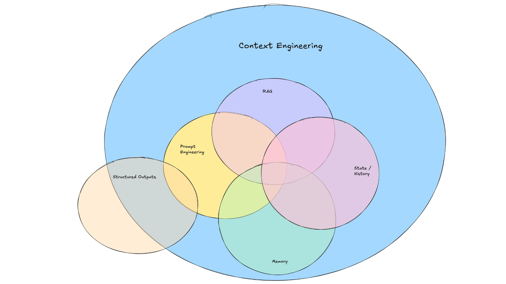
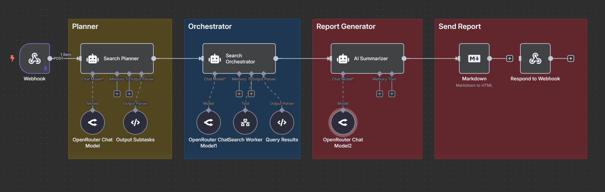

# **Context Engineering Guide**

## **Table of Contents**

* [What is Context Engineering?](#what-is-context-engineering)  
* [Context Engineering in Action](#context-engineering-in-action)  
  * [System Prompt](#system-prompt)  
  * [Instructions](#instructions)  
  * [User Input](#user-input)  
  * [Structured Inputs and Outputs](#structured-inputs-and-outputs)  
  * [Tools](#tools)  
  * [RAG & Memory](#rag--memory)  
  * [States & Historical Context](#states--historical-context)  
* [Advanced Context Engineering](#advanced-context-engineering-wip)  
* [Resources](#resources)


## **What is Context Engineering?**

A few years ago, many, even top AI researchers, claimed that prompt engineering would be dead by now.

Obviously, they were very wrong, and in fact, prompt engineering is now even more important than ever. It is so important that it is now being rebranded as ***context engineering***.

Yes, another fancy term to describe the important process of tuning the instructions and relevant context that an LLM needs to perform its tasks effectively.

Much has been written already about context engineering ([Ankur Goyal](https://x.com/ankrgyl/status/1913766591910842619), [Walden Yan](https://cognition.ai/blog/dont-build-multi-agents), [Tobi Lutke](https://x.com/tobi/status/1935533422589399127), and [Andrej Karpathy](https://x.com/karpathy/status/1937902205765607626)), but I wanted to write about my thoughts on the topic and show you a concrete step-by-step guide putting context engineering into action in developing an AI agent workflow.

I am not entirely sure who coined context engineering, but we will build on this figure from [Dex Horthy](https://x.com/dexhorthy/status/1933283008863482067) that briefly explains a bit about what context engineering is.



I like the term context engineering as it feels like a broader term that better explains most of the work that goes into prompt engineering, including other related tasks.

The doubt about prompt engineering being a serious skill is that many confuse it with blind prompting (a short task description you use in an LLM like ChatGPT). In blind prompting, you are just asking the system a question. In prompt engineering, you have to think more carefully about the context and structure of your prompt. Perhaps it should have been called context engineering from early on.

Context engineering is the next phase, where you architect the full context, which in many cases requires going beyond simple prompting and into more rigorous methods to obtain, enhance, and optimize knowledge for the system.

From a developer's point of view, context engineering involves an iterative process to optimize instructions and the context you provide an LLM to achieve a desired result. This includes having formal processes (e.g., eval pipelines) to measure whether your tactics are working.

Given the fast evolution of the AI field, I suggest a broader definition of context engineering: ***the process of designing and optimizing instructions and relevant context for the LLMs and advanced AI models to perform their tasks effectively.*** This encompasses not only text-based LLMs but also optimizing context for multimodal models, which are becoming more widespread. This can include all the prompt engineering efforts and the related processes such as:

* Designing and managing prompt chains (when applicable)  
* Tuning instructions/system prompts  
* Managing dynamic elements of the prompt (e.g., user inputs, date/time, etc.)  
* Searching and preparing relevant knowledge (i.e., RAG)  
* Query augmentation  
* Tool definitions and instructions (in the case of agentic systems)  
* Preparing and optimizing few-shot demonstrations  
* Structuring inputs and outputs (e.g., delimiters, JSON schema)  
* Short-term memory (i.e., managing state/historical context) and long-term memory (e.g., retrieving relevant knowledge from a vector store)  
* And the many other tricks that are useful to optimize the LLM system prompt to achieve the desired tasks.

In other words, what you are trying to achieve in context engineering is optimizing the information you are providing in the context window of the LLM. This also means filtering out noisy information, which is a science on its own, as it requires systematically measuring the performance of the LLM.

Everyone is writing about context engineering, but here we are going to walk you through a concrete example of what context engineering looks like when building AI agents.


## **Context Engineering in Action**

Let’s look at a concrete example of some recent context engineering work I did for a multi-agent deep research application I built for personal use.

I built the agentic workflow inside of n8n, but the tool doesn’t matter. The complete agent architecture I built looks like the following:



The Search Planner agent in my workflow is in charge of generating a search plan based on the user query.

### **System Prompt**

Below is the system prompt I have put together for this subagent:

```
You are an expert research planner. Your task is to break down a complex research query (delimited by <user_query></user_query>) into specific search subtasks, each focusing on a different aspect or source type.
        
The current date and time is: {{ $now.toISO() }}

For each subtask, provide:
1. A unique string ID for the subtask (e.g., 'subtask_1', 'news_update')
2. A specific search query that focuses on one aspect of the main query
3. The source type to search (web, news, academic, specialized)
4. Time period relevance (today, last week, recent, past_year, all_time)
5. Domain focus if applicable (technology, science, health, etc.)
6. Priority level (1-highest to 5-lowest)
        
All fields (id, query, source_type, time_period, domain_focus, priority) are required for each subtask, except time_period and domain_focus which can be null if not applicable.
        
Create 2 subtasks that together will provide comprehensive coverage of the topic. Focus on different aspects, perspectives, or sources of information.

Each substask will include the following information:

id: str
query: str
source_type: str  # e.g., "web", "news", "academic", "specialized"
time_period: Optional[str] = None  # e.g., "today", "last week", "recent", "past_year", "all_time"
domain_focus: Optional[str] = None  # e.g., "technology", "science", "health"
priority: int  # 1 (highest) to 5 (lowest)

After obtaining the above subtasks information, you will add two extra fields. Those correspond to start_date and end_date. Infer this information given the current date and the time_period selected. start_date and end_date should use the format as in the example below:

"start_date": "2024-06-03T06:00:00.000Z",
"end_date": "2024-06-11T05:59:59.999Z",
```

There are many parts to this prompt that require careful consideration about what exact context we are providing the planning agent to carry out the task effectively. As you can see, it’s not just about designing a simple prompt or instruction; this process requires experimentation and providing important context for the model to perform the task optimally.

Let’s break down the problem into core components that are key to effective context engineering.

### **Instructions**

The instruction is the high-level instructions provided to the system to instruct it exactly what to do.

```
You are an expert research planner. Your task is to break down a complex research query (delimited by <user_query></user_query>) into specific search subtasks, each focusing on a different aspect or source type.
```

Many beginners and even experienced AI developers would stop here. Given that I shared the full prompt above, you can appreciate how much more context we need to give the system for it to work as we want. That’s what context engineering is all about; it informs the system more about the problem scope and the specifics of what exactly we desire from it.

### **User Input**

The user input wasn’t shown in the system prompt, but below is an example of how it would look.

```
<user_query> What's the latest dev news from OpenAI? </user_query>
```

Notice the use of the delimiters, which is about structuring the prompt better. This is important to avoid confusion and adds clarity about what the user input is and what things we want the system to generate. Sometimes, the type of information we are inputting is related to what we want the model to output (e.g., the query is the input, and subqueries are the outputs).

### **Structured Inputs and Outputs**

In addition to the high-level instruction and the user input, you might have noticed that I spent a considerable amount of effort on the details related to the subtasks the planning agent needs to produce. Below are the detailed instructions I have provided to the planning agent to create the subtasks given the user query.

```
For each subtask, provide:
1. A unique string ID for the subtask (e.g., 'subtask_1', 'news_update')
2. A specific search query that focuses on one aspect of the main query
3. The source type to search (web, news, academic, specialized)
4. Time period relevance (today, last week, recent, past_year, all_time)
5. Domain focus if applicable (technology, science, health, etc.)
6. Priority level (1-highest to 5-lowest)
        
All fields (id, query, source_type, time_period, domain_focus, priority) are required for each subtask, except time_period and domain_focus which can be null if not applicable.
        
Create 2 subtasks that together will provide comprehensive coverage of the topic. Focus on different aspects, perspectives, or sources of information.
```

If you look closely at the instructions above, I have decided to structure a list of the required information I want the planning agent to generate, along with some hints/examples to better help steer the data generation process. This is crucial to give the agent additional context on what is expected. As an example, if you don’t tell it that you want the priority level to be on a scale of 1-5, then the system might prefer to use a scale of 1-10. Again, this context matters a lot\!

Next, let’s talk about structured outputs. In order to get consistent outputs from the planning agent, we are also providing some context on the subtask format and field types that we expect. Below is the example we are passing as additional context to the agent. This will provide the agent with hints and clues on what we expect as the output:

```
Each substask will include the following information:

id: str
query: str
source_type: str  # e.g., "web", "news", "academic", "specialized"
time_period: Optional[str] = None  # e.g., "today", "last week", "recent", "past_year", "all_time"
domain_focus: Optional[str] = None  # e.g., "technology", "science", "health"
priority: int  # 1 (highest) to 5 (lowest)
```

In addition to this, inside of n8n, you can also use a tool output parser, which essentially is going to be used to structure the final outputs. The option I am using is providing a JSON example as follows:

```
{
  "subtasks": [
    {
      "id": "openai_latest_news",
      "query": "latest OpenAI announcements and news",
      "source_type": "news",
      "time_period": "recent",
      "domain_focus": "technology",
      "priority": 1,
      "start_date": "2025-06-03T06:00:00.000Z",
      "end_date": "2025-06-11T05:59:59.999Z"
    },
    {
      "id": "openai_official_blog",
      "query": "OpenAI official blog recent posts",
      "source_type": "web",
      "time_period": "recent",
      "domain_focus": "technology",
      "priority": 2,
      "start_date": "2025-06-03T06:00:00.000Z",
      "end_date": "2025-06-11T05:59:59.999Z"
    },
...
}
```

Then the tool will automatically generate the schema from these examples, which in turn allows the system to parse and generate proper structured outputs, as shown in the example below:

```
[
  {
    "action": "parse",
    "response": {
      "output": {
        "subtasks": [
          {
            "id": "subtask_1",
            "query": "OpenAI recent announcements OR news OR updates",
            "source_type": "news",
            "time_period": "recent",
            "domain_focus": "technology",
            "priority": 1,
            "start_date": "2025-06-24T16:35:26.901Z",
            "end_date": "2025-07-01T16:35:26.901Z"
          },
          {
            "id": "subtask_2",
            "query": "OpenAI official blog OR press releases",
            "source_type": "web",
            "time_period": "recent",
            "domain_focus": "technology",
            "priority": 1.2,
            "start_date": "2025-06-24T16:35:26.901Z",
            "end_date": "2025-07-01T16:35:26.901Z"
          }
        ]
      }
    }
  }
]
```

This stuff looks complicated, but many tools today enable structured output functionalities out of the box, so it’s likely you won’t need to implement it yourself. n8n makes this part of context engineering a breeze. This is one underrated aspect of context engineering that I see many AI devs ignore for some reason. Hopefully, context engineering sheds more light on these important techniques. This is a really powerful approach, especially when your agent is getting inconsistent outputs that need to be passed in a special format to the next component in the workflow.

### **Tools**

We are using n8n to build our agent, so it’s easy to put in the context the current date and time. You can do it like so:

```
The current date and time is: {{ $now.toISO() }}
```

This is a simple, handy function that’s being called in n8n, but it’s typical to build this as a dedicated tool that can help with making things more dynamic (i.e., only get the date and time if the query requires it). That’s what context engineering is about. It forces you, the builder, to make concrete decisions about what context to pass and when to pass it to the LLM. This is great because it eliminates assumptions and inaccuracies from your application.

The date and time are important context for the system; otherwise, it tends not to perform well with queries that require knowledge of the current date and time. For instance, if I asked the system to search for the latest dev news from OpenAI that happened last week, it would just guess the dates and time, which would lead to suboptimal queries and, as a result, inaccurate web searches. When the system has the correct date and time, it can better infer date ranges, which are important for the search agent and tools. I added this as part of the context to allow the LLM to generate the date range:

```
After obtaining the above subtasks information, you will add two extra fields. Those correspond to start_date and end_date. Infer this information given the current date and the time_period selected. start_date and end_date should use the format as in the example below:

"start_date": "2024-06-03T06:00:00.000Z",
"end_date": "2024-06-11T05:59:59.999Z",
```

We are focusing on the planning agent of our architecture, so there aren’t too many tools we need to add here. The only other tool that would make sense to add is a retrieval tool that retrieves relevant subtasks given a query. Let’s discuss this idea below.

### **RAG & Memory**

This first version of the deep research application I have built doesn’t require the use of short-term memory, but we have built a version of it that caches subqueries for different user queries. This is useful to achieve some speed-ups/optimizations in the workflow. If a similar query was already used by a user before, it is possible to store those results in a vector store and search over them to avoid the need to create a new set of subqueries for a plan that we already generated and exists in the vector store. Remember, every time you call the LLM APIs, you are increasing latency and costs.

This is clever context engineering as it makes your application more dynamic, cheaper, and efficient. You see, context engineering is not just about optimizing your prompt; it’s about choosing the right context for the goals you are targeting. You can also get more creative about how you are maintaining that vector store and how you pull those existing subtasks into context. Creative and novel context engineering is the moat\!

### **States & Historical Context**

We are not showing it in v1 of our deep research agent, but an important part of this project was to optimize the results to generate the final report. In many cases, the agentic system might need to revise all or a subset of the queries, subtasks, and potentially the data it’s pulling from the web search APIs. This means that the system will take multiple shots at the problem and needs access to the previous states and potentially all the historical context of the system.

What does this mean in the context of our use case? In our example, it could be giving the agent access to the state of the subtasks, the revisions (if any), the past results from each agent in the workflow, and whatever other context is necessary to help in the revision phase. For this type of context, what we are passing would depend on what you are optimizing for. Lots of decision-making will happen here. Context engineering isn’t always straightforward, and I think you can start to imagine how many iterations this component will require. This is why I continue to emphasize the importance of other areas, such as evaluation. If you are not measuring all these things, how do you know whether your context engineering efforts are working?


## **Advanced Context Engineering \[WIP\]**

There are many other aspects of context engineering we are not covering in this article, such as context compression, context management techniques, context safety, and evaluating context effectiveness (i.e., measuring how effective that context is over time). We will be sharing more ideas about these topics in future articles.

Context can dilute or become inefficient (i.e., be filled with stale and irrelevant information), which requires special evaluation workflows to capture these issues.

I expect that context engineering continues to evolve as an important set of skills for AI developers/engineers. Beyond manual context engineering, there are also opportunities to build methods that automate the processing of effective context engineering. I’ve seen a few tools that have attempted this, but there needs to be more progress in this area.

<Callout type="info" emoji="🎓">
  <strong>This guide is a Work in Progress.</strong>  

  Learn how to apply context engineering in your own projects.

  Join our hands-on courses in [DAIR.AI Academy](https://dair-ai.thinkific.com/) for practical workflows, agent design, and more.
  
  We are also hosting a workshop on context engineering for our Pro members on July 31, 2025. Hope to meet some of you there.
    
  <strong>Use code <code>PROMPTING20</code> for 20% off Pro membership.</strong>
</Callout>

## **Resources**

Below are some recommended readings from other folks who have recently written about context engineering:
 
* [https://rlancemartin.github.io/2025/06/23/context\_engineering/](https://rlancemartin.github.io/2025/06/23/context_engineering/)  
* [https://x.com/karpathy/status/1937902205765607626](https://x.com/karpathy/status/1937902205765607626)  
* [https://www.philschmid.de/context-engineering](https://www.philschmid.de/context-engineering)  
* [https://simple.ai/p/the-skill-thats-replacing-prompt-engineering?](https://simple.ai/p/the-skill-thats-replacing-prompt-engineering?)  
* [https://github.com/humanlayer/12-factor-agents](https://github.com/humanlayer/12-factor-agents)  
* [https://blog.langchain.com/the-rise-of-context-engineering/](https://blog.langchain.com/the-rise-of-context-engineering/)


*Please reach out if you see any mistakes in this article.*

import { Callout } from 'nextra/components'
