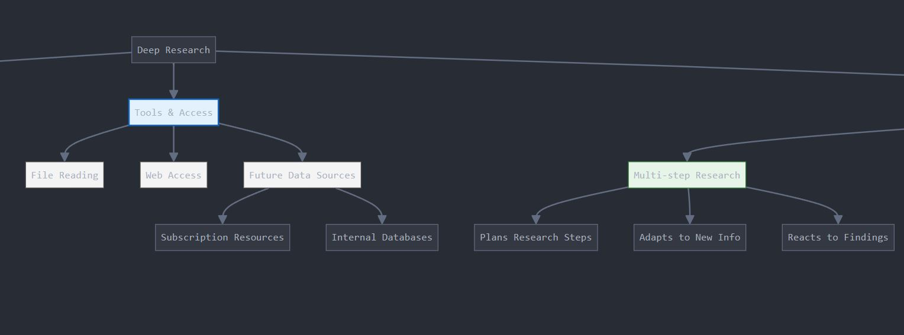
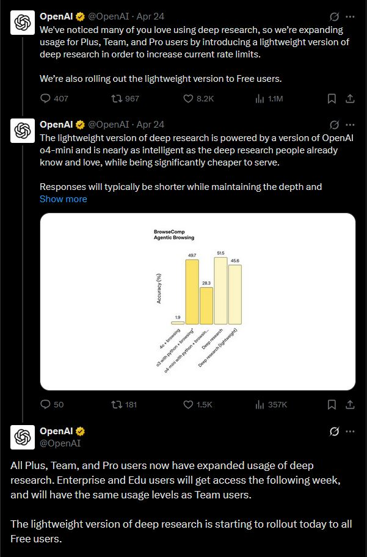
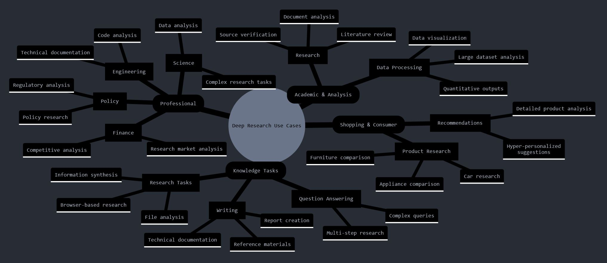
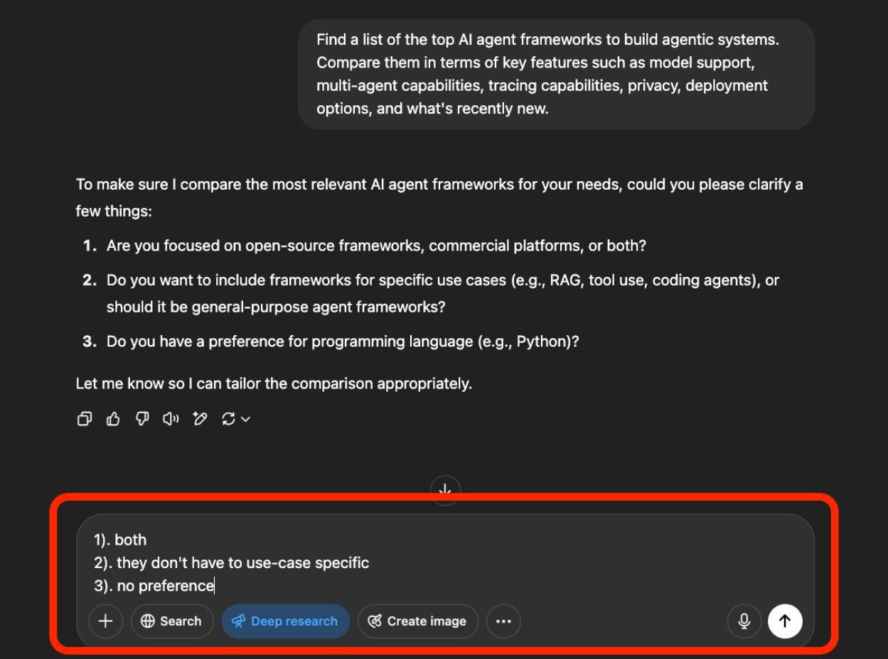
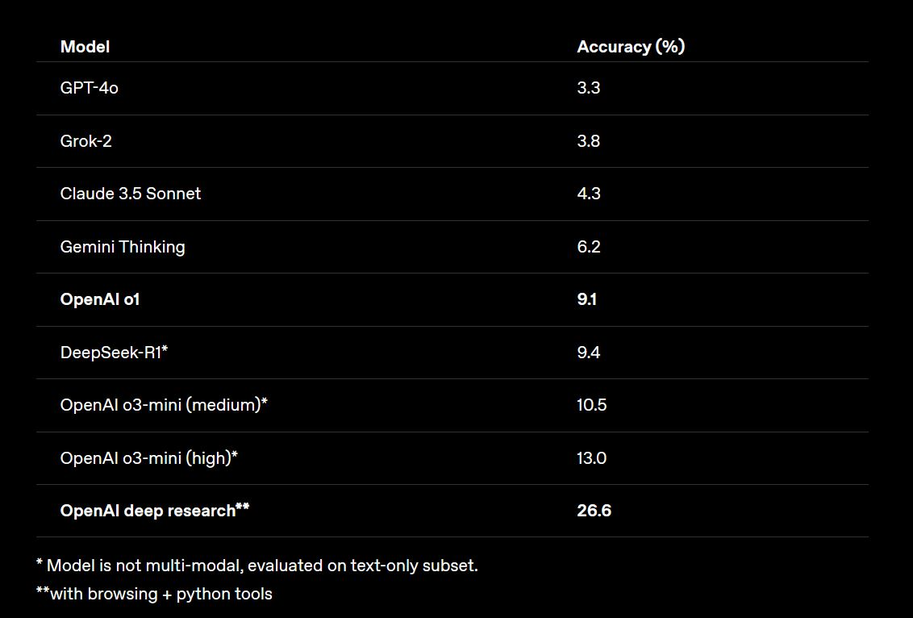

## OpenAI Deep Research Guide

<iframe width="100%"
  height="415px"
  src="https://www.youtube.com/embed/wovjVUnYfic?si=OinK6Vd-VYRMy7Gt"
  allow="accelerometer; autoplay; clipboard-write; encrypted-media; gyroscope; picture-in-picture"
  allowFullScreen
/>

### What is Deep Research?

Deep Research is OpenAI’s new agent that can perform **multi-step research** on the internet for performing complex tasks like generating reports and competitor analysis. It is an **agentic reasoning system** that has access to tools such as **Python** and web browsing to perform advanced research across a wide range of domains.

This system is designed to execute complex multi-step research tasks in significantly less time than a human would typically require, completing tasks in minutes instead of hours. This makes it particularly useful for tasks that require **extensive** and **complex web searches**. Deep Research is powered by OpenAI's **o3 model**, which is optimized for web browsing and data analysis, employing reasoning to search, interpret, and analyze massive amounts of information. More recently, OpenAI has introduced a lightweight version of Deep Research powered by **o4-mini**.

The model was developed using **reinforcement learning (RL)**, training it to browse effectively, reason about complex information, and learn to plan and execute multi-step tasks to find the data it needs. It possesses the ability to **backtrack, adapt its plan**, and **react** to real-time information as needed. Deep Research supports **user-uploaded files**, can **generate plots** using Python, and is designed to embed generated graphs and images from websites (though this embedding feature is not fully functional at the moment), including adding citations.

**Deep Research Flow Chart:**  
[https://claude.site/artifacts/4e4f5dec-b44a-4662-b727-089515cc045e](https://claude.site/artifacts/4e4f5dec-b44a-4662-b727-089515cc045e)

### How to Access OpenAI Deep Research? 

Deep Research is currently available to users with **Pro, Plus, Teams, and Enterprise** subscriptions. Usage limits were expanded in an April 24th update from OpenAI. For **Plus, Team, Enterprise, and Edu users**, the limit is now **25 deep research queries per month**, up from 10. Pro users now have a limit of **250 deep research queries per month**, up from 120. **Free users** get **5 deep research queries** using the lightweight version. OpenAI has stated that once limits for the original version of Deep Research are reached, queries automatically default to the **lightweight version**.

### What Problems Does Deep Research Solve?

Deep Research can perform **complex multi-step research tasks** much faster than people can, reducing hours of work to minutes. It is useful for tasks that require extensive and complex web searches, as it figures out a sophisticated plan and the search queries needed.

Its core process is **Search + Analyze + Synthesize**, leading to **Report Generation**, **Insights**, and **Action Plans**. It can do this using hundreds of online sources.

### Deep Research Use Cases

**Professional Applications:**  
  * Finance: Market and competitive analysis  
  * Scientific research and data analysis  
  * Policy and regulatory research  
  * Engineering documentation and analysis  

**Shopping & Consumer Research:**  
  * Detailed product research (cars, appliances, furniture)  
  * Hyper-personalized recommendations  
  * In-depth product comparisons  

**Academic & Analysis:**  
  * Literature review and comprehensive summaries  
  * Generate overviews with findings and discover new insights  
  * Identify research gaps → new research questions → novel scientific research  
  * Discover trends and find new recommended new readings  
  * Analyzing quantitative outputs and generate interesting discussions  
  * Source verification and discovering new evidence  
  * Hypothesis testing?  

**Knowledge Work/Enginering:**  
  * Answering complex queries requiring multiple steps  
  * Analyzing uploaded files and documents and augmenting with new research  
  * Creating comprehensive reports  
  * Developing technical documentation  
  * Conduct feasibility studies  
  * Synthesizing information from multiple sources

**Our Examples:** 

*   [Analyze GitHub Repos](https://x.com/OpenAIDevs/status/1920556386083102844) (New functionality added 8 May, 2025)
*   [Top AI Agent Frameworks](https://chatgpt.com/share/681bd7b4-41e0-8000-a9de-c2b82c55d5ba) (Report)
*   [AI-Driven Scientific Discovery Across Disciplines](https://chatgpt.com/share/681bdb1f-e764-8000-81c8-fab25119da0d) (Literature Review)
*   [OpenAI models vs. Google Gemini models](https://chatgpt.com/share/681cbf8e-6550-8000-b7ea-e94ca104a17f) (Competitive Analysis)
*   [Trends in AI Education](https://chatgpt.com/share/681cc54d-f970-8000-8e6e-c6df6ae9e73e) (Trends)
*   [YC Startup Ideas Research](https://chatgpt.com/share/681ccd59-0ef8-8000-a638-16b2c803bc99) (Company Research)
*   [DeepSeek-R1 Guide](https://chatgpt.com/share/67a3dd37-5a2c-8000-9a87-3b5f2d90350e) (Guide)
*   [CrewAI Framework - One-Month Study Plan](https://chatgpt.com/share/67a4cece-f444-8000-9a55-8491767e4aff) (Study Plan)
*   [LLM Pricing Trends](https://chatgpt.com/share/67a4cf07-efec-8000-ad83-486163512568) (Trends)
*   [Recent Papers on o1 and DeepSeek-R1](https://chatgpt.com/share/67a4cf3b-cfe4-8000-a1ca-71b0c1555caa) (Summary & Analysis)

More examples here: [https://openai.com/index/introducing-deep-research/](https://openai.com/index/introducing-deep-research/)

Deep research particularly excels at tasks that would normally take humans **many hours to complete**, especially those requiring:

* **Integration of multiple information sources**  
* **Deep analysis of complex data**  
* **Creation of well-documented reports**  
* **Multi-step research processes** (involving planning, finding, browsing, reasoning, analyzing, and synthesizing)  
* **Processing, understanding, and reasoning about large amounts of information**

Word cloud of use cases (generated by Claude): [https://claude.site/artifacts/76919015-51ba-496e-bbde-451336eac16a](https://claude.site/artifacts/76919015-51ba-496e-bbde-451336eac16a)

### How to decide when to use Deep Research?

Use Deep Research if the task **requires multi-faceted, domain-specific queries** requiring extensive research for **real-time information** and **careful reasoning/understanding** about that information. Look at other sections of this document for more concrete use cases and inspirations of when to use Deep Research. 

You can use the raw (without Deep Research) o1-mini and GPT-4o for all other tasks. Use o1-mini if it’s a task that can benefit from reasoning (breaking down complex tasks into smaller parts in an autonomous way). Use GPT-4o for all other one-off simple tasks.  

### Usage Tips for OpenAI's Deep Research 

Here is a summary of the usage tips I have gathered from my own experiments and observing the results of others:

#### Prompting Tips

* **Clear and specific instructions**: Give it a plan and be as specific as possible. Tasks take time, so it’s important to get the prompt right the first time.
* **Clarify, don’t ignore**: The model will ask questions to clarify things it’s not sure about. Answering thoroughly helps get better results. Requests are more expensive than standard queries, so take time to clarify.

* **Keywords help a lot**: The reasoning model uses keywords to search the web, so provide as many as possible. Precise terms (e.g., brand, technical term, product name) save the model time and effort.
* **Use clear verbs**: Deep Research is trained to follow instructions. Verbs like “compare,” “suggest,” “recommend,” and “report” help it understand the task and what output you want.
* **Output Format**: Give instructions about the format you want, if any. For example, what type of report, format, or sections to include, or if you need tables. You can also specify the layout of reports or tables (e.g., how many columns, headers). The model’s preferred report-style output may not work for everyone.
* **Upload files as context**: Add files like PDFs to help guide the model and give important context, especially for very technical topics or information the model might not know much about. This works with the ChatGPT-4o model.

**Check sources & verify information**: Always check sources yourself. The model can still make mistakes and may struggle to tell authoritative information from speculation.

### What to try Next?

These are some ideas that you can try using Deep Research for:

* **Research**  
  * Performing comprehensive market research/competitor analysis on AI tools  
  * Research around new products including reviews, price comparisons, etc.  
  * Give it a doc and ask it to augment and fill in more details or even critize it  
  * Do extensive research to make product feature recommendations based on trends, adoption rates, and other user patterns  
  * User studies  
  * Legal case research: gathering case laws, precedents, and regulations  
  * Fact-checking or background checks  
* **Business use cases**  
  * Search and develop AI/agent use cases for a specific domain  
  * Track trends in a specific domain or topic  
* **Learning use cases**  
  * Build a study plan and make recommendations about a learning path  
  * A collection of tips and coding best practices on how to use AI models  
  * Check for the latest features of a specific developer tool and ask it to suggest exercises or learning material  
* **Science**  
  * Latest research on health-related topics like sleep, symptoms, mental health, etc.   
  * Write technical reports with the latest findings about a topic  
* **Content Creation**  
  * Write a blog post on a combination of topics  
  * Suggest topics to write about or build content about by analyzing trends on the web about a domain  
* **Personal**   
  * Develop a detailed bio about you or any other public figure  
  * Develop/update a resume based on public information and projects  
  * Generate/Suggest slides for an upcoming presentation

### How does OAI Deep Research differ from other Solutions? 

There are already dedicated agentic solutions, such as Google's Gemini Deep Research, and various frameworks available to build agentic workflows similar to Deep Research. For instance, **Flowise AI** can be used to replicate something similar. Developers can also use tools like **Llama Index, crewAI, n8n, or LangGraph** to construct these systems. Such custom-built systems might be more cost-effective and can be integrated with currently available models like o1 and o3-mini.

It is important to note that OpenAI utilizes a *proprietary o3 model variant* for Deep Research, to which only they have access. This model has been specifically designed to conduct complex reasoning and multi-step research tasks, which are *important capabilities* for these types of workflows. It is not yet entirely clear whether OpenAI plans to launch this specific model via their APIs or even make it available in ChatGPT. For a performance comparison, results of Deep Research and o3-mini-high on benchmarks like Humanity’s Last Exam are available from OpenAI (Source: https://openai.com/index/introducing-deep-research/).

The more the model browses and thinks about what it's browsing, the better it does, which is why *giving it time to think is important*. *Reasoning models are key to making Deep Research perform better on complex tasks*. As reasoning models improve, so will Deep Research.

### Deep Research Limitations?

Deep Research, while powerful, has several areas for improvement. It still **struggles to synthesize technical and domain-specific information**, so it’s helpful to provide any supporting documents if available. The model also **needs to improve on hallucinations**. It still makes mistakes and may struggle to distinguish authoritative information from rumors. **Results for different sectors/domains might vary**, and it **has challenges with combining diverse types of information**.

Several specific limitations are also noted:

* It's **unclear how to make it explicitly search for more online sources** (say, like 50 different articles) or scope to specific sources. An **observed bias towards certain domain names also exists**.
* It still produces **citation mistakes and formatting errors**.
* It’s **difficult to get information out of Deep Research**; features allowing export to other formats like Excel, notebooks, Notion, Docs, or other popular editing software would be great.
* It is **not great with time/date-related queries**, so be as specific as you can here.
* **Sources behind paywalls/subscriptions are still not supported**; integrations for this may be coming in the future.
* **Generating and embedding charts is not functional yet** from our experiments (though it can incorporate images), but this is expected to be rolled out eventually.

A significant limitation is that **Deep Research doesn’t take action (yet)**. OpenAI claims that Deep Research can open web pages and look at different components (mostly reading actions), but it might be interesting for it to perform site searches (in the background) and execute actions like Operator. This can help it find more relevant information across the web (e.g., use the advanced search functionality on the arXiv website). We might see a merging of Operator and Deep Research in the near future.

More tools and accessing knowledge bases automatically would be interesting. More **personalization is needed in the outputs**. This could potentially improve by leveraging custom instructions (not sure how this affects responses yet). OpenAI recently released advanced memory capabilities, which could also be useful to make more focused and personalized deep research.

import { Callout } from 'nextra/components'

<Callout type= "info" emoji="🎓">
Learn how to build a Deep Research agent in our new course: [Advanced AI Agents](https://dair-ai.thinkific.com/courses/advanced-ai-agents)

Use code PROMPTING20 to get an extra 20% off.

</Callout>

### Other Useful References

* [Introducing deep research | OpenAI](https://openai.com/index/introducing-deep-research/)  
* [Introduction to Deep Research](https://www.youtube.com/watch?v=YkCDVn3_wiw&ab_channel=OpenAI)  
* [OpenAI Deep Research: The Future of Autonomous Research and Analysis](https://dirox.com/post/openai-deep-research)  
* [OpenAI’s 5-Stage AI Roadmap, Explained Using the “3 Levels of AI Adoption and the 6 Levels of Autonomous Companies” | by The Last AI | Dec, 2024 | Medium](https://medium.com/@The_Last_AI/openais-5-stage-ai-roadmap-explained-using-the-3-levels-of-ai-adoption-and-the-6-levels-of-e295693cc105)
* [No Priors Ep. 112 with OpenAI Deep Research, Isa Fulford](https://www.youtube.com/watch?v=qfB4eDkd_40)