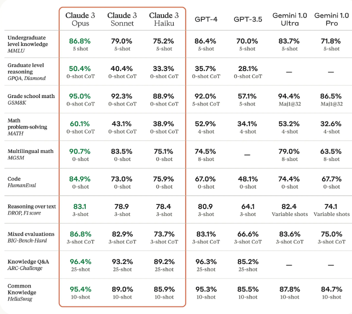
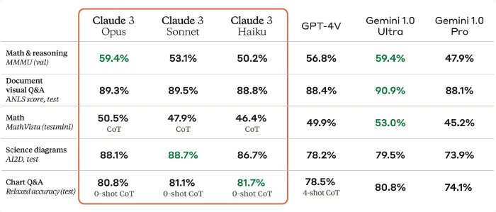

# Claude 3

Anthropic announces Claude 3, their new family of models that include Claude 3 Haiku, Claude 3 Sonnet, and Claude 3 Opus. 

Claude 3 Opus (the strongest model) is reported to outperform GPT-4 and all other models on common benchmarks like MMLU and HumanEval.

## Results and Capabilities

Claude 3 capabilities include advanced reasoning, basic mathematics, analysis, data extraction, forecasting, content creation, code generation, and converting in non-English languages like Spanish, Japanese, and French. The table below demonstrates how Claude 3 compares with other models on several benchmarks with Claude 3 Opus outperforming all the mentioned models:

Claude 3 Haiku is the fastest and most cost-effective model of the series. Claude 3 Sonnet is 2x faster than previous iterations of Claude and Opus is as fast as Claude 2.1 with more superior capabilities.

The Claude 3 models offer support for 200K context windows but can be extended to 1M tokens to select customers. Claude 3 Opus achieved near-perfect recall on the Needle In A Haystack (NIAH) evaluation which measures the model's ability to recall information in a large corpus and effectively process long context prompts.

The models also have strong vision capabilities for processing formats like photos, charts, and graphs. 

Anthropic also claim that these models have a more nuanced understanding of requests and make fewer refusals. Opus also shows significant improvements in factual question answering in open-ended questions while reducing incorrect answers or hallucinations. Claude 3 models are also better than the Claude 2 models at producing structured outputs like JSON objects.

## References

- [Claude 3 Haiku, Claude 3 Sonnet, and Claude 3 Opus](https://www.anthropic.com/news/claude-3-family)
- [The Claude 3 Model Family: Opus, Sonnet, Haiku](https://www-cdn.anthropic.com/de8ba9b01c9ab7cbabf5c33b80b7bbc618857627/Model_Card_Claude_3.pdf)