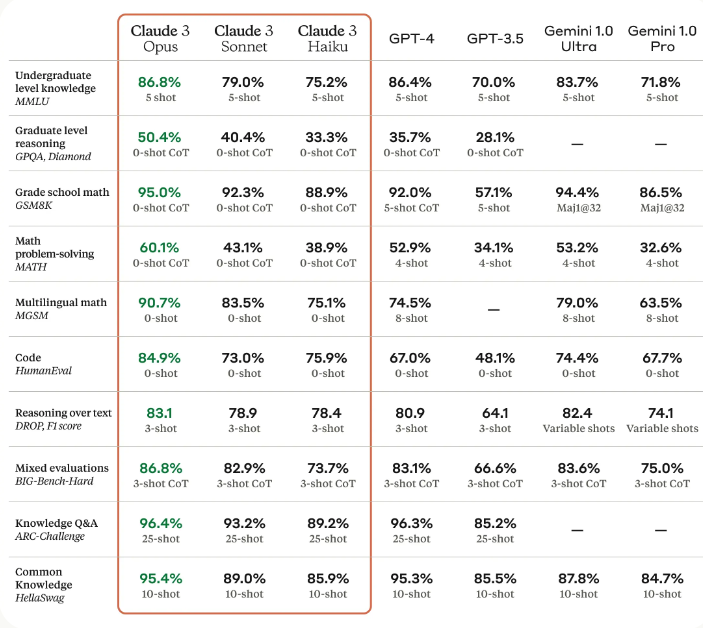
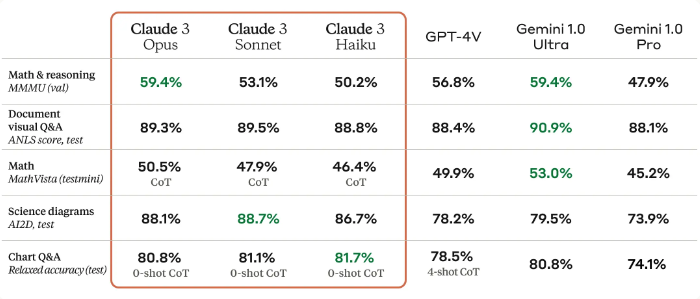

# Claude 3

Anthropic 宣布推出 Claude 3，这是其最新一代模型系列，包括 Claude 3 Haiku、Claude 3 Sonnet 和 Claude 3 Opus。

据报告，Claude 3 Opus（该系列中最强的模型）在 MMLU 和 HumanEval 等常见基准测试中表现优于 GPT-4 以及其他所有模型。

## 性能与能力

Claude 3 的能力涵盖高级推理、基础数学、分析、数据提取、预测、内容创作、代码生成，以及在西班牙语、日语和法语等非英语语言中的转换。下表展示了 Claude 3 在多个基准测试上与其他模型的对比情况，其中 Claude 3 Opus 超越了所有提及的模型：

Claude 3 Haiku 是该系列中最快且最具成本效益的模型。Claude 3 Sonnet 的速度是之前版本的两倍，而 Opus 的速度与 Claude 2.1 相当，但具备更强大的功能。

Claude 3 模型支持 200K 的上下文窗口，并可面向部分客户扩展至 1M token 。 Claude 3 Opus 在 Needle In A Haystack（NIAH）评估中实现了近乎完美的召回率，而该评估用于衡量模型在大规模语料库中回忆信息并有效处理长上下文提示的能力。

这些模型还具备强大的视觉处理能力，能够处理照片、图表和图形等格式。

Anthropic 还声称，这些模型对请求的理解更加细致，并减少了拒绝响应的情况。Opus 在开放性问题的事实性问答方面表现出显著提升，同时降低了错误答案或幻觉的发生率。此外，Claude 3 模型在生成结构化输出（如 JSON 对象）方面也优于 Claude 2 模型。

## 参考文献

- [Claude 3 Haiku, Claude 3 Sonnet, and Claude 3 Opus](https://www.anthropic.com/news/claude-3-family)
- [The Claude 3 Model Family: Opus, Sonnet, Haiku](https://www-cdn.anthropic.com/de8ba9b01c9ab7cbabf5c33b80b7bbc618857627/Model_Card_Claude_3.pdf)