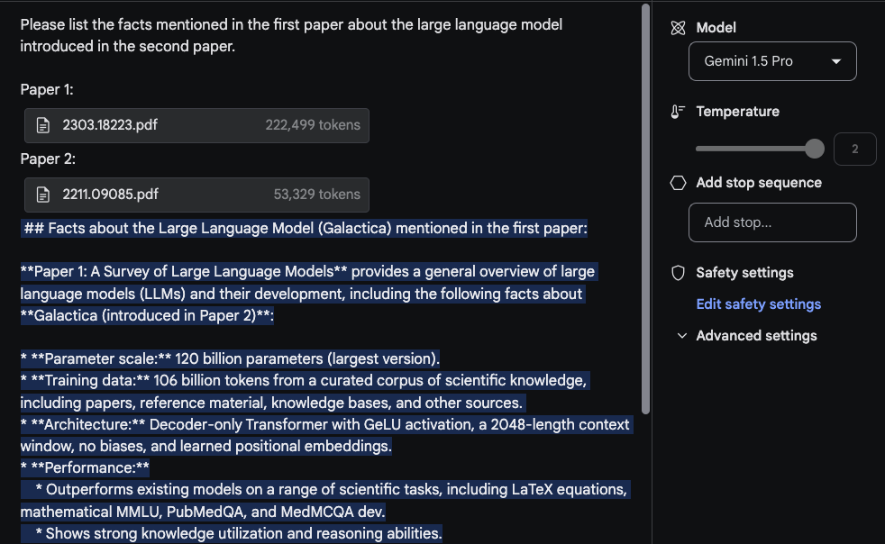
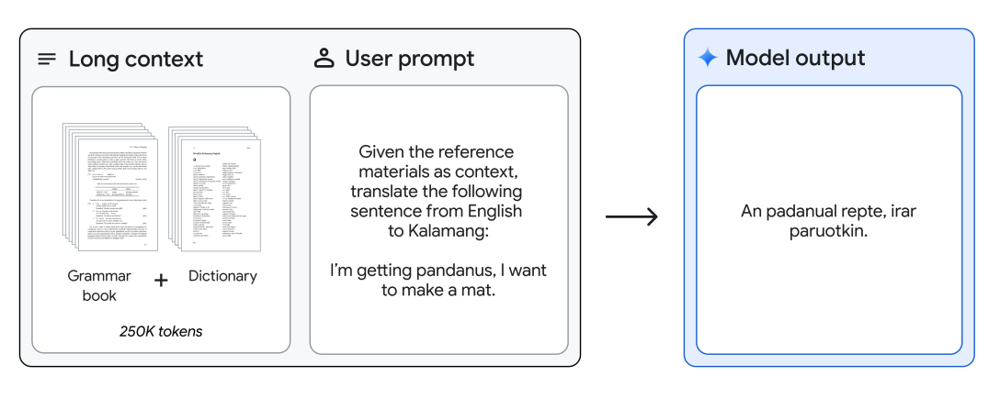

# Gemini 1.5 Pro

Google stellt Gemini 1.5 Pro vor, ein recheneffizientes multimodales Mischmodell aus Experten. Dieses KI-Modell konzentriert sich auf Fähigkeiten wie das Abrufen und Schlussfolgern über langformige Inhalte. Gemini 1.5 Pro kann über lange Dokumente schlussfolgern, die potenziell Millionen von Tokens enthalten, einschließlich Stunden von Video- und Audioinhalten. Gemini 1.5 Pro verbessert die bestehenden Spitzenleistungen bei Fragen und Antworten zu langen Dokumenten, langen Videos und langkontextueller automatischer Spracherkennung (ASR). Gemini 1.5 Pro erreicht oder übertrifft Gemini 1.0 Ultra in allen Standard-Benchmarks und erreicht eine nahezu perfekte Wiederauffindungsrate (>99%) bis zu mindestens 10 Millionen Tokens, ein signifikanter Fortschritt im Vergleich zu anderen LLMs für lange Kontexte.

Als Teil dieser Veröffentlichung präsentiert Google auch ein neues experimentelles Modell mit einem Kontextfenster von 1 Million Tokens, das in Google AI Studio ausprobiert werden kann. Um es anders auszudrücken, 200K ist das bisher größte Kontextfenster eines verfügbaren LLM. Mit dem 1-Millionen-Kontextfenster zielt Gemini 1.5 Pro darauf ab, eine Vielzahl von Anwendungsfällen zu ermöglichen, die Fragen und Antworten über große PDFs, Code-Repositorys und sogar umfangreiche Videos als Prompts in Google AI Studio einschließen. Es unterstützt eine Mischung aus Audio-, Video-, Text- und Code-Eingaben in derselben Eingabesequenz.

## Architektur
Gemini 1.5 Pro ist ein sparsames Mischmodell aus Experten (MoE) basierend auf einem Transformer, das auf den multimodalen Fähigkeiten von Gemini 1.0 aufbaut. Der Vorteil von MoE ist, dass die Gesamtzahl der Modellparameter wachsen kann, während die Anzahl der aktivierten Parameter konstant bleibt. Im [technischen Bericht](https://storage.googleapis.com/deepmind-media/gemini/gemini_v1_5_report.pdf) sind nicht viele Details enthalten, aber es wird berichtet, dass Gemini 1.5 Pro deutlich weniger Rechenleistung für das Training benötigt, effizienter zu bedienen ist und Architekturänderungen beinhaltet, die das Verständnis von langen Kontexten (bis zu 10 Millionen Tokens) ermöglichen. Das Modell wird mit Daten vortrainiert, die verschiedene Modalitäten und Anweisungen umfassen, die mit multimodalen Daten abgestimmt wurden, mit weiterer Feinabstimmung basierend auf Daten zu menschlichen Präferenzen.


## Ergebnisse
Gemini 1.5 Pro erreicht eine nahezu perfekte "Nadel" -Wiederauffindung von bis zu 1 Million Tokens in allen Modalitäten, d. h. Text, Video und Audio. Um das Unterstützte Kontextfenster von Gemini 1.5 Pro einzuordnen, kann Gemini 1.5 Pro die Wiederaufführungsleistung aufrechterhalten und erweitern auf:

- ~22 Stunden Aufnahmen
- 10 x 1440 Seiten Bücher
- komplette Codebasen
- 3 Stunden Video bei 1 fps


Gemini 1.5 Pro übertrifft Gemini 1.0 Pro bei der Mehrheit der Benchmarks mit signifikanten Leistungen in Mathematik, Wissenschaft, Schlussfolgern, Mehrsprachigkeit, Videoverständnis und Code. Unten ist eine Tabelle mit den Ergebnissen der verschiedenen Gemini-Modelle zusammengefasst. Gemini 1.5 Pro übertrifft Gemini 1.0 Ultra bei der Hälfte der Benchmarks, obwohl es deutlich weniger Rechenleistung für das Training verwendet.


## Fähigkeiten

Die folgenden Unterabschnitte heben eine Reihe von Fähigkeiten hervor, die mit Gemini 1.5 Pro möglich sind, von der Analyse großer Datenmengen bis zum Schlussfolgern in langen multimodalen Kontexten. Einige der Fähigkeiten wurden im Papier, von der Community und aus unseren Experimenten berichtet.

### Analyse langer Dokumente

Um die Fähigkeiten von Gemini 1.5 Pro zur Verarbeitung und Analyse von Dokumenten zu demonstrieren, beginnen wir mit einer sehr einfachen Aufgabe zum Beantworten von Fragen. Das Gemini 1.5 Pro-Modell in Google AI Studio unterstützt bis zu 1 Million Tokens, sodass wir ganze PDFs hochladen können. Das unten stehende Beispiel zeigt, dass ein einzelnes PDF hochgeladen wurde, zusammen mit einem einfachen Prompt `Worum geht es in dem Paper?`:


Die Antwort des Models ist genau und prägnant, da sie eine akzeptable Zusammenfassung des [Galactica-Papers](https://arxiv.org/abs/2211.09085) bietet. Das oben genannte Beispiel verwendet einen freiformigen Prompt innerhalb von Google AI Studio, aber Sie können auch das Chat-Format verwenden, um mit einem hochgeladenen PDF zu interagieren. Dies ist eine nützliche Funktion, wenn Sie viele Fragen haben, die Sie aus dem/den bereitgestellten Dokument(en) beantwortet haben möchten.


Um das lange Kontextfenster zu nutzen, laden wir nun zwei PDFs hoch und stellen eine Frage, die beide PDFs umfasst.



Die Antwort ist vernünftig und der interessante Teil ist, dass die aus dem ersten Paper, das ein [Übersichtspaper über LLMs](https://arxiv.org/abs/2303.18223) ist, extrahierte Information aus einer Tabelle kommt. Die Information zur "Architektur" scheint ebenfalls korrekt zu sein. Der Abschnitt "Performance" gehört jedoch nicht dazu, da er nicht im ersten Paper gefunden wurde. Für diese Aufgabe war es wichtig, den Prompt `Bitte listen Sie die im ersten Paper erwähnten Fakten über das im zweiten Paper eingeführte große Sprachmodell auf.` oben zu setzen und die Papiere mit Tags wie `Paper 1` und `Paper 2` zu kennzeichnen. Eine weitere damit zusammenhängende Folgeaufgabe zu diesem Experiment könnte sein, einen Abschnitt mit verwandten Arbeiten zu schreiben, indem eine Reihe von Papieren hochgeladen und die Anweisungen dafür, wie sie zusammenzufassen sind, bereitgestellt werden. Ein weiterer Spaß könnte es sein, das Modell zu bitten, neuere LLM-Papiere in die Übersicht aufzunehmen.

### Verständnis von Videos

Gemini 1.5 Pro ist von Grund auf mit multimodalen Fähigkeiten trainiert und demonstriert auch Fähigkeiten im Verständnis von Videos. Wir haben einige Prompts mit einem der [jüngsten Vorträge über LLMs von Andrej Karpathy](https://www.youtube.com/watch?v=zjkBMFhNj_g&ab_channel=AndrejKarpathy) getestet.

Für diese kurze Demo haben wir einen `Chat-Prompt` erstellt und das YouTube-Video, das Karpathys Vortrag enthält, hochgeladen. Die erste Frage lautet `Worum geht es in dem Vortrag?`. Nichts zu Ausgefallenes hier, aber die Antwort ist akzeptabel, da sie den Vortrag genau zusammenfasst.


Die zweite Aufgabe, zu der wir das Modell auffordern, besteht darin, eine prägnante Gliederung (eine Seitenlänge) des Vortrags zu liefern. Die Antwort lautet wie folgt (zur Kürze bearbeitet):

```markdown
## Große Sprachmodelle: Ein neues Betriebssystem?
Einführung:

- LLMs werden mit riesigen Mengen an Textdaten trainiert und können menschenähnlichen Text generieren.
- Sie werden zunehmend leistungsfähiger und für eine breite Palette von Aufgaben eingesetzt, wie Schreiben, Übersetzen und Programmieren.

Wie LLMs funktionieren:

- LLMs sind neuronale Netzwerke, die das nächste Wort in einer Sequenz vorhersagen.
- Sie lernen, indem sie ihre Parameter iterativ anpassen, um bessere Vorhersagen zu treffen.
- Obwohl wir ihre Leistung messen können, verstehen wir nicht vollständig, wie die Milliarden von Parametern zusammenarbeiten, um dies zu erreichen.

Training von LLMs:

- Erfordert massive Mengen an Daten und Rechenleistung.
- Kann als "Komprimierung des Internets" in eine einzige Datei betrachtet werden.
- Zum Beispiel erforderte das Training von LLaMA 2 70B 6.000 GPUs für 12 Tage und kostete ~$2 Millionen.

Sicherheit von LLMs:

- Die Sicherheit von LLMs ist ein neues und sich schnell entwickelndes Feld.
- Einige Schlüsselrisiken für die Sicherheit beinhalten:
    - Jailbreaking: das Umgehen von Sicherheitsmechanismen, um schädliche Inhalte zu generieren.
    - Prompt-Injektion: das Einbringen von bösartigem Code in Prompts, um die Ausgabe des LLM zu steuern.
    - Datenvergiftung / Backdoor-Angriffe: das Einfügen von speziell gestaltetem Text in die Trainingsdaten, um das Verhalten des LLM zu beeinflussen.
...
```

Die Zusammenfassung ist sehr prägnant und stellt eine gute Gliederung des Vortags zusammen mit den wichtigsten Punkten dar. Wir haben die gesamte Ausgabe nicht auf Genauigkeit überprüft, aber es ist interessant zu sehen, dass das Modell informative Bits wie `"das Training von LLaMA 2 70B erforderte 6.000 GPUs für 12 Tage und kostete ~$2 Millionen."` ausgibt.

Wenn die spezifischen Details wichtig sind, beachten Sie, dass das Modell manchmal "halluziniert" oder aus verschiedenen Gründen falsche Informationen abruft. Zum Beispiel, als wir das Modell mit dem Prompt `Wie viele FLOPs wurden für Llama 2 in dem Vortrag berichtet?` aufforderten, antwortete es mit `Im Vortrag wird berichtet, dass das Training von Llama 2 70B ungefähr 1 Billion FLOPs benötigte.`, was nicht genau ist. Die korrekte Antwort sollte `~1e24 FLOPs` sein. Im technischen Bericht sind viele Beispiele dafür enthalten, wo diese Modelle für lange Kontexte versagen, wenn sie spezifische Fragen über das Video gestellt bekommen.

Die nächste Aufgabe beinhaltet das Extrahieren von Tabelleninformationen aus dem Video. Das Beispiel zeigt den Prompt und die Antwort. Wir können beobachten, dass das Modell eine Tabelle generiert hat und es einige Details richtig und einige falsch bekommen hat. Zum Beispiel sind die Spaltenüberschriften der Tabelle korrekt, aber eine der Zeilenbeschriftungen ist falsch (d. h. `Concept Resolution` sollte `Coref Resolution` sein). Wir haben einige dieser Extraktionsaufgaben mit anderen Tabellen und anderen verschiedenen Elementen wie Textfeldern getestet und haben ähnliche Inkonsistenzen festgestellt.

Ein interessantes Beispiel, das im technischen Bericht dokumentiert ist, ist die Fähigkeit des Modells, Details aus dem Video basierend auf spezifischen Szenen oder Zeitstempeln abzurufen. Im ersten Beispiel haben wir das Modell aufgefordert, mit der Antwort auf die Frage, wo ein spezifischer Abschnitt beginnt.

Prompt:
```
An welchem Zeitstempel beginnt der Abschnitt zum LLM-Betriebssystem?
```

Ausgabe:
```
Der Abschnitt zum LLM-Betriebssystem beginnt bei 42:17.
```

Die Antwort ist korrekt.

Im nächsten Beispiel fragen wir das Modell, ein Diagramm zu erklären, das auf den Folien zu finden ist.

Prompt:
```
Können Sie das Diagramm (auf der rechten Seite) auf der Folie zur Selbstverbesserung erklären?
```

Ausgabe:
```
Das Diagramm zeigt die Leistung von AlphaGo Zero im Laufe der Zeit, gemessen an seiner Elo-Bewertung. Die Elo-Bewertung ist ein Maß für die Spielfähigkeit eines Spielers, wobei höhere Bewertungen auf stärkere Spieler hinweisen. Das Diagramm zeigt, dass sich die Leistung von AlphaGo Zero innerhalb von 40 Tagen schnell verbesserte und schließlich die Leistung aller anderen Versionen von AlphaGo übertraf, einschließlich der Version, die den Weltmeister im Go, Lee Sedol, besiegte. Diese Verbesserung wurde vollständig durch Selbstspiel erreicht, ohne menschliches Eingreifen oder historische Daten.
```

Das Modell scheint die bereitgestellten Informationen gut zu nutzen, um die Ergebnisse im Diagramm zu erklären. Unten ist eine Momentaufnahme der entsprechenden Folie:


### Code-Schlussfolgern
Mit seinem langkontextuellen Schlussfolgern kann Gemini 1.5 Pro Fragen zur Codebasis beantworten. Mit Google AI Studio ermöglicht Gemini 1.5 Pro bis zu 1 Million Tokens, sodass wir eine gesamte Codebasis hochladen und es mit verschiedenen Fragen oder codebezogenen Aufgaben auffordern können. Der technische Bericht liefert ein Beispiel, in dem das Modell die gesamte JAX-Codebasis im Kontext (~746K Tokens) gegeben wird und gebeten wird, die Lage einer zentralen Methode zur automatischen Differenzierung zu identifizieren.


### Übersetzung von Englisch nach Kalamang
Gemini 1.5 Pro kann ein Grammatikhandbuch (500 Seiten linguistischer Dokumentation, ein Wörterbuch und ~400 parallele Sätze) für Kalamang, eine von weniger als 200 Sprechern weltweit gesprochene Sprache, bereitgestellt werden und übersetzt Englisch nach Kalamang auf dem Niveau einer Person, die aus denselben Inhalten lernt. Dies demonstriert die in-Kontext-Lernfähigkeiten von Gemini 1.5 Pro, ermöglicht durch lange Kontexte.




Quellen der Abbildungen: [Gemini 1.5: Multimodales Verständnis über Millionen von Tokens an Kontext freischalten](https://storage.googleapis.com/deepmind-media/gemini/gemini_v1_5_report.pdf)

## Referenzen

- [Gemini 1.5: Multimodales Verständnis über Millionen von Tokens an Kontext freischalten](https://storage.googleapis.com/deepmind-media/gemini/gemini_v1_5_report.pdf)
- [Gemini 1.5: Unser nächstes Generationen-Modell, jetzt verfügbar für Private Preview in Google AI Studio](https://developers.googleblog.com/2024/02/gemini-15-available-for-private-preview-in-google-ai-studio.html)
