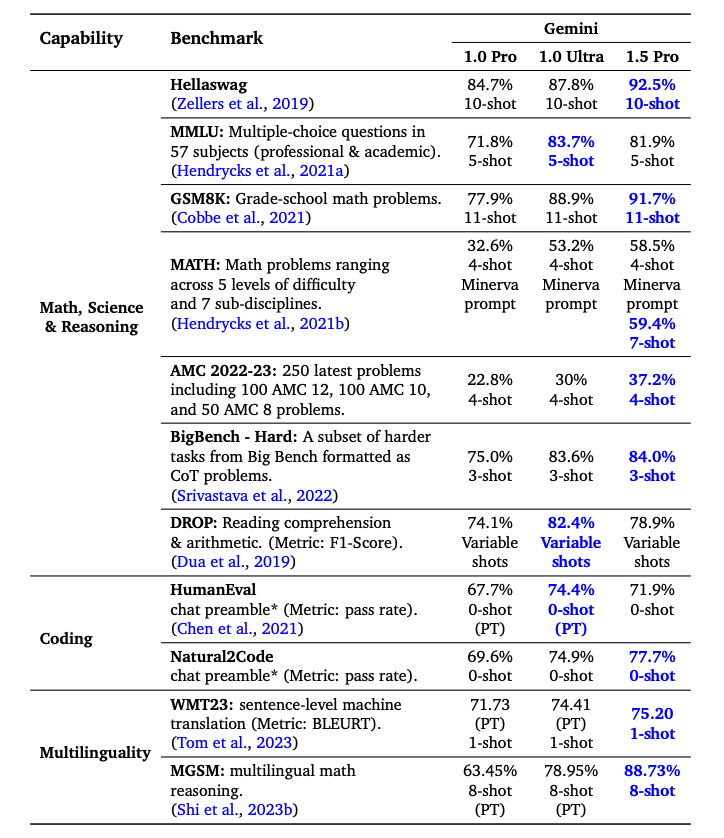

# Gemini 1.5 Pro

Google 發表了 **Gemini 1.5 Pro**，一個計算效率佳的多模態 mixture‑of‑experts 模型，主打「在超長內容上進行推理與回憶」的能力。
它可以對包含數百萬 tokens 的長文件進行推理，包括數小時的影片與音訊，並在：

- 長文件問答（long‑document QA）
- 長影片問答（long‑video QA）
- 長脈絡語音辨識（long‑context ASR）

等任務上重新整理多項 SOTA。
在標準 benchmark 上，Gemini 1.5 Pro 與 Gemini 1.0 Ultra 持平甚至表現更好，並在長脈絡檢索中能在 **至少 1,000,000 tokens** 範圍內達到 >99% 的「needle」召回率，相較於其他長脈絡 LLM 是一大進展。

Google 也釋出一個實驗性版本，支援 **100 萬 tokens** 的 context window，可在 Google AI Studio 試用。
作為對照，目前多數公開模型的最大 context 約在 200K 左右。
有了 1M context，Gemini 1.5 Pro 可以支援：

- 對大型 PDF 進行問答
- 直接在整個 codebase 上進行查詢與分析
- 甚至把長影片作為提示詞的一部分

並且在單一輸入序列中混合 audio / visual / text / code 等多模態資料。

## 架構概覽

Gemini 1.5 Pro 以 Gemini 1.0 的多模態能力為基礎，採用 sparse Mixture‑of‑Experts（MoE）Transformer 架構。
MoE 的好處是：**總參數量可以增加，但每次推論實際被啟用的參數數量維持穩定**，因此在提供更強表現的同時，仍能保持計算成本合理。

技術報告（[Gemini 1.5: Unlocking multimodal understanding across millions of tokens of context](https://storage.googleapis.com/deepmind-media/gemini/gemini_v1_5_report.pdf)）指出：

- Gemini 1.5 Pro 使用的訓練計算量明顯少於 Gemini 1.0 Ultra；
- 在推論端也更加省資源；
- 並透過多項架構設計支援最高到 10M tokens 的長脈絡理解。

模型在多模態資料上預訓練，並以多模態資料做指令調整（instruction tuning），再進一步蒐集人類偏好資料進行微調。

## 實驗結果

在「needle in a haystack」式的測試中，Gemini 1.5 Pro 在文字、影片與音訊等多種模態上，對長達 1M tokens 的 context 仍能達到近乎完美的召回率。實務上，這代表它可以在非常長的內容中仍有效地定位指定資訊。

大致尺度可以想成：

- 約 22 小時錄音內容
- 約 10 本各 1440 頁的書
- 一整個中大型 codebase
- 約 3 小時、以 1 fps 抽幀的影片


在多數 benchmark 上，Gemini 1.5 Pro 的表現都優於 Gemini 1.0 Pro；
在數學、科學、推理、多語言、影片理解與程式碼等領域的表現尤其亮眼。
即便在訓練成本較低的情況下，它在約半數的基準上仍能超越 Gemini 1.0 Ultra。



## 能力示例（節錄）

### 長文件分析

在 Google AI Studio 中，Gemini 1.5 Pro 支援上傳大容量 PDF，並對其進行問答或摘要。為了示範 Gemini 1.5 Pro 的文件分析能力，我們先從最基本的問答任務開始。由於 Gemini 1.5 Pro 在 Google AI Studio 中支援最多 100 萬 tokens，因此可直接上傳整份 PDF。以下範例上傳單一 PDF，並使用提示詞 `What is the paper about?`：


模型回覆相當準確且精簡，能給出 [Galactica 論文](https://arxiv.org/abs/2211.09085) 的可接受摘要。上面的例子在 Google AI Studio 中使用自由提示詞（freeform prompt），但也可以改用聊天格式與上傳的 PDF 互動，適合用來針對文件提出多個問題。


為了發揮長脈絡能力，接著上傳兩篇 PDF，並提出跨兩篇的問題。


回覆整體合理，其中從第一篇論文（[LLM 綜述](https://arxiv.org/abs/2303.18223)）取出的資訊來自表格，這點滿有意思。「Architecture」看起來正確，但「Performance」那段不屬於第一篇。這個任務很關鍵的一點，是把提示詞 `Please list the facts mentioned in the first paper about the large language model introduced in the second paper.` 放在最前面，並用 `Paper 1`、`Paper 2` 清楚標示。另一個延伸實驗，是上傳一組論文並要求撰寫 related work 段落；也可以請模型把更新的 LLM 論文整合進綜述。

### 長影片理解與摘要

Gemini 1.5 Pro 從模型設計就具備多模態能力，也展現了影片理解的能力。我們用 [Andrej Karpathy 近期一場 LLM 演講](https://www.youtube.com/watch?v=zjkBMFhNj_g&ab_channel=AndrejKarpathy) 測試了幾個提示詞。

在這個短 demo 中，我們建立一個 `Chat prompt` 並上傳 YouTube 演講影片。第一個問題是 `What is the lecture about?`。這不是什麼複雜的問題，但回覆相當可接受，能準確摘要演講內容。


第二個任務是請模型產出一頁長度的演講大綱。回覆如下（已節錄）：

```markdown
## Large Language Models: A New Operating System?
Introduction:

- LLMs are trained on massive amounts of text data and can generate human-quality text.
- They are becoming increasingly powerful and are being used for a wide range of tasks, such as writing, translation, and coding.

How LLMs Work:

- LLMs are neural networks that predict the next word in a sequence.
- They learn by iteratively adjusting their parameters to make better predictions.
- While we can measure their performance, we don't fully understand how the billions of parameters collaborate to achieve it.

Training LLMs:

- Requires massive amounts of data and computing power.
- Can be thought of as "compressing the internet" into a single file.
- For example, training LLaMA 2 70B required 6,000 GPUs for 12 days and cost ~$2 million.

LLM Security:

- LLM security is a new and rapidly evolving field.
- Some key security risks include:
    - Jailbreaking: bypassing safety mechanisms to generate harmful content.
    - Prompt injection: injecting malicious code into prompts to control the LLM's output.
    - Data poisoning / Backdoor attacks: inserting crafted text into the training data to influence the LLM's behavior.
...
```

這份摘要相當精簡，也能涵蓋演講重點。我們沒有檢查整份輸出是否正確，但有趣的是模型會給出像是「training LLaMA 2 70B required 6,000 GPUs for 12 days and cost ~$2 million.」這類細節。

當需要精確細節時，仍要留意模型有時會 hallucinate 或抓錯資訊。例如我們問 `What are the FLOPs reported for Llama 2 in the lecture?` 時，模型回答 `The lecture reports that training Llama 2 70B required approximately 1 trillion FLOPs.`，但正確答案應是 `~1e24 FLOPs`。技術報告中也列出不少這類在影片細節問題上出錯的案例。

下一個任務是從影片擷取表格資訊。範例顯示模型產生了表格，有些細節正確、有些錯誤。例如表格欄位正確，但其中一個列標錯了（`Concept Resolution` 應為 `Coref Resolution`）。我們用其他表格與不同元素（例如文字框）測試，也觀察到類似的不一致。

技術報告中一個有趣案例，是模型能依據特定場景或時間點回答問題。第一個範例中，我們請模型回答某一段落從哪個時間點開始。

提示詞：
```
At what timestamp does the LLM OS section start?
```

回覆：
```
The LLM OS section starts at 42:17.
```

這個回覆是正確的。

下一個範例，我們請模型說明投影片上的圖表。

提示詞：
```
Can you explain the chart (on the right-hand side) on the self-improvement slide?
```

回覆：
```
The chart shows the performance of AlphaGo Zero over time, as measured by its Elo rating. The Elo rating is a measure of a player's skill in a game, with higher ratings indicating stronger players. The chart shows that AlphaGo Zero's performance improved rapidly over the course of 40 days, eventually surpassing the performance of all other versions of AlphaGo, including the version that defeated the world champion Go player Lee Sedol. This improvement was achieved entirely through self-play, with no human intervention or historical data.
```

模型似乎能善用提供的資訊來說明圖表。下方是對應投影片截圖：


### 程式碼推理與大型專案導覽

由於具備長脈絡能力，Gemini 1.5 Pro 可以在單次提示詞中載入整個 codebase，並回答像是：

- 「某個核心函式定義在哪裡？」
- 「這份程式架構中，自動微分的關鍵實作位於何處？」

技術報告中的示例是：
將整個 JAX 程式碼庫（約 746K tokens）放入 context 中，並請模型說明自動微分核心方法的位置與相關檔案。


### 英文到 Kalamang 翻譯

Gemini 1.5 Pro 也展示了強大的 in‑context learning 能力：
研究中將約 500 頁的語言學文獻、字典與 ~400 句平行句對（英文／Kalamang）提供給模型，
結果顯示模型在英文→Kalamang 翻譯上的表現，可與用同一組資料學習的人類學習者相當。


這對少數語言或低資源語言的技術應用具有重大意義。

圖與更多細節可見技術報告：
[Gemini 1.5: Unlocking multimodal understanding across millions of tokens of context](https://storage.googleapis.com/deepmind-media/gemini/gemini_v1_5_report.pdf)

## 參考資料

- [Gemini 1.5: Unlocking multimodal understanding across millions of tokens of context](https://storage.googleapis.com/deepmind-media/gemini/gemini_v1_5_report.pdf)
- [Gemini 1.5: Our next-generation model, now available for Private Preview in Google AI Studio](https://developers.googleblog.com/2024/02/gemini-15-available-for-private-preview-in-google-ai-studio.html)
