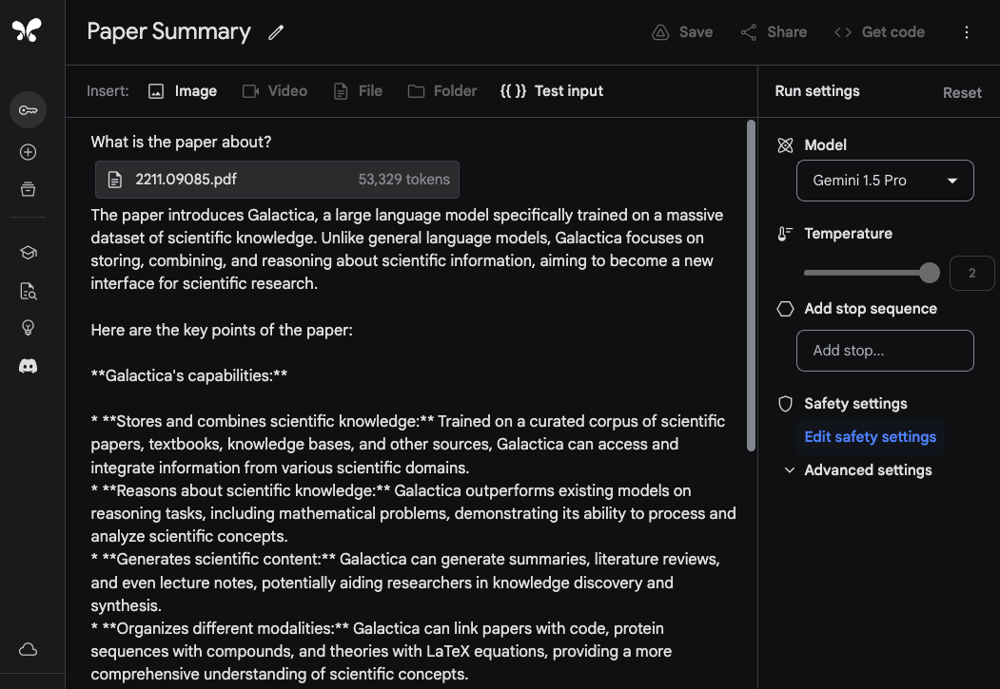
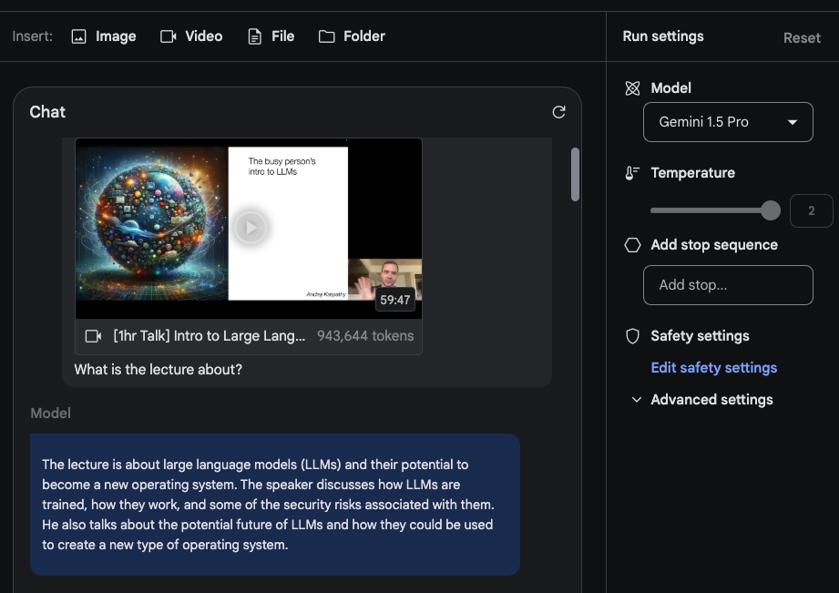
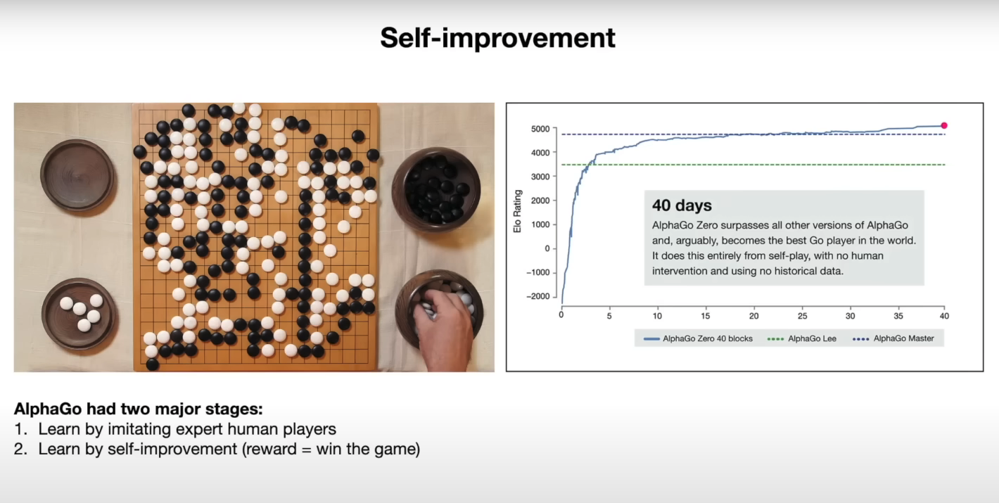

# Gemini 1.5 Pro

Google 发布了 Gemini 1.5 Pro，一个计算效率高的多模态混合专家模型。这款 AI 模型专注于长文本内容的回忆和推理能力。Gemini 1.5 Pro 可以推理长文本内容，包括数百万个 token，包括视频和音频。Gemini 1.5 Pro 在长文本问答、长视频问答和长上下文 ASR 等领域的性能都超过了当前的 state-of-the-art，且在标准基准测试中与 Gemini 1.0 Ultra 相比，性能相似或更好。

作为本次发布的一部分，Google 也推出了一个新的实验性 1,000,000 token 上下文窗口模型，这款模型将在 Google AI Studio 中可供试用。为了将其置于背景中，200,000 是到目前为止任何可用的 LLM 中最大的上下文窗口。Gemini 1.5 Pro 目的是通过 1,000,000 上下文窗口来解锁各种用例，包括对大 PDF、代码库和长视频的 Q&A 等。

## 架构

Gemini 1.5 Pro 是一个稀疏混合专家（MoE）Transformer 基础模型，基于 Gemini 1.0 的多模态能力。MoE 的好处是模型的总参数可以增长，而保持激活参数的数量不变。关于技术报告的细节可以查看 [技术报告](https://storage.googleapis.com/deepmind-media/gemini/gemini_v1_5_report.pdf)，但 Gemini 1.5 Pro 使用了大量的训练计算资源，更加高效地服务，并且架构变化使得长上下文理解成为可能（最高可达 10,000,000 个 token）。模型是在不同模态和指令下预训练的，使用多模态数据进行调整，并且在人类偏好数据下进行了调整。

## 结果

Gemini 1.5 Pro 在所有模态中都实现了近乎完美的 “针” 回忆能力，最高可达 1,000,000 个 token。为了将 Gemini 1.5 Pro 的上下文窗口支持置于背景中，Gemini 1.5 Pro 可以处理和维持回忆性能，当扩展到：

* ~22 小时的录音
* 10 张 1440 页的书籍
* 整个代码库
* 3 小时的视频（1 fps）


Gemini 1.5 Pro 超过了 Gemini 1.0 Pro 在大多数基准测试中的性能，特别是在数学、科学、推理、多语言、视频理解和代码等领域。下面是不同 Gemini 模型的结果表格。Gemini 1.5 Pro 也超过了 Gemini 1.0 Ultra 在半数基准测试中的性能，尽管使用了大量的训练计算资源。


## 能力

以下小节展示了 Gemini 1.5 Pro 的多种能力，从分析大量数据到长上下文多模态推理。一些能力已经在论文中、社区中和我们的实验中报告过。

### 长文本分析

为了展示 Gemini 1.5 Pro 处理和分析文本的能力，我们从一个基本的问答任务开始。Gemini 1.5 Pro 模型在 Google AI Studio 中支持最高 1,000,000 个 token，所以我们可以上传整个 PDF。以下是一个示例，展示了一个 PDF 已经上传了，并且提供了一个简单的提示 `What is the paper about?`：



模型的响应是准确的和简洁的，它提供了 Galactica 论文的可接受摘要。上面的示例使用了 Google AI Studio 中的自由格式提示，但您也可以使用聊天格式与上传的 PDF 交互。这是一个有用的功能，如果您有很多问题想从提供的文档中获取答案。


为了利用长上下文窗口，让我们上传两个 PDF 并问一个跨越两个 PDF 的问题。


响应是合理的，interesting 的部分是来自第一个论文的信息，这是一个关于 LLM 的调查论文，从表格中提取的信息。"Architecture" 信息也正确。但是，"Performance" 部分不属于第一个论文。对于这个任务，重要的是将提示 `Please list the facts mentioned in the first paper about the large language model introduced in the second paper.` 置于顶部，并将论文标记为 `Paper 1` 和 `Paper 2`。另一个相关的后续任务将是写一个相关工作部分，上传一组论文，并提供关于如何总结它们的指令。另一个有趣的任务将是让模型将新的 LLM 论文纳入调查。

### 视频理解

Gemini 1.5 Pro 是从头开始训练的多模态模型，也展示了视频理解能力。我们测试了一些提示，使用了 Andrej Karpathy 的最近的一堂 LLM 讲座视频（https://www.youtube.com/watch?v=zjkBMFhNj_g&ab_channel=AndrejKarpathy）。

对于这个短的 demo，我们创建了一个 `Chat prompt` 并上传了 Karpathy 讲座视频中的 YouTube 视频。第一个问题是 `What is the lecture about?`。没有太多的花样，但响应是准确的，准确地总结了讲座。



第二个任务是让模型提供讲座的简洁概要（一页长）。响应如下（编辑了简洁性）：

```markdown
## Large Language Models: A New Operating System?
Introduction:

- LLMs are trained on massive amounts of text data and can generate human-quality text.
- They are becoming increasingly powerful and are being used for a wide range of tasks, such as writing, translation, and coding.

How LLMs Work:

- LLMs are neural networks that predict the next word in a sequence.
- They learn by iteratively adjusting their parameters to make better predictions.
- While we can measure their performance, we don't fully understand how the billions of parameters collaborate to achieve it.

Training LLMs:

- Requires massive amounts of data and computing power.
- Can be thought of as "compressing the internet" into a single file.
- For example, training LLaMA 2 70B required 6,000 GPUs for 12 days and cost ~$2 million.

LLM Security:

- LLM security is a new and rapidly evolving field.
- Some key security risks include:
    - Jailbreaking: bypassing safety mechanisms to generate harmful content.
    - Prompt injection: injecting malicious code into prompts to control the LLM's output.
    - Data poisoning / Backdoor attacks: inserting crafted text into the training data to influence the LLM's behavior.
...
```

概要非常简洁，代表了讲座的关键点。我们没有评估整个输出的准确性，但它是有趣的，模型输出了有用的信息，如 `"training LLaMA 2 70B required 6,000 GPUs for 12 days and cost ~$2 million."`

当特定的细节很重要时，请注意模型可能会 “ hallucinate” 或者检索错误的信息。例如，当我们提示模型 `What are the FLOPs reported for Llama 2 in the lecture?` 时，它响应了 `The lecture reports that training Llama 2 70B required approximately 1 trillion FLOPs.`，这不是准确的。正确的响应应该是 `~1e24 FLOPs`。技术报告中包含了许多长上下文模型在被问到视频中的特定问题时失败的情况。

下一个任务涉及到从视频中提取表格信息。示例显示了提示和响应。我们可以观察到模型生成了表格，并且一些细节正确，而一些错误。例如，表格列是正确的，但一个行标签错误（即 `Concept Resolution` 应该是 `Coref Resolution`）。我们测试了这些提取任务，使用了其他表格和其他不同的元素，如文本框和我们注意到了类似的不一致。

有趣的示例记录在技术报告中，是模型可以根据特定场景或时间戳检索视频中的细节。第一个示例，我们提示模型回答特定部分的开始时间。

Prompt:
```
At what timestamp does the LLM OS section start?
```

Output:
```
The LLM OS section starts at 42:17.
```

响应是正确的。

在下一个示例中，我们问模型解释一个图表。

Prompt:
```
Can you explain the chart (on the right-hand side) on the self-improvement slide?
```

Output:
```
The chart shows the performance of AlphaGo Zero over time, as measured by its Elo rating. The Elo rating is a measure of a player's skill in a game, with higher ratings indicating stronger players. The chart shows that AlphaGo Zero's performance improved rapidly over the course of 40 days, eventually surpassing the performance of all other versions of AlphaGo, including the version that defeated the world champion Go player Lee Sedol. This improvement was achieved entirely through self-play, with no human intervention or historical data.
```

该模型似乎很好地利用了所提供的信息来解释图表中的结果。以下是相应幻灯片的快照：



### 代码推理

Gemini 1.5 Pro 具有长上下文推理能力，可以回答关于代码库的问题。使用 Google AI Studio，Gemini 1.5 Pro 允许最高 1,000,000 个 token，所以我们可以上传整个代码库，并使用不同的问题或代码相关任务来询问模型。技术报告提供了一个示例，模型被提供了整个 JAX 代码库（~746K 个 token），并被问到自动 differentiation 方法的位置。


### 英文到卡拉曼语翻译

Gemini 1.5 Pro 可以被提供卡拉曼语的语法手册（语言文档 500 页、词典和～400 个平行句子），并将英文翻译为卡拉曼语，达到学习同一内容的人的水平。这展示了 Gemini 1.5 Pro 通过长上下文学习能力的能力。


来源：[Gemini 1.5：跨百万 token 上下文理解的多模态解锁](https://storage.googleapis.com/deepmind-media/gemini/gemini_v1_5_report.pdf)

## 参考

- [Gemini 1.5：跨百万 token 上下文理解的多模态解锁](https://storage.googleapis.com/deepmind-media/gemini/gemini_v1_5_report.pdf)
- [Gemini 1.5：我们的下一代模型，现在在 Google AI Studio 中可供私人预览](https://developers.googleblog.com/2024/02/gemini-15-available-for-private-preview-in-google-ai-studio.html)