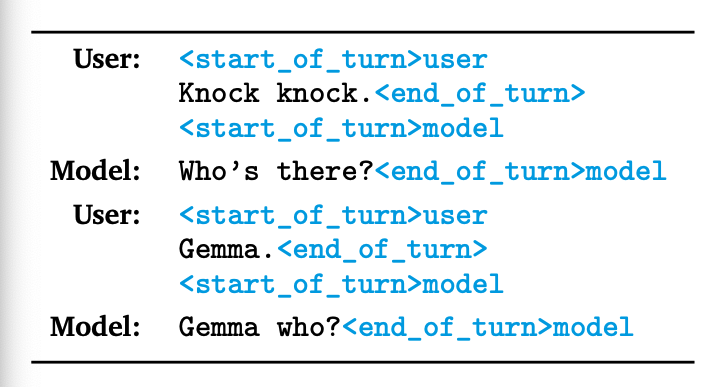
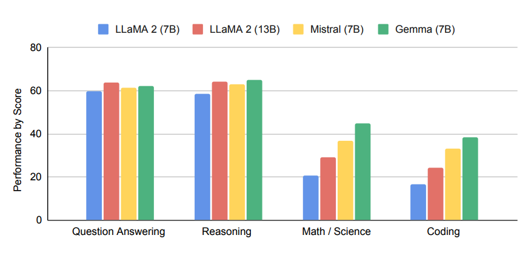
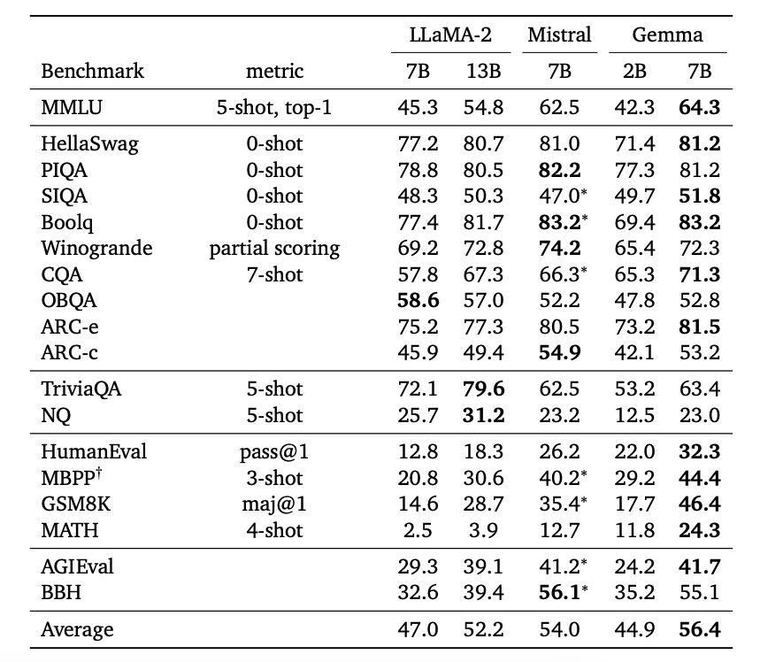
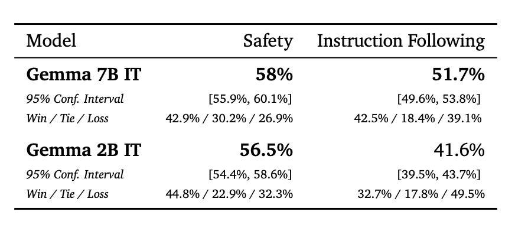
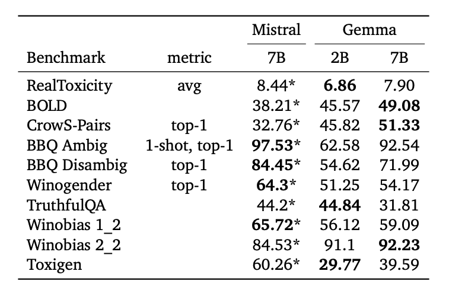

# Gemma

Google DeepMind veröffentlicht Gemma, eine Serie von offenen Sprachmodellen, inspiriert von derselben Forschung und Technologie, die für die Erstellung von Gemini verwendet wurde. Die Veröffentlichung der Gemma-Modelle umfasst 2B (trainiert auf 2T Tokens) und 7B (trainiert auf 6T Tokens) Modelle einschließlich Basis- und instruktionsabgestimmter Checkpoints. Die Modelle sind auf eine Kontextlänge von 8192 Tokens trainiert und übertreffen im Allgemeinen die Modelle Llama 2 7B und Mistral 7B in mehreren Benchmarks.

Die Architektur des Gemma-Modells basiert auf dem Transformer-Dekoder mit Verbesserungen, einschließlich [Multi-Query Attention](http://arxiv.org/abs/1911.02150) (verwendet vom 2B Modell), Multi-Head Attention (verwendet vom 7B Modell), [RoPE-Einbettungen](https://arxiv.org/abs/2104.09864), [GeGLU-Aktivierungen](https://arxiv.org/abs/2002.05202) und [Normalizer-Position](http://arxiv.org/abs/1910.07467).

Laut [technischem Bericht](https://storage.googleapis.com/deepmind-media/gemma/gemma-report.pdf) werden Gemma 2B und 7B auf 2T und 6T Tokens trainiert, die hauptsächlich aus Webdokumenten, Mathematik und Code bestehen. Im Gegensatz zu Gemini sind diese Modelle nicht explizit darauf trainiert, mehrsprachige oder multimodale Fähigkeiten zu unterstützen. Die Vokabulargröße beträgt 256.000 Tokens und verwendet einen Teil der SentencePiece-Tokenisierung von Gemini, erhält Leerzeichen in Ziffernteilungen und stützt sich auf byte-level Kodierungen für unbekannte Tokens.

Die instruktionsabgestimmten Modelle werden mittels überwachtem Feinabstimmen auf einer Mischung aus textbasierten synthetischen und von Menschen generierten Prompt-Antwortpaaren und Verstärkungslernen aus menschlichem Feedback (RLHF) mit dem auf markierten Präferenzdaten trainierten Belohnungsmodell und der auf einer Reihe von hochwertigen Prompts basierenden Politik abgestimmt. Beachten Sie, dass alle verwendeten Datensätze ausschließlich Englisch sind. Wie in der untenstehenden Tabelle gezeigt, verwenden die instruktionsabgestimmten Modelle auch spezifische Formatierungskontrolltokens, um Rollen und Abfolgen in einem Gespräch anzugeben.



## Ergebnisse

Wie in der folgenden Abbildung gezeigt, demonstriert das Gemma 7B Modell starke Leistungen bei Mathematik-, Wissenschafts- und Code-bezogenen Aufgaben. Die Punktzahlen entsprechen den Durchschnittspunktzahlen bei akademischen Benchmark-Bewertungen, gruppiert nach Fähigkeiten.



Gemma 7B übertrifft Llama 2 7B und Mistral 7B bei verschiedenen akademischen Benchmarks mit bemerkenswerter Leistung bei HumanEval, GSM8K, MATH und AGIEval sowie verbesserter Leistung bei Schlussfolgerung, Dialog, Mathematik und Code.



Die instruktionsabgestimmten Gemma 7B Modelle übertreffen auch das Mistral-7B v0.2 Instruct Modell bei Sicherheit und Befolgung von Instruktionen, wie von Menschen bewertet.



Gemma wird auch anhand verschiedener akademischer Sicherheitsbenchmarks bewertet und mit Mistral verglichen. Der technische Bericht erwähnt auch die Verwendung von Techniken zur Voreingenommenheitsminderung und Red-Teaming, um potenzielle Risiken zu mindern, die mit großen Sprachmodellen (LLMs) verbunden sind. Weitere Informationen darüber, wie man verantwortungsvoll mit Gemma entwickeln kann, finden Sie im [Modellkarten-Dokument](https://ai.google.dev/gemma/docs/model_card) und im [Toolkit für verantwortungsvolle generative KI](https://ai.google.dev/responsible).



## Gemma 7B Prompt-Format

Die Gemma-Grundmodelle verwenden kein spezifisches Prompt-Format, können jedoch zum Ausführen von Aufgaben durch Zero-Shot/Few-Shot-Prompting aufgefordert werden. Das Gemma Instruct Modell verwendet das folgende Format:

```
<start_of_turn>user
Generiere eine Python-Funktion, die zwei Zahlen multipliziert <end_of_turn>
<start_of_turn>model
```

Hier ist eine Tabelle mit den relevanten Formatierungskontrolltokens, die in Gemma verfügbar sind:

| Kontext                         | Relevanter Token     |
|---------------------------------|----------------------|
| Benutzerzug                     | `user`               |
| Modellzug                       | `model`              |
| Beginn eines Gesprächszugs      | `<start_of_turn>`    |
| Ende eines Gesprächszugs        | `<end_of_turn>`      |


Sie können die speziellen Kontrolltokens auch im Kontext eines Mehrzug-Benutzer-Prompts wie folgt verwenden:

```markdown
<start_of_turn>user
Was ist ein guter Ort für eine Reise in den USA?<end_of_turn>
<start_of_turn>model
Kalifornien.<end_of_turn>
<start_of_turn>user
Was kann ich in Kalifornien machen?<end_of_turn>
<start_of_turn>model
```

## Wie man Gemma 7B promptet
Gemma 7B effektiv zu prompten, erfordert die richtige Verwendung des Prompt-Templates. In den folgenden Beispielen werden wir einige Beispiele behandeln, die die effektive Verwendung des Prompt-Templates von Gemma 7B Instruct für verschiedene Aufgaben demonstrieren.

### Zero-shot Prompting
Wie bei jedem Modell können Sie die Zero-shot-Fähigkeiten von Gemma einfach nutzen, indem Sie es wie folgt prompten:

```markdown
<start_of_turn>user
Erläutere, warum der Himmel blau ist<end_of_turn>
<start_of_turn>model
```
### Zero-shot Prompting mit System-Prompt
Das Hinzufügen einer Systemrolle oder eines System-Prompts hilft, LLMs besser zu steuern. Obwohl Gemma keine explizite Systemrolle hat, können Sie zusätzliche Anweisungen als Teil des Prompts wie folgt hinzufügen:

```markdown
<start_of_turn>user
Beantworte die folgende Frage auf eine prägnante und informative Weise:

Erläutere, warum der Himmel blau ist<end_of_turn>
<start_of_turn>model
```

Im obigen Beispiel haben wir `"Beantworte die folgende Frage auf eine prägnante und informative Weise:"` als zusätzliche Anweisung oder System-Prompt hinzugefügt, um das Modell besser zu steuern.


### Rollenspiel
Wir können auch Gemmas Fähigkeiten zum Rollenspielen testen, was eine nützliche Fähigkeit ist, nicht nur um Modellantworten zu personalisieren, sondern auch um komplexere bereichsspezifische [LLM-Agents](https://www.promptingguide.ai/research/llm-agents) zu bauen.

Prompt:
```
<start_of_turn>user
Du bist ein hilfsbereiter Lehrer der 2. Klasse. Hilf einem Zweitklässler, Fragen in kurzer und klarer Weise zu beantworten.

Erläutere, warum der Himmel blau ist<end_of_turn>
<start_of_turn>model
```

Modellantwort:
```
Klar, hier ist eine Erklärung, warum der Himmel blau ist:

Der Himmel erscheint blau wegen eines Phänomens namens Rayleigh-Streuung.

Hier ist die Wissenschaft dahinter:

Sonnenlicht besteht aus verschiedenen Farben des Lichts, wie Rot, Grün, Blau und Violett.
Wenn Sonnenlicht auf die Erdatmosphäre trifft, werden die verschiedenen Farben des Lichts in unterschiedliche Richtungen gestreut.
Blaues Licht streut leichter als andere Farben, weil es kürzere Wellenlängen hat.
Das gestreute blaue Licht bewegt sich in alle Richtungen, auch in Richtung deiner Augen.
Deswegen sehen wir den Himmel als blau.
Es ist wichtig zu beachten, dass diese Erklärung vereinfacht ist und nicht alle wissenschaftlichen Details berücksichtigt. Sie gibt dir jedoch ein gutes Verständnis der grundlegenden Wissenschaft, warum der Himmel blau erscheint.
```

Zu beachten ist, dass wir die Antwоrt nicht auf Genauigkeit geprüft oder ob sie für einen Zweitklässler geeignet ist. Sie können jedoch die obige Antwort mit der Antwort vergleichen, die aus dem anschließenden Chain-of-Thought-Prompting folgt.

### Schlussfolgerung
Sie können Gemmas Schlussfolgerungsfähigkeiten nutzen, indem Sie [Zero-shot Chain-of-Thought-Prompting](https://www.promptingguide.ai/techniques/cot#zero-shot-cot-prompting) wie folgt verwenden:

Prompt:
```markdown
<start_of_turn>user
Denke nach und schreibe deine schrittweise Überlegung, bevor du antwortest.

Erläutere, warum der Himmel blau ist.<end_of_turn>
<start_of_turn>model
```

Modellantwort (gekürzt zur Kürze):
```
Schritt 1: Streuung des Lichts

Der Himmel erscheint blau aufgrund des Phänomens der Streuung des Lichts. Wenn Sonnenlicht auf die Erdatmosphäre trifft, interagiert es mit den Teilchen der Luft, hauptsächlich Stickstoff- und Sauerstoffmolekülen.

Schritt 2: Rayleigh-Streuung

Rayleigh-Streuung ist der spezifische Streumechanismus, der auftritt, wenn Licht mit Teilchen interagiert, die viel kleiner als die Wellenlänge des Lichts sind. In diesem Prozess werden kürzere Wellenlängen (blaues Licht) effektiver gestreut als längere Wellenlängen (rotes Licht).

Schritt 3: Blaues gestreutes Licht bewegt sich in alle Richtungen

...

Fazit

Der Himmel erscheint blau aufgrund der Streuung von Licht, speziell der Rayleigh-Streuung. Kürzere Wellenlängen von Licht werden effektiver gestreut, und dieses gestreute Licht bewegt sich in alle Richtungen, wobei das Licht, das den Sonnenstrahlen entgegengesetzt reist, am sichtbarsten für unsere Augen ist.
```

Etwas, das beim Gemma-Modell zu beachten ist, ist, dass es automatisch das Markdown-Format ausgeben kann. Wir haben das Textformat ein wenig für Demonstrations- und Einfachheitszwecke bearbeitet, aber der Inhalt ist genau das, was das Modell geantwortet hat. Beachten Sie auch, dass wir die Genauigkeit der Antwort oder ob das Modell halluciniert nicht bewertet haben.

## Ressourcen und Integrationen

Hier sind mehrere Ressourcen und Integrationen, die Teil der Gemma-Veröffentlichung waren:

- [Colab](https://ai.google.dev/gemma/docs/get_started) und [Kaggle](https://www.kaggle.com/models/google/gemma/code) Notebooks
- [Hugging Face Modelle](https://huggingface.co/collections/google/gemma-release-65d5efbccdbb8c4202ec078b)
- [MaxText](https://github.com/google/maxtext)
- [NVIDIA NeMo](https://github.com/NVIDIA/GenerativeAIExamples/tree/main/models/Gemma)
- [TensorRT-LLM](https://developer.nvidia.com/blog/nvidia-tensorrt-llm-revs-up-inference-for-google-gemma/)
- Gemma 7B ist im [NVIDIA AI Playground](https://catalog.ngc.nvidia.com/orgs/nvidia/teams/ai-foundation/models/gemma-7b) verfügbar

Laut der offiziellen [Blog-Veröffentlichung](https://blog.google/technology/developers/gemma-open-models/) erlauben die [Nutzungsbedingungen](https://www.kaggle.com/models/google/gemma/license/consent) die verantwortungsvolle kommerzielle Nutzung und Verteilung für alle Organisationen, unabhängig von ihrer Größe.

## Referenzen

- [Gemma: Introducing new state-of-the-art open models](https://blog.google/technology/developers/gemma-open-models/)
- [Gemma: Open Models Based on Gemini Research and Technology](https://storage.googleapis.com/deepmind-media/gemma/gemma-report.pdf)
- [Responsible Generative AI Toolkit](https://ai.google.dev/responsible)
- [Fast Transformer Decoding: One Write-Head is All You Need](https://arxiv.org/abs/1911.02150)
- [Roformer: Enhanced transformer with rotary position embedding](https://arxiv.org/abs/2104.09864)
- [GLU variants improve transformer](https://arxiv.org/abs/2002.05202)
- [Root mean square layer normalization](http://arxiv.org/abs/1910.07467)
