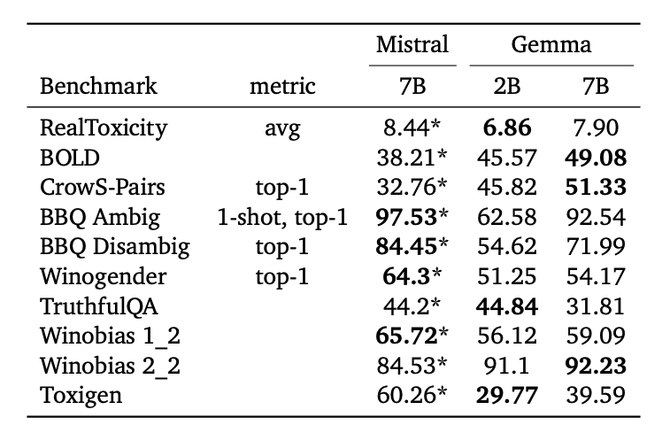

# Gemma

Google DeepMind 發表了 **Gemma**，一系列基於 Gemini 研究與技術的開源語言模型。
目前包含 2B（訓練於約 2T tokens）與 7B（訓練於約 6T tokens）兩種規模，並提供：

- base 模型
- instruction‑tuned 模型

這些模型的 context length 為 8192 tokens，且在多項基準上優於 Llama 2 7B 與 Mistral 7B。

Gemma 採用 Transformer decoder 架構，並整合多項改良，例如：

- [multi-query attention](http://arxiv.org/abs/1911.02150)（2B 模型）
- Multi‑Head Attention（7B 模型）
- [RoPE 旋轉位置編碼](https://arxiv.org/abs/2104.09864)
- [GLU variants improve transformer](https://arxiv.org/abs/2002.05202) 啟用函式
- [RMSNorm 等 normalization 位置調整](http://arxiv.org/abs/1910.07467)

根據[技術報告](https://storage.googleapis.com/deepmind-media/gemma/gemma-report.pdf)，Gemma 2B 與 7B 主要訓練在包含：

- 網頁文件
- 數學內容
- 程式碼

等資料。與 Gemini 不同，Gemma 並未特別針對多語言或多模態能力進行訓練。
其 vocabulary 約 256K tokens，使用 Gemini SentencePiece 字典的子集、在切分時保留空白、數字逐字切分，並以 byte‑level 編碼處理未知字元。

Instruction‑tuned 模型則採用：

- 在純文字（text‑only）的合成與人工 prompt–response 上做監督微調
- 再搭配 RLHF，使用偏好標註資料訓練 reward model，並在一組高品質 prompt 上最佳化 policy

需要注意：這些訓練資料目前皆為英文。
如下圖所示，Gemma 的 instruction 模型會使用特定控制 token 來標示對話中的角色與輪次：


## 成果概觀

從官方結果來看，Gemma 7B 在數學、科學與程式相關任務上都有不錯表現，下圖為依能力類別分組的 academic benchmark 平均分數：


在多項學術基準上，Gemma 7B 優於 Llama 2 7B 與 Mistral 7B，特別是在：

- HumanEval
- GSM8K
- MATH
- AGIEval

以及推理（reasoning）、對話、數學與程式碼等任務上。


Gemma 7B 的 instruction‑tuned 版本，在安全性與指令遵從方面，也比 Mistral‑7B v0.2 Instruct 更受人類評估者青睞：


Gemma 也在多個安全相關 academic benchmark 上進行測試，並與 Mistral 做比較。
技術報告提到，團隊使用去偏（debiasing）與 red‑teaming 等方法試圖降低常見的 LLM 風險。
若想了解如何在實務中「負責任地」使用 Gemma，可以參考：

- [模型卡（Model Card）](https://ai.google.dev/gemma/docs/model_card)
- [Responsible Generative AI toolkit](https://ai.google.dev/responsible)



## Gemma 7B 的提示詞格式

Base 版本的 Gemma 並沒有強制規定 prompt 樣板，你可以透過 zero‑shot 或 few‑shot 的方式直接提示詞。
而 **Gemma Instruct** 則建議使用以下格式：

```text
<start_of_turn>user
Generate a Python function that multiplies two numbers <end_of_turn>
<start_of_turn>model
```

官方文件中提供了常用控制 token 的對應表：

| Context                     | Token              |
|----------------------------|--------------------|
| 使用者輪次（User turn）     | `user`             |
| 模型輪次（Model turn）      | `model`            |
| 輪次開始                    | `<start_of_turn>`  |
| 輪次結束                    | `<end_of_turn>`    |

多輪對話時可以這樣使用：

```markdown
<start_of_turn>user
What is a good place for travel in the US?<end_of_turn>
<start_of_turn>model
California.<end_of_turn>
<start_of_turn>user
What can I do in California?<end_of_turn>
<start_of_turn>model
```

## 如何對 Gemma 7B 下提示詞

想有效使用 Gemma 7B，關鍵在於善用上述樣板並搭配清楚的指令。

### Zero-shot 提示詞

最基本的用法如下：

```markdown
<start_of_turn>user
Explain why the sky is blue<end_of_turn>
<start_of_turn>model
```

### 加上類 System Prompt 的說明

Gemma 本身並沒有獨立的 system role，但可以在 user turn 前加上一段額外說明，作為「隱含 system prompt」：

```markdown
<start_of_turn>user
Answer the following question in a concise and informative manner.

Explain why the sky is blue<end_of_turn>
<start_of_turn>model
```

### 角色扮演（Role Playing）

我們也可以測試 Gemma 的角色扮演能力，這對客製化回應或設計領域專屬的 [LLM agents](https://www.promptingguide.ai/research/llm-agents) 很有幫助：

```markdown
<start_of_turn>user
You are a helpful 2nd-grade teacher. Help a 2nd grader to answer questions in a short and clear manner.

Explain why the sky is blue<end_of_turn>
<start_of_turn>model
```

模型回覆：
```
Sure, here is an explanation for why the sky is blue:

The sky appears blue because of a phenomenon called Rayleigh Scattering.

Here's the science behind it:

Sunlight is made up of different colors of light, like red, green, blue, and violet.
When sunlight hits the Earth's atmosphere, the different colors of light scatter in different directions.
Blue light scatters more easily than other colors because it has shorter wavelengths.
The scattered blue light travels in all directions, including towards your eyes.
That's why we see the sky as blue.
It's important to note that this explanation is simplified and does not account for all scientific details. However, it gives you a good understanding of the basic science behind why the sky appears blue.
```

我們尚未檢查這段回覆是否正確，也未確認是否適合小二程度。不過可以把這段回覆與接下來的 chain‑of‑thought 提示詞結果做比較。

### 推理（Reasoning）

可以透過 [zero‑shot Chain‑of‑Thought 提示詞](https://www.promptingguide.ai/techniques/cot#zero-shot-cot-prompting) 來引出模型的推理能力：

```markdown
<start_of_turn>user
Think and write your step-by-step reasoning before responding.

Explain why the sky is blue.<end_of_turn>
<start_of_turn>model
```

模型回覆（已節錄）：
```
Step 1: Scattering of Light

The sky appears blue due to the phenomenon of scattering of light. When sunlight hits the Earth's atmosphere, it interacts with the particles of air, primarily nitrogen and oxygen molecules.

Step 2: Rayleigh Scattering

Rayleigh scattering is the specific scattering mechanism that occurs when light interacts with particles much smaller than the wavelength of light. In this process, shorter wavelengths (blue light) are scattered more effectively than longer wavelengths (red light).

Step 3: Blue Scattered Light Travels in All Directions

...

Conclusion

The sky appears blue due to the scattering of light, specifically Rayleigh scattering. Shorter wavelengths of light are scattered more effectively, and this scattered light travels in all directions, with the scattered light that travels opposite to the sun's rays being most visible to our eyes.
```

值得注意的是，Gemma 會自動輸出 markdown 格式。我們為了示範與簡化稍微調整了格式，但內容與模型回覆一致。我們也沒有評估這段回覆是否正確，或是否有 hallucination。

## 資源與整合

Gemma 發表時，同步提供了多種資源與整合管道，例如：

- [Colab](https://ai.google.dev/gemma/docs/get_started) 與 [Kaggle](https://www.kaggle.com/models/google/gemma/code) notebooks
- [Hugging Face 模型](https://huggingface.co/collections/google/gemma-release-65d5efbccdbb8c4202ec078b)
- [MaxText](https://github.com/google/maxtext)
- [NVIDIA NeMo 範例](https://github.com/NVIDIA/GenerativeAIExamples/tree/main/models/Gemma)
- [TensorRT-LLM](https://developer.nvidia.com/blog/nvidia-tensorrt-llm-revs-up-inference-for-google-gemma/) 最佳化
- Gemma 7B 也已在 [NVIDIA AI Playground](https://catalog.ngc.nvidia.com/orgs/nvidia/teams/ai-foundation/models/gemma-7b) 提供試用

依官方[部落格](https://blog.google/technology/developers/gemma-open-models/)與 [Terms of Use](https://www.kaggle.com/models/google/gemma/license/consent)，Gemma 允許各種規模的組織在負責任前提下進行商業使用與散佈。

## 參考資料

- [Gemma: Introducing new state-of-the-art open models](https://blog.google/technology/developers/gemma-open-models/)
- [Gemma: Open Models Based on Gemini Research and Technology](https://storage.googleapis.com/deepmind-media/gemma/gemma-report.pdf)
- [Responsible Generative AI toolkit](https://ai.google.dev/responsible)
- [Fast Transformer Decoding: One Write-Head is All You Need](https://arxiv.org/abs/1911.02150)
- [Roformer: Enhanced transformer with rotary position embedding](https://arxiv.org/abs/2104.09864)
- [GLU variants improve transformer](https://arxiv.org/abs/2002.05202)
- [Root mean square layer normalization](http://arxiv.org/abs/1910.07467)
