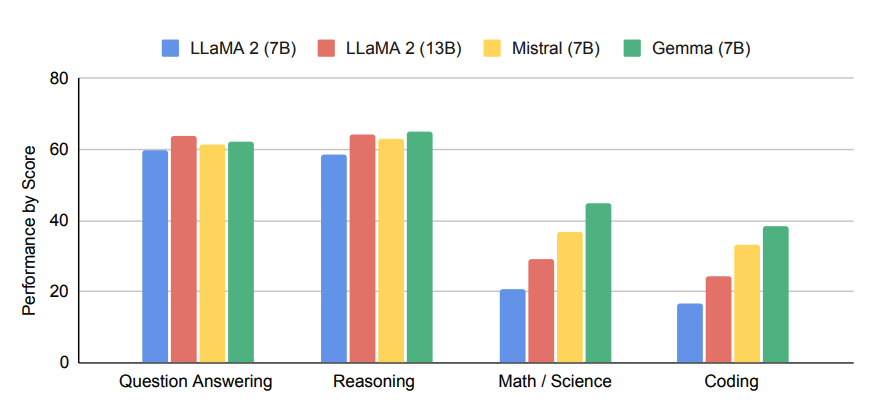
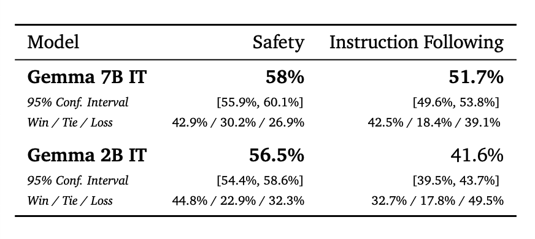

# Gemma  

Google DeepMind 发布了 Gemma，这是一系列开源语言模型，其灵感来源于用于构建 Gemini 的相同研究与技术。Gemma 系列包括 2B（在 2T token 上训练）和 7B（在 6T token 上训练）模型，涵盖基础版本和经过指令微调的 checkpoints。这些模型是在上下文长度为 8192 token 的条件下进行训练的，在多个基准测试中通常优于 Llama 2 7B 和 Mistral 7B 模型。  

Gemma 的模型架构基于 Transformer 解码器并进行了多项改进，包括 [多查询注意力(multi-query attention)](http://arxiv.org/abs/1911.02150)（在 2B 模型上使用）、[多头注意力(multi-head attention)](https://arxiv.org/abs/2104.09864)（在 7B 模型上使用）、[RoPE 嵌入(RoPE embeddings)](https://arxiv.org/abs/2104.09864)、[GeGLU 激活函数(GeGLU activations)](https://arxiv.org/abs/2002.05202) 以及 [归一化层的位置调整(normalizer location)](http://arxiv.org/abs/1910.07467)。  

根据 [技术报告](https://storage.googleapis.com/deepmind-media/gemma/gemma-report.pdf)，Gemma 2B 和 7B 分别在主要由网页文档、数学公式和代码组成的 2T 和 6T token 上进行训练。与 Gemini 不同，这些模型并未专门训练多语言或多模态功能。Gemma 的词汇表大小为 256K token，并采用 Gemini 中的 SentencePiece 分词器的一个子集，保留分隔符中的空格字符，并对未知 token 使用字节级编码。  

经过指令微调的模型是通过对文本合成数据及人工生成的提示-响应对进行监督微调，并结合基于人类反馈的强化学习（RLHF）进行优化；其中奖励模型基于标注的偏好数据训练，策略则基于一组高质量的提示。请注意，所有使用的数据集均为英文内容。如以下表格所示，经过指令微调的模型还使用特定的格式控制 token 来表示对话中的角色和轮次。


## 评测结果

如图所示，Gemma 7B 模型在数学、科学和代码相关任务中表现出色。这些得分对应于按能力分组的学术基准评估的平均得分。



Gemma 7B 在各类学术基准测试中的表现优于 Llama 2 7B 和 Mistral 7B，尤其在 HumanEval、GSM8K、MATH 和 AGIEval 上表现突出，在推理、对话、数学和代码生成方面也有显著提升。


根据人工评估结果，Gemma 7B 的指令微调模型在安全性和指令遵循方面也优于 Mistral-7B v0.2 Instruct 模型。



Gemma 还在多个学术安全基准上进行了评估，并与 Mistral 进行了比较。技术报告中还提到了使用去偏技术（debiasing techniques）和红队演练（red-teaming）来潜在缓解大型语言模型（LLMs）常见的风险。有关如何负责任地开发 Gemma 的更多信息，请参阅 [模型卡片](https://ai.google.dev/gemma/docs/model_card) 和 [负责任生成式 AI 工具包](https://ai.google.dev/responsible) 。


## Gemma 7B 提示格式

基础版本的 Gemma 模型不使用特定提示格式，但可以通过零样本/少样本提示完成任务。Gemma Instruct 版本则采用以下格式：

```
<start_of_turn>user  
生成一个 Python 函数，用于将两个数相乘  
<end_of_turn>  
<start_of_turn>model  
```

下表展示了 Gemma 中可用的相关格式控制标记：

| 上下文                           | 相关标记            |
|---------------------------------|--------------------|
| 用户轮次                         | `user`             |
| 模型轮次                         | `model`            |
| 对话轮次开始                     | `<start_of_turn>`  |
| 对话轮次结束                     | `<end_of_turn>`    |


你也可以在多轮用户提示中使用这些特殊控制标记，例如：

```markdown
<start_of_turn>user
美国有哪些适合旅行的地方？<end_of_turn>  
<start_of_turn>model
加州。<end_of_turn>
<start_of_turn>user
在加州能做什么？<end_of_turn>
<start_of_turn>model
```

## 如何提示 Gemma 7B
有效提示 Gemma 7B 需要正确使用其提示模板。在以下示例中，我们将展示几个说明如何有效地使用 Gemma 7B Instruct 的提示模板来完成各种任务的例子。

### 零样本提示
与其他模型一样，你可以通过以下方式利用 Gemma 的零样本能力：

```markdown
<start_of_turn>user  
解释为什么天空是蓝色的<end_of_turn>  
<start_of_turn>model
```
### 带系统提示的零样本提示
添加系统角色或系统提示有助于更好地引导大语言模型。虽然 Gemma 没有显式的系统角色，但你可以在提示中加入额外指令，如下所示：

```markdown
<start_of_turn>user  
以简洁且信息丰富的方式回答以下问题：  

解释为什么天空是蓝色的<end_of_turn>  
<start_of_turn>model
```

在上述示例中，我们添加了 `以简洁且信息丰富的方式回答以下问题：` 作为额外指令或系统提示，以更好地引导模型。


### 角色扮演
我们还可以测试 Gemma 的角色扮演能力，这不仅有助于个性化模型响应，还能构建更复杂的领域专用 [LLM 智能体](https://www.promptingguide.ai/zh/research/llm-agents)。

提示词:
```
<start_of_turn>user  
你是一位乐于助人的二年级教师，用简短清晰的方式帮助二年级学生解决问题。  

解释为什么天空是蓝色的<end_of_turn>  
<start_of_turn>model
```

Model response:
```
当然，以下是关于天空为何呈蓝色的解释：  

天空呈现蓝色是由于一种称为瑞利散射（Rayleigh Scattering）的现象。  

背后的科学原理如下：  

阳光由多种颜色的光组成，如红色、绿色、蓝色和紫色。  
当阳光进入地球大气层时，不同颜色的光朝各个方向散开。  
蓝光比其他颜色更容易散开，因为它波长较短。  
散开的蓝光传播到各个方向，包括你的视线范围内。  
因此我们看到的天空是蓝色的。  

请注意，这一解释经过简化，并未涵盖所有科学细节，但它有助于你理解天空为何呈蓝色的基本原理。
```

需要注意的是，我们并未验证该回答的准确性，也不确定是否完全适合二年级学生。不过你可以将上述响应与后续链式思考提示所获得的回答进行对比。

### 推理
你可以通过使用 [零样本链式思考提示(Zero-shot CoT Prompting)](https://www.promptingguide.ai/zh/techniques/cot#zero-shot-cot-prompting) 来激发 Gemma 的推理能力，如下所示：

提示词:
```markdown
<start_of_turn>user  
请先逐步思考并写出推理过程，再作答。  

解释为什么天空是蓝色的。<end_of_turn>  
<start_of_turn>model  
```

模型响应（为简洁起见进行了截断）:
```
步骤 1：光的散射

天空呈现蓝色是因为光的散射现象。当阳光进入地球大气层时，会与空气中的粒子发生作用，主要是氮气和氧气分子。

步骤 2：瑞利散射(Rayleigh Scattering)

瑞利散射是一种特定的散射机制，发生在光与远小于光波长的粒子相互作用时。在此过程中，波长较短的光（如蓝光）比波长较长的光（如红光）更容易被散射。  

步骤 3：蓝光朝四面八方散开

...

结论

天空之所以呈蓝色，是因为光的散射现象，特别是瑞利散射。短波长的光更容易被散射，而这种散射光朝各个方向传播，其中逆着太阳光线方向传播的散射光最容易被人眼观察到。
```

值得注意的是，Gemma 模型可以自动输出 Markdown 格式。为了演示和简化目的，我们对文本格式做了一些调整，但内容完全来自于模型的实际响应。同时，我们也未评估该响应的准确性或是否存在幻觉。

## 资源与集成

以下是一些在 Gemma 发布过程中相关的资源与集成工具：

- [Colab](https://ai.google.dev/gemma/docs/get_started) and [Kaggle](https://www.kaggle.com/models/google/gemma/code) notebooks
- [Hugging Face models](https://huggingface.co/collections/google/gemma-release-65d5efbccdbb8c4202ec078b)
- [MaxText](https://github.com/google/maxtext)
- [NVIDIA NeMo](https://github.com/NVIDIA/GenerativeAIExamples/tree/main/models/Gemma)
- [TensorRT-LLM](https://developer.nvidia.com/blog/nvidia-tensorrt-llm-revs-up-inference-for-google-gemma/)
- [NVIDIA AI Playground](https://catalog.ngc.nvidia.com/orgs/nvidia/teams/ai-foundation/models/gemma-7b) 中的 Gemma 7B

根据官方 [博客发布](https://blog.google/technology/developers/gemma-open-models/) 内容， [使用条款](https://www.kaggle.com/models/google/gemma/license/consent) 允许所有组织（无论规模大小）负责任地进行商业用途和分发。

## 参考文献

- [Gemma: Introducing new state-of-the-art open models](https://blog.google/technology/developers/gemma-open-models/)
- [Gemma: Open Models Based on Gemini Research and Technology](https://storage.googleapis.com/deepmind-media/gemma/gemma-report.pdf)
- [Responsible Generative AI Toolkit](https://ai.google.dev/responsible)
- [Fast Transformer Decoding: One Write-Head is All You Need](https://arxiv.org/abs/1911.02150)
- [Roformer: Enhanced transformer with rotary position embedding](https://arxiv.org/abs/2104.09864)
- [GLU variants improve transformer](https://arxiv.org/abs/2002.05202)
- [Root mean square layer normalization](http://arxiv.org/abs/1910.07467)