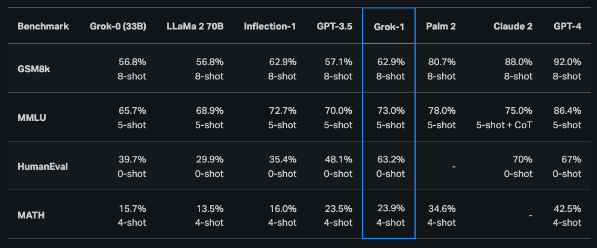
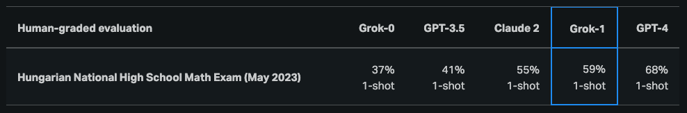

# Grok-1

Grok-1 is a mixture-of-experts (MoE) large language model (LLM) with 314B parameters which includes the open release of the base model weights and network architecture. 

Grok-1 is trained by xAI and consists of MoE model that activates 25% of the weights for a given token at inference time. The pretraining cutoff date for Grok-1 is October 2023.

As stated in the [official announcement](https://x.ai/blog/grok-os), Grok-1 is the raw base model checkpoint from the pre-training phase which means that it has not been fine-tuned for any specific application like conversational agents.

The model has been [released](https://github.com/xai-org/grok-1) under the Apache 2.0 license.

## Results and Capabilities

According to the initial [announcement](https://x.ai/blog/grok), Grok-1 demonstrated strong capabilities across reasoning and coding tasks. The last publicly available results show that Grok-1 achieves 63.2% on the HumanEval coding task and 73% on MMLU. It generally outperforms ChatGPT-3.5 and Inflection-1 but still falls behind improved models like GPT-4. 

Grok-1 was also reported to score a C (59%) compared to a B (68%) from GPT-4 on the Hungarian national high school finals in mathematics.

Check out the model here: https://github.com/xai-org/grok-1

Due to the size of Grok-1 (314B parameters), xAI recommends a multi-GPU machine to test the model.

## References

- [Open Release of Grok-1](https://x.ai/blog/grok-os)
- [Announcing Grok](https://x.ai/blog/grok)