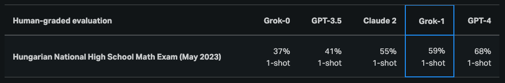

# Grok-1

Grok-1 是一個採用 mixture-of-experts（MoE）架構的大型語言模型（LLM），總參數量約 **314B**，官方開放了 base 模型權重與網路架構。

這個模型由 xAI 訓練，在推論時對每個 token 只啟用約 25% 的權重。
預訓練資料的截止時間為 2023 年 10 月。

依照[官方公告](https://x.ai/blog/grok-os) 的說明，目前釋出的 Grok-1 是預訓練階段的原始 base checkpoint，**尚未針對特定應用（例如對話代理）做微調**。

Grok-1 以 Apache 2.0 授權釋出，程式碼與模型可在此取得：  
[https://github.com/xai-org/grok-1](https://github.com/xai-org/grok-1)

## 成果與能力

根據最初的[公開結果](https://x.ai/blog/grok)，Grok-1 在推理與程式相關任務上表現不錯：

- HumanEval 程式碼基準約 **63.2%**
- MMLU 約 **73%**

整體而言，在多項 benchmark 上優於 ChatGPT‑3.5 與 Inflection‑1，但仍落後於 GPT‑4 等更強模型。

Grok-1 也被拿來測試匈牙利高中數學會考，結果約拿到 **C（59%）**，對照 GPT‑4 的 **B（68%）**：

由於 Grok-1 模型規模巨大（314B 參數），官方建議在多 GPU 環境下進行推論或實驗。

## 參考資料

- [Open Release of Grok-1](https://x.ai/blog/grok-os)
- [Announcing Grok](https://x.ai/blog/grok)
