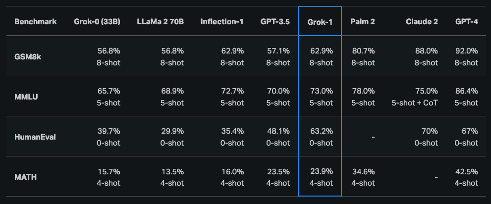

# Grok-1

Grok-1 是一个混合专家(Mixture-of-Experts, MoE) 架构的大型语言模型(Large Language Model, LLM)，拥有 3140 亿参数，其基础模型权重与网络结构已开源发布。

Grok-1 由 xAI 团队训练，采用 MoE 模型，在推理过程中对每个 token 激活 25% 的权重。该模型的预训练数据获取时间为 2023 年 10 月。

如 [官方公告](https://x.ai/blog/grok-os) 所述，Grok-1 是来自预训练阶段的原始基础模型检查点，这意味着它尚未针对任何特定应用（如对话代理）进行微调。

该模型已在 [GitHub](https://github.com/xai-org/grok-1) 上以 Apache 2.0 许可证形式发布。

## 评测结果与模型能力

根据最初的 [公告](https://x.ai/blog/grok) ，Grok-1 在推理与编程任务中展现出强大的能力。最新的公开结果显示，Grok-1 在 HumanEval 编程任务中达到 63.2% 的通过率，在 MMLU 测试中获得 73% 的得分。总体而言，其表现优于 ChatGPT-3.5 和 Inflection-1，但仍落后于 GPT-4 等更先进的模型。

据报道，Grok-1 在匈牙利全国高中数学毕业考试中获得了 C 级(59%)，相比之下，GPT-4 获得了 B 级(68%)。

了解更多: https://github.com/xai-org/grok-1

由于 Grok-1 规模庞大（3140 亿参数），xAI 建议使用多 GPU 设备来测试该模型。

## 参考文献

- [Open Release of Grok-1](https://x.ai/blog/grok-os)
- [Announcing Grok](https://x.ai/blog/grok)