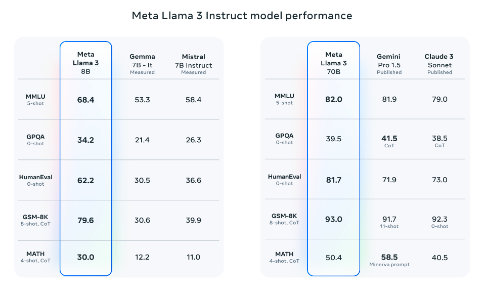
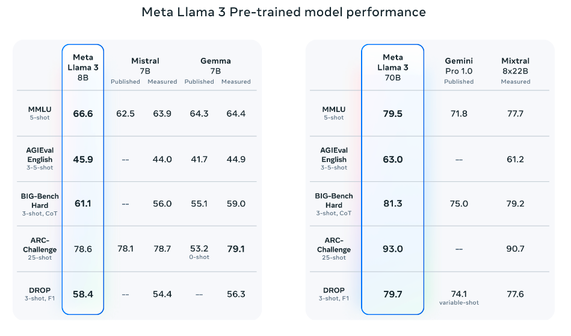

# Llama 3

import {Bleed} from 'nextra-theme-docs'

Meta recently [introduced](https://llama.meta.com/llama3/) their new family of large language models (LLMs) called Llama 3. This release includes 8B and 70B parameters pre-trained and instruction-tuned models. 

## Llama 3 Architecture Details 

Here is a summary of the mentioned technical details of Llama 3:

- It uses a standard decoder-only transformer.
- The vocabulary is 128K tokens.
- It is trained on sequences of 8K tokens.
- It applies grouped query attention (GQA)
- It is pretrained on over 15T tokens.
- It involves post-training that includes a combination of SFT, rejection sampling, PPO, and DPO.

## Performance

Notably, Llama 3 8B (instruction-tuned) outperforms [Gemma 7B](https://www.promptingguide.ai/models/gemma) and [Mistral 7B Instruct](https://www.promptingguide.ai/models/mistral-7b). Llama 3 70 broadly outperforms [Gemini Pro 1.5](https://www.promptingguide.ai/models/gemini-pro) and [Claude 3 Sonnet](https://www.promptingguide.ai/models/claude-3) and falls a bit behind on the MATH benchmark when compared to Gemini Pro 1.5.

*Source: [Meta AI](https://ai.meta.com/blog/meta-llama-3/)*

The pretrained models also outperform other models on several benchmarks like AGIEval (English), MMLU, and Big-Bench Hard.

*Source: [Meta AI](https://ai.meta.com/blog/meta-llama-3/)*

## Llama 3 400B

Meta also reported that they will be releasing a 400B parameter model which is still training and coming soon! There are also efforts around multimodal support, multilingual capabilities, and longer context windows in the pipeline. The current checkpoint for Llama 3 400B (as of April 15, 2024) produces the following results on the common benchmarks like MMLU and Big-Bench Hard:

*Source: [Meta AI](https://ai.meta.com/blog/meta-llama-3/)*

The licensing information for the Llama 3 models can be found on the [model card](https://github.com/meta-llama/llama3/blob/main/MODEL_CARD.md).

## Extended Review of Llama 3

Here is a longer review of Llama 3:

<iframe width="100%"
  height="415px"
  src="https://www.youtube.com/embed/h2aEmciRd6U?si=m7-xXu5IWpB-6mE0" allow="accelerometer; autoplay; clipboard-write; encrypted-media; gyroscope; picture-in-picture"
  allowFullScreen
  />
