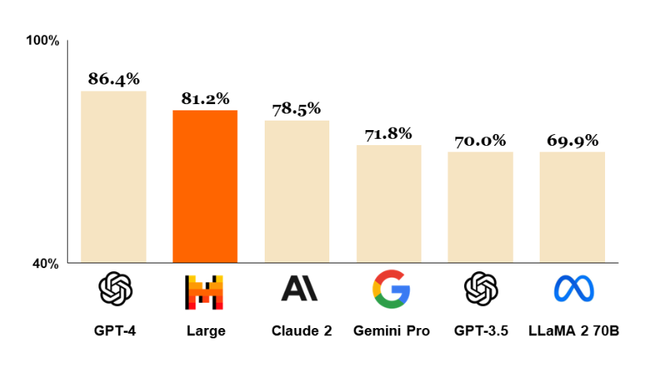
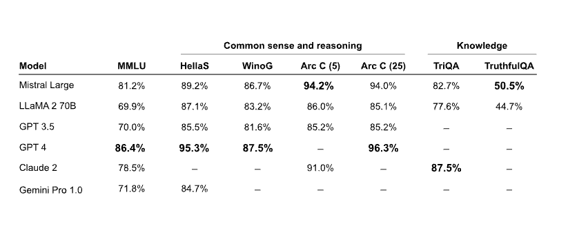
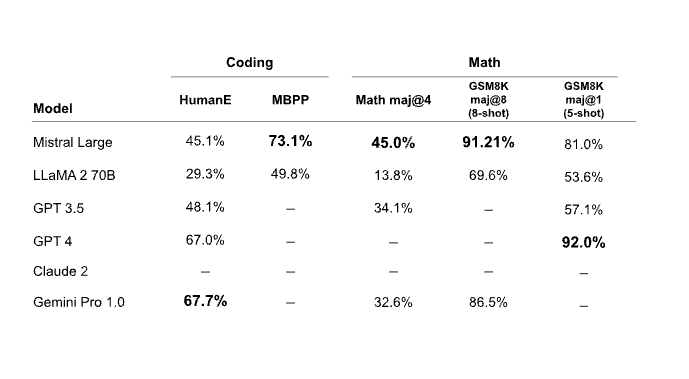
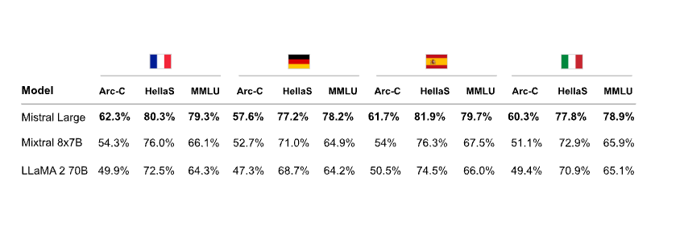

# Mistral Large

Mistral AI releases Mistral, their most advanced large language model (LLM) with strong multilingual, reasoning, maths, and code generation capabilities. Mistral Large is made available through Mistral platform called la Plataforme and Microsoft Azure. It's also available to test in their new chat app, [le Chat](https://chat.mistral.ai/).

Below is a chart showing how Mistral Large compares with other powerful LLMs like GPT-4 and Gemini Pro. It ranks second next to GPT-4 on the MMLU benchmark with a score of 81.2%. 

## Mistral Large Capabilities

Mistral Large's capabilities and strengths include:

- 32K tokens context window
- has native multilingual capacities (fluent in English, French, Spanish, German, and Italian)
- strong capabilities in reasoning, knowledge, maths, and coding benchmarks
- function calling and JSON format natively supported
- a low-latency model called Mistral Small was also released
- allows developers to design moderation policies with its precise instruction-following 

### Reasoning and Knowledge

The table below shows how Mistral Large performs on common reasoning and knowledge benchmarks. It largely falls behind GPT-4 but it's the superior model compared to other LLMs like Claude 2 and Gemini Pro 1.0.

### Maths & Code Generation

The table below shows how Mistral Large performs on common maths and coding benchmarks. Mistral Large demonstrates strong performance on the Math and GSM8K benchmarks but it is significantly outperformed on coding benchmarks by models like Gemini Pro and GPT-4. 

### Multilinguality

The table below demonstrates Mistral Large performance on multilingual reasoning benchmarks. Mistral Large outperforms Mixtral 8x7B and Llama 2 70B in all languages, including French, German, Spanish, and Italian.

## Mistral Small

In addition to the release of Mistral Large, a smaller model and optimized model called Mistral Small is also announced. Mistral Small is optimized for low-latency workloads and outperforms Mixtral 8x7B. Mistral AI reports that this model has strong capacities around RAG-enablement, function calling, and JSON format. 

## Mistral Endpoints and Model Selection

[Here](https://docs.mistral.ai/platform/endpoints/) is a list of all the endpoints provided by Mistral AI. 

Mistral AI has also published a comprehensive [guide](https://docs.mistral.ai/guides/model-selection/) on better model selection when considering performance and cost trade-offs.

*Figures source: https://mistral.ai/news/mistral-large/*