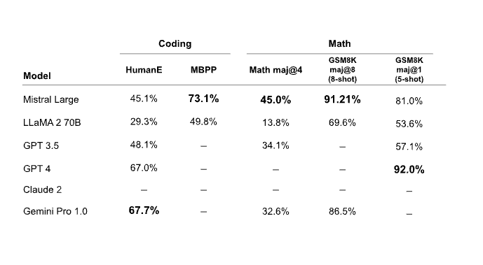

# Mistral Large

Mistral AI 推出 Mistral Large，這是他們目前最先進的大型語言模型（LLM），在多語言、推理、數學與程式碼產生等方面都有相當強的能力。Mistral Large 可透過官方平臺 la Plataforme 與 Microsoft Azure 使用，也能在他們的新聊天應用 [le Chat](https://chat.mistral.ai/) 中試用。

下圖簡要比較 Mistral Large 與其他強大的 LLM，例如 GPT-4 與 Gemini Pro。在 MMLU 基準上，Mistral Large 以 81.2% 的分數排名僅次於 GPT-4。

## Mistral Large 的能力

Mistral Large 的主要特性與優勢包括：

- 32K token 上下文長度
- 具備原生多語言能力（英文、法文、西班牙文、德文、義大利文等）
- 在推理、知識、數學與程式相關基準上表現優異
- 原生支援 function calling 與 JSON 格式輸出
- 同時釋出延遲更低的 Mistral Small 模型
- 讓開發者可以透過精準的指令追蹤來設計自訂審查與防護策略

### 推理與知識

下表展示 Mistral Large 在常見推理與知識基準測試上的表現。整體而言，它雖然略遜於 GPT-4，但相對於 Claude 2、Gemini Pro 1.0 等模型則有明顯優勢。

### 數學與程式碼產生

在數學與程式碼相關基準上，Mistral Large 在 Math 與 GSM8K 等數學題上表現強勢，但在程式碼基準方面，仍被 Gemini Pro 與 GPT-4 等模型明顯領先。

### 多語言能力

下表展示 Mistral Large 在多語言推理基準上的表現。與 Mixtral 8x7B 與 Llama 2 70B 相比，Mistral Large 在法文、德文、西班牙文、義大利文等語言上皆有較佳成績。

## Mistral Small

在發布 Mistral Large 的同時，Mistral AI 也推出一個較小且高度最佳化的模型 Mistral Small。Mistral Small 以低延遲工作負載為主，並在多項基準上超越 Mixtral 8x7B。官方表示，這個模型在支援 RAG、function calling 與 JSON 格式等方面也具備不錯能力。

## 端點與模型選擇

Mistral AI 在官方文件中整理了各種可用的模型端點，詳細列表可見：
[Mistral AI 平臺端點一覽](https://docs.mistral.ai/platform/endpoints/)

如果需要在效能與成本之間做取捨，官方也提供一份詳細的說明文件，協助開發者挑選合適的模型：
[模型選擇指南](https://docs.mistral.ai/guides/model-selection/)

*圖片與資料來源：https://mistral.ai/news/mistral-large/*

