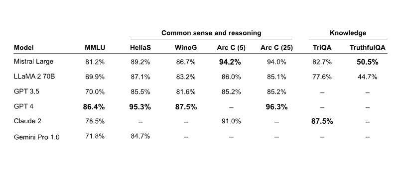

# Mistral Large

Mistral AI 发布了 Mistral Large，这是其目前最先进的大型语言模型（LLM），具备强大的多语言处理能力、推理能力、数学与代码生成能力。Mistral Large 可通过 Mistral 自有的平台 la Plateforme 以及微软 Azure 平台获取。此外，用户还可通过其新的聊天应用 [le Chat](https://chat.mistral.ai/) 进行测试。

下图展示了 Mistral Large 与其他强大 LLM（如 GPT-4 和 Gemini Pro）的对比情况。在 MMLU 基准测试中，Mistral Large 排名仅次于 GPT-4，得分为 81.2%，位列全球第二。

## Mistral Large 能力概述

Mistral Large 的主要功能与优势包括:

- 32K token 上下文窗口
- 原生多语言支持能力 （精通英语、法语、西班牙语、德语和意大利语）
- 在推理、知识、数学和编程基准测试中表现出色
- 原生支持函数调用与 JSON 格式输出
- 同时发布了一款低延迟模型 Mistral Small
- 可通过精确的指令遵循能力，辅助开发者设计内容审核策略

### 推理与知识能力

下表展示了 Mistral Large 在常见推理与知识类基准测试中的表现。虽然其整体性能仍落后于 GPT-4，但在其他主流 LLM（如 Claude 2 和 Gemini Pro 1.0）中表现优异。

### 数学与代码生成能力

下表展示了 Mistral Large 在数学与代码生成类基准测试中的表现。Mistral Large 在 Math 和 GSM8K 等数学任务上表现良好，但在代码生成方面显著落后于 Gemini Pro 和 GPT-4 等模型。

### 多语言能力

下表展示了 Mistral Large 在多语言推理基准测试中的表现。Mistral Large 在法语、德语、西班牙语和意大利语等语言任务中全面优于 Mixtral 8x7B 和 Llama 2 70B。

## Mistral Small

除了 Mistral Large，Mistral AI 还推出了一款更小型且经过优化的模型 —— Mistral Small。该模型专为低延迟要求场景优化，在性能上超越 Mixtral 8x7B。Mistral AI 表示，该模型在 RAG 支持、函数调用和 JSON 格式输出方面具有出色的能力。

## Mistral 端点与模型选择

Mistral AI 提供的所有端点列表请见 [这里](https://docs.mistral.ai/platform/endpoints/)

Mistral AI 同时也发布了一份详尽的 [模型选择指南](https://docs.mistral.ai/guides/model-selection/) ，帮助用户在性能与成本之间做出权衡。

*图表来源: https://mistral.ai/news/mistral-large/*