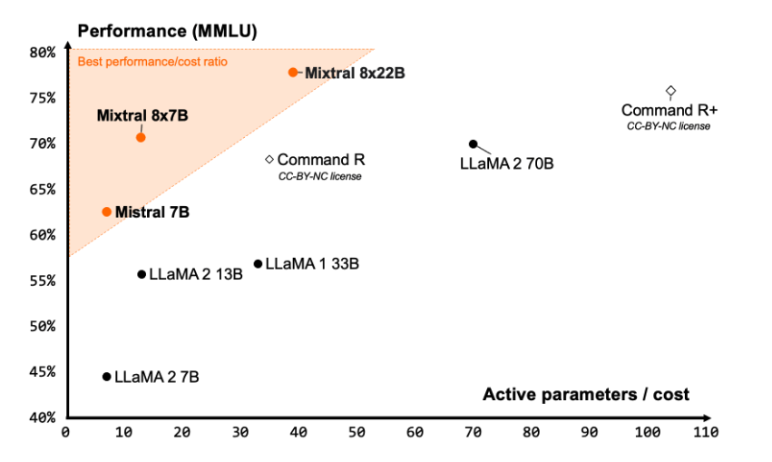
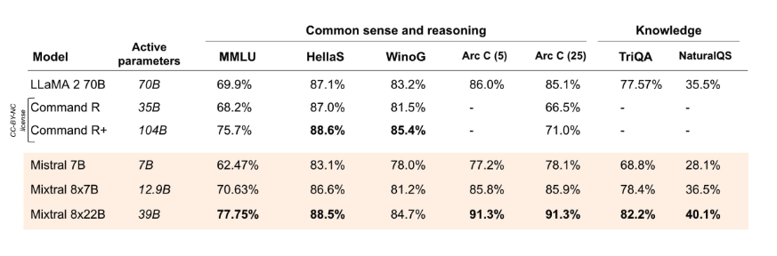
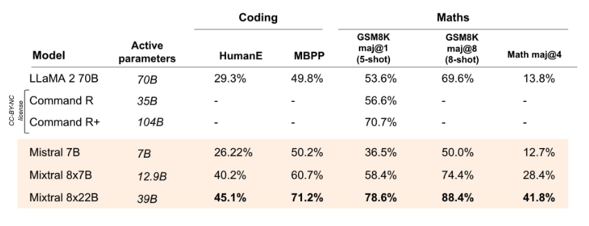

# Mixtral 8x22B

Mixtral 8x22B is a new open large language model (LLM) released by Mistral AI. Mixtral 8x22B is characterized as a sparse mixture-of-experts model with 39B active parameters out of a total of 141B parameters. 

## Capabilities

Mixtral 8x22B is trained to be a cost-efficient model with capabilities that include multilingual understanding, math reasoning, code generation, native function calling support,  and constrained output support. The model supports a context window size of 64K tokens which enables high-performing information recall on large documents. 

Mistral AI claims that Mixtral 8x22B delivers one of the best performance-to-cost ratio community models and it is significantly fast due to its sparse activations. 

*Source: [Mistral AI Blog](https://mistral.ai/news/mixtral-8x22b/)*

## Results

According to the [official reported results](https://mistral.ai/news/mixtral-8x22b/), Mixtral 8x22B (with 39B active parameters) outperforms state-of-the-art open models like Command R+ and Llama 2 70B on several reasoning and knowledge benchmarks like MMLU, HellaS, TriQA, NaturalQA, among others.

*Source: [Mistral AI Blog](https://mistral.ai/news/mixtral-8x22b/)*

Mixtral 8x22B outperforms all open models on coding and math tasks when evaluated on benchmarks such as GSM8K, HumanEval, and Math. It's reported that Mixtral 8x22B Instruct achieves a score of 90% on GSM8K (maj@8).

*Source: [Mistral AI Blog](https://mistral.ai/news/mixtral-8x22b/)*

More information on Mixtral 8x22B and how to use it here: https://docs.mistral.ai/getting-started/open_weight_models/#operation/listModels

The model is released under an Apache 2.0 license.