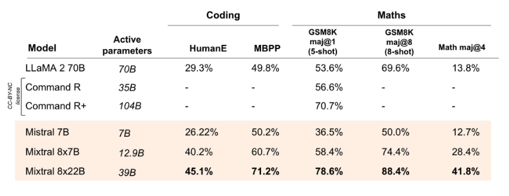

# Mixtral 8x22B

Mixtral 8x22B 是由 Mistral AI 发布的新型开源大型语言模型(LLM)。该模型被定义为一个稀疏混合专家模型(Sparse Mixture-of-Experts, SMoE)，在总共 1410 亿参数中仅激活 390 亿参数。

## 能力概述

Mixtral 8x22B 经过训练以具备高效的成本效益，其能力包括多语言理解、数学推理、代码生成、原生函数调用支持以及受限输出模式。该模型支持最大 64K token 的上下文窗口，使其能够在处理大型文档时实现高效的信息检索。

Mistral AI 声称，Mixtral 8x22B 提供了社区模型中最优模型之一的性能与成本比，并因其稀疏激活机制而具备极高的推理速度。

*来源: [Mistral AI Blog](https://mistral.ai/news/mixtral-8x22b/)*

## 评估结果

根据 [官方发布的测试结果](https://mistral.ai/news/mixtral-8x22b/) ，Mixtral 8x22B（激活 390 亿参数）在多个推理与知识类基准测试中（如 MMLU、HellaSwag、TriviaQA、NaturalQA 等）超越了当前最先进的开源模型，如 Command R+ 和 Llama 2 70B。

*来源: [Mistral AI Blog](https://mistral.ai/news/mixtral-8x22b/) *

在编码与数学任务方面，Mixtral 8x22B 在 GSM8K、HumanEval 和 Math 等基准测试中表现优于所有其他开源模型。据报告，经过指令微调的 Mixtral 8x22B Instruct 在 GSM8K（maj@8）上得分高达 90%。

*来源: [Mistral AI Blog](https://mistral.ai/news/mixtral-8x22b/) *

更多关于 Mixtral 8x22B 的信息及使用方式，请参阅: https://docs.mistral.ai/getting-started/open_weight_models/#operation/listModels

该模型基于 Apache 2.0 许可证发布。