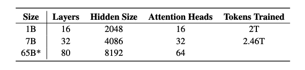
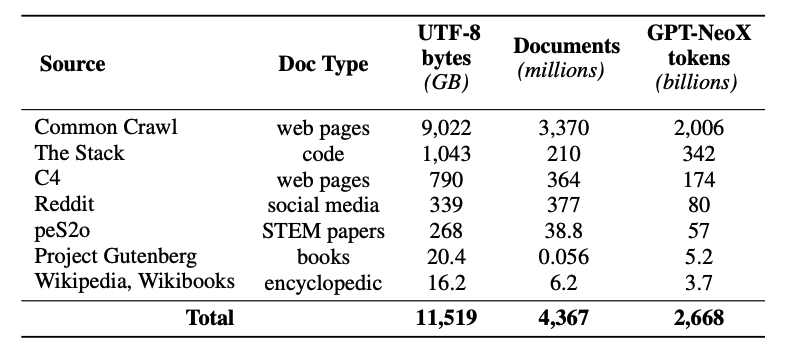

# OLMo

本指南提供了开放语言模型(Open Language Model, OLMo)的概述，包括提示用法示例。此外，还包含与 OLMo 相关的技巧、应用场景、局限性、研究论文及其他阅读材料。

## OLMo 简介

艾伦人工智能研究所(Allen Institute of AI) [发布](https://blog.allenai.org/olmo-open-language-model-87ccfc95f580) 了一个新的开源语言模型及框架 OLMo。该项目旨在通过提供对数据、训练代码、模型、评估代码的完整访问权限，以推动语言模型研究的发展。

其首次发布包括四个 70 亿参数规模的变体和一个 10 亿参数规模的模型，所有模型均在至少 2 万亿 token 上进行训练。这标志着一系列发布的第一步，并计划在未来推出更大规模的 650 亿参数 OLMo 模型。

此次发布内容包括: 

- 完整的训练数据，包括生成该数据的 [代码](https://github.com/allenai/dolma) 
- 完整的模型权重、[训练代码](https://github.com/allenai/OLMo) 、日志、指标及推理代码
- 每个模型的多个检查点
- [评估代码](https://github.com/allenai/OLMo-Eval)
- 微调代码

所有代码、权重和中间检查点均以 [Apache 2.0 许可证](https://github.com/allenai/OLMo#Apache-2-0-1-ov-file) 发布。

## OLMo-7B 

OLMo-7B 和 OLMo-1B 均采用仅解码器的 Transformer 架构。其架构借鉴了 PaLM 和 Llama 等模型的改进设计，包括以下特点：

- no biases
- a non-parametric layer norm
- SwiGLU activation function
- Rotary positional embeddings (RoPE)
- a vocabulary of 50,280

- 无偏置项(no biases)
- 非参数化层归一化(non-parametric layer norm)
- SwiGLU 激活函数
- 旋转位置嵌入(Rotary Positional Embedding, RoPE)
- 大小为 50,280 的词汇表

## Dolma 数据集

本次发布还包括一个名为 [Dolma](https://github.com/allenai/dolma) 的预训练数据集。该数据集是一个多样化的多源语料库，涵盖来自 7 个不同数据源的 3 万亿 token，共包含约 50 亿文档。Dolma 的构建过程包括语言过滤、质量筛选、内容过滤、去重、多源混合及分词等步骤。

[
训练集使用了 Dolma 中的 2 万亿 token 样本。在每个文档末尾添加特殊 `EOS` 标记后，将 token 序列拼接在一起。训练实例由连续的 2048 token 分组构成，并进行了打乱处理。

更多训练细节及模型训练所使用的硬件配置信息可在相关论文中查阅。

## 结果

研究人员使用 [Catwalk](https://github.com/allenai/catwalk) 对模型进行下游任务评估。OLMo 模型与其他公开可用模型（如 Falcon 和 Llama 2）进行了对比。具体而言，该模型在一组旨在衡量常识推理能力的任务上进行了测试。下游评估套件包括 `piqa` 和 `hellaswag` 等数据集。作者采用基于似然排名的零样本评估方法（即通过 likelihood 排名补全结果），并报告准确率。OLMo-7B 在两项任务上表现优于所有其他模型，在 9 项任务中的 8 项中位列前三。以下是结果摘要：

## OLMo 提示词指南

即将上线...

---

图表来源: [OLMo: Accelerating the Science of Language Models](https://allenai.org/olmo/olmo-paper.pdf)

## 参考文献

- [OLMo: Open Language Model](https://blog.allenai.org/olmo-open-language-model-87ccfc95f580)
- [OLMo: Accelerating the Science of Language Models](https://allenai.org/olmo/olmo-paper.pdf)