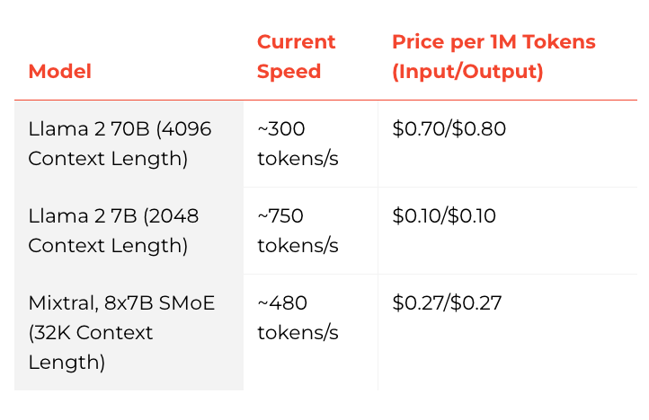

# 什麼是 Groq？

[Groq](https://groq.com/) 近期因為「極高速 LLM 推論」而備受關注。許多開發者與團隊都希望降低 LLM 回應延遲，因為延遲是打造即時互動 AI 服務時非常關鍵的指標。目前市面上已有不少公司專注在 LLM 推論領域，Groq 是其中之一。

Groq 自稱在 [Anyscale 的 LLMPerf Leaderboard](https://github.com/ray-project/llmperf-leaderboard) 上，相較其他主流雲端供應商可達到約 18 倍的推論速度（以撰寫時資料為準）。目前他們透過 API 提供的模型包含 Meta AI 的 Llama 2 70B 與 Mixtral 8x7B 等，並以自家設計的 Groq LPU™ Inference Engine 作為後端。這個引擎是專門為 LLM 推論打造的自製硬體──Language Processing Units（LPUs）。

根據 Groq 的常見問答說明，LPU 透過縮短「每個 token 的計算時間」來達成極低延遲，進而提升整體輸出速度。想深入了解 LPU 的技術細節與優勢，可以參考他們在 ISCA 獲獎的 [2020](https://wow.groq.com/groq-isca-paper-2020/) 與 [2022](https://wow.groq.com/isca-2022-paper/) 論文。

以下是他們在不同模型上的速度與價格示意圖：

下圖則比較不同推論服務在 Llama 2 70B 上的輸出 token 吞吐量（tokens/s），也就是平均每秒輸出的 token 數。圖中的數值為在 150 次請求下量測到的平均輸出吞吐量。

在串流場景中，另一個重要指標是「首個 token 延遲」（time to first token, TTFT），代表模型產生第一個 token 所需時間。下圖展示不同 LLM 推論服務在 TTFT 指標上的比較：

想了解更多 Groq 在 Anyscale LLMPerf Leaderboard 上的推論效能表現，可以參考這篇文章：
[here](https://wow.groq.com/groq-lpu-inference-engine-crushes-first-public-llm-benchmark/)

