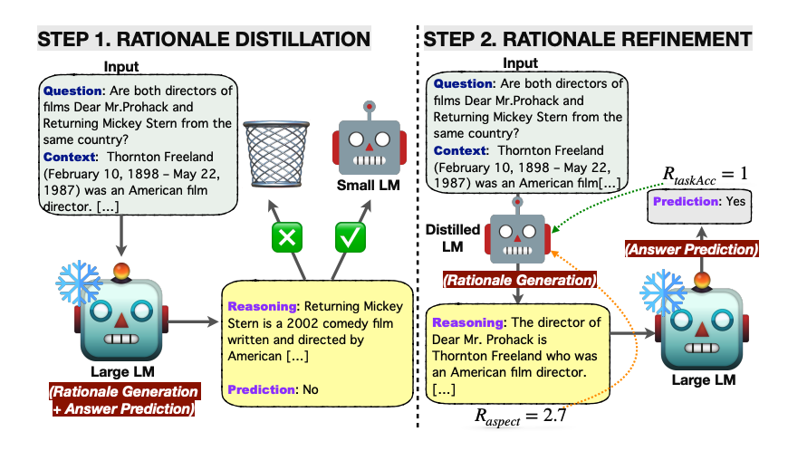

# LM-Guided Chain-of-Thought 

import {Bleed} from 'nextra-theme-docs'

<iframe width="100%"
  height="415px"
  src="https://www.youtube.com/embed/O3bl0qURONM?si=Hwdc_o0qHpw8QRsY" allow="accelerometer; autoplay; clipboard-write; encrypted-media; gyroscope; picture-in-picture"
  allowFullScreen
  />

A new paper by [Lee et al. (2024)](https://arxiv.org/abs/2404.03414) proposes to improve reasoning in LLMs using small language models.

It first applies knowledge distillation to a small LM with rationales generated by the large LM with the hope of narrowing the gap in reasoning capabilities.   

Essentially, the rationale is generated by the lightweight LM and the answer prediction is then left for the frozen large LM. This resource-efficient approach avoids the need to fine-tune the large model and instead offloads the rationale generation to the small language model.

The knowledge-distilled LM is further optimized with reinforcement learning using several rational-oriented and task-oriented reward signals.   

*Source: https://arxiv.org/pdf/2404.03414.pdf*

The framework is tested on multi-hop extractive question answering and outperforms all baselines in terms of answer prediction accuracy. RL helps to improve the quality of generated rationales which further improves question-answering performance.  

The LM-guided CoT prompting approach proposed in this paper outperforms both standard prompting and CoT prompting. Self-consistency decoding also enhances performance.   

This approach shows a clever use of small language models for rationale generation. The results are remarkable given that larger language models are preferred for this capability over smaller ones. Decomposing tasks in this way is something developers should think deeply about. Not everything needs to be done by the large models. When fine-tuning, it's useful to think about what exact aspect you want to optimize and test to see if a small language model can do it for you.
