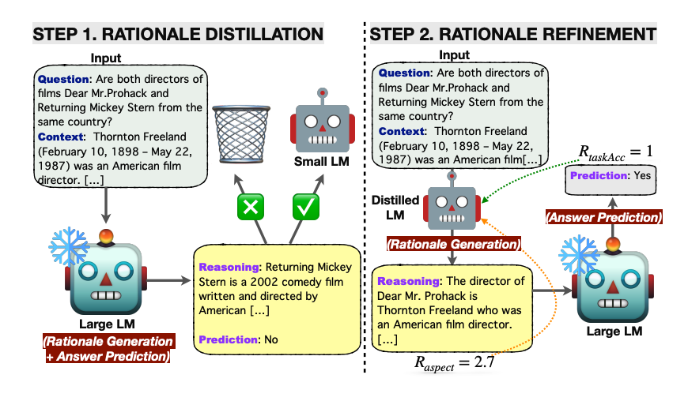

# 语言模型引导的思维链(CoT)

[Lee 等人（2024）的新研究](https://arxiv.org/abs/2404.03414)提出了一种创新方法，利用小型语言模型来提升大语言模型的推理能力。

首先，研究者将大型语言模型生成的解释通过知识蒸馏技术转移到小型语言模型上，以期缩小两者在推理能力上的差距。

在这种方法中，轻量级语言模型负责生成解释，而答案预测则由冻结的大型语言模型完成。这种方法不仅资源高效，而且免去了对大型模型的微调。

随后，研究者使用以解释和任务为导向的多种奖励信号，通过强化学习对知识蒸馏后的小型语言模型进行优化。

*来源：https://arxiv.org/pdf/2404.03414.pdf*

该框架在多跳（multi-hop）抽取式问答任务上进行了测试，并在答案预测准确率方面超过了所有基线方法。强化学习的应用提高了生成解释的质量，进而提升了问答性能。

本文提出的语言模型引导的思维链提示方法在性能上超越了标准提示和传统思维链提示。自我一致性解码也进一步提高了性能。

这种方法巧妙地利用了小型语言模型来生成解释，其结果令人瞩目，因为人们通常认为大型语言模型更适合此类任务。开发者应当深入考虑这种任务分解的方式，并非所有任务都需要依赖大型模型来完成。在微调过程中，思考希望优化的具体方面，并探索小型语言模型是否能够胜任，是非常有用的。

