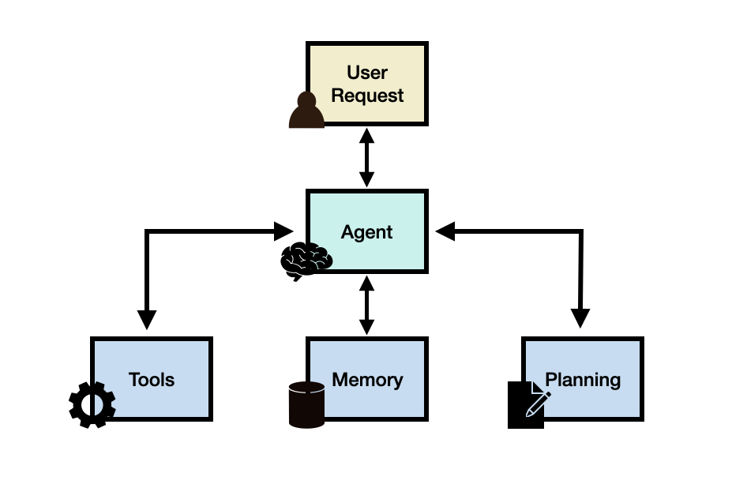
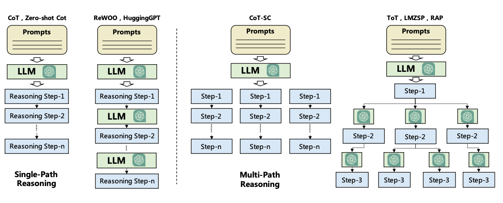
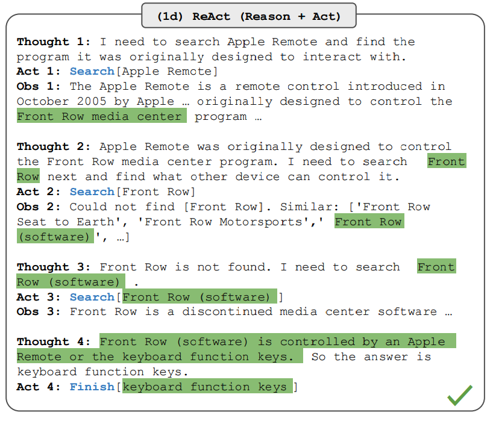
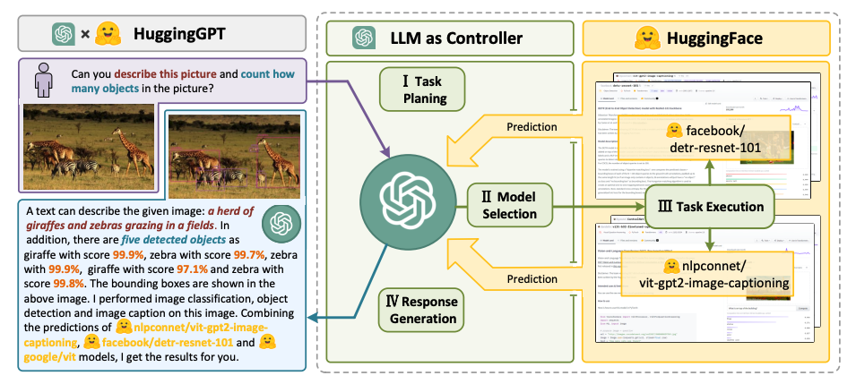
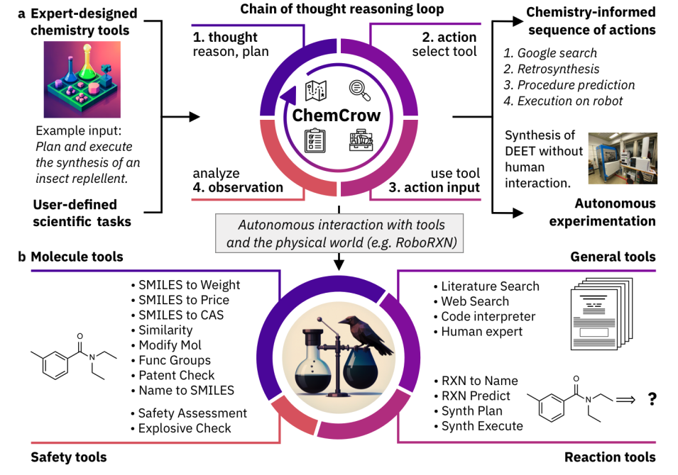
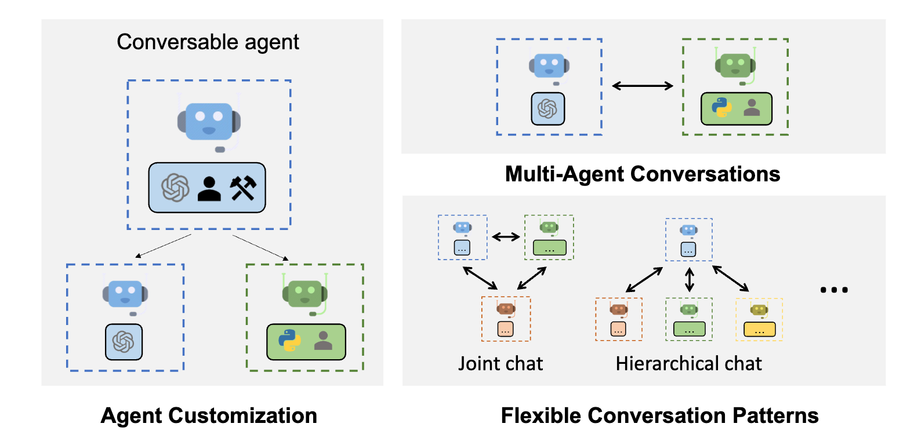
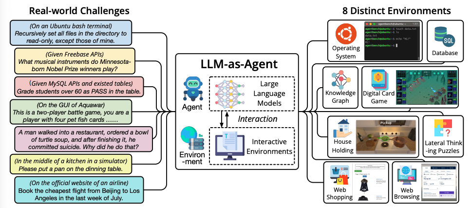

# LLM Agents

import {Cards, Card} from 'nextra-theme-docs'
import {FilesIcon} from 'components/icons'

LLM 기반 에이전트는 계획 및 메모리와 같은 핵심 모듈과 결합된 LLM을 통해 복잡한 작업을 수행할 수 있는 LLM 애플리케이션을 의미합니다. 여기서 LLM은 작업이나 사용자 요청을 완료하는 데 필요한 작업 흐름을 제어하는 주요 컨트롤러 또는 '두뇌' 역할을 합니다. LLM 에이전트는 계획, 메모리, 도구와 같은 다양한 핵심 모듈이 필요할 수 있습니다.

이 LLM 에이전트의 유용성을 더 잘 이해하기 위해, 다음과 같은 시스템을 구축하는 데 관심이 있다고 생각해 보겠습니다:

> 2023년 미국의 평균 일일 칼로리 섭취량은 얼마인가요?

위 질문은 이미 충분한 지식을 갖춘 LLM을 통해 바로 답할 수 있을 것입니다. 만약 LLM이 해당 질문에 대한 지식이 없다면, LLM은 건강 관련 정보나 보고서에 접근할 수 있는 간단한 RAG 시스템을 활용할 수 있습니다. 이제 보다 복잡한 질문을 시도해 보겠습니다:

> 지난 10년 동안 미국 성인의 평균 일일 칼로리 섭취 추세는 어떻게 변했으며, 이것이 비만률에 어떤 영향을 미쳤나요? 또한, 이 기간 동안 비만률 추세의 그래픽 표현을 제공할 수 있나요?

이 질문에 대답하기 위해서는 단순히 LLM만 사용하는 것으로는 충분하지 않습니다. LLM을 외부 지식 베이스와 결합한 RAG 시스템을 만드는 것도 이런 복잡한 질문에 대한 답변을 제공하기엔 부족할 수 있습니다. 이런 질문에 대응하기 위해서는 LLM이 필요한 도구를 활용하고, 목표로 하는 최종 응답을 위한 작업 흐름을 관리하며, 작업을 세분화하는 과정이 필요합니다. 한 가지 해결책으로는 LLM 에이전트를 구축하여 검색 API, 건강 관련 출판물, 칼로리 섭취 및 비만과 관련된 정보를 제공하는 공공 및 사적 건강 데이터베이스에 접근할 수 있도록 하는 것입니다.

LLM은 비만 추세를 분석하는 데 도움이 되는 차트를 생성하기 위해 데이터를 처리하는 코드 인터프리터 도구에 접근해야 할 것입니다. 이러한 도구는 LLM 에이전트가 고려할 수 있는 고급 기능 중 하나입니다. 또한, 작업 계획을 세우고 작업 흐름을 관리하며, 진행 상황을 추적하는 데 유용한 메모리 모듈에 대한 접근도 중요한 고려 사항 중 하나입니다.

## LLM 에이전트 프레임워크

일반적으로 LLM 에이전트 프레임워크는 다음과 같은 핵심 구성 요소로 이루어질 수 있습니다:

- 사용자 요청(User Request) - 사용자의 질문이나 요청
- 에이전트(Agent)/두뇌(Brain) - 관리자의 역할을 하는 에이전트의 핵심
- 계획(Planning) - 에이전트가 미래 행동을 계획하는 것을 도움
- 메모리(Memory) - 에이전트의 과거 행동을 관리

### 에이전트

대규모 언어 모델(LLM)은 시스템의 핵심 두뇌로서, 에이전트 모듈이나 관리자의 역할을 수행합니다. 이 구성 요소는 에이전트의 작동 방식과 접근 가능한 도구(도구의 세부 정보 포함)에 대한 중요한 세부 정보를 담은 프롬프트 템플릿을 통해 활성화됩니다.

필수는 아니지만, 에이전트는 특정 역할이나 특성을 가진 페르소나로 프로파일링될 수 있습니다. 이 프로파일링 정보는 주로 프롬프트에 기재되며, 역할 세부 정보, 성격, 사회적 배경, 인구 통계적 정보 등 구체적인 사항을 포함할 수 있습니다. [Wang et al. 2023](https://arxiv.org/pdf/2308.11432.pdf)에 따르면, 에이전트 프로파일을 정의하는 방법으로는 수작업, LLM 생성, 데이터 기반 접근법이 있습니다.

### 계획

#### 피드백없는 계획

계획 모듈은 에이전트가 사용자의 요청에 답하기 위해 해결해야 할 단계나 하위 작업들을 세분화하는 데 도움을 줍니다. 이러한 단계는 에이전트가 문제를 더 효과적으로 추론하고 신뢰할 수 있는 해결책을 찾는 데 필요합니다. 계획 모듈은 LLM을 이용하여 사용자의 질문에 도움이 되는 하위 작업을 포함한 상세한 계획을 만듭니다. 작업 분해에 사용되는 인기 있는 기술로는 [Chain of Thought](https://www.promptingguide.ai/techniques/cot)와 [Tree of Thoughts](https://www.promptingguide.ai/techniques/tot)가 있으며, 이는 단일 경로 추론과 다중 경로 추론으로 구분될 수 있습니다. 아래는 [Wang et al., 2023](https://arxiv.org/abs/2308.11432)에서 다양한 전략을 비교한 그림입니다:

#### 피드백있는 계획

위에서 언급한 계획 모듈들은 피드백이 없어 복잡한 작업에 대한 장기적인 계획을 세우는 데 어려움을 겪습니다. 이 문제를 해결하기 위해, 모델이 과거 행동과 관찰을 바탕으로 실행 계획을 반복적으로 평가하고 조정하는 메커니즘을 사용할 수 있습니다. 이 방법의 목표는 과거의 실수를 수정하고 개선하여 최종 결과의 질을 높이는 것입니다. 이는 특히 복잡한 실제 환경 및 작업에서 시행착오가 중요한 역할을 할 때 중요합니다. 이런 메커니즘을 위한 두 가지 인기 있는 방법에는 [ReAct](https://www.promptingguide.ai/techniques/react)와 [Reflexion](https://arxiv.org/abs/2303.11366)이 있습니다.

ReAct는 추론과 행동을 결합하여 LLM이 여러 단계(반복적으로 N회 실행)를 번갈아 가면서 복잡한 작업을 해결할 수 있도록 합니다. 이 단계들은 `생각`, `행동`, `관찰`로 구성됩니다. ReAct는 환경으로부터 관찰 형태의 피드백을 받습니다. 다른 유형으로는 인간과 모델 피드백이 포함될 수 있습니다. 아래 그림은 ReAct의 예시와 질문에 답하는 데 관련된 다양한 단계들을 보여줍니다:

ReAct에 대해서 더 자세히 알고 싶다면 아래 문서를 참고하세요:

<Cards>
    <Card
    icon={<FilesIcon />}
    title="ReAct Prompting"
    href="https://www.promptingguide.ai/techniques/react"
    />
</Cards>

### 메모리
메모리 모듈은 에이전트와 사용자 간의 모든 상호작용, 환경에서의 과거 생각, 행동 및 관찰을 포함하는 에이전트의 내부 로그를 저장하는 데 도움을 줍니다. LLM 에이전트 관련 문헌에서 언급되는 주요 메모리 유형은 다음과 같습니다:

- **단기 기억(Short-term memory)** - 에이전트의 현재 상황에 대한 컨텍스트 정보를 포함합니다. 이는 대체로 컨텍스트 윈도우의 제한으로 인해 짧고 유한한 문맥 내 학습으로 구현됩니다.
- **장기 기억(Long-term memory)** - 에이전트의 과거 행동과 생각을 장기간 보존하고 회상해야 하는 내용을 포함합니다. 이는 에이전트가 필요에 따라 관련 정보를 빠르고 확장 가능한 검색을 통해 접근하는 외부 벡터 저장소를 사용하는 경우가 많습니다.

하이브리드 메모리는 단기 기억과 장기 기억을 통합하여 에이전트의 장기적 추론 능력과 경험 축적 능력을 강화합니다.

에이전트를 구축할 때 고려할 수 있는 다양한 메모리 형식도 있습니다. 여기에는 자연 언어, 임베딩, 데이터베이스, 구조화된 리스트 등이 포함되며, 이들은 자연 언어로 표현된 키와 임베딩 벡터로 표현된 값으로 구성된 키-값 구조를 활용하는 Minecraft의 Ghost ([GITM](https://arxiv.org/abs/2305.17144))와 같이 결합될 수 있습니다.

계획과 메모리 모듈은 에이전트가 동적 환경에서 효과적으로 작동하고 과거 행동을 잘 회상하며 미래 행동을 계획할 수 있도록 합니다.

### 도구

도구는 LLM 에이전트가 외부 환경과 상호 작용하는 데 도움을 주는 도구나 도구 집합을 의미합니다. 여기에는 위키피디아 검색 API, 코드 인터프리터, 수학 엔진 등이 포함됩니다. 또한, 데이터베이스, 지식 베이스, 외부 모델도 도구에 포함될 수 있습니다. 에이전트가 외부 도구와 상호작용할 때는 사용자 요청을 충족시키고 부분 작업을 완료하기 위해 필요한 관찰이나 정보를 얻는 워크플로우를 통해 작업을 수행합니다. 예를 들어, 건강 관련 질문에서 코드 인터프리터는 사용자가 요청한 필요한 차트 정보를 생성하는 코드를 실행하는 도구가 됩니다.

LLM은 다양한 방식으로 도구를 활용합니다:

- [MRKL](https://arxiv.org/abs/2205.00445)은 LLM과 전문가 모듈을 결합한 프레임워크로, 이는 LLM 또는 기호식(계산기 또는 날씨 API 등)일 수 있습니다.
- [Toolformer](https://arxiv.org/abs/2302.04761)는 외부 도구 API 사용을 위해 LLM을 미세 조정합니다.
- [Function Calling](https://www.promptingguide.ai/applications/function_calling)은 도구 API 집합을 정의하고 이를 모델에 요청의 일부로 제공함으로써 LLM에 도구 사용 기능을 추가합니다.
- [HuggingGPT](https://arxiv.org/abs/2303.17580)는 다양한 기존 AI 모델을 연결하여 AI 작업을 해결하는 LLM 기반 에이전트로, LLM을 작업 계획자로 활용합니다.

## LLM 에이전트 응용 사례

*ChemCrow 에이전트는 유기 합성, 약물 발견 및 재료 설계를 포함한 작업을 완료하기 위해 설계되었음. 그림 출처: Bran et al., 2023*

이 단락에서는 복잡한 추론 및 상식 이해 능력 덕분에 LLM 기반 에이전트가 효과적으로 사용된 다양한 분야와 사례 연구를 소개합니다.

### 주목할 만한 LLM 에이전트 사례

- [Ma et al. (2023)](https://arxiv.org/abs/2307.15810)에서 정신 건강 지원을 위한 대화형 에이전트의 효과를 분석했습니다. 이 에이전트는 사용자가 불안을 다루는 데 도움을 줄 수 있지만, 때때로 해로운 내용을 생성할 수 있다는 것을 발견했습니다.
- [Horton (2023)](https://arxiv.org/abs/2301.07543)에서 시뮬레이션 시나리오에서 인간의 경제 행동을 탐구하기 위해 LLM 기반 에이전트에 소유권, 선호도, 성격을 부여하는 연구를 진행했습니다.
- [Generative Agents](https://arxiv.org/abs/2304.03442)와 [AgentSims](https://arxiv.org/abs/2308.04026)는 가상 마을에서 인간의 일상 생활을 시뮬레이션하기 위해 여러 에이전트를 사용하는 프로젝트입니다.
- [Blind Judgement](https://arxiv.org/abs/2301.05327)는 여러 언어 모델을 활용해 다양한 판사들의 의사결정 과정을 시뮬레이션하며, 실제 대법원의 판결을 무작위 예측보다 더 정확하게 예측합니다.
- [Ziems et al. (2023)](https://arxiv.org/abs/2305.03514)은 요약 생성, 스크립팅, 키워드 추출과 같은 작업에서 연구자를 보조하는 에이전트를 개발했습니다.
- [ChemCrow](https://arxiv.org/abs/2304.05376)는 화학 관련 데이터베이스를 활용하여 해충 방제제, 세 가지 유기촉매 및 새로운 발색체의 발견을 독립적으로 계획하고 실행하는 LLM 화학 에이전트입니다.
- [Boiko et al. (2023)]은 과학 실험의 설계, 계획 및 실행을 자동화하기 위해 여러 LLM을 결합한 연구를 진행했습니다.
- [Math Agents]()는 수학 문제를 탐색, 발견, 해결 및 증명하는 데 연구자를 지원합니다. [EduChat](https://arxiv.org/abs/2308.02773)과 [CodeHelp](https://arxiv.org/abs/2308.06921)는 교육 목적으로 설계된 주목할 만한 LLM 에이전트입니다.
- [Mehta et al. (2023)](https://arxiv.org/abs/2304.10750)은 인간 건축가들이 AI 에이전트와 상호 작용하여 3D 시뮬레이션 환경에서 구조물을 구축할 수 있는 상호 작용형 프레임워크를 제안했습니다.
- [ChatDev](https://arxiv.org/abs/2307.07924), [ToolLLM](https://arxiv.org/abs/2307.16789), [MetaGPT](https://arxiv.org/abs/2308.00352)는 코딩, 디버깅, 테스팅을 자동화하고 기타 소프트웨어 엔지니어링 작업을 지원하는 데 AI 에이전트의 가능성을 보여주는 연구입니다.
- [D-Bot](https://arxiv.org/abs/2308.05481)은 데이터베이스 유지 관리 경험을 지속적으로 학습하는 LLM 기반 데이터베이스 관리자로, 데이터베이스에 대한 진단 및 최적화 조언을 제공합니다.
- [IELLM](https://arxiv.org/abs/2304.14354)은 석유 및 가스 산업의 도전 과제를 해결하기 위해 LLM을 적용한 사례입니다.
- [Dasgupta et al. 2023](https://arxiv.org/abs/2302.00763)은 실체화된 추론 및 작업 계획을 위한 통합 에이전트 시스템을 제안했습니다.
- [OS-Copilot](https://arxiv.org/abs/2402.07456)은 운영 시스템(OS)의 여러 요소들과 웹, 코드 터미널, 파일, 멀티미디어 및 다양한 타사 애플리케이션과의 인터페이스를 구축할 수 있는 범용 에이전트 프레임워크입니다.

### LLM 에이전트 도구

*AutoGen 능력; 그림 출처: https://microsoft.github.io/autogen*

LLM 에이전트를 구축하는 데 사용되는 주요 도구 및 프레임워크는 다음과 같습니다:

- [LangChain](https://python.langchain.com/docs/get_started/introduction): 언어 모델을 기반으로 한 애플리케이션 및 에이전트 개발을 위한 프레임워크입니다.
- [AutoGPT](https://github.com/Significant-Gravitas/AutoGPT): AI 에이전트를 구축하기 위한 다양한 도구를 제공합니다.
- [Langroid](https://github.com/langroid/langroid): 다중 에이전트 프로그래밍을 통해 LLM 애플리케이션 구축을 간소화합니다. 이는 메시지를 통한 에이전트 간 협업을 중요하게 다룹니다.
- [AutoGen](https://microsoft.github.io/autogen/): 여러 에이전트가 서로 대화하며 작업을 해결하는 LLM 애플리케이션 개발을 가능하게 하는 프레임워크입니다.
- [OpenAgents](https://github.com/xlang-ai/OpenAgents): 언어 에이전트를 사용하고 호스팅하는 오픈 플랫폼입니다.
- [LlamaIndex](https://www.llamaindex.ai/): 대규모 언어 모델에 사용자 정의 데이터 소스를 연결하는 프레임워크입니다.
- [GPT Engineer](https://github.com/gpt-engineer-org/gpt-engineer): 개발 작업을 완료하기 위한 코드 생성을 자동화하는 도구입니다.
- [DemoGPT](https://github.com/melih-unsal/DemoGPT): 대화형 Streamlit 앱을 생성하는 자율 AI 에이전트입니다.
- [GPT Researcher](https://github.com/assafelovic/gpt-researcher): 다양한 작업에 대한 종합적인 온라인 연구를 위해 설계된 자율 에이전트입니다.
- [AgentVerse](https://github.com/OpenBMB/AgentVerse): 다양한 애플리케이션에서 여러 LLM 기반 에이전트의 배치를 용이하게 하도록 설계되었습니다.
- [Agents](https://github.com/aiwaves-cn/agents): 자율 언어 에이전트를 구축하기 위한 오픈 소스 라이브러리/프레임워크입니다. 장단기 기억, 도구 사용, 웹 탐색, 다중 에이전트 통신 등을 지원하며 인간과 에이전트 간 상호작용 및 상징적 제어와 같은 새로운 기능도 지원합니다.
- [BMTools](https://github.com/OpenBMB/BMTools): 언어 모델을 확장하기 위해 도구 사용을 지원하고, 커뮤니티가 도구를 구축하고 공유할 수 있는 플랫폼입니다.
- [crewAI](https://www.crewai.io/): 엔지니어를 위해 다시 구상된 AI 에이전트 프레임워크로, 강력한 기능을 간단하게 제공합니다.
- [Phidata](https://github.com/phidatahq/phidata): 함수 호출을 사용해 AI 어시스턴트를 구축하기 위한 툴킷입니다.

## LLM 에이전트 평가

*AgentBench 벤치마크는 실제 세계의 도전과 8가지 다른 환경에서 LLM-as-Agent를 평가하기 위해 사용됩니다. 그림 출처: Liu et al. 2023*

LLM 자체를 평가하는 것처럼, LLM 에이전트를 평가하는 것도 어려운 작업입니다.  [Wang et al. 2023](https://arxiv.org/pdf/2308.11432.pdf)에 따르면, 일반적인 평가 방법은 다음과 같습니다:

- **Human Annotation**: 인간 평가자가 정직성, 유용성, 참여도, 편견 없음 등 애플리케이션에서 중요한 다양한 측면에서 LLM 결과를 직접 평가합니다.
- **Turing Test**: 인간 평가자는 실제 인간과 에이전트의 결과를 비교하여 구별할 수 없는 결과가 나오면 에이전트가 인간 수준의 성능을 달성했다고 볼 수 있습니다.
- **Metrics**: 에이전트의 품질을 반영하기 위해 세심하게 설계된 지표들입니다. 주요 메트릭으로는 작업 성공률, 인간 유사성, 효율성 등이 있습니다.
- **Protocols**: 메트릭이 어떻게 사용되는지를 결정하는 일반적인 평가 방식입니다. 예를 들어 실제 세계 시뮬레이션, 사회적 평가, 다중 작업 평가, 소프트웨어 테스팅 등이 있습니다.
- **Benchmarks**: LLM 에이전트를 평가하기 위해 설계된 여러 벤치마크가 있습니다. 주목할 만한 예시로는 [ALFWorld](https://alfworld.github.io/), [IGLU](https://arxiv.org/abs/2304.10750), [Tachikuma](https://arxiv.org/abs/2307.12573), [AgentBench](https://github.com/THUDM/AgentBench), [SocKET](https://arxiv.org/abs/2305.14938), [AgentSims](https://arxiv.org/abs/2308.04026), [ToolBench](https://arxiv.org/abs/2305.16504), [WebShop](https://arxiv.org/abs/2207.01206), [Mobile-Env](https://github.com/stefanbschneider/mobile-env), [WebArena](https://github.com/web-arena-x/webarena), [GentBench](https://arxiv.org/abs/2308.04030), [RocoBench](https://project-roco.github.io/), [EmotionBench](https://project-roco.github.io/), [PEB](https://arxiv.org/abs/2308.06782), [ClemBench](https://arxiv.org/abs/2305.13455), [E2E](https://arxiv.org/abs/2308.04624) 등이 있습니다.

## 도전과제

LLM 에이전트는 아직 초기 단계이며, 구축 과정에는 많은 도전과 한계가 남아 있습니다:

- **역할 수행 능력**: LLM 기반 에이전트는 도메인에서 작업을 효과적으로 완료하기 위해 역할을 적응해야 합니다. LLM이 잘 표현하지 못하는 역할에 대해, 드문 역할이나 특이한 캐릭터를 대변하는 데이터로 LLM을 미세 조정할 수 있습니다.
- **장기 계획 및 제한된 컨텍스트 길이**: 장기 계획 수립은 에이전트가 회복 불가능한 오류로 이어질 수도 있는 복잡한 과제입니다. LLM의 지원 가능한 컨텍스트 길이에도 한계가 있어, 에이전트의 단기 기억 활용에 제한을 줄 수 있습니다.
- **일반화된 인간 정렬**: 다양한 인류의 가치와 에이전트를 일치시키는 것은 자주 요구되는 과제입니다. 고급 프롬프팅 전략을 설계하여 LLM을 재조정하는 것이 가능한 해결책 중 하나일 수 있습니다.
- **프롬프트 견고성 및 신뢰성**: LLM 에이전트는 메모리와 계획 등 다양한 모듈을 구동하는 여러 프롬프트를 포함할 수 있습니다. 프롬프트에 작은 변화만 있어도 LLM에서 신뢰성 문제가 발생하기 쉽습니다. LLM 에이전트는 전체 프롬프트 프레임워크를 포함하므로 견고성 문제에 더 취약할 수 있습니다. 잠재적 해결책으로는 프롬프트 요소를 시행착오를 통해 제작하거나, 프롬프트를 자동으로 최적화/조정하거나, GPT를 이용한 자동 프롬프트 생성 등이 있습니다. LLM과 마찬가지로, LLM 에이전트에서도 환각이 흔한 문제이며, 이 에이전트들은 외부 구성 요소와의 인터페이스를 위해 자연 언어에 의존하는데, 이로 인해 충돌하는 정보가 들어와 환각과 사실성 문제를 일으킬 수 있습니다.
- **지식 경계**: 지식 불일치로 인해 발생할 수 있는 환각이나 사실성 문제뿐만 아니라, LLM의 지식 범위를 제어하는 것도 어려워, 이는 시뮬레이션의 효과에 큰 영향을 미칠 수 있습니다. 구체적으로, LLM의 내부 지식은 편향을 도입하거나 사용자가 모르는 지식을 활용하여 특정 환경에서 작동할 때 에이전트의 행동에 영향을 줄 수 있습니다.
- **효율성**: LLM 에이전트는 LLM이 처리해야 하는 상당한 양의 요청을 포함하는데, 이는 LLM 추론 속도에 크게 의존할 수 있어 에이전트 작업의 효율성에 영향을 줄 수 있습니다. 여러 에이전트를 배치할 때 비용도 고려해야 할 사항입니다.

## 참고 자료

- [LLM Powered Autonomous Agents](https://lilianweng.github.io/posts/2023-06-23-agent/)
- [MRKL Systems: A modular, neuro-symbolic architecture that combines large language models, external knowledge sources and discrete reasoning](https://arxiv.org/abs/2205.00445)
- [A Survey on Large Language Model based Autonomous Agents](https://arxiv.org/abs/2308.11432)
- [The Rise and Potential of Large Language Model Based Agents: A Survey](https://arxiv.org/abs/2309.07864)
- [Large Language Model based Multi-Agents: A Survey of Progress and Challenges](https://arxiv.org/abs/2402.01680)
- [Cognitive Architectures for Language Agents](https://arxiv.org/abs/2309.02427)
- [Introduction to LLM Agents](https://developer.nvidia.com/blog/introduction-to-llm-agents/)
- [LangChain Agents](https://python.langchain.com/docs/use_cases/tool_use/agents)
- [Building Your First LLM Agent Application](https://developer.nvidia.com/blog/building-your-first-llm-agent-application/)
- [Building LLM applications for production](https://huyenchip.com/2023/04/11/llm-engineering.html#control_flow_with_llm_agents)
- [Awesome LLM agents](https://github.com/kaushikb11/awesome-llm-agents)
- [Awesome LLM-Powered Agent](https://github.com/hyp1231/awesome-llm-powered-agent#awesome-llm-powered-agent)
- [Functions, Tools and Agents with LangChain](https://www.deeplearning.ai/short-courses/functions-tools-agents-langchain/)
