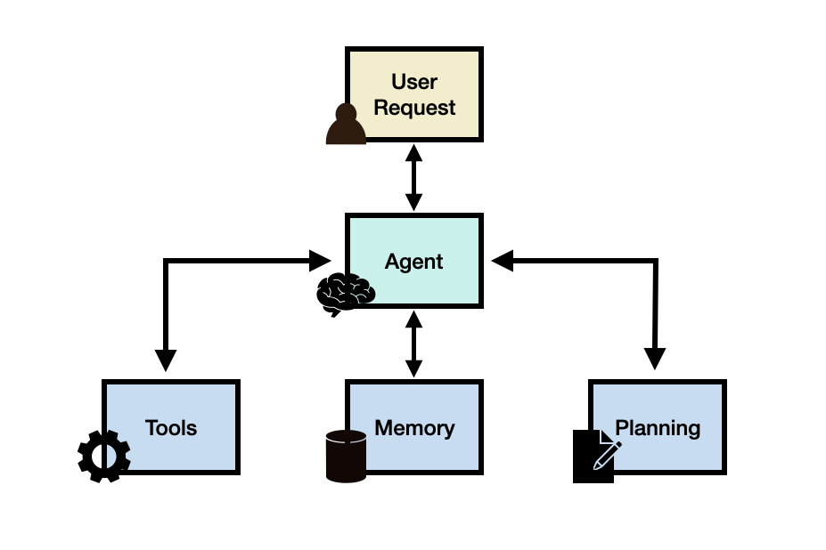
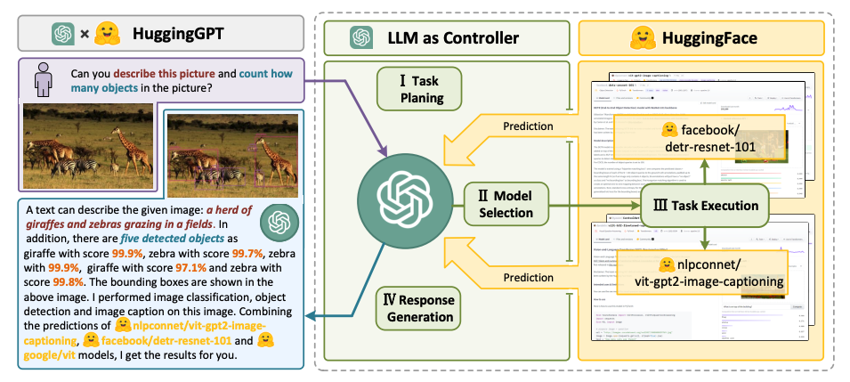

# LLM Agents

import {Cards, Card} from 'nextra-theme-docs'
import { Callout } from 'nextra/components'
import {FilesIcon} from 'components/icons'

所謂「LLM based agents」，簡稱 LLM Agents，指的是一類以大型語言模型為核心的應用架構，能透過規劃、記憶與工具使用等模組，執行複雜任務。當我們在打造 LLM Agent 時，LLM 本身通常扮演「大腦」或「協調中樞」的角色，負責決定在任務流程中要採取哪些步驟。Agent 會視需求搭配規劃（planning）、記憶（memory）與工具（tools）等核心能力。

為了說明 LLM Agent 的價值，可以先看一個問題：

> What's the average daily calorie intake for 2023 in the United States?

這個問題如果模型內建的知識足夠，大概可以直接回答。如果模型不知道，也可以透過一個簡單的 RAG 系統，讓 LLM 查詢健康相關資料庫或報告，仍有機會得到合理答案。

但如果換成這樣的問題：

> How has the trend in the average daily calorie intake among adults changed over the last decade in the United States, and what impact might this have on obesity rates? Additionally, can you provide a graphical representation of the trend in obesity rates over this period?

此時就不是單靠一個 LLM 或基本 RAG 就能搞定了。這個問題需要：

- 把任務拆成多個子問題
- 呼叫不同工具與資料來源
- 執行一連串步驟並彙整結果

例如，我們可能需要打造一個 Agent，能夠：

- 使用搜尋 API 取得相關健康資料與研究
- 查詢公共與私有健康資料庫
- 讀取特定報告中關於卡路里與肥胖率的統計
- 透過「程式碼工具」產生圖表與報表

這些只是高層級元件，實作時還要考慮如何設計「任務規劃」、如何追蹤任務狀態與中間結果，以及如何把這些資訊寫入與讀出 Agent 的記憶。

<Callout type= "info" emoji="🎓">
想更系統地學習 LLM Agent 與進階提示詞技巧？歡迎參考我們的新 AI 課程。 [立刻報名！](https://dair-ai.thinkific.com/)

結帳時輸入折扣碼 PROMPTING20 可再享 8 折優惠。
</Callout>

## LLM Agent 架構

一般來說，一個 LLM Agent 架構會包含下列核心元件：

- **User Request：** 使用者的問題或需求。
- **Agent / Brain：** 作為協調中樞的 Agent 大腦。
- **Planning：** 協助 Agent 規劃未來要採取的行動。
- **Memory：** 管理 Agent 過去的行為、觀測與中介狀態。

### Agent（大腦模組）

具備通用能力的大型語言模型，會作為整個系統的主要大腦、Agent 模組或協調中樞。我們通常會透過一個詳盡的 prompt template 來啟動這個模組，裡面會說明：

- Agent 的角色與任務範圍
- 可使用的工具與其說明
- 輸入輸出的格式與風格要求

實務上，常會為 Agent 設定一個 persona，讓它在特定領域或風格中行動。這些設定會寫在哪個 prompt 中，包括：

- 角色描述（例如「資料分析師」「客服專員」）
- 個性與溝通風格
- 社會與背景資訊

依照 [Wang et al. 2023] 的整理，這些 Agent profile 可以透過手寫、由 LLM 產生，或從真實資料中萃取而來。

### Planning（規劃）

#### 無回饋式規劃

規劃模組的目標，是把使用者的需求拆成一系列可逐一解決的子任務。只要規劃得當，Agent 就能更有效地理解問題並找出穩定可靠的解法。

在這個階段，我們會請 LLM 產生一份較詳細的「任務計畫」，列出要進行的子任務與大致步驟。常用的任務拆解方法包括：

- [chain-of-thought (CoT) prompting](https://www.promptingguide.ai/techniques/cot)：單一路徑推理。
- [Tree of Thoughts](https://www.promptingguide.ai/techniques/tot)：多路徑推理。

下圖（取自 [A Survey on Large Language Model based Autonomous Agents](https://arxiv.org/abs/2308.11432)）整理了不同推理與規劃策略：

#### 有回饋式規劃

上述規劃方式沒有考慮任務執行中的回饋，因此在長期、多步驟任務上，容易因早期錯誤而走偏，很難自我修正。

為了改善長程規劃能力，可以：

- 在每個階段收集環境或工具回饋
- 依照結果動態調整後續計畫
- 將先前的成功與失敗經驗寫入記憶，讓後續規劃更穩健

近期也有不少研究結合增強式學習與搜尋演算法，幫 Agent 在規劃空間中做更精細的探索。

常見的反思／評估方法包含 [ReAct](https://www.promptingguide.ai/techniques/react) 與 [Reflexion](https://arxiv.org/abs/2303.11366)。

想了解 ReAct 可參考：

<Cards>
    <Card
    icon={<FilesIcon />}
    title="ReAct Prompting"
    href="https://www.promptingguide.ai/techniques/react"
    />
</Cards>

### Memory（記憶模組）

強大的記憶系統是 Agent 架構中的關鍵之一。記憶大致可分為：

- **短期記憶（短期上下文）：**
  利用模型上下文來儲存近期對話、工具呼叫結果與中介狀態。

- **長期記憶：**
  使用向量資料庫、關聯式資料庫或其他外部儲存系統，儲存任務歷史、使用者偏好、Env 狀態等，供後續回溯與查詢。

實作上，常見設計包括：

- 例如 Ghost in the Minecraft（[GITM](https://arxiv.org/abs/2305.17144)）使用 key-value 結構儲存記憶，其中 key 以自然語言表示、value 則用 embedding 表示。

- 依照任務型態將記憶拆成多個「槽位」（例如使用者設定、任務筆記、工具觀測等）。
- 設計檢索條件與過濾邏輯，只把最相關的記憶片段帶回上下文。
- 搭配摘要與壓縮機制，避免上下文爆滿。

良好的記憶設計可以讓 Agent：

- 追蹤長期任務進度
- 善用舊資料輔助新任務
- 提供更一致、具延續性的互動體驗

### Tools（工具）

Tools（工具）對應到一組能讓 LLM Agent 與外部環境互動的工具，例如 Wikipedia Search API、Code Interpreter 與 Math Engine。工具也可以包含資料庫、知識庫與外部模型。當 Agent 呼叫外部工具時，通常會透過工作流程來執行任務，協助 Agent 取得觀測結果或必要資訊，以完成子任務並滿足使用者需求。以前面健康相關的複雜查詢為例，code interpreter 就是一個典型工具：它能執行程式碼，並產生使用者要求的圖表資訊。

LLM 也能用不同方式來串接工具，例如：

- [MRKL](https://arxiv.org/abs/2205.00445)：一個把 LLM 與專家模組結合的框架；專家模組可以是 LLM，也可以是符號式工具（例如計算機或天氣 API）。
- [Toolformer](https://arxiv.org/abs/2302.04761)：透過微調讓 LLM 學會使用外部工具 API。
- [Function Calling](https://www.promptingguide.ai/applications/function_calling)：透過定義一組工具 API，並在請求中提供給模型，讓 LLM 具備工具使用能力。
- [HuggingGPT](https://arxiv.org/abs/2303.17580)：一個由 LLM 驅動的 Agent，使用 LLM 做任務規劃，並根據描述串接各種既有 AI models 來完成 AI 任務。

## LLM Agents 的應用領域

LLM-based Agents 已被應用在許多不同領域，下列只是部分例子：

- **資料與知識工作：**
  研究助手、報告與摘要產生、深入調查與比較分析。

- **對話與陪伴型應用：**
  心理支援、學習輔導、語言練習、職涯諮詢等。

- **軟體開發與維運：**
  協助撰寫、重構與除錯程式碼，協助設計測試、產生文件或 CI/CD 指令碼。

- **企業流程與自動化：**
  客服工作流程、工單路由、內部知識庫問答、資料輸入與清理。

- **科學與工程領域：**
  協助設計實驗、分析實驗結果、或在模擬環境中規劃行動。

這些應用多半都仰賴「多步驟推理＋工具使用＋長期記憶」的組合，因此特別適合用 Agent 架構來實作。

### 代表性案例

以下是幾個具有代表性的 LLM Agent 研究與應用：

- [Ma et al. (2023)](https://arxiv.org/abs/2307.15810)
  分析對話式 Agent 在心理健康支援上的效果，發現雖然能幫助使用者舒緩焦慮，但也可能在某些情況下產生有害內容。

- [Horton (2023)](https://arxiv.org/abs/2301.07543)
  為 Agent 設定資產、偏好與人格，模擬人類在經濟場景中的行為。

- [Generative Agents](https://arxiv.org/abs/2304.03442)、[AgentSims](https://arxiv.org/abs/2308.04026)
  在虛擬小鎮中打造多個具個體人格的 Agent，模擬人類日常生活互動。

- [Blind Judgement](https://arxiv.org/abs/2301.05327)
  使用多個語言模型模擬多位法官的決策流程，在預測美國最高法院判決上有顯著優於隨機的準確度。

- [Ziems et al. (2023)](https://arxiv.org/abs/2305.03514)
  建立可協助研究者撰寫摘要、規劃指令碼與抽取關鍵字的 Agent。

- [ChemCrow](https://arxiv.org/abs/2304.05376)
  一個化學領域 Agent，透過連結化學資料庫，能自動規劃與執行多種合成流程。

- [Boiko et al. (2023)]
  結合多個 LLM 來自動化科學實驗的設計、規劃與執行流程。

- **數學與教育相關 Agents**
  例如 Math Agents、[EduChat](https://arxiv.org/abs/2308.02773)、[CodeHelp](https://arxiv.org/abs/2308.06921) 等，用於輔助解題與教學。

- [Mehta et al. (2023)](https://arxiv.org/abs/2304.10750)
  提出框架讓人類建築師能在 3D 模擬環境中與 AI Agent 協作設計建築。

- **軟體工程相關 Agents**
  如 [ChatDev](https://arxiv.org/abs/2307.07924)、[ToolLLM](https://arxiv.org/abs/2307.16789)、[MetaGPT](https://arxiv.org/abs/2308.00352) 等，展示在自動撰寫、除錯與測試程式碼上的潛力。

- [LLM As DBA](https://arxiv.org/abs/2308.05481)
  一個 LLM 型資料庫管理 Agent，能持續累積維運經驗並提出診斷與最佳化建議。

- [IELLM](https://arxiv.org/abs/2304.14354)
  探討在油氣產業中應用 LLM 來解決專業領域問題。

- [Dasgupta et al. 2023](https://arxiv.org/abs/2302.00763)
  提出一個針對實體推理與任務規劃的統一 Agent 系統。

- [OS-Copilot](https://arxiv.org/abs/2402.07456)
  建立可以與完整作業系統互動的通用 Agent，包括瀏覽器、終端機、檔案、多媒體與第三方應用等。

### LLM Agent 工具與框架

*AutoGen 的能力示意圖；圖片來源：https://microsoft.github.io/autogen*

目前已有許多開源與商用框架，協助開發者更容易打造 LLM Agents，例如：

- [LangChain](https://python.langchain.com/docs/get_started/introduction)：
  以語言模型為核心的應用與 Agent 開發框架。

- [AutoGPT](https://github.com/Significant-Gravitas/AutoGPT)：
  提供自主 Agent 建構工具。

- [Langroid](https://github.com/langroid/langroid)：
  專注在多 Agent 程式設計（Multi-Agent Programming），把 Agent 當成一等公民，透過訊息協作完成任務。

- [AutoGen](https://microsoft.github.io/autogen/)：
  讓多個 LLM Agent 彼此對話協作以完成任務的框架。

- [OpenAgents](https://github.com/xlang-ai/OpenAgents)：
  一個用來託管與使用語言 Agent 的開放平臺。

- [LlamaIndex](https://www.llamaindex.ai/)：
  專注在把自訂資料接上 LLM 的框架。

- [GPT Engineer](https://github.com/gpt-engineer-org/gpt-engineer)：
  自動化程式碼產生以完成開發任務。

- [DemoGPT](https://github.com/melih-unsal/DemoGPT)：
  可自動產生互動式 Streamlit 應用的 Agent。

- [GPT Researcher](https://github.com/assafelovic/gpt-researcher)：
  專門做全面線上研究的自動化 Agent。

- [AgentVerse](https://github.com/OpenBMB/AgentVerse)：
  協助在不同應用中部署多個 LLM Agent 的框架。

- [Agents](https://github.com/aiwaves-cn/agents)：
  建構自律式語言 Agent 的開源框架，支援長短期記憶、工具使用、網頁瀏覽、多 Agent 通訊、人類互動與符號式控制等功能。

- [BMTools](https://github.com/OpenBMB/BMTools)：
  讓語言模型能透過擴充工具來提升能力，並提供社群分享工具的平臺。

- [crewAI](https://www.crewai.io/)：
  為工程師設計的 Agent 框架，強調以簡潔方式提供強大自動化能力。

- [Phidata](https://github.com/phidatahq/phidata)：
  利用 function calling 打造 AI 助理的工具組。

## LLM Agent 評估方式

*AgentBench：在 8 個不同環境中評估 LLM-as-Agent 的基準。圖片來源：Liu et al. 2023*

與評估 LLM 本身一樣，如何系統性評估 LLM Agent 也是一大挑戰。依照 Wang et al. (2023) 的整理，常見做法包括：

- **人工評分（Human Annotation）：**
  由人類評審對 Agent 的輸出做多面向評估，例如誠實程度、助益程度、互動品質、偏見程度等。

- **圖靈測試（Turing Test）：**
  讓評審同時看到人類與 Agent 的輸出，如果無法分辨兩者，就代表 Agent 在某些任務上已達到類人水準。

- **指標設計（Metrics）：**
  為 Agent 設計能量化品質的指標，例如：
  - 任務成功率（task success metrics）
  - 與人類相似度（human similarity metrics）
  - 效率相關指標（例如耗時與成本）

- **評估協議（Protocols）：**
  決定在什麼情境下量測上述指標，例如：
  - 真實世界模擬
  - 社會互動評估
  - 多工綜合測試
  - 軟體測試型任務

- **基準資料集（Benchmarks）：**
  目前已有多個專門為 Agent 設計的基準，例如：
  [ALFWorld](https://alfworld.github.io/)、[Mehta et al. (2023)](https://arxiv.org/abs/2304.10750)、[Tachikuma](https://arxiv.org/abs/2307.12573)、[AgentBench](https://github.com/THUDM/AgentBench)、[SocKET](https://arxiv.org/abs/2305.14938)、[AgentSims](https://arxiv.org/abs/2308.04026)、[ToolBench](https://arxiv.org/abs/2305.16504)、[WebShop](https://arxiv.org/abs/2207.01206)、[Mobile-Env](https://github.com/stefanbschneider/mobile-env)、[WebArena](https://github.com/web-arena-x/webarena)、[GentBench](https://arxiv.org/abs/2308.04030)、[EmotionBench](https://project-roco.github.io/)、[EmotionBench](https://project-roco.github.io/)、[PEB](https://arxiv.org/abs/2308.06782)、[ClemBench](https://arxiv.org/abs/2305.13455)、[E2E](https://arxiv.org/abs/2308.04624) 等。

## 挑戰與開放問題

LLM Agents 仍處於發展初期，實務上存在不少限制與挑戰：

- **角色扮演能力（Role-playing）：**
  Agent 往往需要在特定角色下工作（例如醫師、律師、客服代表）。對於模型不熟悉或難以刻畫的角色，可能需要額外收集資料並進行微調。

- **長期規劃與上下文長度限制：**
  要在長時間歷史上維持正確的規劃與推理仍然困難，容易在早期犯錯後一路偏離。LLM 的上下文長度有限，也限制了短期記憶可用的範圍。

- **人類價值對齊（Alignment）：**
  要讓 Agent 在不同文化與價值觀情境下維持適當行為並不容易，常需搭配進階提示詞策略或後處理。

- **Prompt 穩定性與可靠度：**
  一個 Agent 架構通常會包含多個為不同模組設計的 prompt（例如記憶、規劃、工具選擇等）。LLM 對 prompt 的敏感度使得整體框架很容易因微小修改而不穩定。可能的解法包含：
  - 透過反覆實驗打磨 prompt
  - 自動化最佳化或搜尋 prompt
  - 透過其他 LLM 自動產生或修正 prompt
  同時，幻覺問題在 Agent 架構中更為棘手，因為自然語言被用來與外部系統溝通，一旦資訊互相矛盾，容易導致事實性錯誤。

- **知識邊界（Knowledge Boundary）：**
  很難精準控制 LLM 的知識範圍；模型內建知識與外部資料可能互相衝突，造成模擬結果偏離真實。某些模型也可能使用「使用者並不知情的知識」，影響 Agent 在特定環境中的行為。

- **效率與成本（Efficiency）：**
  Agent 常需要大量 LLM 呼叫才能完成一個任務，整體流程會高度仰賴推論速度與費用。當同時運作多個 Agent 時，成本與延遲更是必須仔細評估的問題。

## 參考資料

- [LLM Powered Autonomous Agents](https://lilianweng.github.io/posts/2023-06-23-agent/)
- [MRKL Systems: A modular, neuro-symbolic architecture that combines large language models, external knowledge sources and discrete reasoning](https://arxiv.org/abs/2205.00445)
- [A Survey on Large Language Model based Autonomous Agents](https://arxiv.org/abs/2308.11432)
- [The Rise and Potential of Large Language Model Based Agents: A Survey](https://arxiv.org/abs/2309.07864)
- [Large Language Model based Multi-Agents: A Survey of Progress and Challenges](https://arxiv.org/abs/2402.01680)
- [Cognitive Architectures for Language Agents](https://arxiv.org/abs/2309.02427)
- [Introduction to LLM Agents](https://developer.nvidia.com/blog/introduction-to-llm-agents/)
- [LangChain Agents](https://python.langchain.com/docs/use_cases/tool_use/agents)
- [Building Your First LLM Agent Application](https://developer.nvidia.com/blog/building-your-first-llm-agent-application/)
- [Building LLM applications for production](https://huyenchip.com/2023/04/11/llm-engineering.html#control_flow_with_llm_agents)
- [Awesome LLM agents](https://github.com/kaushikb11/awesome-llm-agents)
- [Awesome LLM-Powered Agent](https://github.com/hyp1231/awesome-llm-powered-agent#awesome-llm-powered-agent)
- [Functions, Tools and Agents with LangChain](https://www.deeplearning.ai/short-courses/functions-tools-agents-langchain/)
