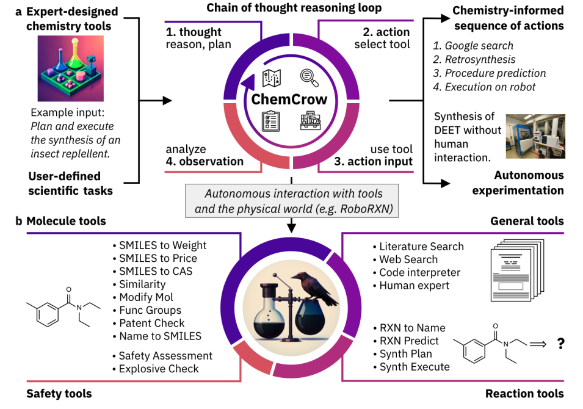
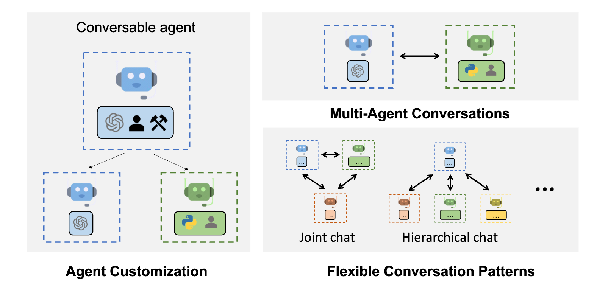

# 大语言模型智能体简介

import {Cards, Card} from 'nextra-theme-docs'
import {FilesIcon} from 'components/icons'

大语言模型（LLM）智能体，是一种利用大语言模型进行复杂任务执行的应用。这种智能体通过结合大语言模型与关键模块，如规划和记忆，来执行任务。构建这类智能体时，LLM充当着控制中心或“大脑”的角色，负责管理完成任务或响应用户请求所需的一系列操作。这种智能体的构建，需要依赖于规划、记忆以及工具使用等关键模块。

想象一下，如果我们想要创建一个系统，能够回答如下问题：

> 在2023年，美国的平均每日卡路里摄入量是多少？

上述问题可能直接通过一个已经掌握了所需知识的LLM来得到回答。如果LLM缺乏回答这个问题的具体知识，我们可以采用一个简单的基于检索增强生成（RAG）系统，使LLM能够访问健康相关的信息或报告。对于更加复杂的问题，比如：

> 在过去的十年中，美国成年人的平均每日卡路里摄入量的趋势如何变化？这种变化对肥胖率有何影响？能否提供一个图表来展示这段时间内肥胖率的趋势？

仅凭LLM可能不足以解答这类复杂问题。虽然结合LLM与外部知识库可以形成RAG系统，但这样做仍可能不足以应对复杂的查询。因为，这类问题要求LLM将任务拆分为可以通过使用工具和操作流程解决的子任务，以实现最终的回答。构建一个能够访问搜索API、健康相关出版物及公共/私人健康数据库的LLM智能体，可能是一个解决方案，以便提供与卡路里摄入和肥胖相关的信息。

此外，LLM还需要能够使用“代码解释器”工具，以利用相关数据生成有助于理解肥胖趋势的图表。这些可能是构建假设中的LLM智能体时考虑的高级组件，但在实际操作中，还需考虑如何规划处理任务的策略，以及如何通过记忆模块跟踪操作流程、观察和整体进展的状态。

## 大语言模型智能体框架简介

通常，一个大语言模型智能体框架包含以下核心部分：

* 用户请求 - 表达用户的问题或请求
* 智能体/大脑 - 作为协调者的智能体核心
* 规划- 助于智能体为未来行动做规划
* 记忆 - 管理智能体的历史行为和经验

通过这些组成部分的协同工作，大语言模型智能体能够处理从简单到复杂的各种请求，不仅能够提供直接的答案，还能解决需要深度分析和多步骤操作的问题。这种智能体的能力，使其在处理复杂信息查询、数据分析和可视化表示等方面具有巨大潜力。

### 智能体

一款具备广泛应用能力的大语言模型 (LLM) 充当了整个系统的中枢大脑、智能体模块或是协调者角色。通过设计一个含有操作方法和可用工具详细信息的提示模板来启动这个组件。

尽管不强制，但我们还是可以为智能体设定一个具体角色或者塑造一个人格，以明确其职能。这种设定通常包含在提示中，涵盖角色详情、性格、社交及人口统计等信息。根据 [Wang 等人，2023年] 的研究，智能体特征的设定方法包括手工构造、LLM生成或基于数据的方法。

### 规划

#### 无反馈规划

规划模块的作用是将用户请求拆分成智能体能够单独解决的若干步骤或子任务。这对于智能体更准确地理解问题和找到可靠解决方案至关重要。规划模块将借助LLM拆分出详尽的计划，包括解答用户问题所需的子任务。常见的任务分解技术包括思路链 (Chain of Thought) 和思路树 (Tree of Thoughts)，它们分别代表了单路径推理和多路径推理。以下图表根据 [Wang 等人，2023年](https://arxiv.org/abs/2308.11432) 的研究，展示了不同策略的比较：

#### 有反馈的规划

之前提到的规划模块未涉及反馈，这在解决复杂任务时面临长期规划的挑战。为应对此挑战，可以采用一种机制，让模型基于过去的行动和观察迭代地反思和调整执行计划。其目的是纠正过去的错误并提升结果质量，这在处理复杂的现实任务时尤其关键，其中试错法是解决问题的关键步骤。两种著名的反思或评估机制方法包括 ReAct 和 Reflexion。

以 ReAct 为例，它将推理与行动结合起来，通过在思考（Thought）、行动（Action）和观察（Observation）这一系列步骤之间交替进行（重复 N 次），帮助大语言模型解决复杂任务。ReAct 通过观察形式从环境中获取反馈。其他反馈类型还可以包括人类和模型反馈。下图展示了 ReAct 的过程及其在问答任务中涉及的各个步骤：

更多关于 ReAct 的信息，请参考以下链接：

<Cards>
    <Card
    icon={<FilesIcon />}
    title="ReAct Prompting"
    href="https://www.promptingguide.ai/techniques/react"
    />
</Cards>

### 内存

智能体的内存模块负责记录其内部日志，涵盖了先前的思考、行为及对环境的观察，也包括与用户的所有互动。在大语言模型智能体的研究文献中，主要区分为两种内存类型：

*   **短期内存** - 涉及智能体当前状态的上下文信息，通常通过上下文内学习实现。由于上下文窗口的限制，这种内存是有时限和容量限制的。
*   **长期内存** - 存储智能体过去的行为和思考，这部分信息需要在长时间内被保留并能够被回忆起来。通常通过连接至快速、可扩展的外部向量存储库来实现，以便在需要时为智能体提供相关信息。

通过结合短期内存和长期内存，混合内存系统能够增强智能体的长期推理和经验积累能力。

在构建智能体时，还会考虑到多种内存格式，如自然语言、数据嵌入、数据库和结构化列表等。这些格式可以组合使用，例如在 Minecraft 游戏中的 Ghost (GITM) 采用了键值对结构，其中键用自然语言表示，值则由嵌入向量构成。

规划与内存模块共同支持智能体在动态环境中的有效运作，使其能够回顾过去行为并规划未来动作。

### 工具

LLM 智能体通过工具与外界环境互动，这些工具包括 Wikipedia 搜索 API、代码解释器和数学引擎等。工具的范畴也涵盖数据库、知识库和外部模型。智能体利用这些工具执行任务，通过工作流程获取信息或完成子任务，以满足用户的需求。例如，在处理健康查询时，代码解释器就是一个能够执行代码并生成所需图表信息的工具。

LLM 以多种方式使用这些工具：

*   [MRKL](https://arxiv.org/abs/2205.00445) 结合了 LLM 和专家模块，后者可以是其他 LLM 或特定功能的符号系统（如计算器或天气 API）。
*   [Toolformer](https://arxiv.org/abs/2302.04761) 对 LLM 进行微调，使其能够使用外部工具 API。
*   函数调用（ [Function Calling](https://www.promptingguide.ai/applications/function_calling) ）功能增强了 LLM 的工具使用能力，它定义了一套工具 API 并将其作为请求的一部分提供给模型。
*   [HuggingGPT](https://arxiv.org/abs/2303.17580) 利用 LLM 作为任务规划器，通过连接各种现有的 AI 模型（根据描述）来解决 AI 任务。

## 大语言模型智能体的应用领域

*ChemCrow 智能体，专门设计用于应对有机合成、药物发现和材料设计等领域的任务。图来源：Bran et al., 2023*

本节将介绍几个大语言模型智能体因其出色的复杂推理和常识理解能力而在不同领域和案例中得到有效应用的实例。

### 著名的大语言模型智能体

*   [Ma et al. (2023)](https://arxiv.org/abs/2307.15810) 的研究探讨了会话式 AI 智能体在提供心理健康支持方面的效用，指出这类智能体能助人减轻焦虑，但有时也可能输出有害信息。
*   [Horton (2023)](https://arxiv.org/abs/2301.07543) 通过给予基于大语言模型（LLM）的智能体以“资产、偏好及个性”，模拟人类在经济行为场景中的决策过程。
*   [生成式 AI 智能体](https://arxiv.org/abs/2304.03442) 和 [AgentSims](https://arxiv.org/abs/2308.04026) 都致力于在虚拟小镇环境中重现人类的日常生活，通过搭建多元化的智能体完成此目标。
*   [盲审](https://arxiv.org/abs/2301.05327) 利用多个语言模型模拟法官的判决过程，其对现实世界最高法院裁决的预测准确度高于随机水平。
*   [Ziems et al. (2023)](https://arxiv.org/abs/2305.03514) 展示了能够辅助研究人员进行文献综述、脚本编写和关键词提取等任务的智能体。
*   [ChemCrow](https://arxiv.org/abs/2304.05376) 描述了一个专注于化学领域的大语言模型智能体，该智能体能够独立规划并执行驱虫剂、有机催化剂的合成及新型色素的开发。
*   [Boiko et al. (2023)] 展示了如何集成多个大语言模型，自动化科研实验的设计、规划及执行过程。
*   [数学智能体]() 旨在辅助研究人员探索数学问题，发现新解，完成证明。[EduChat](https://arxiv.org/abs/2308.02773) 和 [CodeHelp](https://arxiv.org/abs/2308.06921) 则是专为教育领域设计的两个杰出的大语言模型智能体。
*   [Mehta et al. (2023)](https://arxiv.org/abs/2304.10750) 提出了一种互动框架，允许建筑师与 AI 智能体合作，在三维模拟环境中设计建筑。
*   [ChatDev](https://arxiv.org/abs/2307.07924)、[ToolLLM](https://arxiv.org/abs/2307.16789)、[MetaGPT](https://arxiv.org/abs/2308.00352) 等例证展示了 AI 智能体在自动化编程、调试、测试及支持软件工程其他任务方面的潜力。
*   [D-Bot](https://arxiv.org/abs/2308.05481) 是一个基于大语言模型的数据库管理智能体，它不断积累数据库维护的经验，并为数据库的诊断与优化提供咨询建议。

*   [IELLM](https://arxiv.org/abs/2304.14354) 利用大语言模型 (LLMs) 面向石油与天然气产业的特定需求，开展解决方案探索，以应对该行业面临的复杂挑战。
*   [Dasgupta et al. 2023](https://arxiv.org/abs/2302.00763) 开发了一个全新的智能体系统，该系统整合了身体动作的推理与任务计划功能，旨在提升机器执行任务的效率和自主性。
*   [OS-Copilot](https://arxiv.org/abs/2402.07456) 提供了一个创新框架，旨在打造能够全面操作操作系统 (OS) 的通用智能体，这些智能体能够灵活应对网络浏览、编码操作、文件管理、多媒体处理及与众多第三方应用的交互。

### 大语言模型智能体工具

*AutoGen 功能展示; 图片来源: https://microsoft.github.io/autogen*

下面列出了一些在构建大语言模型智能体过程中常用的重要工具和框架：

*   [LangChain](https://python.langchain.com/docs/get_started/introduction)：一个开发基于语言模型的应用程序和智能体的框架，旨在简化语言模型的应用开发流程。
*   [AutoGPT](https://github.com/Significant-Gravitas/AutoGPT)：提供了一套工具，帮助开发者构建 AI 智能体，简化了AI智能体的开发工作。
*   [Langroid](https://github.com/langroid/langroid)：通过多智能体编程，将智能体作为核心组件，通过消息交互协作完成任务，简化了大语言模型应用的构建过程。
*   [AutoGen](https://microsoft.github.io/autogen/)：一个使多个智能体能够交流协作解决问题的大语言模型应用开发框架，推动了智能体之间的对话和任务解决能力。
*   [OpenAgents](https://github.com/xlang-ai/OpenAgents)：一个开放的平台，用于在实际环境中使用和托管语言智能体，促进了语言智能体的广泛应用。
*   [LlamaIndex](https://www.llamaindex.ai/)：一个连接自定义数据源与大语言模型的框架，扩展了大语言模型的应用场景。
*   [GPT Engineer](https://github.com/gpt-engineer-org/gpt-engineer)：专注于自动化代码生成以辅助完成开发任务，简化了编程工作。
*   [DemoGPT](https://github.com/melih-unsal/DemoGPT)：一个能够创建交互式 Streamlit 应用的自主 AI 智能体，增强了应用的互动性。
*   [GPT Researcher](https://github.com/assafelovic/gpt-researcher)：一个设计用于执行各种任务的全面在线研究的自主智能体，提升了研究效率。
*   [AgentVerse](https://github.com/OpenBMB/AgentVerse)：旨在促进在不同应用中部署基于大语言模型的多个智能体，提供了丰富的应用可能性。
*   [Agents](https://github.com/aiwaves-cn/agents)：一个开源的构建自主语言智能体的库/框架，支持长短期记忆、工具使用、网页导航、多智能体通信等功能，还新增了人机交互和符号控制等新功能，是构建高级智能体的强大工具。
*   [BMTools](https://github.com/OpenBMB/BMTools)：通过工具扩展语言模型的能力，并为社区提供一个构建和分享这些工具的平台，促进了工具的创新和共享。
*   [crewAI](https://www.crewai.io/)：为工程师设计的 AI 智能体框架，以简单强大为特点，帮助构建智能体和自动化流程，简化了智能体的开发和部署。

## 大语言模型智能体的评估

*AgentBench 基准测试，旨在评估作为智能体的大语言模型在现实世界挑战及八种不同环境下的表现（图源：Liu 等，2023）。*

与评估大语言模型本身相似，对大语言模型智能体的评估也是一项充满挑战的任务。根据 Wang 等人（2023年）的研究，常用的评估方法包括：

*   **人工评注**：涉及人类评价者直接就应用中重要的各个方面对大语言模型的输出进行评分，这些方面包括诚实性、有用性、参与度、公正性等。
*   **图灵测试**：通过让人类评价者比较真实人类和智能体的输出结果来进行评估，如果结果无法区分，则意味着智能体达到了与人类相似的表现水平。
*   **量化指标**：精心设计的量化指标用来反映智能体的质量，包括任务完成度指标、与人类相似度指标及效率指标等。
*   **评估协议**：这指的是确定如何应用这些量化指标的常见评估流程，例如真实世界模拟、社交评估、多任务评估和软件测试等。
*   **基准测试**：为了评估大语言模型智能体的性能，设计了若干基准测试，其中包括 [ALFWorld](https://alfworld.github.io/)、[IGLU](https://arxiv.org/abs/2304.10750)、[Tachikuma](https://arxiv.org/abs/2307.12573)、[AgentBench](https://github.com/THUDM/AgentBench)、[SocKET](https://arxiv.org/abs/2305.14938)、[AgentSims](https://arxiv.org/abs/2308.04026)、[ToolBench](https://arxiv.org/abs/2305.16504)、[WebShop](https://arxiv.org/abs/2207.01206)、[Mobile-Env](https://github.com/stefanbschneider/mobile-env)、[WebArena](https://github.com/web-arena-x/webarena)、[GentBench](https://arxiv.org/abs/2308.04030)、[RocoBench](https://project-roco.github.io/)、[EmotionBench](https://project-roco.github.io/)、[PEB](https://arxiv.org/abs/2308.06782)、[ClemBench](https://arxiv.org/abs/2305.13455) 和 [E2E](https://arxiv.org/abs/2308.04624) 等。

## 挑战

大语言模型（LLM）智能体正处于发展初期，构建它们的过程中仍面临诸多挑战和限制：

* **角色适应能力**：LLM 智能体在特定领域内有效执行任务通常需要适配特定角色。针对 LLM 较弱的角色识别能力，可以通过针对性地微调 LLM，使用反映罕见角色或心理特征的数据来增强其性能。
* **长期规划与有限上下文长度**：基于长时间历史的规划是一大挑战，可能导致错误累积，智能体难以自我纠错。同时，LLM 支持的上下文长度有限，这可能制约智能体的功能，比如限制其利用短期记忆的能力。
* **广泛的人类价值对齐**：使智能体与多元化的人类价值观保持一致同样具有挑战性，这在传统 LLM 中也是一个普遍问题。一种可能的解决方法是通过设计先进的提示策略来调整 LLM，以便更好地对齐人类价值。
* **提示的稳定性与可靠性**：LLM 智能体可能涉及设计多个提示来支持不同功能模块，如记忆和规划，而对提示微小变化的高敏感度常导致可靠性问题。整个提示框架的设计使其更易受到稳定性问题的影响。可能的解决办法包括通过反复试验来设计提示元素、自动优化或调整提示，或利用 GPT 自动生成提示。另一个常见问题是“语言幻觉”，LLM 智能体依赖自然语言与外部组件交互，可能因为接收到的冲突信息而产生信息准确性问题。
* **知识界限**：控制 LLM 的知识范围具有挑战性，这直接影响模拟活动的有效性。LLM 内部的知识可能携带偏见或使用用户不熟悉的信息，这在特定环境下可能影响智能体的表现。
* **效率**：LLM 智能体的操作涉及大量请求处理，这可能影响其行动的效率，因其高度依赖于 LLM 的推理速度。同时，在部署多个智能体时，成本也成为了一个需要考虑的因素。

## 参考资料

*   [利用大语言模型驱动的自主AI智能体](https://lilianweng.github.io/posts/2023-06-23-agent/)
*   [MRKL 系统：融合大语言模型、外部知识源与离散逻辑的模块化神经符号框架](https://arxiv.org/abs/2205.00445)
*   [大语言模型支撑的自主智能体综述](https://arxiv.org/abs/2308.11432)
*   [基于大语言模型的智能体：崛起及其潜能综览](https://arxiv.org/abs/2309.07864)
*   [基于大语言模型的多智能体系统：进展与挑战综述](https://arxiv.org/abs/2402.01680)
*   [语言智能体的认知框架](https://arxiv.org/abs/2309.02427)
*   [大语言模型智能体入门](https://developer.nvidia.com/blog/introduction-to-llm-agents/)
*   [LangChain 智能体实践](https://python.langchain.com/docs/use_cases/tool_use/agents)
*   [打造你的首款大语言模型智能体应用](https://developer.nvidia.com/blog/building-your-first-llm-agent-application/)
*   [为生产环境打造大语言模型应用指南](https://huyenchip.com/2023/04/11/llm-engineering.html#control_flow_with_llm_agents)
*   [精选大语言模型智能体资源集](https://github.com/kaushikb11/awesome-llm-agents)
*   [精选大语言模型驱动智能体资源](https://github.com/hyp1231/awesome-llm-powered-agent#awesome-llm-powered-agent)
*   [LangChain：功能、工具与智能体综合应用](https://www.deeplearning.ai/short-courses/functions-tools-agents-langchain/)
