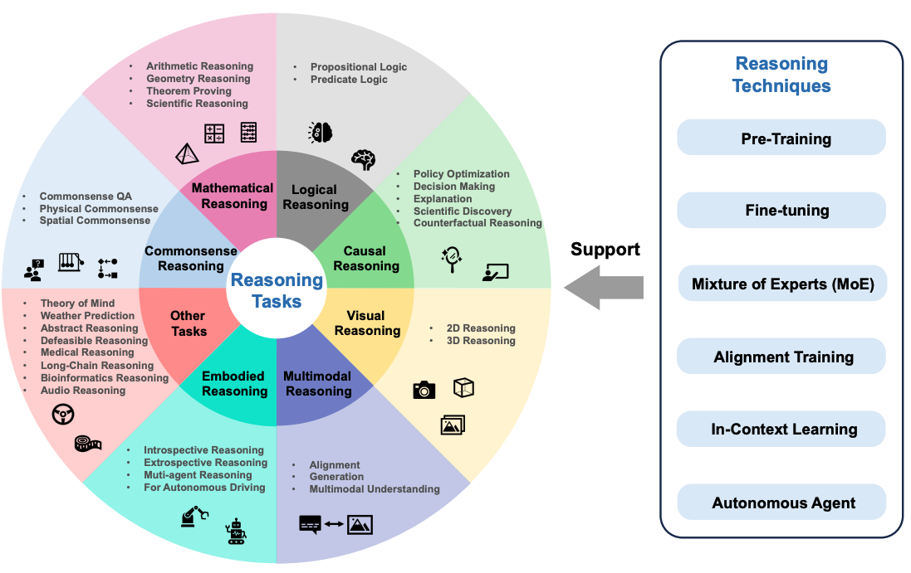
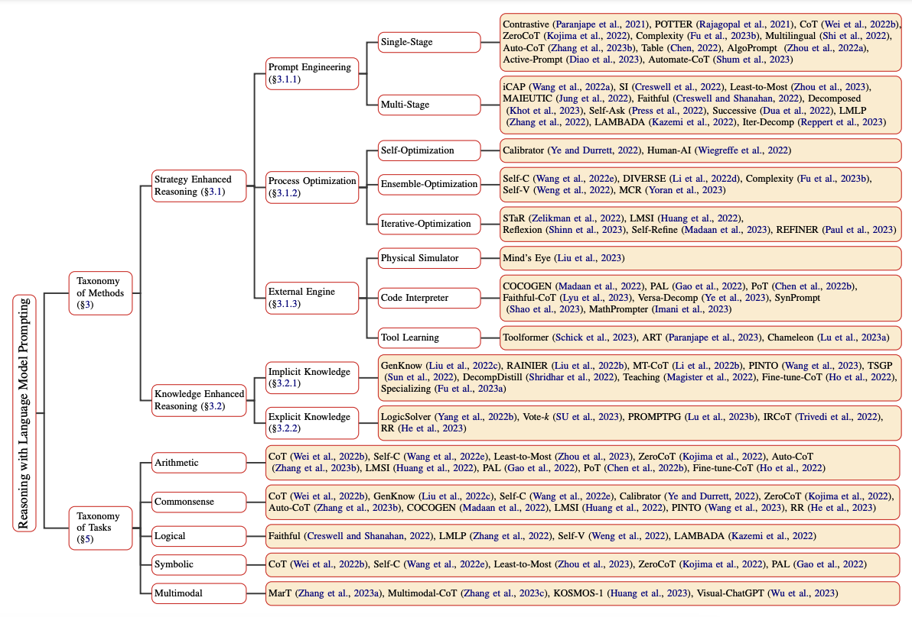
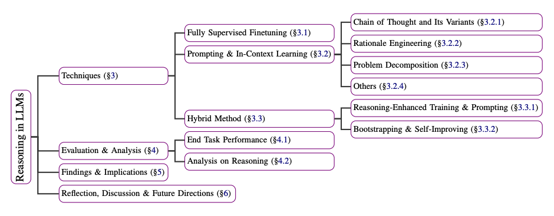

# LLM Reasoning

Over the last couple of years, large language models (LLMs) have made significant progress in a wide range of tasks. More recently, LLMs have shown the potential to exhibit reasoning abilities when scaled to a large enough size. Different types of reasoning are fundamental to intelligence but it's not fully understood how AI models can learn and harness this capability to solve complex problems. It is an area of huge focus and investment for many research labs.

## Reasoning with Foundation Models
[Sun et al. (2023)](https://arxiv.org/abs/2312.11562) recently proposed an overview of reasoning with foundation models which focuses on the latest advancements in various reasoning tasks. This work also focuses on a more extensive look at reasoning that spans multimodal models and autonomous language agents.

Reasoning tasks could include tasks such as mathematical reasoning, logical reasoning, causal reasoning, visual reasoning and more. The following figure shows an overview of reasoning tasks discussed in the survey paper, including reasoning techniques for foundation models such as alignment training and in-context learning.

*Figure source: [Sun et al., 2023](https://arxiv.org/pdf/2212.09597.pdf)*

## How Can Reasoning be Elicited in LLMs?
Reasoning in LLMs can be elicited and enhanced using many different prompting approaches. [Qiao et al. (2023)](https://arxiv.org/abs/2212.09597) categorized reasoning methods research into two different branches, namely reasoning enhanced strategy and knowledge enhancement reasoning. Reasoning strategies include prompt engineering, process optimization, and external engines. For instance, single-stage prompting strategies include [Chain-of-Thought](https://www.promptingguide.ai/techniques/cot) and [Active-Prompt](https://www.promptingguide.ai/techniques/activeprompt). A full taxonomy of reasoning with language model prompting can be found in the paper and summarized in the figure below:

*Figure source: [Qiao et al., 2023](https://arxiv.org/pdf/2212.09597.pdf)*

[Huang et al. (2023)]() also explain a summary of techniques to improve or elicit reasoning in LLMs such as GPT-3. These techniques range from using fully supervised fine-tuning models trained on explanation datasets to prompting methods such as chain-of-thought, problem decomposition, and in-context learning. Below is a summary of the techniques described in the paper:

*Figure source: [Huang et al., 2023](https://arxiv.org/pdf/2212.10403.pdf)*

## Can LLMs Reason and Plan?
There is a lot of debate about whether LLMs can reason and plan. Both reasoning and planning are important capabilities for unlocking complex applications with LLMs such as in the domains of robotics and autonomous agents. A [position paper by Subbarao Kambhampati (2024)](https://arxiv.org/abs/2403.04121)  discusses the topic of reasoning and planning for LLMs. 

Here is a summary of the author's conclusion:

>To summarize, nothing that I have read, verified, or done gives me any compelling reason to believe that LLMs do reasoning/planning, as normally understood. What they do instead, armed with web-scale training, is a form of universal approximate retrieval, which, as I have argued, can sometimes be mistaken for reasoning capabilities.

## References

- [Reasoning with Language Model Prompting: A Survey](https://arxiv.org/abs/2212.09597)
- [Towards Reasoning in Large Language Models: A Survey](https://arxiv.org/abs/2212.10403)
- [Can Large Language Models Reason and Plan?](https://arxiv.org/abs/2403.04121)
- [Rethinking the Bounds of LLM Reasoning: Are Multi-Agent Discussions the Key?](https://arxiv.org/abs/2402.18272v1)
- [Awesome LLM Reasoning](https://github.com/atfortes/Awesome-LLM-Reasoning)