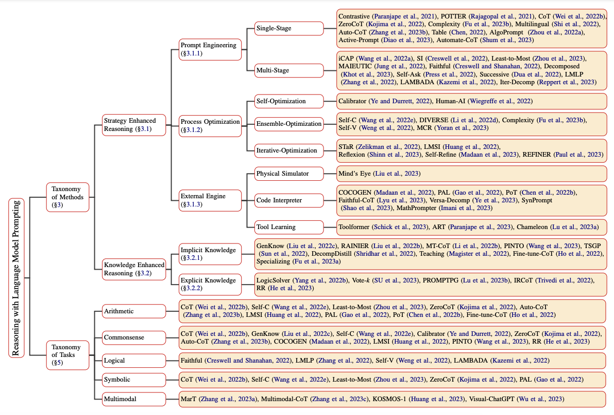

# LLM 推理能力概觀

近幾年，大型語言模型（LLM）在許多工上都有長足進步。尤其在模型規模持續擴張後，LLM 逐漸展現出某種「推理能力」，可以在數學、邏輯、規劃等領域處理更複雜的問題。不過，目前我們仍未完全弄清楚：模型是如何學會這些能力，又要如何穩定地喚起與強化這些能力。這也是各大研究團隊高度投入的主題。

## Foundation Models 的推理能力

[Sun et al. (2023)](https://arxiv.org/abs/2312.11562) 近期整理了一篇關於「Foundation Model 推理」的綜論，聚焦在各種推理任務的最新進展，也延伸討論到多模態模型與自律式語言 Agent 的推理問題。

推理任務可包含：

- 數學推理
- 邏輯推理
- 因果推理
- 視覺推理
- ……等等

下圖呈現論文中彙整的推理任務全貌，以及針對 foundation models 的推理增強技術，例如對齊訓練與 in-context learning 等。

*圖片來源： [Qiao et al., 2023](https://arxiv.org/pdf/2212.09597.pdf)*

## 如何在 LLM 中喚起推理能力？

LLM 的推理能力可以透過多種提示詞方式被喚起或強化。[Reasoning with Language Model Prompting: A Survey](https://arxiv.org/abs/2212.09597) 將推理相關研究大致分成兩大類：
「推理策略強化」（reasoning enhanced strategy）與「知識增強型推理」（knowledge enhancement reasoning）。

推理策略包含提示詞工程、過程最佳化與外部引擎等。例如：

- 單階段提示詞策略：
  - [chain-of-thought (CoT) prompting](https://www.promptingguide.ai/techniques/cot)
  - [Active-Prompt](https://www.promptingguide.ai/techniques/activeprompt)
- 其他多階段與結構化提示詞方法

論文中也整理了一份完整的提示詞式推理分類，概要如下圖：

*圖片來源： [Qiao et al., 2023](https://arxiv.org/pdf/2212.09597.pdf)*

[Huang et al. (2023)]() 也總結了多種提升或喚起 LLM 推理能力的方法，從以解釋資料進行監督式微調，到各種提示詞技巧，例如 chain-of-thought、問題拆解與 in-context learning 等。下圖是論文中整理的技術總覽：

*圖片來源： [Huang et al., 2023](https://arxiv.org/pdf/2212.10403.pdf)*

## LLM 真的會「推理與規劃」嗎？

目前仍有許多討論聚焦在：LLM 是否真正具備推理與規劃能力。這兩種能力被視為解鎖更複雜應用（如機器人、自治型 Agent 等）的關鍵。

[position paper by Subbarao Kambhampati (2024)](https://arxiv.org/abs/2403.04121) 的一篇立場文就專門探討此題。作者的結論大致如下：

> 總結來說，無論是閱讀、驗證或實驗，目前都沒有足夠證據能讓我相信 LLM 真的在以一般意義上的「推理／規劃」。它們比較像是在憑藉網路規模的訓練資料做「近似泛化式檢索」，而這種行為有時會被誤認為推理能力。

這樣的觀點提醒我們：在設計使用情境與評估指標時，需要謹慎區分「真正的推理能力」與「基於訓練資料的擬似推理」。

## 參考資料

- [Reasoning with Language Model Prompting: A Survey](https://arxiv.org/abs/2212.09597)
- [Towards Reasoning in Large Language Models: A Survey](https://arxiv.org/abs/2212.10403)
- [position paper by Subbarao Kambhampati (2024)](https://arxiv.org/abs/2403.04121)
- [Rethinking the Bounds of LLM Reasoning: Are Multi-Agent Discussions the Key?](https://arxiv.org/abs/2402.18272v1)
- [Awesome LLM Reasoning](https://github.com/atfortes/Awesome-LLM-Reasoning)

