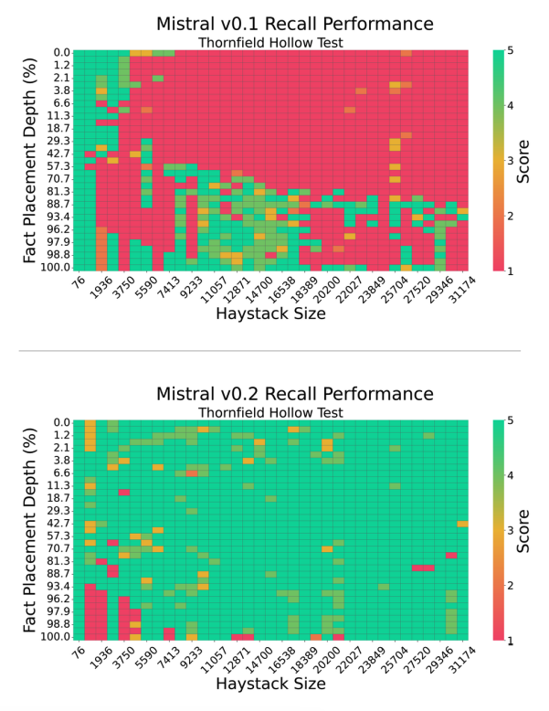

# LLM In-Context Recall is Prompt Dependent

import {Bleed} from 'nextra-theme-docs'

<iframe width="100%"
  height="415px"
  src="https://www.youtube.com/embed/2cNO76lIZ4s?si=tbbdo-vnr56YQ077" allow="accelerometer; autoplay; clipboard-write; encrypted-media; gyroscope; picture-in-picture"
  allowFullScreen
  />

This new [paper by Machlab and Battle (2024)](https://arxiv.org/abs/2404.08865) analyzes the in-context recall performance of different LLMs using several needle-in-a-haystack tests.

It shows that various LLMs recall facts at different lengths and placement depths. It finds that a model's recall performance is significantly affected by small changes in the prompt. 

*Source: [Machlab and Battle (2024)](https://arxiv.org/abs/2404.08865)*

In addition, the interplay between prompt content and training data can degrade the response quality.

The recall ability of a model can be improved with increasing size, enhancing the attention mechanism, trying different training strategies, and applying fine-tuning.

Important practical tip from the paper: "Continued evaluation will further inform the selection of LLMs for individual use cases, maximizing their impact and efficiency in real-world applications as the technology continues to evolve."

The takeaways from this paper are the importance of careful prompt design, establishing a continuous evaluation protocol, and testing different model enhancement strategies to improve recall and utility.
