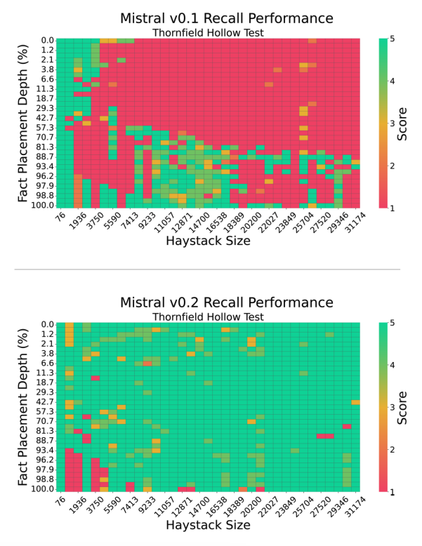

# 大型语言模型的上下文记忆受提示影响

[Machlab 和 Battle（2024）的新研究](https://arxiv.org/abs/2404.08865)分析了不同大型语言模型在“大海捞针”测试中的上下文记忆性能。

研究表明，各种大型语言模型回忆事实的长度和位置各不相同，且模型回忆性能对提示的微小变化非常敏感。

*来源：[Machlab and Battle (2024)](https://arxiv.org/abs/2404.08865)*

此外，提示内容与训练数据之间的相互作用可能会降低回答的质量。

模型的回忆能力可以通过增加模型大小、增强注意力机制、尝试不同的训练策略和进行微调来提高。

论文提供了一个重要的实用建议：“通过持续的评估，可以更好地了解不同LLM在特定用例中的表现，从而做出更明智的选择，以最大化它们在实际应用中的影响力和效率。随着技术的不断发展，这种评估和选择过程将变得更加重要和有效。”

研究的结论是，谨慎设计提示、建立持续的评估协议，并测试不同的模型改进策略对于提高记忆和实用性至关重要。
