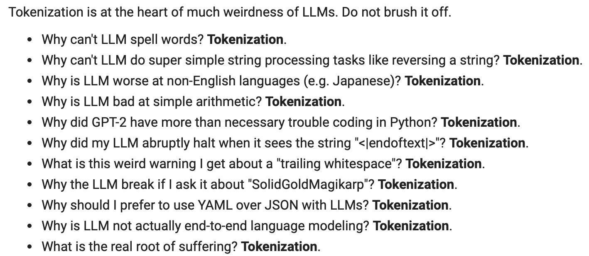

# 大语言模型（LLM）的标记化处理

Andrej Karpathy 最近发布了一个关于如何对大型语言模型（Large Language Model，简称 LLM）进行标记化处理的新[讲座视频](https://youtu.be/zduSFxRajkE?si=Hq_93DBE72SQt73V)。标记化是训练这类模型时的核心环节，它包括使用专属的数据集和算法（比如[字节对编码](https://en.wikipedia.org/wiki/Byte_pair_encoding)）来训练标记器。

在讲座中，Karpathy 向我们展示了如何从零开始构建一个 GPT 标记器，并探讨了与标记化相关的一些异常行为。

*图源：https://youtu.be/zduSFxRajkE?t=6711*
以下是视频中提及的列表内容：
- 为什么大语言模型不能正确拼写单词？这是因为标记化。
- 为什么它不能执行像字符串反转这样的简单任务？同样是因为标记化。
- 为什么在处理日语等非英语语言时表现不佳？标记化的问题。
- 为什么它在简单算术方面表现糟糕？也是标记化导致的。
- GPT-2 为什么在用 Python 编码时遇到更多问题？依旧是标记化的问题。
- 当模型遇到 "\<endoftext\>" 这个字符串时为什么会突然停止？还是标记化的问题。
- 那些关于 "trailing whitespace" 的警告是什么意思？也是标记化引起的。
- 为什么询问 "SolidGoldMagikarp" 时模型会出错？同样是标记化的问题。
- 为什么在使用大语言模型时更倾向于使用 YAML 而不是 JSON？这也是标记化的问题。
- 为什么大语言模型并不是真正的端到端语言模型？原因在于标记化。
- 什么才是痛苦真正的根源？在这一点上，讲座中以幽默的方式指出，也是标记化。

为了提升大语言模型的可靠性，了解如何有效地提示模型至关重要，这包括认识到它们的局限性。虽然在模型推理时对标记器的关注不多（除了设置 `max_tokens` 参数之外），但要想进行有效的提示工程，就需要像考虑如何构建和格式化提示一样，理解标记化过程中的内在限制和约束。例如，如果提示没有达到预期效果，可能是因为模型未能正确处理或标记化某个缩写词或概念，这是一个很多开发者和研究者在开发大语言模型时容易忽视的问题。

[Tiktokenizer](https://tiktokenizer.vercel.app/) 是一个实用的标记化工具，Karpathy 在讲座中就是用它来演示的。

