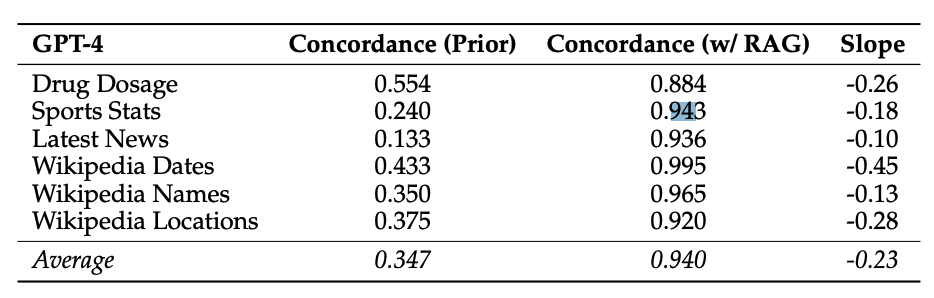

# RAG 模型的忠实度如何？

[Wu 等人（2024）的研究](https://arxiv.org/abs/2404.10198)旨在衡量 RAG 与 LLM 内部先验之间的角力。

研究重点分析了 GPT-4 和其他 LLMs 在问答任务上的表现。

研究发现，提供准确检索信息能显著减少模型错误，达到 94% 的准确率。

*来源：[Wu et al. (2024)](https://arxiv.org/abs/2404.10198)*

当文档中的错误信息增多且 LLM 的内部先验较弱时，LLM 更倾向于重复错误信息。但是，当 LLM 拥有较强的先验时，它们对此类错误的抵抗力更强。

论文还指出，修改后的信息与模型先验的差异越大，模型选择这种信息的可能性就越小。

由于许多开发者和公司已经在生产环境中使用 RAG 系统，这项工作强调了在使用大型语言模型时，评估上下文信息中的支持性、矛盾性和错误性内容的重要性。
