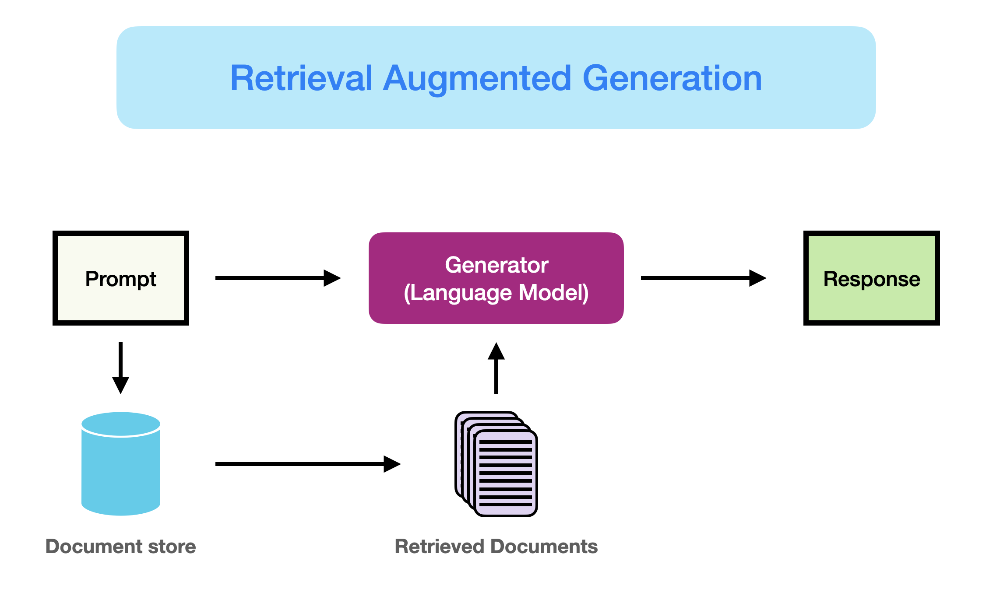

# Retrieval Augmented Generation (RAG) für LLMs

Es gibt zahlreiche Herausforderungen beim Arbeiten mit LLMs wie Wissenslücken in bestimmten Domänen, Faktizitätsfragen und Halluzinationen. Retrieval Augmented Generation (RAG) bietet eine Lösung, um einige dieser Probleme zu mildern, indem LLMs mit externem Wissen wie Datenbanken angereichert werden. RAG ist besonders nützlich in wissensintensiven Szenarien oder domänenspezifischen Anwendungen, die kontinuierlich aktualisiertes Wissen erfordern. Ein Schlüsselvorteil von RAG gegenüber anderen Ansätzen ist, dass das LLM nicht für anwendungsspezifische Aufgaben neu trainiert werden muss. RAG wurde kürzlich mit seiner Anwendung bei Konversationsagenten populär gemacht.

In dieser Zusammenfassung heben wir die wichtigsten Erkenntnisse und praktischen Einblicke aus der jüngsten Umfrage mit dem Titel [Retrieval-Augmented Generation for Large Language Models: A Survey](https://arxiv.org/abs/2312.10997) (Gao et al., 2023) hervor. Insbesondere konzentrieren wir uns auf die bestehenden Ansätze, den neuesten Stand bei RAG, Evaluierung, Anwendungen und Technologien rund um die verschiedenen Komponenten, die ein RAG-System ausmachen (Retrieval, Generierung und Augmentierungstechniken).

## Einführung in RAG

Wie [hier](https://www.promptingguide.ai/techniques/rag) besser eingeführt, kann RAG definiert werden als:

> RAG nimmt eine Eingabe und holt eine Menge relevanter/unterstützender Dokumente von einer Quelle (z.B. Wikipedia) ab. Die Dokumente werden als Kontext mit dem ursprünglichen Eingabe-Prompt zusammengefügt und an den Textgenerator übergeben, der den endgültigen Ausgangstext produziert. Dies macht RAG anpassungsfähig für Situationen, in denen sich Fakten im Laufe der Zeit entwickeln könnten. Dies ist sehr nützlich, da das parametrische Wissen der LLMs statisch ist. RAG ermöglicht es Sprachmodellen, ein Neutraining zu umgehen und über eine abrufbasierte Generation Zugang zu den neuesten Informationen zu erhalten, um verlässliche Ausgaben zu generieren.

Kurz gesagt, die bei RAG abgerufenen Belege können als eine Möglichkeit dienen, die Genauigkeit, Kontrollierbarkeit und Relevanz der Antwort des LLMs zu verbessern. Aus diesem Grund kann RAG dabei helfen, Probleme der Halluzination oder Leistung beim Ansprechen von Problemen in einer sich stark entwickelnden Umgebung zu reduzieren.

Während RAG auch die Optimierung von Vortrainingsmethoden involviert hat, haben aktuelle Ansätze sich größtenteils darauf verlagert, die Stärken von RAG und leistungsfähigen feinabgestimmten Modellen wie [ChatGPT](https://www.promptingguide.ai/models/chatgpt) und [Mixtral](https://www.promptingguide.ai/models/mixtral) zu kombinieren. Das folgende Diagramm zeigt die Entwicklung der RAG-bezogenen Forschung:

*[Bildquelle](https://arxiv.org/abs/2312.10997)*

Unten ist ein typischer RAG-Anwendungsworkflow dargestellt:

*[Bildquelle](https://arxiv.org/abs/2312.10997)*

Wir können die verschiedenen Schritte/Komponenten wie folgt erklären:
- **Input:** Die Frage, auf die das LLM-System antwortet, wird als Eingabe bezeichnet. Wenn kein RAG verwendet wird, wird das LLM direkt verwendet, um auf die Frage zu antworten.
- **Indizierung:** Wenn RAG verwendet wird, werden dann eine Reihe von verwandten Dokumenten indiziert, indem sie zunächst in Stücke geteilt, Embeddings der Stücke generiert und in einen Vektor-Speicher indiziert werden. Bei der Inferenz wird die Anfrage auf ähnliche Weise eingebettet.
- **Retrieval:** Die relevanten Dokumente werden durch Vergleich der Anfrage mit den indizierten Vektoren erhalten, auch bezeichnet als "Relevante Dokumente".
- **Generierung:** Die relevanten Dokumente werden mit dem ursprünglichen Prompt als zusätzlicher Kontext kombiniert. Der kombinierte Text und Prompt werden dann dem Modell zur Generierung der Antwort übergeben, die dann als das endgültige Ergebnis des Systems für den Benutzer vorbereitet wird.

Im gezeigten Beispiel scheitert die direkte Verwendung des Modells daran, auf die Frage zu antworten, da es kein Wissen über aktuelle Ereignisse hat. Andererseits kann das System beim Einsatz von RAG die relevanten Informationen abrufen, die das Modell benötigt, um die Frage angemessen zu beantworten.

## RAG Paradigmen

In den letzten Jahren haben sich RAG-Systeme von Naive RAG zu Advanced RAG und Modular RAG entwickelt. Diese Entwicklung fand statt, um bestimmte Einschränkungen bezüglich der Leistung, der Kosten und der Effizienz zu adressieren.

*[Bildquelle](https://arxiv.org/abs/2312.10997)*

### Naive RAG
Naive RAG folgt dem traditionellen zuvor erwähnten Prozess der Indizierung, des Retrievals und der Generierung. Kurz gesagt, eine Benutzereingabe wird verwendet, um relevante Dokumente abzufragen, die dann mit einem Prompt kombiniert und dem Modell übergeben werden, um eine endgültige Antwort zu generieren. Konversationshistorie kann in den Prompt integriert werden, wenn die Anwendung Interaktionen in mehreren Schritten umfasst.

Naive RAG hat Limitationen wie eine geringe Präzision (nicht zutreffende abgerufene Abschnitte) und eine geringe Trefferquote (Versagen, alle relevanten Abschnitte abzurufen). Es ist auch möglich, dass dem LLM veraltete Informationen übergeben werden, was eines der Hauptprobleme ist, die ein RAG-System zunächst lösen sollte. Dies führt zu Halluzinationsproblemen und schlechten sowie ungenauen Antworten.

Bei der Anwendung der Augmentierung könnte es auch zu Problemen mit Redundanz und Wiederholungen kommen. Bei der Verwendung mehrerer abgerufener Passagen sind auch Rangfolge und Abstimmung von Stil/Ton wichtig. Eine weitere Herausforderung besteht darin, sicherzustellen, dass die Generierungsaufgabe nicht zu stark von den augmentierten Informationen abhängt, was dazu führen kann, dass das Modell nur den abgerufenen Inhalt wiederholt.

### Advanced RAG

Advanced RAG hilft, Probleme, die bei Naive RAG auftreten, wie die Verbesserung der Abfragequalität zu lösen, die das Optimieren der Vorabfrage-, Abfrage- und Nachabfrageprozesse umfassen könnte.

Der Vorabfrageprozess beinhaltet die Optimierung der Datenindizierung, die darauf abzielt, die Qualität der zu indizierenden Daten zu verbessern, durch fünf Stufen: Verbesserung der Datengranularität, Optimierung der Indexstrukturen, Hinzufügen von Metadaten, Ausrichtungsoptimierung und gemischtes Retrieval.

Die Abfragestufe kann weiter verbessert werden, indem das Einbettungsmodell selbst optimiert wird, was direkt die Qualität der Kontextabschnitte beeinflusst. Dies kann durch Feinabstimmung der Einbettung zur Optimierung der Abfragerelvanz oder durch Verwendung dynamischer Einbettungen, die ein besseres kontextuelles Verständnis erfassen (z. B. das embeddings-ada-02-Modell von OpenAI), erreicht werden.

Die Optimierung der Nachabfrage konzentriert sich auf die Vermeidung von Kontextfensterlimits und den Umgang mit störenden oder potenziell ablenkenden Informationen. Ein gängiger Ansatz zur Bewältigung dieser Probleme ist das Neurangieren, das Ansätze wie das Verlegen relevanter Kontexte an die Ränder des Prompts oder das Neuberechnen der semantischen Ähnlichkeit zwischen der Anfrage und relevanten Textabschnitten beinhalten könnte. Die Komprimierung des Prompts kann auch dabei helfen, diese Probleme zu bewältigen.

### Modular RAG

Wie der Name andeutet, verbessert Modular RAG funktionale Module, wie das Einbeziehen eines Suchmoduls für Ähnlichkeitsabfragen und die Anwendung von Feinabstimmung im Retriever. Sowohl Naive RAG als auch Advanced RAG sind Spezialfälle von Modular RAG und bestehen aus festen Modulen. Erweiterte RAG-Module umfassen Suche, Speicher, Fusion, Routing, Vorhersage und Task-Adapter, die unterschiedliche Probleme lösen. Diese Module können neu angeordnet werden, um spezifischen Problemkontexten zu entsprechen. Daher profitiert Modular RAG von einer größeren Vielfalt und Flexibilität, da Sie Module hinzufügen oder ersetzen oder den Fluss zwischen den Modulen basierend auf den Aufgabenanforderungen anpassen können.

Angesichts der erhöhten Flexibilität beim Aufbau von RAG-Systemen wurden andere wichtige Optimierungstechniken vorgeschlagen, um RAG-Pipelines zu optimieren, einschließlich:

- **Hybride Suchexploration:** Dieser Ansatz nutzt eine Kombination von Suchtechniken wie Keyword-basierte Suche und semantische Suche, um relevante und kontextreiche Informationen abzurufen; dies ist nützlich beim Umgang mit verschiedenen Anfragetypen und Informationsbedürfnissen.
- **Rekursive Abfrage und Query-Engine:** Beinhaltet einen rekursiven Abfrageprozess, der mit kleinen semantischen Abschnitten beginnen könnte und anschließend größere Abschnitte abruft, die den Kontext bereichern; dies ist nützlich, um Effizienz und kontextreiche Informationen auszugleichen.
- **StepBack-prompt:** [Eine Prompting-Technik](https://arxiv.org/abs/2310.06117), die LLMs ermöglicht, Abstraktion zu vollziehen, die Konzepte und Prinzipien hervorbringt, die das Denken leiten; dies führt zu besser fundierten Antworten, wenn sie in einem RAG-Framework eingesetzt wird, da das LLM von spezifischen Instanzen abweicht und bei Bedarf breiter argumentieren kann.
- **Sub-Queries:** Es gibt verschiedene Abfragestrategien wie Baumabfragen oder sequenzielles Abfragen von Abschnitten, die für verschiedene Szenarien verwendet werden können. LlamaIndex bietet eine [Sub-Question-Query-Engine](https://docs.llamaindex.ai/en/latest/understanding/putting_it_all_together/agents.html#), die es ermöglicht, eine Anfrage in mehrere Fragen aufzuteilen, die verschiedene relevante Datenquellen nutzen.
- **Hypothetische Dokumentembeddings:** [HyDE](https://arxiv.org/abs/2212.10496) generiert eine hypothetische Antwort auf eine Anfrage, bettet sie ein und verwendet sie, um Dokumente abzurufen, die der hypothetischen Antwort ähneln, anstatt die Anfrage direkt zu verwenden.

## RAG-Framework
In diesem Abschnitt fassen wir die wichtigsten Entwicklungen der Komponenten eines RAG-Systems zusammen, darunter Abfrage, Generierung und Augmentierung.

### Abfrage
Abfrage ist die Komponente von RAG, die sich mit der Abfrage hochgradig relevanter Kontexte aus einem Retriever befasst. Ein Retriever kann auf viele Arten verbessert werden, einschließlich:

**Verbesserung semantischer Darstellungen**

Dieser Prozess beinhaltet die direkte Verbesserung der semantischen Repräsentationen, die den Retriever antreiben. Hier einige Überlegungen:

- **Chunking:** Ein wichtiger Schritt ist die Wahl der richtigen Chunking-Strategie, die von dem von Ihnen behandelten Inhalt und der Anwendung, für die Sie Antworten generieren, abhängt. Verschiedene Modelle zeigen auch unterschiedliche Stärken bei verschiedenen Blockgrößen. Sentence Transformers funktionieren besser bei einzelnen Sätzen, aber text-embedding-ada-002 funktioniert besser mit Blöcken, die 256 oder 512 Tokens enthalten. Andere Aspekte, die zu berücksichtigen sind, umfassen die Länge der Benutzerfragen, Anwendung und Token-Limits, aber es ist üblich, mit verschiedenen Chunking-Strategien zu experimentieren, um die Abfrage in Ihrem RAG-System zu optimieren.
- **Feinabgestimmte Einbettungsmodelle:** Sobald Sie eine wirksame Chunking-Strategie festgelegt haben, ist es möglicherweise erforderlich, das Einbettungsmodell zu feinabstimmen, wenn Sie mit einem spezialisierten Bereich arbeiten. Andernfalls ist es möglich, dass die Benutzeranfragen in Ihrer Anwendung völlig missverstanden werden. Sie können auf breites Domänenwissen (d. h. Domänenwissens-Feinabstimmung) und für spezifische Downstream-Aufgaben feinabstimmen. [BGE-large-EN developed BAAI](https://github.com/FlagOpen/FlagEmbedding) ist ein erwähnenswertes Embeddingmodell, das für die Optimierung der Retrieval-Relevanz feinabgestimmt werden kann. 

**Ausrichtung von Anfragen und Dokumenten**

Dieser Prozess befasst sich mit der Ausrichtung der Anfragen der Benutzer auf die der Dokumente im semantischen Raum. Dies kann erforderlich sein, wenn die Anfrage eines Benutzers möglicherweise semantische Informationen fehlen oder ungenaue Formulierungen enthalten. Hier einige Ansätze:

- **Anfrage-Umschreiben:** Konzentriert sich auf das Umschreiben von Anfragen unter Verwendung einer Vielzahl von Techniken wie [Query2Doc](https://arxiv.org/abs/2303.07678), [ITER-RETGEN](https://arxiv.org/abs/2305.15294) und HyDE.
- **Einbettungstransformation:** Optimiert die Darstellung von Anfrageeinbettungen und richtet sie an einen latenten Raum aus, der stärker mit einer Aufgabe übereinstimmt.

**Ausrichtung von Retriever und LLM**

Dieser Prozess befasst sich mit der Ausrichtung der Ausgaben des Retrievers auf die Präferenzen der LLMs.

- **Feinabstimmung von Retrievern:** Verwendet Feedbacksignale eines LLMs, um die Abfragemodelle zu verfeinern. Beispiele hierfür sind der an die Augmentierung angepasste Retriever ([AAR](https://arxiv.org/abs/2305.17331)), [REPLUG](https://arxiv.org/abs/2301.12652) und [UPRISE](https://arxiv.org/abs/2303.08518), um nur einige zu nennen.
- **Adapter:** Beinhaltet externe Adapter, um beim Ausrichtungsprozess zu helfen. Beispiele hierfür sind [PRCA](https://aclanthology.org/2023.emnlp-main.326/), [RECOMP](https://arxiv.org/abs/2310.04408) und [PKG](https://arxiv.org/abs/2305.04757).

### Generierung

Der Generator in einem RAG-System ist für die Umwandlung abgerufener Informationen in einen kohärenten Text verantwortlich, der die endgültige Ausgabe des Modells bildet. Dieser Prozess beinhaltet diverse Eingabedaten, die manchmal Anstrengungen erfordern, um die Anpassung des Sprachmodells an die aus Anfragen und Dokumenten abgeleiteten Eingabedaten zu verfeinern. Dies kann mit einer Nachabfrageverarbeitung und Feinabstimmung angegangen werden:

- **Nachabfrage mit unverändertem LLM:** Die Nachabfrageverarbeitung belässt das LLM unverändert und konzentriert sich stattdessen darauf, die Qualität der Abfrageergebnisse durch Operationen wie Informationskompression und Neurangierung zu verbessern. Informationskompression hilft bei der Reduzierung von Rauschen, der Berücksichtigung von Kontextlängenbeschränkungen eines LLMs und der Verbesserung der Generierungseffekte. Neurangierung zielt darauf ab, Dokumente neu zu ordnen, um die relevantesten Elemente oben zu priorisieren.
- **Feinabstimmung des LLM für RAG:** Um das RAG-System zu verbessern, kann der Generator weiter optimiert oder feinabgestimmt werden, um sicherzustellen, dass der generierte Text natürlich ist und effektiv die abgerufenen Dokumente nutzt.

### Augmentierung
Augmentierung beinhaltet den Prozess der effektiven Integration von Kontext aus abgerufenen Passagen mit der aktuellen Generierungsaufgabe. Bevor wir näher auf den Augmentierungsprozess, die Augmentierungsstufen und die Augmentierungsdaten eingehen, hier ist eine Taxonomie von RAGs Kernkomponenten:

*[Bildquelle](https://arxiv.org/abs/2312.10997)*

Retrieval Augmentation kann in vielen verschiedenen Phasen wie Vor-Training, Fine-Tuning und Inferenz angewandt werden.

- **Augmentierungsphasen:** [RETRO](https://arxiv.org/abs/2112.04426) ist ein Beispiel für ein System, das Retrieval Augmentation für großangelegtes Vor-Training von Grund auf nutzt; es verwendet einen zusätzlichen Encoder, der auf externem Wissen aufbaut. Fine-Tuning kann auch kombiniert mit RAG verwendet werden, um die Effektivität von RAG-Systemen zu entwickeln und zu verbessern. Im Inferenzstadium werden viele Techniken angewandt, um abgerufene Inhalte effektiv zu integrieren, um spezifischen Aufgabenanforderungen zu entsprechen und den RAG-Prozess weiter zu verfeinern.

- **Augmentierungsquelle:** Die Wirksamkeit eines RAG-Modells wird stark von der Wahl der Augmentierungsdatenquelle beeinflusst. Daten können in unstrukturierte, strukturierte und von LLMs generierte Daten kategorisiert werden.

- **Augmentierungsprozess:** Für viele Probleme (z.B. mehrstufiges Reasoning) reicht eine einzelne Abfrage nicht aus, daher wurden einige Methoden vorgeschlagen:
    - **Iterative Abfrage** ermöglicht dem Modell, mehrere Abfragezyklen durchzuführen, um die Tiefe und Relevanz der Informationen zu erhöhen. Bemerkenswerte Ansätze, die diese Methode nutzen, umfassen [RETRO](https://arxiv.org/abs/2112.04426) und [GAR-meets-RAG](https://arxiv.org/abs/2310.20158).
    - **Rekursive Abfrage** iteriert rekursiv auf der Ausgabe eines Abfrageschritts als Eingabe für einen weiteren Abfrageschritt; dies ermöglicht ein tieferes Eintauchen in relevante Informationen für komplexe und mehrstufige Abfragen (z.B. akademische Forschung und Analyse von Rechtsfällen). Bemerkenswerte Ansätze, die diese Methode nutzen, umfassen [IRCoT](https://arxiv.org/abs/2212.10509) und [Tree of Clarifications](https://arxiv.org/abs/2310.14696).
    - **Adaptive Abfrage** passt den Abfrageprozess an spezifische Anforderungen an, indem optimale Momente und Inhalte für die Abfrage bestimmt werden. Bemerkenswerte Ansätze, die diese Methode nutzen, umfassen [FLARE](https://arxiv.org/abs/2305.06983) und [Self-RAG](https://arxiv.org/abs/2310.11511).

Die folgende Abbildung zeigt eine detaillierte Darstellung der RAG-Forschung mit verschiedenen Augmentierungsaspekten, einschließlich der Augmentierungsphasen, -quelle und -prozess.

*[Bildquelle](https://arxiv.org/abs/2312.10997)*

### RAG vs. Fine-Tuning
Es gibt viele offene Diskussionen über den Unterschied zwischen RAG und Fine-Tuning und in welchen Szenarien jedes angemessen ist. Forschungen in diesen beiden Bereichen deuten darauf hin, dass RAG nützlich ist, um neues Wissen zu integrieren, während Fine-Tuning verwendet werden kann, um die Leistung und Effizienz des Modells durch Verbesserung des internen Wissens, des Ausgabeformats und des Lehrens komplexer Befehlsfolgen zu verbessern. Diese Ansätze schließen sich nicht gegenseitig aus und können sich in einem iterativen Prozess, der darauf abzielt, die Nutzung von LLMs für komplexe wissensintensive und skalierbare Anwendungen zu verbessern, ergänzen, die Zugang zu schnell entwickelndem Wissen erfordern und angepasste Antworten liefern, die ein bestimmtes Format, einen Ton und Stil befolgen. Zudem kann auch das Engineering von Prompts helfen, Ergebnisse durch Nutzung der inhärenten Fähigkeiten des Modells zu optimieren. Unten ist eine Abbildung, die die verschiedenen Charakteristiken von RAG im Vergleich zu anderen Modell-Optimierungsmethoden zeigt:

*[Bildquelle](https://arxiv.org/abs/2312.10997)*

Hier ist eine Tabelle aus dem Survey-Paper, das die Merkmale zwischen RAG- und feinabgestimmten Modellen vergleicht:

*[Bildquelle](https://arxiv.org/abs/2312.10997)*

## RAG Bewertung

Ähnlich wie bei der Messung der Leistung von LLMs in verschiedenen Aspekten spielt die Bewertung eine Schlüsselrolle beim Verständnis und bei der Optimierung der Leistung von RAG-Modellen in verschiedenen Anwendungsszenarien. Traditionell wurden RAG-Systeme basierend auf der Leistung der nachgelagerten Aufgaben mithilfe aufgabenspezifischer Metriken wie F1 und EM bewertet. [RaLLe](https://arxiv.org/abs/2308.10633v2) ist ein bemerkenswertes Beispiel für ein Framework zur Bewertung von retrieval-augmentierten großen Sprachmodellen für wissensintensive Aufgaben.

Ziele der RAG-Bewertung werden sowohl für das Abrufen als auch für die Generierung festgelegt, wobei das Ziel darin besteht, sowohl die Qualität des abgerufenen Kontexts als auch die Qualität des generierten Inhalts zu bewerten. Zur Bewertung der Abfragequalität werden Metriken verwendet, die in anderen wissensintensiven Bereichen wie Empfehlungssystemen und Informationsabruf verwendet werden, wie z.B. NDCG und Hit Rate. Zur Bewertung der Generierungsqualität können Sie verschiedene Aspekte wie Relevanz und Schädlichkeit bei nicht gekennzeichnetem Inhalt oder Genauigkeit für gekennzeichneten Inhalt bewerten. Insgesamt kann die RAG-Bewertung entweder manuelle oder automatische Bewertungsmethoden beinhalten.

Die Bewertung eines RAG-Frameworks konzentriert sich auf drei primäre Qualitätsscores und vier Fähigkeiten. Qualitätsscores umfassen das Messen der Kontextrelevanz (d.h. die Präzision und Spezifität des abgerufenen Kontexts), Antworttreue (d.h. die Treue der Antworten zum abgerufenen Kontext) und Antwortrelevanz (d.h. die Relevanz der Antworten auf gestellte Fragen). Zusätzlich gibt es vier Fähigkeiten, die helfen, die Anpassungsfähigkeit und Effizienz eines RAG-Systems zu messen: Geräuschrobustheit, Ablehnung negativer Informationen, Informationsintegration und kontrafaktische Robustheit. Unten ist eine Zusammenfassung der Metriken, die für die Bewertung verschiedener Aspekte eines RAG-Systems verwendet werden:

*[Bildquelle](https://arxiv.org/abs/2312.10997)*

Mehrere Benchmarks wie [RGB](https://arxiv.org/abs/2309.01431) und [RECALL](https://arxiv.org/abs/2311.08147) werden verwendet, um RAG-Modelle zu bewerten. Viele Tools wie [RAGAS](https://arxiv.org/abs/2309.15217), [ARES](https://arxiv.org/abs/2311.09476) und [TruLens](https://www.trulens.org/trulens_eval/core_concepts_rag_triad/) wurden entwickelt, um den Prozess der Bewertung von RAG-Systemen zu automatisieren. Einige der Systeme verlassen sich auf LLMs, um einige der oben definierten Qualitätsscores zu bestimmen.

## Herausforderungen & Zukunft von RAG

In dieser Übersicht haben wir mehrere Forschungsaspekte der RAG-Forschung und verschiedene Ansätze zur Verbesserung von Retrieval, Augmentation und Generation eines RAG-Systems diskutiert. Hier sind mehrere Herausforderungen, die von [Gao et al., 2023](https://arxiv.org/abs/2312.10997) hervorgehoben wurden, während wir die Entwicklung und Verbesserung von RAG-Systemen weiter vorantreiben:

- **Kontextlänge:** LLMs erweitern weiterhin die Größe des Kontextfensters, was Herausforderungen darstellt, wie RAG angepasst werden muss, um sicherzustellen, dass hochrelevanten und wichtigen Kontext erfasst wird.
- **Robustheit:** Der Umgang mit kontrafaktischen und adversarialen Informationen ist wichtig, um zu messen und in RAG zu verbessern.
- **Hybridansätze:** Es gibt eine laufende Forschungsbemühung, besser zu verstehen, wie man den Einsatz von sowohl RAG als auch feinabgestimmten Modellen am besten optimieren kann.
- **Erweiterung der LLM-Rollen:** Das Vergrößern der Rolle und der Fähigkeiten von LLMs, um RAG-Systeme weiter zu verbessern, ist von hohem Interesse.
- **Skalierungsgesetze:** Die Untersuchung von LLM-Skalierungsgesetzen und wie diese auf RAG-Systeme angewendet werden, ist immer noch nicht richtig verstanden.
- **Einsatzbereites RAG:** Einsatzfähige RAG-Systeme erfordern technische Exzellenz in Bezug auf Leistung, Effizienz, Datensicherheit, Datenschutz und mehr.
- **Multimodales RAG:** Obwohl es viele Forschungsbemühungen rund um RAG-Systeme gegeben hat, waren diese meist auf textbasierte Aufgaben zentriert. Es gibt ein zunehmendes Interesse daran, Modalitäten für ein RAG-System zu erweitern, um Probleme in mehr Bereichen wie Bildern, Audio und Video, Code und mehr anzugehen.
- **Evaluierung:** Das Interesse, komplexe Anwendungen mit RAG zu bauen, erfordert besondere Aufmerksamkeit, um nuancierte Metriken und Bewertungsinstrumente zu entwickeln, die verschiedene Aspekte wie kontextuelle Relevanz, Kreativität, Inhaltsdiversität, Faktualität und mehr zuverlässiger bewerten können. Zusätzlich besteht auch ein Bedarf an besserer Interpretierbarkeitsforschung und -werkzeuge für RAG.

## RAG-Werkzeuge

Einige beliebte umfassende Werkzeuge zum Aufbau von RAG-Systemen sind [LangChain](https://www.langchain.com/), [LlamaIndex](https://www.llamaindex.ai/) und [DSPy](https://github.com/stanfordnlp/dspy). Es gibt auch eine Reihe von spezialisierten Werkzeugen, die unterschiedlichen Zwecken dienen, wie z.B. [Flowise AI](https://flowiseai.com/), das eine Low-Code-Lösung für den Aufbau von RAG-Anwendungen bietet. Weitere nennenswerte Technologien sind [HayStack](https://haystack.deepset.ai/), [Meltano](https://meltano.com/), [Cohere Coral](https://cohere.com/coral) und andere. Software- und Clouddienstanbieter beinhalten auch RAG-zentrische Dienstleistungen. Beispielsweise ist Verba von Weaviate nützlich für den Aufbau von persönlichen Assistentenanwendungen und Amazons Kendra bietet intelligente Unternehmenssuchdienste.

## Schlussfolgerung

Abschließend haben sich RAG-Systeme schnell entwickelt, einschließlich der Entwicklung von fortschrittlicheren Paradigmen, die Anpassungen ermöglichen und die Leistung und den Nutzen von RAG in einer breiten Palette von Bereichen weiter erhöhen. Es gibt eine enorme Nachfrage nach RAG-Anwendungen, was die Entwicklung von Methoden zur Verbesserung der verschiedenen Komponenten eines RAG-Systems beschleunigt hat. Von Hybridmethodologien bis zu Selbst-Retrieval sind dies einige der derzeit erforschten Forschungsgebiete moderner RAG-Modelle. Es besteht auch eine zunehmende Nachfrage nach besseren Evaluierungswerkzeugen und -metriken. Die obige Abbildung bietet eine Zusammenfassung des RAG-Ökosystems, Techniken zur Verbesserung von RAG, Herausforderungen und anderen verwandten Aspekten, die in dieser Übersicht behandelt wurden:

---

## RAG Forschungsergebnisse

Unten finden Sie eine Sammlung von Forschungsarbeiten, die wichtige Erkenntnisse und die neuesten Entwicklungen im Bereich RAG hervorheben.

| **Erkenntnis**  | **Referenz** | **Datum** |
| ------------- | ------------- | ------------- |
| Schlägt Corrective Retrieval Augmented Generation (CRAG) vor, um die Robustheit der Generation in einem RAG-System zu verbessern. Die Kernidee besteht darin, eine Selbstkorrekturkomponente für den Retriever zu implementieren und die Nutzung abgerufener Dokumente zur Unterstützung der Generation zu verbessern. Der Retrieval-Evaluator hilft, die Gesamtqualität der abgerufenen Dokumente anhand einer Anfrage zu bewerten. Durch die Nutzung von Websuche und optimierten Wissensnutzungsoperationen kann die automatische Selbstkorrektur und effiziente Nutzung abgerufener Dokumente verbessert werden. | [Corrective Retrieval Augmented Generation](https://arxiv.org/abs/2401.15884)| Jan 2024|
| Betten rekursiv Textblöcke ein, clustert und fasst sie zusammen, um einen Baum mit unterschiedlichen Zusammenfassungsebenen von unten nach oben zu konstruieren. Zur Inferenzzeit ruft das vorgeschlagene RAPTOR-Modell aus dem Baum ab, integriert Informationen aus langen Dokumenten auf verschiedenen Abstraktionsebenen. | [RAPTOR: Recursive Abstractive Processing for Tree-Organized Retrieval](https://arxiv.org/abs/2401.18059)| Jan 2024 |
| Ein allgemeines Programm mit mehrstufigen Interaktionen zwischen LMs und Retrievern, um Multi-Label-Klassifikationsprobleme effizient anzugehen. | [In-Context Learning for Extreme Multi-Label Classification](https://arxiv.org/abs/2401.12178) | Jan 2024 |
| Extrahiert semantisch ähnliche Prompts aus ressourcenreichen Sprachen, um die Zero-Shot-Leistung von multilingualen vortrainierten Sprachmodellen über diverse Aufgaben hinweg zu verbessern. | [From Classification to Generation: Insights into Crosslingual Retrieval Augmented ICL](https://arxiv.org/abs/2311.06595) | Nov 2023|
| Verbessert die Robustheit von RAGs beim Umgang mit lärmenden, irrelevanten Dokumenten und in unbekannten Szenarien. Es erzeugt sequenzielle Lesehinweise für abgerufene Dokumente, ermöglicht eine gründliche Bewertung ihrer Relevanz für die gestellte Frage und integriert die Informationen, um die endgültige Antwort vorzubereiten. | [Chain-of-Note: Enhancing Robustness in Retrieval-Augmented Language Models](https://arxiv.org/abs/2311.09210)| Nov 2023 |
| Eliminiert Tokens, die möglicherweise keine wesentlichen Informationen für den Generierungsprozess eines Lesers beitragen. Reduziert die Laufzeit um bis zu 62,2%, mit nur 2% Leistungsverlust. | [Optimizing Retrieval-augmented Reader Models via Token Elimination](https://arxiv.org/abs/2310.13682) |  Okt  2023 |
| Stimmt ein kleines LM-Verifier ab, um die Ausgabe und das Wissen der wissensaugmentierten LMs mit einem separaten Verifier zu verifizieren. Es hilft, Szenarien anzugehen, in denen das Modell möglicherweise nicht das relevante Wissen für die gegebene Anfrage abruft oder das abgerufene Wissen im generierten Text nicht treu widerspiegelt. | [Knowledge-Augmented Language Model Verification](https://arxiv.org/abs/2310.12836) |  Okt  2023 |
| Benchmark zur Analyse der Leistung verschiedener LLMs in 4 grundlegenden Fähigkeiten, die für RAG erforderlich sind, einschließlich Lärmrobustheit, Ablehnung von Negativen, Informationsintegration und kontrafaktischer Robustheit. | [Benchmarking Large Language Models in Retrieval-Augmented Generation](https://arxiv.org/abs/2309.01431) |  Okt  2023 |
| Stellt das Self-Reflective Retrieval-Augmented Generation (Self-RAG) Framework vor, das die Qualität und Faktizität eines LM durch Retrieval und Selbstreflexion verbessert. Es nutzt ein LM, um adaptiv Passagen abzurufen, und generiert und reflektiert über abgerufene Passagen und seine eigenen Generationen unter Verwendung von Reflexionstokens. | [Self-RAG: Learning to Retrieve, Generate, and Critique through Self-Reflection](https://arxiv.org/abs/2310.11511) | Okt 2023 |
| Verbessert die Zero-Shot-Informationswiederherstellung, indem es die Wiederherstellung durch generationsergänzte Wiederherstellung (GAR) iterativ verbessert und die Umschreibung durch RAG verbessert. Die Umschreib-Wiederherstellungsstufen verbessern die Recall und eine Neurangierungsstufe verbessert die Präzision. | [GAR-meets-RAG Paradigm for Zero-Shot Information Retrieval](https://arxiv.org/abs/2310.20158) | Okt 2023 |
| Prätrainiert ein 48B Retrieval-Modell unter Verwendung eines Basis-43B-GPT-Modells und ruft aus 1,2 Billionen Tokens ab. Das Modell wird weiterhin anweisungsoptimiert, um eine signifikante Verbesserung gegenüber dem anweisungsoptimierten GPT bei einer Vielzahl von Zero-Shot-Aufgaben zu demonstrieren. | [InstructRetro: Instruction Tuning post Retrieval-Augmented Pretraining](https://arxiv.org/abs/2310.07713) | Okt 2023|
| Rüstet ein LLM mit Retrieval-Fähigkeiten durch zwei unterschiedliche Feinabstimmungsschritte nach: Einer aktualisiert ein vortrainiertes LM, um abgerufene Informationen besser zu nutzen, und der andere aktualisiert den Retriever, um relevantere Ergebnisse zurückzugeben, wie vom LM bevorzugt. Durch Feinabstimmung über Aufgaben, die sowohl Wissensnutzung als auch kontextuelle Bewusstheit erfordern, erzielt jede Stufe Leistungsverbesserungen. | [RA-DIT: Retrieval-Augmented Dual Instruction Tuning](https://arxiv.org/abs/2310.01352) | Okt 2023 |
| Eine Methode, um RAGs robust gegenüber irrelevantem Inhalt zu machen. Es generiert automatisch Daten, um ein Sprachmodell fein abzustimmen, damit es abgerufene Passagen korrekt nutzt, indem es eine Mischung aus relevanten und irrelevanten Kontexten zur Trainingszeit verwendet. | [Making Retrieval-Augmented Language Models Robust to Irrelevant Context](https://arxiv.org/abs/2310.01558) |Okt 2023|
| Stellt fest, dass LLMs mit einem 4K-Kontextfenster unter Verwendung einfacher retrieval-augmentierter Generation eine vergleichbare Leistung zu feinabgestimmten LLMs mit einem 16K-Kontextfenster über positionelle Interpolation bei Aufgaben mit langem Kontext erzielen. | [Retrieval meets Long Context Large Language Models](https://arxiv.org/abs/2310.03025)| Okt 2023|
| Komprimiert abgerufene Dokumente vor der in-Kontext-Integration in textuelle Zusammenfassungen, was die Rechenkosten reduziert und die Last für LMs verringert, relevante Informationen in langen abgerufenen Dokumenten zu identifizieren. | [RECOMP: Improving Retrieval-Augmented LMs with Compression and Selective Augmentation](https://arxiv.org/abs/2310.04408)| Okt 2023|
| Ein iterativer Wiederherstellungs-Generierungs-Kollaborationsrahmen, der sowohl parametrisches als auch nicht-parametrisches Wissen nutzt und hilft, den richtigen Begründungspfad durch Wiederherstellungs-Generierungs-Interaktionen zu finden. Nützlich für Aufgaben, die mehrstufiges Schließen erfordern, und verbessert insgesamt die Schließfähigkeit von LLMs. | [Retrieval-Generation Synergy Augmented Large Language Models](https://arxiv.org/abs/2310.05149)| Okt 2023|
| Schlägt den Tree of Clarifications (ToC) vor, ein Framework, das rekursiv einen Baum von Klärungen für mehrdeutige Fragen über Few-Shot-Prompts unter Nutzung externen Wissens konstruiert. Dann nutzt es den Baum, um eine langformige Antwort zu generieren. | [Tree of Clarifications: Answering Ambiguous Questions with Retrieval-Augmented Large Language Models](https://arxiv.org/abs/2310.14696) | Okt 2023 |
| Ein Ansatz, der es einem LLM ermöglicht, sich auf früher begegnete Fragen zu beziehen und adaptiv externe Ressourcen anzufordern, wenn es auf neue Fragen trifft. | [Self-Knowledge Guided Retrieval Augmentation for Large Language Models](https://arxiv.org/abs/2310.05002)| Okt 2023|
| Eine Suite von Metriken, die verwendet werden kann, um verschiedene Dimensionen (d. h. die Fähigkeit des Wiederherstellungssystems, relevante und fokussierte Kontextpassagen zu identifizieren, die Fähigkeit des LLM, solche Passagen auf eine treue Weise zu nutzen, oder die Qualität der Generierung selbst) zu bewerten, ohne sich auf Bodenwahrheits-Menschenannotationen verlassen zu müssen.| [RAGAS: Automated Evaluation of Retrieval Augmented Generation](https://arxiv.org/abs/2309.15217) | Sep 2023 |
| Schlägt eine Generate-then-Read (GenRead)-Methode vor, die zunächst ein großes Sprachmodell auffordert, kontextuelle Dokumente basierend auf einer gegebenen Frage zu generieren, und dann die generierten Dokumente liest, um die endgültige Antwort zu produzieren. | [Generate rather than Retrieve: Large Language Models are Strong Context Generators](https://arxiv.org/abs/2209.10063)| Sep 2023 |
| Demonstriert, wie Rangierer wie DiversityRanker und LostInTheMiddleRanker in einem RAG-System genutzt werden können, um Informationen auszuwählen und zu nutzen, die die Nutzung des LLM-Kontextfensters optimieren. | [Enhancing RAG Pipelines in Haystack: Introducing DiversityRanker and LostInTheMiddleRanker](https://towardsdatascience.com/enhancing-rag-pipelines-in-haystack-45f14e2bc9f5) | Aug  2023 |
| Überbrückt LLMs mit verschiedenen Wissensdatenbanken (KBs), erleichtert sowohl den Abruf als auch die Speicherung von Wissen. Der Abrufprozess verwendet Programm-of-Thought-Prompting, das Suchsprache für KBs im Codeformat mit vordefinierten Funktionen für KB-Operationen generiert. Es bietet auch die Möglichkeit, Wissen in einer personalisierten KB zu speichern, um individuellen Benutzeranforderungen gerecht zu werden. | [KnowledGPT: Enhancing Large Language Models with Retrieval and Storage Access on Knowledge Bases](https://arxiv.org/abs/2308.11761) | Aug 2023|
| Schlägt ein Modell vor, das retrieval-augmented maskiertes Sprachmodellieren und Präfix-Sprachmodellieren kombiniert. Dann führt es Fusion-in-Context-Lernen ein, um die Few-shot-Leistung zu verbessern, indem es dem Modell ermöglicht, mehr in-Kontext-Beispiele zu nutzen, ohne zusätzliches Training zu benötigen. | [RAVEN: In-Context Learning with Retrieval Augmented Encoder-Decoder Language Models](https://arxiv.org/abs/2308.07922)| Aug 2023|
| RaLLe ist ein Open-Source-Framework zur Entwicklung, Bewertung und Optimierung von RAG-Systemen für wissensintensive Aufgaben. | [RaLLe: A Framework for Developing and Evaluating Retrieval-Augmented Large Language Models](https://arxiv.org/abs/2308.10633) | Aug 2023|
| Stellt fest, dass die Leistung eines LLM signifikant abnehmen kann, wenn die Position relevanter Informationen geändert wird, was darauf hinweist, dass LLMs Informationen in langen Eingabekontexten nicht robust nutzen. | [Lost in the Middle: How Language Models Use Long Contexts](https://arxiv.org/abs/2307.03172) | Jul 2023 |
| Synergiert Retrieval und Generierung auf iterative Weise. Das Modellausgabe wird verwendet, um zu zeigen, was benötigt wird, um eine Aufgabe zu beenden, und bietet informativen Kontext für das Abrufen relevanterer Kenntnisse, die wiederum helfen, eine bessere Ausgabe in der nächsten Iteration zu generieren. | [Enhancing Retrieval-Augmented Large Language Models with Iterative Retrieval-Generation Synergy](https://arxiv.org/abs/2305.15294) | Mai 2023|
| Bietet eine verallgemeinerte Sicht auf aktives RAG, Methoden, die aktiv entscheiden, wann und was im Verlauf der Generierung abgerufen werden soll. Dann schlägt es Forward-Looking Active REtrieval augmented generation (FLARE) vor, eine Methode, die iterativ eine Vorhersage des kommenden Satzes verwendet, um zukünftige Inhalte zu antizipieren, die dann als Abfrage verwendet werden, um relevante Dokumente abzurufen, um den Satz neu zu generieren, wenn er Tokens mit geringem Vertrauen enthält. | [Active Retrieval Augmented Generation](https://arxiv.org/abs/2305.06983)| Mai 2023|
| Führt ein generisches Retrieval-Plug-In ein, das einen generischen Retriever nutzt, um Ziel-LMs zu verbessern, die möglicherweise im Voraus unbekannt sind oder nicht gemeinsam feinabgestimmt werden können. | [Augmentation-Adapted Retriever Improves Generalization of Language Models as Generic Plug-In](https://arxiv.org/abs/2305.17331)| Mai 2023|
| Verbessert dichtes Retrieval auf strukturierten Daten durch zwei Pre-Training-Strategien. Zuerst nutzt es die natürliche Ausrichtung zwischen strukturierten und unstrukturierten Daten für strukturbewusstes Pretraining. Dann implementiert es Masked Entity Prediction für maskierte Entitätsvorhersage und das Erfassen struktureller Semantik. | [Structure-Aware Language Model Pretraining Improves Dense Retrieval on Structured Data](https://arxiv.org/abs/2305.19912) | Mai 2023 |
| Integriert dynamisch Verankerungsinformationen aus heterogenen Quellen in mehreren Domänen, um die faktische Korrektheit von LLMs zu verbessern. Führt einen adaptiven Abfragegenerator ein, um mit Abfragen umzugehen, die auf verschiedene Wissensquellen zugeschnitten sind. Der Rahmen korrigiert Begründungen fortschreitend, um sicherzustellen, dass Ungenauigkeiten aus vorhergehenden Begründungen sich nicht in die folgenden Schritte fortpflanzen. | [Chain-of-Knowledge: Grounding Large Language Models via Dynamic Knowledge Adapting over Heterogeneous Sources](https://arxiv.org/abs/2305.13269) | Mai 2023 |
| Ein Rahmenwerk zur Generierung kontextrelevanter und wissensfundierter Dialoge mit einem Wissensgraphen (KG). Zuerst ruft es den relevanten Teilgraphen aus dem KG ab und erzwingt dann Konsistenz über Fakten, indem es deren Wortembeddings bedingt durch den abgerufenen Teilgraphen stört. Dann nutzt es kontrastives Lernen, um sicherzustellen, dass die generierten Texte eine hohe Ähnlichkeit mit den abgerufenen Teilgraphen aufweisen. | [Knowledge Graph-Augmented Language Models for Knowledge-Grounded Dialogue Generation](https://arxiv.org/abs/2305.18846)| Mai 2023|
| Adoptiert ein kleines Sprachmodell als trainierbaren Umschreiber, um einem Black-Box-LLM-Leser zu dienen. Der Umschreiber wird unter Verwendung des Feedbacks des LLM-Lesers durch RL trainiert. Ergebnis ist ein neues Framework namens Rewrite-Retrieve-Read, bei dem der Fokus auf der Optimierung von Abfragen liegt. | [Query Rewriting for Retrieval-Augmented Large Language Models](https://arxiv.org/abs/2305.14283)| Mai 2023 |
| Setzt iterativ einen retrieval-augmentierten Generator ein, um einen ungebundenen Speicherpool zu erstellen, und verwendet einen Speicherauswähler, um eine Ausgabe als Speicher für die nächste Generierungsrunde auszuwählen. Dadurch kann ein Modell seine eigene Ausgabe nutzen, die als Selbstspeicher bezeichnet wird, für eine verbesserte Generierung. | [Lift Yourself Up: Retrieval-augmented Text Generation with Self Memory](https://arxiv.org/abs/2305.02437) | Mai 2023 |
| Rüstet LLMs mit einem Wissensleitmodul aus, um relevantes Wissen abzurufen, ohne seine Parameter zu ändern. Es verbessert die Leistung von "Black-Box"-LLMs bei einer Reihe von wissensintensiven Aufgaben, die faktisches (+7,9%), tabellarisches (+11,9%), medizinisches (+3,0%) und multimodales (+8,1%) Wissen erfordern. | [Augmented Large Language Models with Parametric Knowledge Guiding](https://arxiv.org/abs/2305.04757) | Mai 2023|
| Rüstet LLMs mit einer allgemeinen Schreib-Lese-Speichereinheit aus, die es ihnen ermöglicht, Wissen aus dem Text bei Bedarf für die Aufgabenleistung zu extrahieren, zu speichern und abzurufen. | [RET-LLM: Towards a General Read-Write Memory for Large Language Models](https://arxiv.org/abs/2305.14322) | Mai 2023|
| Adoptiert einen aufgabenagnostischen Retriever, um einen gemeinsamen statischen Index zu erstellen und Kandidatenbeweise effizient auszuwählen. Dann entwirft es einen promptgeleiteten Neurangierer, um die nächstgelegenen Beweise gemäß der aufgabenspezifischen Relevanz für den Leser neu zu ordnen. | [Prompt-Guided Retrieval Augmentation for Non-Knowledge-Intensive Tasks](https://arxiv.org/abs/2305.17653)| Mai 2023|
| Schlägt UPRISE (Universal Prompt Retrieval for Improving Zero-Shot Evaluation) vor, das einen leichten und vielseitigen Retriever abstimmt, der automatisch Prompts für eine gegebene Zero-Shot-Task-Eingabe abruft. | [UPRISE: Universal Prompt Retrieval for Improving Zero-Shot Evaluation](https://arxiv.org/abs/2303.08518) | März 2023 |
| Ein adaptives Filter-dann-Neurangieren-Paradigma, das die Stärken von SLMs (dienen als Filter) und LLMs (dienen als Neurangierer) kombiniert. | [Large Language Model Is Not a Good Few-shot Information Extractor, but a Good Reranker for Hard Samples!](https://arxiv.org/abs/2303.08559) | März 2023 |
| Instruiert ein anweisungsbefolgendes LLM im Zero-Shot, ein hypothetisches Dokument zu generieren, das Relevanzmuster erfasst. Dann kodiert ein Contriever das Dokument in einen Einbettungsvektor, der verwendet wird, um eine Nachbarschaft im Korpus-Einbettungsraum zu identifizieren, wo ähnliche echte Dokumente basierend auf Vektorähnlichkeit abgerufen werden. | [Precise Zero-Shot Dense Retrieval without Relevance Labels](https://arxiv.org/abs/2212.10496)| Dez 2022|
| Schlägt Demonstrate-Search-Predict (DSP) vor, einen Rahmen, um hochrangige Programme zu komponieren, die pipelinebewusste Demonstrationen bootstrappen, relevante Passagen suchen und begründete Vorhersagen generieren, Probleme systematisch in kleine Transformationen zerlegen, die zuverlässiger gehandhabt werden können. | [Demonstrate-Search-Predict: Composing retrieval and language models for knowledge-intensive NLP](https://arxiv.org/abs/2212.14024) | Dez 2022 |
| Ein Ansatz für mehrstufige QA, der Retrieval mit Schritten in einer CoT verflechtet, das Retrieval mit CoT leitet und wiederum die abgerufenen Ergebnisse verwendet, um CoT zu verbessern. Dies hilft, die Leistung bei wissensintensiven mehrstufigen Fragen zu verbessern. | [Interleaving Retrieval with Chain-of-Thought Reasoning for Knowledge-Intensive Multi-Step Questions](https://arxiv.org/abs/2212.10509)| Dez 2022|
| Zeigt, dass Retrieval-Augmentation die Abhängigkeit von relevanten Pre-Training-Informationen reduzieren kann, was RAG zu einem vielversprechenden Ansatz für die Erfassung des Long-Tail macht. | [Large Language Models Struggle to Learn Long-Tail Knowledge](https://arxiv.org/abs/2211.08411)| Nov 2022 |
| Rezitiert eine oder mehrere relevante Passagen aus dem eigenen Speicher von LLMs über Sampling und produziert dann die endgültigen Antworten. | [Recitation-Augmented Language Models](https://arxiv.org/abs/2210.01296) | Okt 2022|
| Nutzt LLMs als Few-shot-Abfragegenerator und erstellt aufgabenspezifische Retriever basierend auf den generierten Daten. | [Promptagator: Few-shot Dense Retrieval From 8 Examples](https://arxiv.org/abs/2209.11755) | Sep 2022|
| Präsentiert Atlas, ein vortrainiertes Retrieval-augmentiertes Sprachmodell, das in der Lage ist, wissensintensive Aufgaben mit sehr wenigen Trainingsbeispielen zu lernen. |[Atlas: Few-shot Learning with Retrieval Augmented Language Models](https://arxiv.org/abs/2208.03299)| Aug 2022|
| Ruft aus den Trainingsdaten ab, um Gewinne bei mehreren NLG- und NLU-Aufgaben zu erzielen. | [Training Data is More Valuable than You Think: A Simple and Effective Method by Retrieving from Training Data](https://arxiv.org/abs/2203.08773) | März 2022|
| Approximiert eine Datenspeichersuche, indem Zeiger zwischen aufeinanderfolgenden Datenspeichereinträgen gespeichert und diese Einträge in Zustände gruppiert werden. Ergebnis ist ein gewichteter endlicher Automat, der zur Inferenzzeit hilft, bis zu 83% der nächsten Nachbarschaftssucher über kNN-LM zu sparen, ohne die Perplexität zu beeinträchtigen. | [Neuro-Symbolic Language Modeling with Automaton-augmented Retrieval](https://arxiv.org/abs/2201.12431) | Jan 2022 |
| Verbessert ein autoregressives Sprachmodell, indem es auf Dokumentenfragmenten konditioniert wird, die aus einem großen Korpus basierend auf lokaler Ähnlichkeit mit vorangegangenen Token abgerufen wurden. Es verbessert das Modell durch Abrufen aus einer 2 Billionen Token Datenbank. | [Improving language models by retrieving from trillions of tokens](https://arxiv.org/abs/2112.04426) | Dez  2021 |
| Ein neuartiger Ansatz zum Zero-shot Slot Filling, der dichtes Passagen-Retrieval mit harten Negativen und robusten Trainingsverfahren für Retrieval-augmentierte Generierungsmodelle erweitert. | [Robust Retrieval Augmented Generation for Zero-shot Slot Filling](https://arxiv.org/abs/2108.13934)| Aug 2021 |
| Führt RAG-Modelle ein, bei denen das parametrische Gedächtnis ein vortrainiertes seq2seq-Modell ist und das nicht-parametrische Gedächtnis ein dichter Vektorindex von Wikipedia ist, auf den mit einem vortrainierten neuronalen Retriever zugegriffen wird. Es vergleicht zwei RAG-Formulierungen, eine, die auf denselben abgerufenen Passagen über die gesamte generierte Sequenz konditioniert, und die andere, die verschiedene Passagen pro Token verwendet. | [Retrieval-Augmented Generation for Knowledge-Intensive NLP Tasks](https://arxiv.org/abs/2005.11401) | Mai 2020 | 
| Zeigt, dass Retrieval allein mit dichten Darstellungen implementiert werden kann, wo Einbettungen von einer kleinen Anzahl von Fragen und Passagen durch ein einfaches Dual-Encoder-Framework gelernt werden. | [Dense Passage Retrieval for Open-Domain Question Answering](https://arxiv.org/abs/2004.04906)| Apr 2020 |

## Referenzen

- [A Survey on Hallucination in Large Language Models: Principles,Taxonomy, Challenges, and Open Questions](https://arxiv.org/abs/2311.05232)
- [Retrieval-Augmented Generation for Knowledge-Intensive NLP Tasks](https://arxiv.org/abs/2005.11401)
- [Retrieval-augmented multimodal language modeling](https://arxiv.org/abs/2211.12561)
- [In-Context Retrieval-Augmented Language Models](https://arxiv.org/abs/2302.00083)
- [Precise Zero-Shot Dense Retrieval without Relevance Labels](https://arxiv.org/abs/2212.10496)
- [Shall we pretrain autoregressive language models with retrieval? a comprehensive study.](https://arxiv.org/pdf/2312.10997.pdf)
- [REPLUG: Retrieval-Augmented Black-Box Language Models](https://arxiv.org/abs/2301.12652)
- [Query2Doc](https://arxiv.org/abs/2303.07678)
- [ITER-RETGEN](https://arxiv.org/abs/2305.15294)
- [A Survey of Techniques for Maximizing LLM Performance](https://youtu.be/ahnGLM-RC1Y?si=z45qrLTPBfMe15LM)
- [HyDE](https://arxiv.org/abs/2212.10496)
- [Advanced RAG Techniques: an Illustrated Overview](https://pub.towardsai.net/advanced-rag-techniques-an-illustrated-overview-04d193d8fec6)
- [Best Practices for LLM Evaluation of RAG Applications](https://www.databricks.com/blog/LLM-auto-eval-best-practices-RAG)
- [Building Production-Ready RAG Applications](https://youtu.be/TRjq7t2Ms5I?si=gywRj82NIc-wsHcF)
- [Evaluating RAG Part I: How to Evaluate Document Retrieval](https://www.deepset.ai/blog/rag-evaluation-retrieval)
- [Retrieval Augmented Generation meets Reciprocal Rank Fusion and Generated Queries](https://towardsdatascience.com/forget-rag-the-future-is-rag-fusion-1147298d8ad1)
