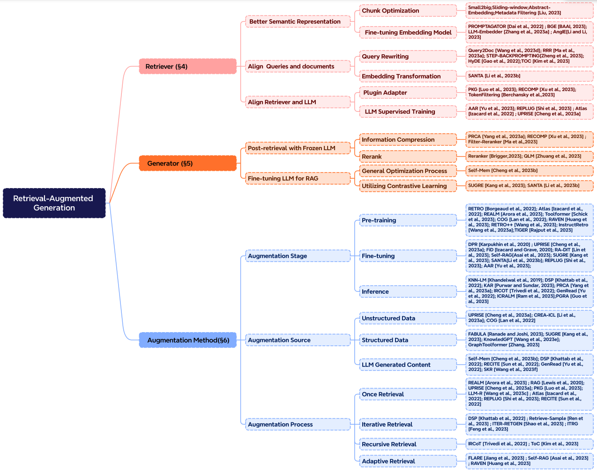
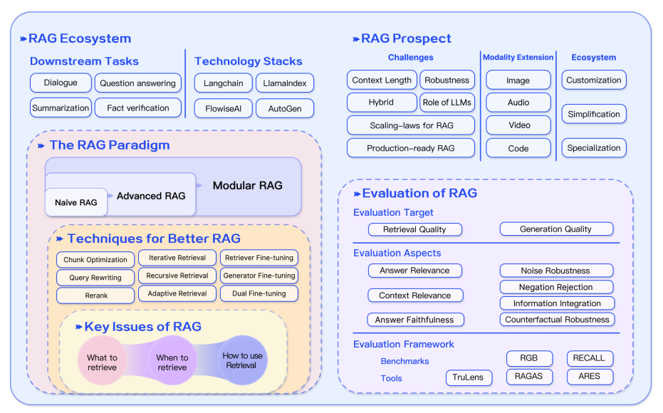

# Retrieval Augmented Generation (RAG) for LLMs

import { Callout } from 'nextra/components'

There are many challenges when working with LLMs such as domain knowledge gaps, factuality issues, and hallucination. Retrieval Augmented Generation (RAG) provides a solution to mitigate some of these issues by augmenting LLMs with external knowledge such as databases. RAG is particularly useful in knowledge-intensive scenarios or domain-specific applications that require knowledge that's continually updating. A key advantage of RAG over other approaches is that the LLM doesn't need to be retrained for task-specific applications. RAG has been popularized recently with its application in conversational agents. 

In this summary, we highlight the main findings and practical insights from the recent survey titled [Retrieval-Augmented Generation for Large Language Models: A Survey](https://arxiv.org/abs/2312.10997) (Gao et al., 2023). In particular, we focus on the existing approaches, state-of-the-art RAG, evaluation, applications and technologies surrounding the different components that make up a RAG system (retrieval, generation, and augmentation techniques). 

## Introduction to RAG

As better introduced [here](https://www.promptingguide.ai/techniques/rag), RAG can be defined as:

> RAG takes input and retrieves a set of relevant/supporting documents given a source (e.g., Wikipedia). The documents are concatenated as context with the original input prompt and fed to the text generator which produces the final output. This makes RAG adaptive for situations where facts could evolve over time. This is very useful as LLMs's parametric knowledge is static. RAG allows language models to bypass retraining, enabling access to the latest information for generating reliable outputs via retrieval-based generation.

In short, the retrieved evidence obtained in RAG can serve as a way to enhance the accuracy, controllability, and relevancy of the LLM's response. This is why RAG can help reduce issues of hallucination or performance when addressing problems in a highly evolving environment.

While RAG has also involved the optimization of pre-training methods, current approaches have largely shifted to combining the strengths of RAG and powerful fine-tuned models like [ChatGPT](https://www.promptingguide.ai/models/chatgpt) and [Mixtral](https://www.promptingguide.ai/models/mixtral). The chart below shows the evolution of RAG-related research:

*[Figure Source](https://arxiv.org/abs/2312.10997)*

Below is a typical RAG application workflow:

*[Figure Source](https://arxiv.org/abs/2312.10997)*

We can explain the different steps/components as follows:
- **Input:** The question to which the LLM system responds is referred to as the input. If no RAG is used, the LLM is directly used to respond to the question. 
- **Indexing:** If RAG is used, then a series of related documents are indexed by chunking them first, generating embeddings of the chunks, and indexing them into a vector store. At inference, the query is also embedded in a similar way.
- **Retrieval:** The relevant documents are obtained by comparing the query against the indexed vectors, also denoted as "Relevant Documents".
- **Generation:** The relevant documents are combined with the original prompt as additional context. The combined text and prompt are then passed to the model for response generation which is then prepared as the final output of the system to the user. 

In the example provided, using the model directly fails to respond to the question due to a lack of knowledge of current events. On the other hand, when using RAG, the system can pull the relevant information needed for the model to answer the question appropriately.

<Callout type= "info" emoji="🎓">
Learn more about RAG and advanced prompting methods in our new AI courses. [Join now!](https://dair-ai.thinkific.com/)

Use code PROMPTING20 to get an extra 20% off.
</Callout>

## RAG Paradigms

Over the past few years, RAG systems have evolved from Naive RAG to Advanced RAG and Modular RAG. This evolution has occurred to address certain limitations around performance, cost, and efficiency. 

*[Figure Source](https://arxiv.org/abs/2312.10997)*

### Naive RAG
Naive RAG follows the traditional aforementioned process of indexing, retrieval, and generation. In short, a user input is used to query relevant documents which are then combined with a prompt and passed to the model to generate a final response. Conversational history can be integrated into the prompt if the application involves multi-turn dialogue interactions.

Naive RAG has limitations such as low precision (misaligned retrieved chunks) and low recall (failure to retrieve all relevant chunks). It's also possible that the LLM is passed outdated information which is one of the main issues that a RAG system should initially aim to solve. This leads to hallucination issues and poor and inaccurate responses. 

When augmentation is applied, there could also be issues with redundancy and repetition. When using multiple retrieved passages, ranking and reconciling style/tone are also key. Another challenge is ensuring that the generation task doesn't overly depend on the augmented information which can lead to the model just reiterating the retrieved content.

### Advanced RAG

Advanced RAG helps deal with issues present in Naive RAG such as improving retrieval quality that could involve optimizing the pre-retrieval, retrieval, and post-retrieval processes.

The pre-retrieval process involves optimizing data indexing which aims to enhance the quality of the data being indexed through five stages: enhancing data granularity, optimizing index structures, adding metadata, alignment optimization, and mixed retrieval.

The retrieval stage can be further improved by optimizing the embedding model itself which directly impacts the quality of the chunks that make up the context. This can be done by fine-tuning the embedding to optimize retrieval relevance or employing dynamic embeddings that better capture contextual understanding (e.g., OpenAI’s embeddings-ada-02 model).

Optimizing post-retrieval focuses on avoiding context window limits and dealing with noisy or potentially distracting information. A common approach to address these issues is re-ranking which could involve approaches such as relocation of relevant context to the edges of the prompt or recalculating the semantic similarity between the query and relevant text chunks. Prompt compression may also help in dealing with these issues. 

### Modular RAG

As the name implies, Modular RAG enhances functional modules such as incorporating a search module for similarity retrieval and applying fine-tuning in the retriever. Both Naive RAG and Advanced RAG are special cases of Modular RAG and are made up of fixed modules. Extended RAG modules include search, memory, fusion, routing, predict, and task adapter which solve different problems. These modules can be rearranged to suit specific problem contexts. Therefore, Modular RAG benefits from greater diversity and flexibility in that you can add or replace modules or adjust the flow between modules based on task requirements. 

Given the increased flexibility in building RAG systems, other important optimization techniques have been proposed to optimize RAG pipelines including:

- **Hybrid Search Exploration:** This approach leverages a combination of search techniques like keyword-based search and semantic search to retrieve relevant and context-rich information; this is useful when dealing with different query types and information needs.
- **Recursive Retrieval and Query Engine:** Involves a recursive retrieval process that might start with small semantic chunks and subsequently retrieve larger chunks that enrich the context; this is useful to balance efficiency and context-rich information.
- **StepBack-prompt:** [A prompting technique](https://arxiv.org/abs/2310.06117) that enables LLMs to perform abstraction that produces concepts and principles that guide reasoning; this leads to better-grounded responses when adopted to a RAG framework because the LLM moves away from specific instances and is allowed to reason more broadly if needed. 
- **Sub-Queries:** There are different query strategies such as tree queries or sequential querying of chunks that can be used for different scenarios. LlamaIndex offers a [sub question query engine](https://docs.llamaindex.ai/en/latest/understanding/putting_it_all_together/agents.html#) that allows a query to be broken down into several questions that use different relevant data sources.
- **Hypothetical Document Embeddings:** [HyDE](https://arxiv.org/abs/2212.10496) generates a hypothetical answer to a query, embeds it, and uses it to retrieve documents similar to the hypothetical answer as opposed to using the query directly.

## RAG Framework
In this section, we summarize the key developments of the components of a RAG system, which include Retrieval, Generation, and Augmentation.

### Retrieval
Retrieval is the component of RAG that deals with retrieving highly relevant context from a retriever. A retriever can be enhanced in many ways, including:

**Enhancing Semantic Representations** 

This process involves directly improving the semantic representations that power the retriever. Here are a few considerations:

- **Chunking:** One important step is choosing the right chunking strategy which depends on the content you are dealing with and the application you are generating responses for. Different models also display different strengths on varying block sizes. Sentence transformers will perform better on single sentences but text-embedding-ada-002 will perform better with blocks containing 256 or 512 tokens. Other aspects to consider include the length of user questions, application, and token limits but it's common to experiment with different chunking strategies to help optimize retrieval in your RAG system.
- **Fine-tuned Embedding Models:** Once you have determined an effective chunking strategy, it may be required to fine-tune the embedding model if you are working with a specialized domain. Otherwise, it's possible that the user queries will be completely misunderstood in your application. You can fine-tune on broad domain knowledge (i.e., domain knowledge fine-tuning) and for specific downstream tasks. [BGE-large-EN developed BAAI](https://github.com/FlagOpen/FlagEmbedding) is a notable embedding model that can be fine-tuned to optimize retrieval relevance. 

**Aligning Queries and Documents**

This process deals with aligning user's queries to those of documents in the semantic space. This may be needed when a user's query may lack semantic information or contain imprecise phrasing. Here are some approaches:

- **Query Rewriting:** Focuses on rewriting queries using a variety of techniques such as [Query2Doc](https://arxiv.org/abs/2303.07678), [ITER-RETGEN](https://arxiv.org/abs/2305.15294), and HyDE. 
- **Embedding Transformation:** Optimizes the representation of query embeddings and align them to a latent space that is more closely aligned with a task. 

**Aligning Retriever and LLM**

This process deals with aligning the retriever outputs with the preferences of the LLMs. 

- **Fine-tuning Retrievers:** Uses an LLM's feedback signals to refine the retrieval models. Examples include augmentation adapted retriever ([AAR](https://arxiv.org/abs/2305.17331)), [REPLUG](https://arxiv.org/abs/2301.12652), and [UPRISE](https://arxiv.org/abs/2303.08518), to name a few. 
- **Adapters:** Incorporates external adapters to help with the alignment process. Examples include [PRCA](https://aclanthology.org/2023.emnlp-main.326/), [RECOMP](https://arxiv.org/abs/2310.04408), and [PKG](https://arxiv.org/abs/2305.04757).

### Generation

The generator in a RAG system is responsible for converting retrieved information into a coherent text that will form the final output of the model. This process involves diverse input data which sometimes require efforts to refine the adaptation of the language model to the input data derived from queries and documents. This can be addressed using post-retrieval process and fine-tuning:

- **Post-retrieval with Frozen LLM:** Post-retrieval processing leaves the LLM untouched and instead focuses on enhancing the quality of retrieval results through operations like information compression and result reranking. Information compression helps with reducing noise, addressing an LLM's context length restrictions, and enhancing generation effects. Reranking aims at reordering documents to prioritize the most relevant items at the top.
- **Fine-tuning LLM for RAG:** To improve the RAG system, the generator can be further optimized or fine-tuned to ensure that the generated text is natural and effectively leverages the retrieved documents.

### Augmentation
Augmentation involves the process of effectively integrating context from retrieved passages with the current generation task. Before discussing more on the augmentation process, augmentation stages, and augmentation data, here is a taxonomy of RAG's core components:

*[Figure Source](https://arxiv.org/abs/2312.10997)*

Retrieval augmentation can be applied in many different stages such as pre-training, fine-tuning, and inference. 

- **Augmentation Stages:** [RETRO](https://arxiv.org/abs/2112.04426) is an example of a system that leverages retrieval augmentation for large-scale pre-training from scratch; it uses an additional encoder built on top of external knowledge. Fine-tuning can also be combined with RAG to help develop and improve the effectiveness of RAG systems. At the inference stage, many techniques are applied to effectively incorporate retrieved content to meet specific task demands and further refine the RAG process. 

- **Augmentation Source:** A RAG model's effectiveness is heavily impacted by the choice of augmentation data source. Data can be categorized into unstructured, structured, and LLM-generated data. 

- **Augmentation Process:** For many problems (e.g., multi-step reasoning), a single retrieval isn't enough so a few methods have been proposed: 
    - **Iterative retrieval** enables the model to perform multiple retrieval cycles to enhance the depth and relevance of information. Notable approaches that leverage this method include [RETRO](https://arxiv.org/abs/2112.04426) and [GAR-meets-RAG](https://arxiv.org/abs/2310.20158).
    - **Recursive retrieval** recursively iterates on the output of one retrieval step as the input to another retrieval step; this enables delving deeper into relevant information for complex and multi-step queries (e.g., academic research and legal case analysis). Notable approaches that leverage this method include [IRCoT](https://arxiv.org/abs/2212.10509) and [Tree of Clarifications](https://arxiv.org/abs/2310.14696).
    - **Adaptive retrieval** tailors the retrieval process to specific demands by determining optimal moments and content for retrieval.  Notable approaches that leverage this method include [FLARE](https://arxiv.org/abs/2305.06983) and [Self-RAG](https://arxiv.org/abs/2310.11511).

The figure below depicts a detailed representation of RAG research with different augmentation aspects, including the augmentation stages, source, and process.

*[Figure Source](https://arxiv.org/abs/2312.10997)*

### RAG vs. Fine-tuning
There are a lot of open discussions about the difference between RAG and fine-tuning and in which scenarios each is appropriate. Research in these two areas suggests that RAG is useful for integrating new knowledge while fine-tuning can be used to improve model performance and efficiency through improving internal knowledge, output format, and teaching complex instruction following. These approaches are not mutually exclusive and can compliment each other in an iterative process that aims to improve the use of LLMs for a complex knowledge-intensive and scalable application that requires access to quickly-evolving knowledge and customized responses that follow a certain format, tone, and style. In addition, Prompting Engineering can also help to optimize results by leveraging the inherent capabilities of the model. Below is a figure showing the different characteristics of RAG compared with other model optimization methods: 

*[Figure Source](https://arxiv.org/abs/2312.10997)*

Here is table from the survey paper that compares the features between RAG and fine-tuned models:

*[Figure Source](https://arxiv.org/abs/2312.10997)*

## RAG Evaluation

Similar to measuring the performance of LLMs on different aspects, evaluation plays a key role in understanding and optimizing the performance of RAG models across diverse application scenarios. Traditionally, RAG systems have been assessed based on the performance of the downstream tasks using task-specific metrics like F1 and EM. [RaLLe](https://arxiv.org/abs/2308.10633v2) is a notable example of a framework used to evaluate retrieval-augmented large language models for knowledge-intensive tasks.

RAG evaluation targets are determined for both retrieval and generation where the goal is to evaluate both the quality of the context retrieved and the quality of the content generated. To evaluate retrieval quality, metrics used in other knowledge-intensive domains like recommendation systems and information retrieval are used such as NDCG and Hit Rate. To evaluate generation quality, you can evaluate different aspects like relevance and harmfulness if it's unlabeled content or accuracy for labeled content. Overall, RAG evaluation can involve either manual or automatic evaluation methods.

Evaluating a RAG framework focuses on three primary quality scores and four abilities. Quality scores include measuring context relevance (i.e., the precision and specificity of retrieved context), answer faithfulness (i.e., the faithfulness of answers to the retrieved context), and answer relevance (i.e., the relevance of answers to posed questions). In addition, there are four abilities that help measure the adaptability and efficiency of a RAG system: noise robustness, negative rejection, information integration, and counterfactual robustness. Below is a summary of metrics used for evaluating different aspects of a RAG system:

*[Figure Source](https://arxiv.org/abs/2312.10997)*

Several benchmarks like [RGB](https://arxiv.org/abs/2309.01431) and [RECALL](https://arxiv.org/abs/2311.08147) are used to evaluate RAG models. Many tools like [RAGAS](https://arxiv.org/abs/2309.15217), [ARES](https://arxiv.org/abs/2311.09476), and [TruLens](https://www.trulens.org/trulens_eval/core_concepts_rag_triad/) have been developed to automate the process of evaluating RAG systems. Some of the systems rely on LLMs to determine some of the quality scores defined above. 

## Challenges & Future of RAG

In this overview, we discussed several research aspects of RAG research and different approaches for enhancing retrieval, augmentation, and generation of a RAG system. Here are several challenges emphasized by [Gao et al., 2023](https://arxiv.org/abs/2312.10997) as we continue developing and improving RAG systems:

- **Context length:** LLMs continue to extend context window size which presents challenges to how RAG needs to be adapted to ensure highly relevant and important context is captured.
- **Robustness:** Dealing with counterfactual and adversarial information is important to measure and improve in RAG.
- **Hybrid approaches:** There is an ongoing research effort to better understand how to best optimize the use of both RAG and fine-tuned models. 
- **Expanding LLM roles:** Increasing the role and capabilities of LLMs to further enhance RAG systems is of high interest. 
- **Scaling laws:** Investigation of LLM scaling laws and how they apply to RAG systems are still not properly understood.
- **Production-ready RAG:** Production-grade RAG systems demand engineering excellence across performance, efficiency, data security, privacy, and more.
- **Multimodal RAG:** While there have been lots of research efforts around RAG systems, they have been mostly centered around text-based tasks. There is increasing interest in extending modalities for a RAG system to support tackling problems in more domains such as image, audio and video, code, and more. 
- **Evaluation:** The interest in building complex applications with RAG requires special attention to develop nuanced metrics and assessment tools that can more reliably assess different aspects such as contextual relevance, creativity, content diversity, factuality, and more. In addition, there is also a need for better interpretability research and tools for RAG.

## RAG Tools

Some popular comprehensive tools to build RAG systems include [LangChain](https://www.langchain.com/), [LlamaIndex](https://www.llamaindex.ai/), and [DSPy](https://github.com/stanfordnlp/dspy). There are also a range of specialized tools that serve different purposes such as [Flowise AI](https://flowiseai.com/) that offers a low-code solution for building RAG applications. Other notables technologies include [HayStack](https://haystack.deepset.ai/), [Meltano](https://meltano.com/), [Cohere Coral](https://cohere.com/coral), and others. Software and cloud service providers are also including RAG-centric services. For instance, Verba from Weaviate is useful for building personal assistant applications and Amazon's Kendra offers intelligent enterprise search services. 

## Conclusion

In conclusion, RAG systems have evolved rapidly including the development of more advanced paradigms that enable customization and further the performance and utility of RAG across a wide range of domains. There is a huge demand for RAG applications, which has accelerated the development of methods to improve the different components of a RAG system. From hybrid methodologies to self-retrieval, these are some of the currently explored research areas of modern RAG models. There is also increasing demand for better evaluation tools and metrics. The figure below provides a recap of the RAG ecosystem, techniques to enhance RAG, challenges, and other related aspects covered in this overview:

*[Figure Source](https://arxiv.org/abs/2312.10997)*

---

## RAG Research Insights

Below is a collection of research papers highlighting key insights and the latest developments in RAG. 

| **Insight**  | **Reference** | **Date** |
| ------------- | ------------- | ------------- |
| Shows how retrieval augmentation can be used to distill language model assistants by training retrieval augmented simulators | [KAUCUS: Knowledge Augmented User Simulators for Training Language Model Assistants](https://aclanthology.org/2024.scichat-1.5)| Mar 2024 |
| Proposes Corrective Retrieval Augmented Generation (CRAG) to improve the robustness of generation in a RAG system. The core idea is to implement a self-correct component for the retriever and improve the utilization of retrieved documents for augmenting generation. The retrieval evaluator helps to assess the overall quality of retrieved documents given a query. Using web search and optimized knowledge utilization operations can improve automatic self-correction and efficient utilization of retrieved documents. | [Corrective Retrieval Augmented Generation](https://arxiv.org/abs/2401.15884)| Jan 2024|
| Recursively embeds, clusters, and summarizes chunks of text, constructing a tree with differing levels of summarization from the bottom up. At inference time, the proposed RAPTOR model retrieves from the tree, integrating information across lengthy documents at different levels of abstraction. | [RAPTOR: Recursive Abstractive Processing for Tree-Organized Retrieval](https://arxiv.org/abs/2401.18059)| Jan 2024 |
| A general program with multi-step interactions between LMs and retrievers to efficiently tackle multi-label classification problems. | [In-Context Learning for Extreme Multi-Label Classification](https://arxiv.org/abs/2401.12178) | Jan 2024 |
| Extracts semantically similar prompts from high-resource languages to improve the zero-shot performance of multilingual pre-trained language models across diverse tasks. | [From Classification to Generation: Insights into Crosslingual Retrieval Augmented ICL](https://arxiv.org/abs/2311.06595) | Nov 2023|
| Improves the robustness of RAGs in facing noisy, irrelevant documents and in handling unknown scenarios. It generates sequential reading notes for retrieved documents, enabling a thorough evaluation of their relevance to the given question and integrating the information to prepare the final answer. | [Chain-of-Note: Enhancing Robustness in Retrieval-Augmented Language Models](https://arxiv.org/abs/2311.09210)| Nov 2023 |
| Eliminates tokens that might not contribute essential information to optimize the answer generation process of a reader. Reduces run-time by up to 62.2%, with only a 2% reduction in performance. | [Optimizing Retrieval-augmented Reader Models via Token Elimination](https://arxiv.org/abs/2310.13682) |  Oct  2023 |
| Instruction-tunes a small LM verifier to verify the output and the knowledge of the knowledge-augmented LMs with a separate verifier. It helps to address scenarios where the model may fail to retrieve the knowledge relevant to the given query, or where the model may not faithfully reflect the retrieved knowledge in the generated text. | [Knowledge-Augmented Language Model Verification](https://arxiv.org/abs/2310.12836) |  Oct  2023 |
| Benchmark to analyze the performance of different LLMs in 4 fundamental abilities required for RAG, including noise robustness, negative rejection, information integration, and counterfactual robustness. | [Benchmarking Large Language Models in Retrieval-Augmented Generation](https://arxiv.org/abs/2309.01431) |  Oct  2023 |
| Introduces the Self-Reflective Retrieval-Augmented Generation (Self-RAG) framework that enhances an LM's quality and factuality through retrieval and self-reflection. It leverages an LM to adaptively retrieve passages, and generates and reflects on retrieved passages and its own generations using reflection tokens. | [Self-RAG: Learning to Retrieve, Generate, and Critique through Self-Reflection](https://arxiv.org/abs/2310.11511) | Oct 2023 |
| Improves zero-shot information retrieval by iteratively improving retrieval through generation-augmented retrieval (GAR) and improving rewrite through RAG. The rewrite-retrieval stages improves recall and a re-ranking stage improves precision. | [GAR-meets-RAG Paradigm for Zero-Shot Information Retrieval](https://arxiv.org/abs/2310.20158) | Oct 2023 |
| Pretrains a 48B retrieval model using a base 43B GPT model and retrieving from 1.2 trillion tokens. The model is further instruction tuned to demonstrate significant improvement over the instruction tuned GPT on a wide range of zero-shot tasks. | [InstructRetro: Instruction Tuning post Retrieval-Augmented Pretraining](https://arxiv.org/abs/2310.07713) | Oct 2023|
| Retrofits an LLM with retrieval capabilities through two distinct fine-tuning steps: one updates a pre-trained LM to better use retrieved information, and the other updates the retriever to return more relevant results, as preferred by the LM. By fine-tuning over tasks that require both knowledge utilization and contextual awareness, each stage yields performance improvements. | [RA-DIT: Retrieval-Augmented Dual Instruction Tuning](https://arxiv.org/abs/2310.01352) | Oct 2023 |
| A method to make RAGs robust to irrelevant content. It automatically generates data to fine-tune a language model to properly leverage retrieved passages, using a mix of relevant and irrelevant contexts at training time. | [Making Retrieval-Augmented Language Models Robust to Irrelevant Context](https://arxiv.org/abs/2310.01558) |Oct 2023|
| Finds that LLMs with 4K context window using simple retrieval-augmentation at generation achieve comparable performance to finetuned LLMs with 16K context window via positional interpolation on long context tasks. | [Retrieval meets Long Context Large Language Models](https://arxiv.org/abs/2310.03025)| Oct 2023|
| Compresses retrieved documents into textual summaries prior to in-context integration which reduces the computational costs and relieves the burden of LMs to identify relevant information in long retrieved documents. | [RECOMP: Improving Retrieval-Augmented LMs with Compression and Selective Augmentation](https://arxiv.org/abs/2310.04408)| Oct 2023|
| An iterative retrieval-generation collaborative framework that leverages both parametric and non-parametric knowledge and helps to find the correct reasoning path through retrieval-generation interactions. Useful for tasks that require multi-step reasoning and overall improves reasoning ability of LLMs. | [Retrieval-Generation Synergy Augmented Large Language Models](https://arxiv.org/abs/2310.05149)| Oct 2023|
| Proposes Tree of Clarifications (ToC), a framework that recursively constructs a tree of disambiguations for ambiguous questions via few-shot prompting leveraging external knowledge. Then, it uses the tree to generate a long-form answer. | [Tree of Clarifications: Answering Ambiguous Questions with Retrieval-Augmented Large Language Models](https://arxiv.org/abs/2310.14696) | Oct 2023 |
| An approach that lets an LLM refer to the questions it has previously encountered and adaptively call for external resources when encountering new questions. | [Self-Knowledge Guided Retrieval Augmentation for Large Language Models](https://arxiv.org/abs/2310.05002)| Oct 2023|
| A suite of metrics which can be used to evaluate different dimensions (i.e., the ability of the retrieval system to identify relevant and focused context passages, the ability of the LLM to exploit such passages in a faithful way, or the quality of the generation itself) without having to rely on ground truth human annotations.| [RAGAS: Automated Evaluation of Retrieval Augmented Generation](https://arxiv.org/abs/2309.15217) | Sep 2023 |
| Proposes a generate-then-read (GenRead) method, which first prompts a large language model to generate contextutal documents based on a given question, and then reads the generated documents to produce the final answer. | [Generate rather than Retrieve: Large Language Models are Strong Context Generators](https://arxiv.org/abs/2209.10063)| Sep 2023 |
| Demonstrates how rankers such as DiversityRanker and LostInTheMiddleRanker can be utilized in a RAG system to select and utilize information that optimizes LLM context window utilization. | [Enhancing RAG Pipelines in Haystack: Introducing DiversityRanker and LostInTheMiddleRanker](https://towardsdatascience.com/enhancing-rag-pipelines-in-haystack-45f14e2bc9f5) | Aug  2023 |
| Bridges LLMs with various knowledge bases (KBs), facilitating both the retrieval and storage of knowledge. The retrieval process employs program of thought prompting, which generates search language for KBs in code format with pre-defined functions for KB operations. It also offers the capability to store knowledge in a personalized KB, catering to individual user demands. | [KnowledGPT: Enhancing Large Language Models with Retrieval and Storage Access on Knowledge Bases](https://arxiv.org/abs/2308.11761) | Aug 2023|
| Proposes a model that combines retrieval-augmented masked language modeling and prefix language modeling. Then, it introduces Fusion-in-Context Learning to enhance few-shot performance by enabling the model to leverage more in-context examples without requiring additional training. | [RAVEN: In-Context Learning with Retrieval Augmented Encoder-Decoder Language Models](https://arxiv.org/abs/2308.07922)| Aug 2023|
| RaLLe is an open-source framework to develop, evaluate, and optimize RAG systems for knowledge-intensive tasks. | [RaLLe: A Framework for Developing and Evaluating Retrieval-Augmented Large Language Models](https://arxiv.org/abs/2308.10633) | Aug 2023|
| Finds that the performance of an LLM can degrade significantly when changing the position of relevant information, which indicates that LLMs do not robustly make use of information in long input contexts. | [Lost in the Middle: How Language Models Use Long Contexts](https://arxiv.org/abs/2307.03172) | Jul 2023 |
| Synergizes retrieval and generation in an iterative manner. The model output is used to show what is needed to finish a task, providing informative context for retrieving more relevant knowledge which in turn helps generate a better output in the next iteration. | [Enhancing Retrieval-Augmented Large Language Models with Iterative Retrieval-Generation Synergy](https://arxiv.org/abs/2305.15294) | May 2023|
| Provides a generalized view of active RAG, methods that actively decide when and what to retrieve across the course of the generation. Then,  proposes Forward-Looking Active REtrieval augmented generation (FLARE), a method which iteratively uses a prediction of the upcoming sentence to anticipate future content, which is then utilized as a query to retrieve relevant documents to regenerate the sentence if it contains low-confidence tokens. | [Active Retrieval Augmented Generation](https://arxiv.org/abs/2305.06983)| May 2023|
| Introduces a generic retrieval plug-in that utilizes a generic retriever to enhance target LMs that may be unknown in advance or are unable to be fine-tuned jointly. | [Augmentation-Adapted Retriever Improves Generalization of Language Models as Generic Plug-In](https://arxiv.org/abs/2305.17331)| May 2023|
| Improves dense retrieval on structured data through two pre-training strategies. First, it utilizes the natural alignment between structured and unstructured data for structure-aware pretraining. Then, it implements Masked Entity Prediction for masked entity prediction and  capturing structural semantics. | [Structure-Aware Language Model Pretraining Improves Dense Retrieval on Structured Data](https://arxiv.org/abs/2305.19912) | May 2023 |
| Dynamically incorporates grounding information from heterogeneous sources in multiple domains to enhance factual correctness of LLMs. Introduces an adaptive query generator to deal with queries tailored to different knowledge sources. The framework corrects rationales progressively to make sure that inaccuracies from preceding rationales do not propagate into the subsequent steps. | [Chain-of-Knowledge: Grounding Large Language Models via Dynamic Knowledge Adapting over Heterogeneous Sources](https://arxiv.org/abs/2305.13269) | May 2023 |
| A framework to generate context-relevant and knowledge-grounded dialogues with a knowledge graph (KG). It first retrieves the relevant subgraph from the KG, and then enforces consistency across facts by perturbing their word embeddings conditioned by the retrieved subgraph. Then, it utilizes contrastive learning to ensure that the generated texts have high similarity to the retrieved subgraphs. | [Knowledge Graph-Augmented Language Models for Knowledge-Grounded Dialogue Generation](https://arxiv.org/abs/2305.18846)| May 2023|
| Adopts a small language model as a trainable rewriter to cater to a black-box LLM reader. The rewriter is trained using the feedback of the LLM reader by RL. Results in a new framework called Rewrite-Retrieve-Read where the focus is on optimizing queries. | [Query Rewriting for Retrieval-Augmented Large Language Models](https://arxiv.org/abs/2305.14283)| May 2023 |
| Iteratively employs a retrieval-augmented generator to create an unbounded memory pool and uses a memory selector to choose one output as memory for the subsequent generation round. This enables a model to leverage its own output, referred to as self-memory, for improved generation. | [Lift Yourself Up: Retrieval-augmented Text Generation with Self Memory](https://arxiv.org/abs/2305.02437) | May 2023 |
| Equips LLMs with a knowledge-guiding module to access relevant knowledge without altering its parameters. It improves performance of "black-box" LLMs on a range of domain knowledge-intensive tasks that require factual (+7.9%), tabular (+11.9%), medical (+3.0%), and multimodal (+8.1%) knowledge. | [Augmented Large Language Models with Parametric Knowledge Guiding](https://arxiv.org/abs/2305.04757) | May 2023|
| Equips LLMs with a general write-read memory unit, allowing them to extract, store, and recall knowledge from the text as needed for task performance. | [RET-LLM: Towards a General Read-Write Memory for Large Language Models](https://arxiv.org/abs/2305.14322) | May 2023|
| Adopts a task-agnostic retriever to build a shared static index and select candidate evidence efficiently. Then, designs a prompt-guided reranker to rerank the nearest evidence according to task-specific relevance for the reader. | [Prompt-Guided Retrieval Augmentation for Non-Knowledge-Intensive Tasks](https://arxiv.org/abs/2305.17653)| May 2023|
| Proposes UPRISE (Universal Prompt Retrieval for Improving zero-Shot Evaluation), which tunes a lightweight and versatile retriever that automatically retrieves prompts for a given zero-shot task input. | [UPRISE: Universal Prompt Retrieval for Improving Zero-Shot Evaluation](https://arxiv.org/abs/2303.08518) | Mar 2023 |
| An adaptive filter-then-rerank paradigm that combines the strengths of SLMs (serve as filters) and LLMs (serve as rerankers). | [Large Language Model Is Not a Good Few-shot Information Extractor, but a Good Reranker for Hard Samples!](https://arxiv.org/abs/2303.08559) | Mar 2023 |
| Zero-shot instructs an instruction-following LLM to generate a hypothetical document that captures relevance patterns. Then, a Contriever encodes the document into an embedding vector which is used to identify a neighborhood in the corpus embedding space, where similar real documents are retrieved based on vector similarity. | [Precise Zero-Shot Dense Retrieval without Relevance Labels](https://arxiv.org/abs/2212.10496)| Dec 2022|
| Proposes Demonstrate-Search-Predict (DSP), a framework to compose high-level programs that bootstrap pipeline-aware demonstrations, search for relevant passages, and generate grounded predictions, systematically breaking down problems into small transformations that can be handled more reliably. | [Demonstrate-Search-Predict: Composing retrieval and language models for knowledge-intensive NLP](https://arxiv.org/abs/2212.14024) | Dec 2022 |
| An approach for multi-step QA that interleaves retrieval with steps in a CoT, guiding the retrieval with CoT and in turn using retrieved results to improve CoT. This helps to improve performance on knowledge-intensive multi-step questions. | [Interleaving Retrieval with Chain-of-Thought Reasoning for Knowledge-Intensive Multi-Step Questions](https://arxiv.org/abs/2212.10509)| Dec 2022|
| Shows that retrieval-augmentation can reduce the dependence on relevant pre-training information, which makes RAG a promising approach for capturing the long-tail. | [Large Language Models Struggle to Learn Long-Tail Knowledge](https://arxiv.org/abs/2211.08411)| Nov 2022 |
| Recites one or several relevant passages from LLMs' own memory via sampling, and then produces the final answers. | [Recitation-Augmented Language Models](https://arxiv.org/abs/2210.01296) | Oct 2022|
| Leverages LLMs as a few-shot query generator, and creates task-specific retrievers based on the generated data. | [Promptagator: Few-shot Dense Retrieval From 8 Examples](https://arxiv.org/abs/2209.11755) | Sep 2022|
| Presents Atlas, a pre-trained retrieval augmented language model able to learn knowledge intensive tasks with very few training examples. |[Atlas: Few-shot Learning with Retrieval Augmented Language Models](https://arxiv.org/abs/2208.03299)| Aug 2022|
| Retrieves from the training data to achieve gains on multiple NLG and NLU tasks. | [Training Data is More Valuable than You Think: A Simple and Effective Method by Retrieving from Training Data](https://arxiv.org/abs/2203.08773) | Mar 2022|
| Approximates a datastore search by saving pointers between consecutive datastore entries, and clustering those entries into states. Results in a weighted finite automaton that, at inference time, helps save up to 83% of the nearest neighbor searchers over kNN-LM without hurting perplexity. | [Neuro-Symbolic Language Modeling with Automaton-augmented Retrieval](https://arxiv.org/abs/2201.12431) | Jan 2022 |
| Improves an auto-regressive language model by conditioning on document chunks retrieved from a large corpus, based on local similarity with preceding tokens. It enhances the model by retrieving from a 2 trillion token database. | [Improving language models by retrieving from trillions of tokens](https://arxiv.org/abs/2112.04426) | Dec  2021 |
| A novel approach to zero-shot slot filling that extends dense passage retrieval with hard negatives and robust training procedures for retrieval augmented generation models. | [Robust Retrieval Augmented Generation for Zero-shot Slot Filling](https://arxiv.org/abs/2108.13934)| Aug 2021 |
| Introduces RAG models where the parametric memory is a pre-trained seq2seq model and the non-parametric memory is a dense vector index of Wikipedia, accessed with a pre-trained neural retriever. It compares two RAG formulations, one which conditions on the same retrieved passages across the whole generated sequence, and the other uses different passages per token. | [Retrieval-Augmented Generation for Knowledge-Intensive NLP Tasks](https://arxiv.org/abs/2005.11401) | May 2020 | 
| Shows that retrieval can be implemented using dense representations alone, where embeddings are learned from a small number of questions and passages by a simple dual-encoder framework. | [Dense Passage Retrieval for Open-Domain Question Answering](https://arxiv.org/abs/2004.04906)| Apr 2020 |

## References

- [KAUCUS: Knowledge Augmented User Simulators for Training Language Model Assistants](https://aclanthology.org/2024.scichat-1.5)
- [A Survey on Hallucination in Large Language Models: Principles,Taxonomy, Challenges, and Open Questions](https://arxiv.org/abs/2311.05232)
- [Retrieval-Augmented Generation for Knowledge-Intensive NLP Tasks](https://arxiv.org/abs/2005.11401)
- [Retrieval-augmented multimodal language modeling](https://arxiv.org/abs/2211.12561)
- [In-Context Retrieval-Augmented Language Models](https://arxiv.org/abs/2302.00083)
- [Precise Zero-Shot Dense Retrieval without Relevance Labels](https://arxiv.org/abs/2212.10496)
- [Shall we pretrain autoregressive language models with retrieval? a comprehensive study.](https://arxiv.org/pdf/2312.10997.pdf)
- [REPLUG: Retrieval-Augmented Black-Box Language Models](https://arxiv.org/abs/2301.12652)
- [Query2Doc](https://arxiv.org/abs/2303.07678)
- [ITER-RETGEN](https://arxiv.org/abs/2305.15294)
- [A Survey of Techniques for Maximizing LLM Performance](https://youtu.be/ahnGLM-RC1Y?si=z45qrLTPBfMe15LM)
- [HyDE](https://arxiv.org/abs/2212.10496)
- [Advanced RAG Techniques: an Illustrated Overview](https://pub.towardsai.net/advanced-rag-techniques-an-illustrated-overview-04d193d8fec6)
- [Best Practices for LLM Evaluation of RAG Applications](https://www.databricks.com/blog/LLM-auto-eval-best-practices-RAG)
- [Building Production-Ready RAG Applications](https://youtu.be/TRjq7t2Ms5I?si=gywRj82NIc-wsHcF)
- [Evaluating RAG Part I: How to Evaluate Document Retrieval](https://www.deepset.ai/blog/rag-evaluation-retrieval)
- [Retrieval Augmented Generation meets Reciprocal Rank Fusion and Generated Queries](https://towardsdatascience.com/forget-rag-the-future-is-rag-fusion-1147298d8ad1)
