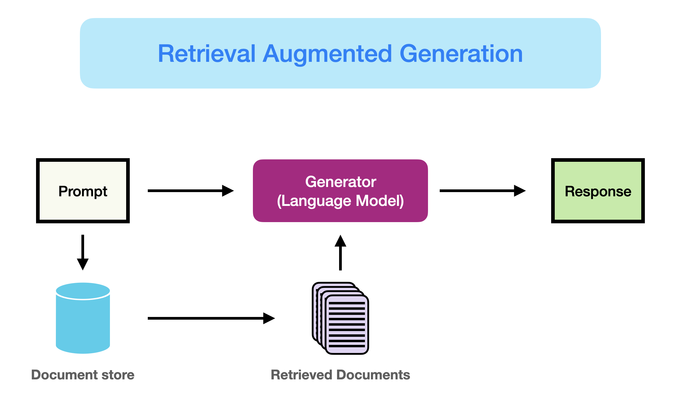
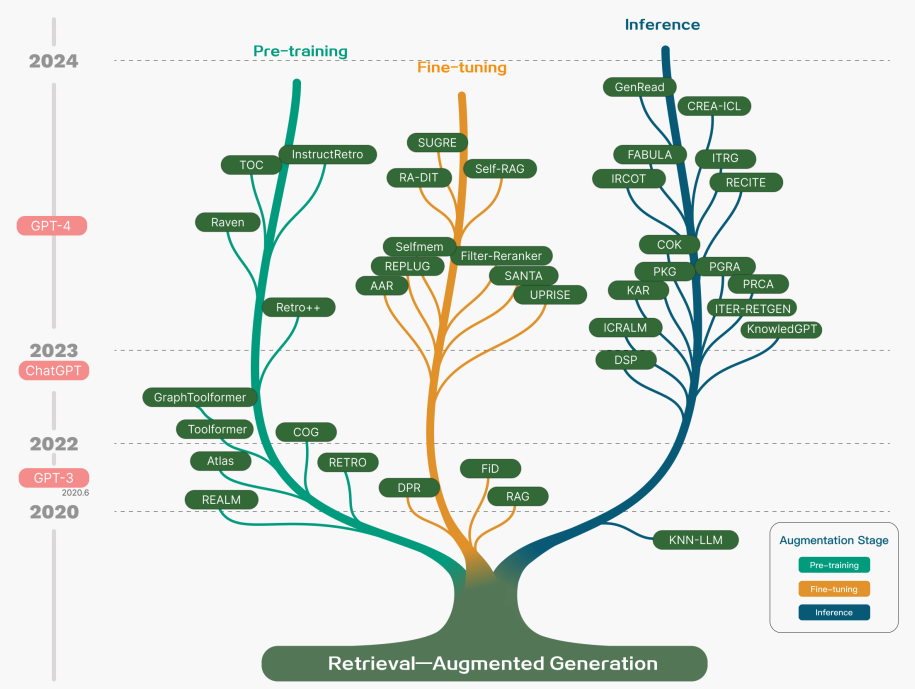
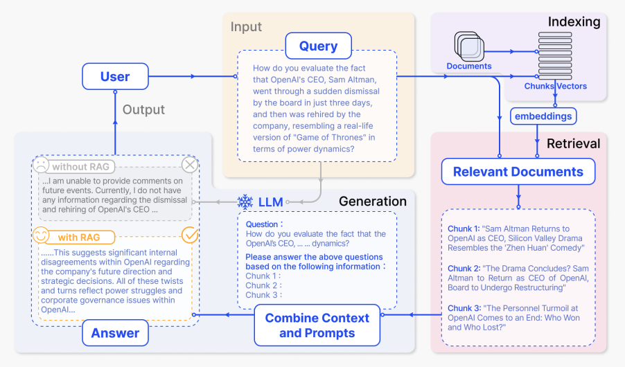
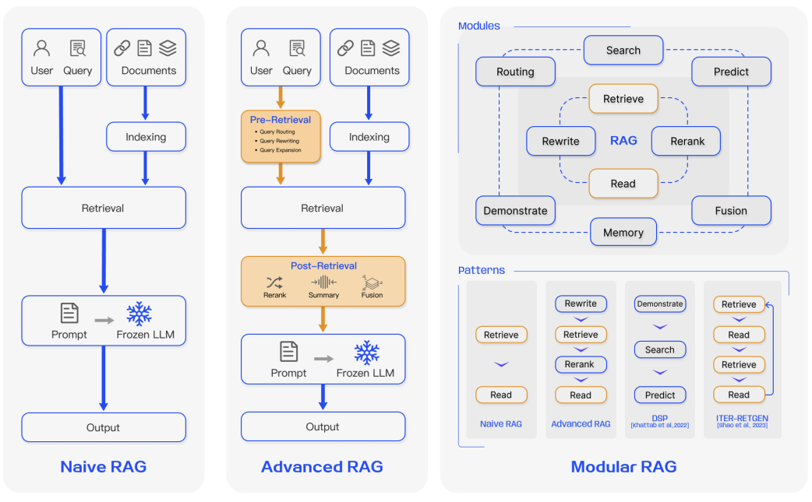
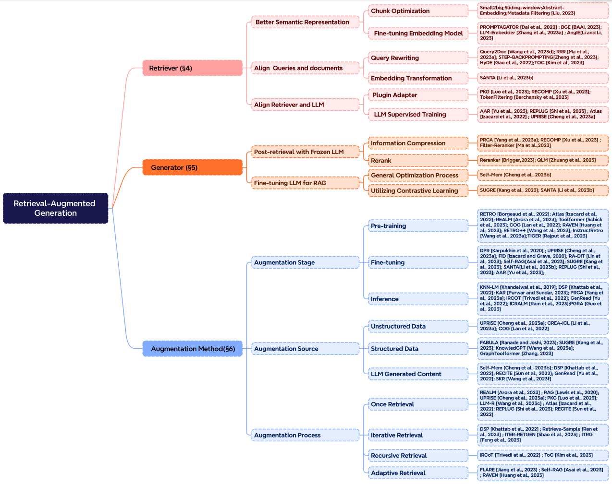
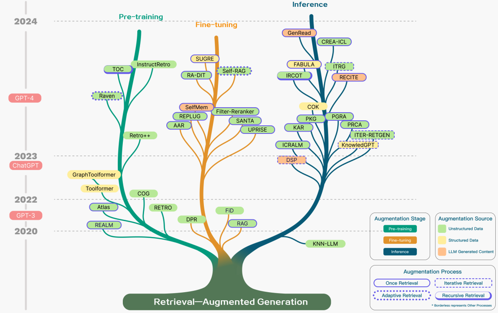
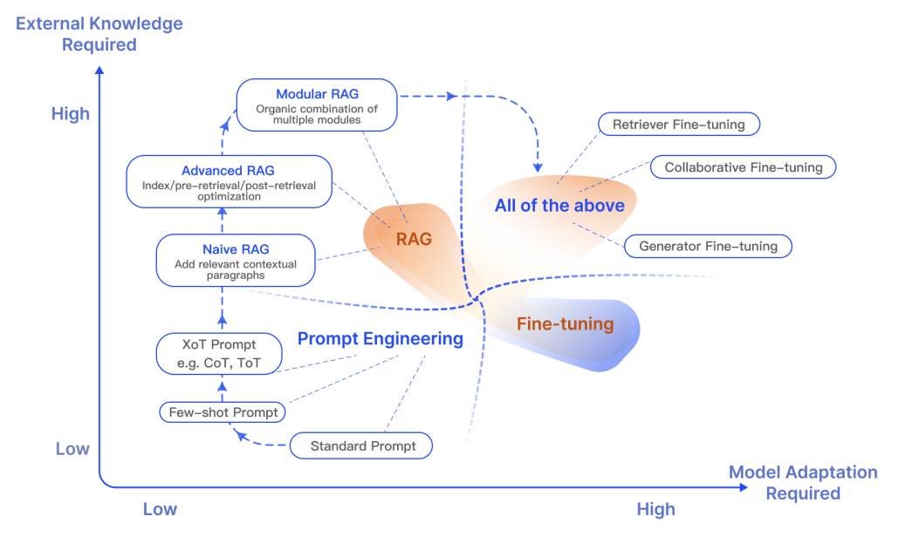
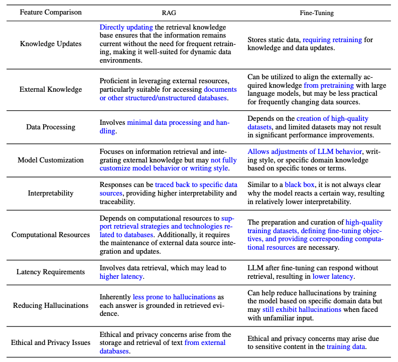
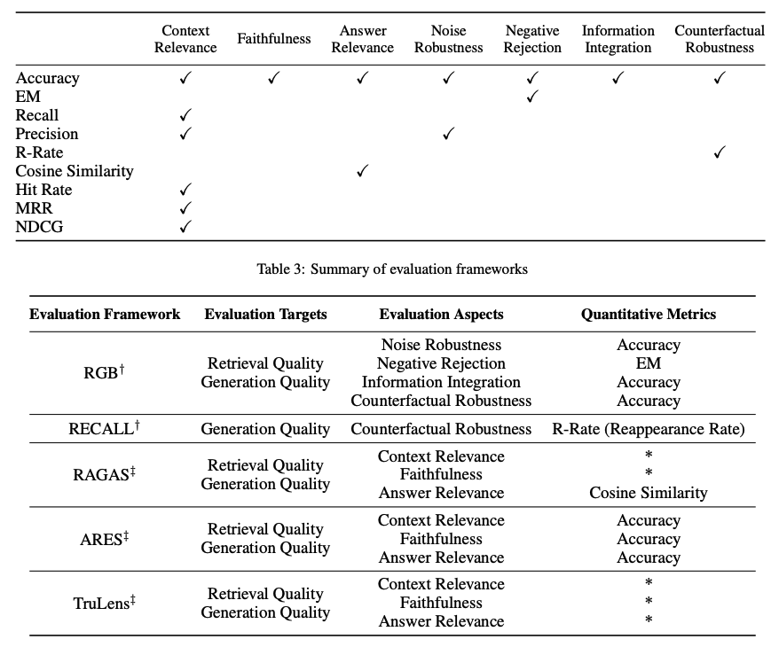
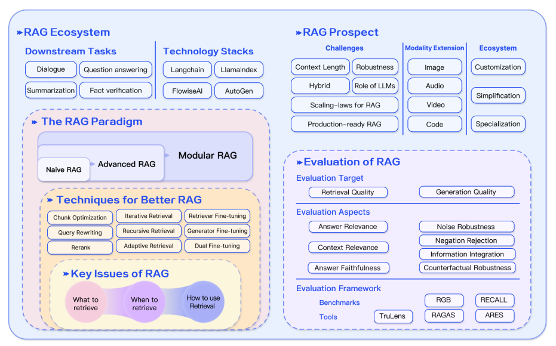

# Retrieval Augmented Generation (RAG) for LLMs

Retrieval Augmented Generation(RAG)은 대규모 언어 모델, 즉 LLM(Large Language Models)의 한계를 해결하기 위한 효과적인 방법입니다. 이 방식은 데이터베이스 같은 외부 지식원을 LLM에 결합시켜, 도메인 지식의 격차, 사실적 오류, 그리고 잘못된 정보 생성(hallucination)과 같은 문제들을 줄일 수 있습니다. 특히, 지속적으로 변화하고 업데이트되는 정보가 필요한 분야나 특정한 응용 프로그램에서 RAG는 큰 장점을 가지게 됩니다. RAG의 뛰어난 점은 특정 작업이나 응용 프로그램에 맞추어 LLM을 다시 학습시킬 필요가 없다는 것입니다. 최근에는 대화형 에이전트 분야에서 RAG의 활용이 늘어나며 그 인기가 많아지고 있습니다.

이 글은 최근 발표된 '[Retrieval-Augmented Generation for Large Language Models: A Survey](https://arxiv.org/abs/2312.10997) (Gao et al., 2023)'라는 논문에서 나온 중요한 발견과 실질적인 인사이트를 요약합니다. 현재의 접근 방법, 최신 RAG 기술, 평가 방법, 응용 프로그램, 그리고 RAG 시스템을 구성하는 다양한 요소(검색, 생성, 증강 기술)를 둘러싼 기술에 집중하여 설명합니다.

## RAG란?

[이 문서](https://www.promptingguide.ai/techniques/rag)에서 소개되었듯이, RAG는 아래와 같이 정의될 수 있습니다:

> RAG는 입력을 받아 해당하는 출처(예: 위키백과)에서 관련 문서를 찾아냅니다. 이 문서들은 원래의 입력 프롬프트와 함께 컨텍스트로 연결되어, 텍스트 생성기를 통해 결과물을 만들어냅니다. 이 과정을 통해 RAG는 변화하는 정보에도 적응할 수 있습니다. 이는 LLM의 고정된 매개 변수에 대한 효과적인 해결책이 됩니다. RAG 덕분에 언어 모델은 다시 학습할 필요 없이 검색 기반 생성을 통해 최신 정보에 기반한 신뢰할 수 있는 결과물을 만들 수 있습니다.

간단히 말해서, RAG에서 검색된 정보는 LLM 응답의 정확성, 제어 가능성 및 관련성을 높이는 데 활용됩니다. 그렇기 때문에, 변화하는 환경에서 발생할 수 있는 거짓된 정보 생성이나 성능 문제를 줄이는 데 도움이 됩니다.

RAG는 사전 교육(Pre-traing) 방법의 개선과 관련이 있습니다. 그러나, 현재는 RAG와 [ChatGPT](https://www.promptingguide.ai/models/chatgpt)나 [Mixtral](https://www.promptingguide.ai/models/mixtral)과 같은 성능이 뛰어난 파인 튜닝된 모델의 장점을 결합하는 데 중점을 두고 있습니다. 아래 차트는 RAG 연구의 발전을 보여줍니다.

아래 그림은 RAG 응용 프로그램의 일반적인 워크플로우를 보여줍니다: 

위 그림에서 나온 다양한 단계 및 구성 요소를 설명해보겠습니다:
- **입력:** LLM 시스템이 응답해야 할 질문을 '입력'이라고 합니다. RAG를 사용하지 않는 경우, LLM은 직접 질문에 대답합니다.
- **색인 생성:** RAG를 사용할 때는 관련 문서들이 먼저 작은 단위로 나뉘어 색인화됩니다. 추론 과정에서는 질문도 비슷한 방식으로 임베딩됩니다.
- **검색:** 질문과 관련된 문서들은 색인된 벡터와 비교하여 검색됩니다. 이 문서들을 '관련 문서(Relevant Documents)'라고 부릅니다.
- **생성:** 관련 문서들은 원래의 질문과 함께 추가 컨텍스트로 결합됩니다. 이 결합된 텍스트와 질문은 모델에 전달되어 시스템의 최종 응답을 생성하는 데 사용됩니다.

제공된 예시에서, 모델만을 사용했을 때 현재 사건에 대한 지식 부족으로 질문에 응답하지 못하였습니다. 반면, RAG를 사용할 때 시스템은 모델이 질문에 적절하게 대답할 수 있도록 필요한 정보를 제공해주었습니다.

## RAG 패러다임

최근 몇 년 동안 RAG 시스템은 Naive RAG에서 Advanced RAG, Modular RAG로 발전해왔습니다. 이러한 발전은 성능과 비용, 효율성과 관련된 특정 제한 사항을 해결하기 위한 것입니다.

### Naive RAG
Naive RAG는 색인 생성과 검색, 생성 순으로 전통적인 단계를 거칩니다. 사용자의 입력은 관련 문서를 찾는 데 사용되고, 이 문서들은 최종 응답을 생성하는 모델에 전달되기 전에 프롬프트와 결합됩니다. 여러 단계의 대화 상호작용이 필요한 응용 프로그램에서는 대화 이력을 프롬프트에 통합할 수 있습니다.

Naive RAG는 검색된 문서의 순서나 정확도 문제(낮은 정밀도), 관련 문서를 찾지 못하는 문제(낮은 재현율) 등의 한계를 가지고 있습니다. 또한, RAG 시스템이 해결해야 할 주요한 문제 중 하나가 LLM에게 오래된 정보를 제공한다는 것입니다. 이로 인해 잘못된 정보 생성이나 부정확한 응답이 나타날 수 있습니다.

Naive RAG에서 증강을 적용할 때, 중복이나 반복과 같은 문제도 발생할 수 있습니다. 또한 여러 검색 결과를 사용할 때, 순위 매기기와 스타일/톤 조정도 중요합니다. 또 다른 문제는 생성 작업이 검색된 정보에 지나치게 의존하게 되어 모델이 검색된 내용을 단순 반복하게 되는 것입니다.

### Advanced RAG

Advanced RAG는 기존의 Naive RAG에서 발생하는 문제들을 해결할 수 있습니다. 예를 들어, 검색 품질을 개선하는 것인데, 사전 검색(Pre-Retrieval)과 검색(Retrieval), 사후 검색(Post-Retrieval) 과정을 최적화하는 것을 의미합니다.

사전 검색 과정은 데이터 색인 생성을 최적화하는 것을 포함하며, 이 과정에서는 데이터의 질을 높이기 위해 다섯 가지 단계(데이터 세분화, 색인 구조 최적화, 메타데이터 추가, 정렬 최적화, 혼합 검색)를 거칩니다.

임베딩 모델을 개선하는 것으로 검색의 성능을 향상시킬 수 있습니다. 예를 들어, 임베딩 모델을 파인 튜닝하거나 컨텍스트를 더 잘 이해하는 동적 임베딩(예: OpenAI의 embeddings-ada-02 모델)을 사용하는 것으로 임베딩 모델을 개선할 수 있습니다.

사후 검색 최적화는 컨텍스트 윈도우의 한계를 극복할뿐만 아니라 잡음이 많거나 필요가 없는 정보를 처리할 수 있도록 합니다. 이 문제를 해결하는 일반적인 방법은 재순위 매기기(re-ranking)입니다. 이 방법은 관련 컨텍스트를 프롬프트의 가장자리로 재배치하거나 질문과 관련 텍스트 청크 사이의 의미론적 유사성을 다시 계산하는 것을 포함할 수 있습니다. 프롬프트 압축도 이러한 문제를 다루는 데 유용할 수 있습니다.

### Modular RAG

Modular RAG는 검색 기능과 같은 다양한 기능 모듈을 통합하여 성능을 개선하는 것을 의미합니다. 예를 들어, 유사성 검색을 위한 검색 모듈을 통합하고 검색기를 파인 튜닝하는 방식이 될 수 있습니다. Naive RAG와 Advanced RAG는 모두 Modular RAG의 특정 형태로 볼 수 있습니다. 확장된 RAG 모듈에는 검색, 메모리, 융합, 라우팅, 예측, 태스크 어댑터 등 다양한 문제 해결을 위한 모듈이 포함될 수 있으며, 이들은 특정 문제 맥락에 맞게 조정될 수 있습니다. 따라서 Modular RAG는 모듈을 추가하거나 교체하고 작업 요구 사항에 맞게 모듈 간의 흐름을 조정할 수 있는 더 큰 다양성과 유연성을 제공합니다.

RAG 시스템 구축의 유연성이 증가함에 따라, RAG 파이프라인을 최적화하기 위한 여러 기술이 제안되었습니다:

- **하이브리드 검색 탐색:** 이 접근법은 키워드 기반 검색과 의미론적 검색을 결합하여 더 관련성 높고 컨텍스트가 풍부한 정보를 검색합니다. 다양한 질문 유형과 정보 요구 사항을 처리하는 데 유용할 수 있습니다.
- **재귀적 검색 및 질의 엔진:** 이 방법은 작은 의미 단위인 청크(Chunk)에서 시작하여 점진적으로 컨텍스트를 확장해 나가며 더 큰 청크를 검색하는 재귀적인 과정을 거칩니다. 이러한 접근 방식은 검색의 효율성과 풍부한 컨텍스트를 가진 정보 사이의 균형을 맞추는 데 효과적입니다.
- **스텝백 프롬프트:** [이 프롬프팅 기술](https://arxiv.org/abs/2310.06117)은 LLM의 추론을 위한 개념과 원칙을 생성하도록 유도합니다. 이 프롬프트가 RAG 프레임워크에 적용될 때, LLM은 구체적인 사례에서 벗어나 더 넓은 범위의 추론을 할 수 있게 되므로 신뢰도가 높은 응답을 생성할 수 있게 됩니다.
- **하위 질의:** 다양한 질의 전략을 활용하여 복잡한 질문을 여러 개의 하위 질문으로 분할할 수 있습니다. 이는 트리 구조로 질의하거나 순차적으로 청크를 질의하는 등 다양한 시나리오에 적용 가능합니다. LlamaIndex는 [하위 질문 질의 엔진](https://docs.llamaindex.ai/en/latest/understanding/putting_it_all_together/agents.html#)을 제공하여 이러한 하위 질문을 사용해 다양한 데이터 소스를 효과적으로 활용할 수 있도록 지원합니다.
- **가상 문서 임베딩:** [HyDE](https://arxiv.org/abs/2212.10496)는 질문에 대한 가상의 답변을 생성하고 이 답변을 임베딩하는 작업을 수행합니다. 질문을 직접 사용하는 것 대신에 생성된 가상 답변과 유사한 문서를 검색합니다.

## RAG 프레임워크
이 단락에서는 RAG 시스템의 구성 요소인 검색(Retrieval), 생성(Generation), 증강(Augmentation)의 핵심 내용을 설명합니다.

### 검색
검색은 RAG 시스템에서 검색기로부터 관련성 높은 관련성을 가진 문맥을 검색하는 부분입니다. 검색기의 성능을 높이려면 다음과 같은 여러 방법을 사용해볼 수 있습니다:

**의미 표현 개선하기** 

검색기의 핵심인, 의미 표현을 직접적으로 개선하는 과정을 살펴보겠습니다. 여기서 고려해야 할 사항은 다음과 같습니다:

- **청킹(Chunking):** 다루고 있는 콘텐츠와 응답을 생성하는 애플리케이션을 고려하여 최적의 청킹 방법을 선택하는 것이 중요합니다. 모델마다 블록 크기에 따른 성능 차이가 존재합니다. Sentence transformers는 단일 문장에서, text-embedding-ada-002는 256 또는 512 토큰 블록에서 더 좋은 성능을 보입니다. 또한, 사용자 질문의 길이, 애플리케이션, 토큰 제한 등 여러 요소를 고려할 수 있습니다. 일반적으로 다양한 청킹 방법을 실험해보면서 RAG 시스템의 검색 성능을 최적화합니다.
- **임베딩 모델 파인 튜닝:** 청킹 방법을 결정했다면, 파인 튜닝을 고려할 수 있습니다. 특히, 전문적인 분야를 다룰 때 파인 튜닝을 하지 않으면 애플리케이션에서 사용자의 질문을 제대로 이해하지 못할 가능성이 높습니다. 광범위한 도메인 지식이나 특정 작업을 잘 처리하기 위해 파인 튜닝을 고려할 수 있습니다. [BAAI에서 개발한 BGE-large-EN](https://github.com/FlagOpen/FlagEmbedding)은 검색 관련성을 높이기 위해 파인 튜닝하기에 적합한 임베딩 모델입니다.

**질문과 문서 정렬하기**

사용자의 질문에 의미 정보가 부족하거나 애매한 표현이 있을 경우, 정렬(Alignment) 기술을 적용해볼 수 있습니다. 정렬은 의미 공간 상에서 사용자의 질문을 문서와 일치시키는 방법입니다. 이를 위한 접근 방식으로는 다음과 같은 것들이 있습니다:

- **질문 다시 작성하기:** [Query2Doc](https://arxiv.org/abs/2303.07678), [ITER-RETGEN](https://arxiv.org/abs/2305.15294), HyDE 등 다양한 기술을 활용해 질문을 다시 작성하는 데 초점을 맞춥니다.
- **임베딩 변환하기:** 질문 임베딩의 표현을 최적화하여 특정 작업에 더 잘 부합하는 잠재 공간으로 맞추는 방법입니다.

**검색기와 LLM 정렬하기**

검색기의 출력 결과를 LLM이 선호하는 방향으로 정렬하는 방법입니다.

- **검색기 파인 튜닝:** LLM의 피드백을 활용하여 검색 모델을 개선하는 방법입니다. [AAR](https://arxiv.org/abs/2305.17331), [REPLUG](https://arxiv.org/abs/2301.12652), [UPRISE](https://arxiv.org/abs/2303.08518) 등으로 검색기와 LLM을 정렬할 수 있습니다.
- **어댑터:** [PRCA](https://aclanthology.org/2023.emnlp-main.326/), [RECOMP](https://arxiv.org/abs/2310.04408), [PKG](https://arxiv.org/abs/2305.04757) 등의 외부 어댑터를 도입하여 검색기와 LLM을 정렬해 볼 수 있습니다.

### 생성

RAG 시스템에서 생성기(Generator)는 검색된 정보를 기반으로 자연스러운 텍스트를 생성하여 최종 출력을 만들어내는 역할을 합니다. 이 과정에는 다양한 입력 데이터가 포함되며, 때로는 질문과 문서에서 파생된 입력 데이터에 언어 모델을 적응시키기 위한 추가적인 노력이 필요할 수 있습니다. 이러한 문제는 검색 이후의 후처리(Post-processing) 및 파인 튜닝을 통해 해결할 수 있습니다.

- **검색 후처리에서 고정된 LLM 활용:** 이 방법은 LLM을 변경하지 않고, 정보 압축이나 결과 재순위화와 같은 작업을 통해 검색 결과의 품질을 향상시키는 데 중점을 둡니다. 정보 압축은 노이즈를 줄이고 LLM의 컨텍스트 길이 제한 문제를 해결하며 생성 성능을 개선합니다. 재순위화는 관련성이 높은 문서를 상위에 배치하도록 검색 결과의 순서를 조정합니다.
- **RAG를 위한 LLM 파인 튜닝:** RAG 시스템의 성능을 향상시키기 위해, 생성기를 추가로 최적화하거나 파인 튜닝하여 검색된 문서를 효과적으로 활용하는 동시에 자연스러운 텍스트를 생성하도록 조정하는 방법입니다.

### 증강
증강(Augmentation)은 검색된 패시지(Passage)의 문맥을 현재 생성 작업과 효과적으로 통합하는 과정을 의미합니다. 증강 과정, 증강 단계, 그리고 증강 데이터에 대해 논의하기에 앞서, RAG의 핵심 구성 요소를 살펴보겠습니다:

검색 증강은 사전 학습, 파인 튜닝, 추론과 같은 다양한 단계에 적용될 수 있습니다.

- **증강 단계 개선:** [RETRO](https://arxiv.org/abs/2112.04426)는 대규모 사전 학습을 위한 검색 증강 시스템입니다. 이 시스템은 외부 지식을 기반으로 하는 추가 인코더를 사용합니다. RETRO는 RAG 시스템과 결합되어 개발 및 성능 향상에 기여할 수 있으며, 추론 단계에서는 RAG 프로세스를 보다 정교하게 만들고 특정 작업 요구 사항에 맞게 검색된 콘텐츠를 효율적으로 통합하기 위해 다양한 기술을 적용합니다.

- **증강 소스의 중요성:** RAG 모델의 성능은 증강 데이터 소스의 선택에 따라 크게 달라질 수 있습니다. 이러한 데이터는 비정형 데이터, 정형 데이터, LLM 생성 데이터로 분류할 수 있습니다.

- **증강 프로세스의 다양성:** 복잡한 문제 해결을 위해 다양한 증강 방법이 제안되었습니다:
    - **반복 검색:** 이 방식은 모델이 정보의 깊이와 관련성을 향상시키기 위해 여러 검색 주기를 수행합니다. [RETRO](https://arxiv.org/abs/2112.04426)와 [GAR-meets-RAG](https://arxiv.org/abs/2310.20158)는 반복 검색을 활용하는 주목할만한 예시입니다.
    - **재귀 검색:** 이 방식은 한 검색 단계의 결과를 다음 검색 단계의 입력으로 재귀적으로 사용합니다. 이를 통해 학술 연구 및 법률 사례 분석과 같은 복잡한 다단계 쿼리에 대한 정보를 깊이 있게 탐색할 수 있습니다. [IRCoT](https://arxiv.org/abs/2212.10509)와 [Tree of Clarifications](https://arxiv.org/abs/2310.14696)가 재귀 검색을 사용하는 주요 예시입니다.
    - **적응 검색:** 이 방식은 최적의 검색 시점과 콘텐츠를 결정함으로써 특정 요구에 맞게 검색 프로세스를 조정합니다. [FLARE](https://arxiv.org/abs/2305.06983)와 [Self-RAG](https://arxiv.org/abs/2310.11511)는 적응형 검색을 활용하는 주요 접근 방식입니다.

아래 그림은 증강 단계, 소스, 프로세스 등 RAG 연구를 다양한 증강 측면으로 상세하게 묘사하고 있습니다.

### RAG vs. 파인 튜닝
RAG와 파인 튜닝 간의 차이점과 각각의 적합한 상황에 대한 토론이 활발히 이루어지고 있습니다. 이 두 분야의 연구에 따르면, RAG는 새로운 지식을 통합하는 데에 효과적인 반면, 파인 튜닝은 내부 지식, 출력 형식 및 복잡한 요구사항을 이해하는 능력을 개선함으로써 모델의 성능과 효율성을 높일 수 있다고 합니다. 이 두 방법은 상호 배타적이지 않으며, 복잡하고 지식 집약적이며 확장 가능한 응용 프로그램에 LLM을 사용함에 있어, 빠르게 변화하는 지식에 대한 접근과 특정 형식, 어조, 스타일을 갖춘 맞춤형 응답이 필요할 때 서로를 보완하며 반복적인 개선 과정을 거칠 수 있습니다. 이와 더불어, 프롬프팅 엔지니어링은 모델의 기본 기능을 활용하여 결과를 최적화하는 데 중요한 역할을 할 수 있습니다. 아래는 RAG가 다른 모델 최적화 방법들과 비교했을 때 갖는 다양한 특성을 보여주는 그림입니다:

아래는 RAG와 파인 튜닝된 모델들 간의 특징을 비교한 논문에서 가져온 표입니다:

## RAG 평가

LLM의 다양한 측면에 대해서 성능을 측정하는 것과 마찬가지로, RAG를 평가하는 것은 다양한 애플리케이션 시나리오에서 모델의 성능을 이해하고 최적화하는 데 중요한 역할을 합니다. 전통적으로 RAG 시스템은 F1이나 EM 같은 특정 작업에 초점을 맞춘 평가 지표를 통해 평가되었습니다. 예를 들어, [RaLLe](https://arxiv.org/abs/2308.10633v2)는 지식 집약적 작업에서 검색 기능을 강화한 대규모 언어 모델의 성능을 평가하는 데 사용됩니다.

RAG 평가는 검색된 내용과 생성된 콘텐츠의 품질을 모두 평가하는 것을 목표로 합니다. 검색 품질은 NDCG와 적중률 같은, 추천 시스템이나 정보 검색 분야에서 사용되는 평가 지표로 측정됩니다. 생성 품질 평가는 2가지의 경우로 나누어집니다. 레이블이 지정되지 않은 콘텐츠의 경우 관련성과 유해성을, 레이블이 있는 콘텐츠의 경우 정확성을 평가합니다. RAG 평가 방법은 수동적이거나 자동화된 접근 방식을 사용할 수 있습니다.

RAG 프레임워크의 평가는 세 가지 주요 품질 지표와 네 가지 능력을 중심으로 이루어집니다. 품질 지표에는 검색된 내용의 관련성, 답변의 충실성, 그리고 제시된 질문에 대한 답변의 관련성이 포함됩니다. 또한, RAG 시스템의 적응성과 효율성을 측정하는 데 도움이 되는 네 가지 능력도 평가에 있어 중요한 요소입니다. 여기에는 잡음에 대한 견고성, 부적절한 내용을 거부하는 능력, 다양한 정보를 통합하는 능력, 그리고 반사실적 상황에 대한 견고성이 포함됩니다. 아래는 RAG 시스템의 다양한 측면을 평가하는 데 사용되는 주요 평가 지표를 요약한 내용입니다:

RAG 모델 평가에는 [RGB](https://arxiv.org/abs/2309.01431), [RECALL](https://arxiv.org/abs/2311.08147)과 같은 여러 벤치마크가 사용됩니다. 이와 함께,  [RAGAS](https://arxiv.org/abs/2309.15217)와 [ARES](https://arxiv.org/abs/2311.09476), [TruLens](https://www.trulens.org/trulens_eval/core_concepts_rag_triad/) 같은 다양한 도구들이 RAG 시스템 평가 과정을 자동화하기 위해 개발되었습니다. 이러한 시스템 중 일부는 앞서 정의된 품질 지표를 위해 LLM을 사용합니다.

## RAG의 도전과제와 미래

RAG 시스템의 검색, 증강, 생성 능력을 향상시키기 위한 여러 접근 방법이 존재합니다. [Gao et al., 2023](https://arxiv.org/abs/2312.10997) 에서 강조한 것처럼, RAG 시스템을 개발하고 개선하는 과정에는 다음과 같은 도전 과제가 있습니다:

- **컨텍스트 길이:** LLM의 컨텍스트 윈도우 크기가 확장됨에 따라, RAG가 높은 관련성과 중요한 컨텍스트를 포착하기 위해 어떻게 적응해야 할지에 대한 과제가 있습니다.
- **견고성:** 반사실적이고 적대적 정보를 처리하는 능력은 RAG에서 측정하고 개선해야 할 중요한 부분입니다.
- **하이브리드 접근법:** RAG와 파인 튜닝된 모델을 어떻게 최적화하는지에 대해 더 잘 이해하기 위한 지속적인 연구가 필요합니다.
- **LLM 역할 확장:** LLM의 역할과 능력을 증가시켜 RAG 시스템을 강화하는 것이 주목받고 있습니다.
- **스케일링 법칙:** LLM의 스케일링 법칙이 RAG 시스템에 어떻게 적용되는지에 대한 연구는 여전히 초기 단계에 있습니다.
- **상용화 준비가 된 RAG:** 실제로 사용될 수 있는 RAG 시스템은 성능, 효율성, 데이터 보안, 개인 정보 보호 등 다양한 분야에서 뛰어난 엔지니어링 기술을 요구합니다.
- **다중 모달 RAG:** RAG 시스템에 대한 많은 연구 노력이 있었지만, 대부분 텍스트 기반 작업을 중심으로 이루어졌습니다. 이미지, 오디오, 비디오, 코드 등과 같은 다양한 도메인에서 문제를 해결하기 위해 RAG 시스템의 모달리티를 확장하는 데에 대한 관심이 증가하고 있습니다.
- **평가:** RAG를 사용한 복잡한 응용 프로그램 개발이 확대됨에 따라, 컨텍스트 관련성, 창의성, 콘텐츠 다양성, 사실성 등을 더 정확하게 평가할 수 있는 섬세한 메트릭과 평가 도구 개발에 주목이 집중되고 있습니다. 또한 RAG에 대한 해석 가능성 연구와 도구 개발의 필요성도 증가하고 있습니다.

## RAG 도구

RAG 시스템을 구축하기 위한 인기 있는 도구들로는 [LangChain](https://www.langchain.com/), [LlamaIndex](https://www.llamaindex.ai/), [DSPy](https://github.com/stanfordnlp/dspy)가 있습니다. 이와 함께 다양한 목적을 위한 도구도 존재합니다. 예를 들어 [Flowise AI](https://flowiseai.com/) 코드를 거의 작성하지 않는, 사용이 간편한 솔루션을 제공하여 RAG 애플리케이션 구축을 용이하게 합니다. 다른 주목할 만한 기술로는 [HayStack](https://haystack.deepset.ai/), [Meltano](https://meltano.com/), [Cohere Coral](https://cohere.com/coral) 등이 있습니다. 또한, 소프트웨어 및 클라우드 서비스 제공업체들도 RAG 중심 서비스를 제공하고 있습니다. 예를 들어, Weaviate의 Verba는 개인 비서 애플리케이션을 구축하는 데 유용하며, Amazon의 Kendra는 지능적인 비즈니스 검색 서비스를 제공합니다.

## 결론

결론적으로, RAG 시스템은 더욱 고급화된 패러다임의 개발을 포함하여 급속하게 발전하고 있으며, 이는 다양한 분야에서 RAG의 성능과 유용성을 높이고 사용자 맞춤화를 가능하게 합니다. RAG 애플리케이션에 대한 엄청난 수요가 있으며, 이는 RAG 시스템의 다양한 구성 요소를 개선하기 위한 개발을 빠르게 하고 있습니다. 하이브리드 방법론에서 자체 검색에 이르기까지, 이것들은 현재 RAG 모델의 연구 분야 중 일부입니다. 마지막으로, 더 나은 평가 도구와 지표에 대한 수요도 증가하고 있습니다. 아래 그림은 지금까지 다룬 RAG 생태계, RAG 개선을 위한 기술, 도전 과제 및 기타 관련 측면을 요약한 것입니다:

---

*그림 출처: [Retrieval-Augmented Generation for Large Language Models: A Survey](https://arxiv.org/abs/2312.10997)*

## RAG 연구 인사이트

아래 표에서 RAG의 주요 인사이트와 최신 개발 사항을 소개하는 연구 논문 모음을 확인할 수 있습니다.

| 인사이트 | 논문 | 날짜 |
| --- | --- | --- |
| RAG 시스템에서 생성의 견고성을 향상시키기 위해 Corrective Retrieval Augmented Generation(CRAG)을 제안합니다. 핵심 아이디어는 검색기를 위한 자기 수정 구성 요소를 구현하고 생성을 증강하기 위해 검색된 문서의 활용도를 개선하는 것입니다. 검색 평가기는 쿼리를 고려할 때 검색된 문서의 전반적인 품질을 평가하는 데 도움이 됩니다. 웹 검색 및 최적화된 지식 활용 작업을 사용하면 자동 자가 수정 및 검색된 문서의 효율적 활용을 개선할 수 있습니다. | https://arxiv.org/abs/2401.15884 | 2024년 1월 |
| 텍스트 청크를 재귀적으로 임베딩, 클러스터링 및 요약하여 아래에서 위로 다양한 수준의 요약이 있는 트리를 구성합니다. 추론 시 제안된 RAPTOR 모델은 트리에서 검색하여 길이가 긴 문서에서 서로 다른 추상화 수준의 정보를 통합합니다. | https://arxiv.org/abs/2401.18059 | 2024년 1월 |
| 다중 레이블 분류 문제를 효율적으로 해결하기 위한 LM과 검색기 간의 다단계 상호 작용이 있는 일반 프로그램입니다. | https://arxiv.org/abs/2401.12178 | 2024년 1월 |
| 다양한 작업에 걸쳐 다국어 사전 학습 언어 모델의 제로샷 성능을 향상시키기 위해 리소스가 풍부한 언어에서 의미론적으로 유사한 프롬프트를 추출합니다. | https://arxiv.org/abs/2311.06595 | 2023년 11월 |
| 노이즈가 많고 관련성이 낮은 문서에 직면하고 알 수 없는 시나리오를 처리할 때 RAG의 견고성을 개선합니다. 검색된 문서에 대한 순차적 독서 메모를 생성하여 주어진 질문과의 관련성을 철저히 평가하고 정보를 통합하여 최종 답변을 준비할 수 있습니다. | https://arxiv.org/abs/2311.09210 | 2023년 11월 |
| 독자의 답변 생성 프로세스를 최적화하기 위해 필수 정보에 기여하지 않을 수 있는 토큰을 제거합니다. 실행 시간을 최대 62.2% 줄이고 성능은 2%만 감소합니다. | https://arxiv.org/abs/2310.13682 | 2023년 10월 |
| 지식 증강 LM의 출력과 지식을 별도의 검증기로 확인하기 위해 작은 LM 검증기를 지침 튜닝합니다. 모델이 주어진 쿼리와 관련된 지식을 검색하지 못하거나 모델이 생성된 텍스트에서 검색된 지식을 충실하게 반영하지 못할 수 있는 시나리오를 해결하는 데 도움이 됩니다. | https://arxiv.org/abs/2310.12836 | 2023년 10월 |
| RAG에 필요한 노이즈 견고성, 부정 거부, 정보 통합 및 반사실적 견고성을 포함한 4가지 기본 능력에서 다양한 LLM의 성능을 분석하는 벤치마크입니다. | https://arxiv.org/abs/2309.01431 | 2023년 10월 |
| 검색 및 자기 성찰을 통해 LM의 품질과 사실성을 향상시키는 Self-Reflective Retrieval-Augmented Generation(Self-RAG) 프레임워크를 소개합니다. LM을 활용하여 단락을 적응적으로 검색하고 반사 토큰을 사용하여 검색된 단락과 자체 생성에 대해 생성하고 반영합니다. | https://arxiv.org/abs/2310.11511 | 2023년 10월 |
| 생성 증강 검색(GAR)을 통해 검색을 반복적으로 개선하고 RAG를 통해 다시 쓰기를 개선하여 제로샷 정보 검색을 개선합니다. 다시 쓰기-검색 단계는 재현율을 개선하고 재순위화 단계는 정밀도를 개선합니다. | https://arxiv.org/abs/2310.20158 | 2023년 10월 |
| 기본 43B GPT 모델을 사용하여 48B 검색 모델을 사전 학습하고 1.2조 토큰에서 검색합니다. 이 모델은 광범위한 제로샷 작업에서 지침 조정된 GPT보다 상당한 개선을 보여주기 위해 추가로 지침 조정됩니다. | https://arxiv.org/abs/2310.07713 | 2023년 10월 |
| 두 가지 고유한 미세 조정 단계를 통해 검색 기능을 갖춘 LLM을 개조합니다. 하나는 사전 학습된 LM을 업데이트하여 검색된 정보를 더 잘 사용하고 다른 하나는 LM이 선호하는 대로 더 관련성 있는 결과를 반환하도록 검색기를 업데이트합니다. 지식 활용과 맥락 인식이 모두 필요한 작업에 대해 미세 조정함으로써 각 단계는 성능 향상을 가져옵니다. | https://arxiv.org/abs/2310.01352 | 2023년 10월 |
| RAG를 무관한 내용에 견고하게 만드는 방법입니다. 학습 시간에 관련 및 무관한 문맥을 혼합하여 사용하여 언어 모델을 미세 조정하여 검색된 단락을 적절히 활용하도록 자동으로 데이터를 생성합니다. | https://arxiv.org/abs/2310.01558 | 2023년 10월 |
| 4K 컨텍스트 창이 있는 LLM은 긴 컨텍스트 작업에서 위치 보간을 통해 16K 컨텍스트 창으로 미세 조정된 LLM과 비교할 만한 성능을 달성하기 위해 생성 시 단순한 검색 증강을 사용한다는 것을 발견했습니다. | https://arxiv.org/abs/2310.03025 | 2023년 10월 |
| 문맥 내 통합 전에 검색된 문서를 텍스트 요약으로 압축하여 계산 비용을 줄이고 LM이 긴 검색 문서에서 관련 정보를 식별해야 하는 부담을 덜어줍니다. | https://arxiv.org/abs/2310.04408 | 2023년 10월 |
| 매개변수 및 비매개변수 지식을 모두 활용하고 검색-생성 상호 작용을 통해 올바른 추론 경로를 찾는 데 도움이 되는 반복적 검색-생성 협업 프레임워크입니다. 다단계 추론이 필요한 작업에 유용하며 전반적으로 LLM의 추론 능력을 향상시킵니다. | https://arxiv.org/abs/2310.05149 | 2023년 10월 |
| 모호한 질문에 대한 모호성 해소 트리를 재귀적으로 구성하는 Tree of Clarifications(ToC) 프레임워크를 제안합니다. 그런 다음 트리를 사용하여 긴 양식의 답변을 생성합니다. | https://arxiv.org/abs/2310.14696 | 2023년 10월 |
| LLM이 이전에 접했던 질문을 참조하고 새로운 질문을 만났을 때 적응적으로 외부 리소스를 요청할 수 있게 하는 접근 방식입니다. | https://arxiv.org/abs/2310.05002 | 2023년 10월 |
| 사람의 주석에 의존하지 않고도 다양한 차원(즉, 관련 및 집중된 문맥 단락을 식별하는 검색 시스템의 능력, 그러한 단락을 충실하게 활용하는 LLM의 능력 또는 생성 자체의 품질)을 평가하는 데 사용할 수 있는 일련의 메트릭입니다. | https://arxiv.org/abs/2309.15217 | 2023년 9월 |
| 대형 언어 모델을 먼저 프롬프트하여 주어진 질문을 기반으로 문맥 문서를 생성한 다음 생성된 문서를 읽어 최종 답변을 생성하는 generate-then-read(GenRead) 방법을 제안합니다. | https://arxiv.org/abs/2209.10063 | 2023년 9월 |
| DiversityRanker 및 LostInTheMiddleRanker와 같은 랭커가 RAG 시스템에서 LLM 컨텍스트 창 활용을 최적화하는 정보를 선택하고 활용하는 데 어떻게 사용될 수 있는지 보여줍니다. | https://towardsdatascience.com/enhancing-rag-pipelines-in-haystack-45f14e2bc9f5 | 2023년 8월 |
| LLM을 다양한 지식 베이스(KB)와 연결하여 지식의 검색과 저장을 모두 용이하게 합니다. 검색 프로세스는 KB 작업을 위한 미리 정의된 함수로 코드 형식으로 KB에 대한 검색 언어를 생성하는 사고 프롬프팅 프로그램을 사용합니다. 또한 개별 사용자 요구 사항에 맞게 개인화된 KB에 지식을 저장할 수 있는 기능을 제공합니다. | https://arxiv.org/abs/2308.11761 | 2023년 8월 |
| 검색 증강 마스크 언어 모델링과 접두사 언어 모델링을 결합한 모델을 제안합니다. 그런 다음 추가 교육 없이도 모델이 더 많은 문맥 내 예제를 활용할 수 있도록 하여 몇 샷 성능을 향상시키는 Fusion-in-Context Learning을 도입합니다. | https://arxiv.org/abs/2308.07922 | 2023년 8월 |
| RaLLe은 지식 집약적 작업을 위한 RAG 시스템을 개발, 평가 및 최적화하기 위한 오픈 소스 프레임워크입니다. | https://arxiv.org/abs/2308.10633 | 2023년 8월 |
| LLM의 성능은 관련 정보의 위치를 변경할 때 크게 저하될 수 있으며, 이는 LLM이 긴 입력 컨텍스트의 정보를 강건하게 활용하지 않는다는 것을 나타냅니다. | https://arxiv.org/abs/2307.03172 | 2023년 7월 |
| 작업 지향적 방식으로 검색과 생성을 시너지 효과적으로 결합합니다. 모델 출력은 작업을 완료하는 데 필요한 사항을 보여주는 데 사용되며, 다음 반복에서 더 나은 출력을 생성하는 데 도움이 되는 보다 관련성 있는 지식을 검색하기 위한 유용한 맥락을 제공합니다. | https://arxiv.org/abs/2305.15294 | 2023년 5월 |
| 생성 과정에서 언제 무엇을 검색할지 능동적으로 결정하는 방법인 능동 RAG의 일반화된 관점을 제공합니다. 그런 다음 예측된 다음 문장을 반복적으로 사용하여 미래 내용을 예측하는 Forward-Looking Active REtrieval augmented generation(FLARE) 방법을 제안합니다. 이는 관련 문서를 검색하는 데 사용되는 쿼리로 활용되어 신뢰도가 낮은 토큰이 포함된 경우 문장을 재생성합니다. | https://arxiv.org/abs/2305.06983 | 2023년 5월 |
| 사전에 알 수 없거나 공동으로 미세 조정할 수 없는 대상 LM을 향상시키기 위해 일반 검색기를 활용하는 일반 검색 플러그인을 소개합니다. | https://arxiv.org/abs/2305.17331 | 2023년 5월 |
| 두 가지 사전 학습 전략을 통해 구조화된 데이터에 대한 밀집 검색을 개선합니다. 첫째, 구조화된 데이터와 구조화되지 않은 데이터 간의 자연스러운 정렬을 활용하여 구조 인식 사전 학습을 수행합니다. 그런 다음 마스크된 엔티티 예측 및 구조적 의미 캡처를 위해 Masked Entity Prediction을 구현합니다. | https://arxiv.org/abs/2305.19912 | 2023년 5월 |
| LLM의 사실적 정확성을 높이기 위해 여러 도메인의 이질적 출처에서 근거 정보를 동적으로 통합합니다. 서로 다른 지식 출처에 맞춰진 쿼리를 처리하기 위해 적응형 쿼리 생성기를 도입합니다. 이 프레임워크는 선행 근거에서 부정확성이 후속 단계로 전파되지 않도록 근거를 점진적으로 수정합니다. | https://arxiv.org/abs/2305.13269 | 2023년 5월 |
| 지식 그래프(KG)를 사용하여 문맥 관련성이 높고 지식 기반의 대화를 생성하는 프레임워크입니다. 먼저 KG에서 관련 하위 그래프를 검색한 다음 검색된 하위 그래프에 의해 조건화된 단어 임베딩을 교란시켜 사실 간의 일관성을 시행합니다. 그런 다음 생성된 텍스트가 검색된 하위 그래프와 높은 유사성을 갖도록 대조 학습을 활용합니다. | https://arxiv.org/abs/2305.18846 | 2023년 5월 |
| 블랙박스 LLM 리더에 맞게 조정하기 위해 작은 언어 모델을 학습 가능한 재작성기로 채택합니다. 재작성기는 RL에 의해 LLM 리더의 피드백을 사용하여 학습됩니다. 쿼리 최적화에 중점을 둔 새로운 프레임워크인 Rewrite-Retrieve-Read를 만듭니다. | https://arxiv.org/abs/2305.14283 | 2023년 5월 |
| 반복적으로 검색 증강 생성기를 사용하여 무제한 메모리 풀을 만들고 메모리 선택기를 사용하여 후속 생성 라운드의 메모리로 하나의 출력을 선택합니다. 이를 통해 모델은 자체 메모리라고 하는 자체 출력을 활용하여 생성을 개선할 수 있습니다. | https://arxiv.org/abs/2305.02437 | 2023년 5월 |
| 매개변수를 변경하지 않고 관련 지식에 액세스할 수 있도록 LLM에 지식 안내 모듈을 장착합니다. 사실적(+7.9%), 테이블(+11.9%), 의료(+3.0%) 및 다중 모달(+8.1%) 지식이 필요한 다양한 도메인 지식 집약적 작업에서 "블랙박스" LLM의 성능을 개선합니다. | https://arxiv.org/abs/2305.04757 | 2023년 5월 |
| LLM에 일반 쓰기-읽기 메모리 유닛을 장착하여 작업 수행에 필요에 따라 텍스트에서 지식을 추출, 저장 및 회상할 수 있도록 합니다. | https://arxiv.org/abs/2305.14322 | 2023년 5월 |
| 공유 정적 인덱스를 구축하고 후보 증거를 효율적으로 선택하기 위해 작업 불가지론적 검색기를 채택합니다. 그런 다음 리더를 위한 작업별 관련성에 따라 가장 가까운 증거의 순위를 재조정하기 위한 프롬프트 안내 재조정기를 설계합니다. | https://arxiv.org/abs/2305.17653 | 2023년 5월 |
| 주어진 제로샷 작업 입력에 대한 프롬프트를 자동으로 검색하는 가벼우면서도 다재다능한 검색기를 튜닝하는 UPRISE(Universal Prompt Retrieval for Improving zero-Shot Evaluation)를 제안합니다. | https://arxiv.org/abs/2303.08518 | 2023년 3월 |
| SLM(필터 역할)과 LLM(재순위 지정 역할)의 강점을 결합하는 적응형 필터 후 재순위 지정 패러다임입니다. | https://arxiv.org/abs/2303.08559 | 2023년 3월 |
| 지시를 따르는 LLM을 제로샷 방식으로 지시하여 관련성 패턴을 캡처하는 가설적 문서를 생성합니다. 그런 다음 Contriever는 문서를 임베딩 벡터로 인코딩하여 코퍼스 임베딩 공간에서 이웃을 식별하는 데 사용되며, 여기서 벡터 유사성을 기반으로 유사한 실제 문서가 검색됩니다. | https://arxiv.org/abs/2212.10496 | 2022년 12월 |
| 파이프라인 인식 데모를 부트스트랩하고 관련 구절을 검색하며 근거 있는 예측을 생성하는 고급 프로그램을 작성하는 Demonstrate-Search-Predict(DSP) 프레임워크를 제안하여, 보다 안정적으로 처리할 수 있는 작은 변환으로 문제를 체계적으로 분해합니다. | https://arxiv.org/abs/2212.14024 | 2022년 12월 |
| 검색을 CoT로 안내하고 검색 결과를 사용하여 CoT를 개선하여 검색과 CoT 단계를 교차하는 다단계 QA 접근 방식입니다. 이는 지식 집약적인 다단계 질문에 대한 성능을 향상시키는 데 도움이 됩니다. | https://arxiv.org/abs/2212.10509 | 2022년 12월 |
| 검색 증강이 관련 사전 학습 정보에 대한 의존도를 줄일 수 있음을 보여주며, 이는 RAG를 롱테일 캡처를 위한 유망한 접근 방식으로 만듭니다. | https://arxiv.org/abs/2211.08411 | 2022년 11월 |
| 샘플링을 통해 LLM 자체 메모리에서 하나 또는 여러 개의 관련 구절을 암송한 다음 최종 답변을 생성합니다. | https://arxiv.org/abs/2210.01296 | 2022년 10월 |
| LLM을 몇 개의 샷 쿼리 생성기로 활용하고 생성된 데이터를 기반으로 작업별 검색기를 만듭니다. | https://arxiv.org/abs/2209.11755 | 2022년 9월 |
| Atlas를 제시하는데, 이는 매우 적은 수의 학습 예제로 지식 집약적 작업을 학습할 수 있는 사전 학습된 검색 증강 언어 모델입니다. | https://arxiv.org/abs/2208.03299 | 2022년 8월 |
| 학습 데이터에서 검색하여 다양한 NLG 및 NLU 작업에서 성과를 올립니다. | https://arxiv.org/abs/2203.08773 | 2022년 3월 |
| 연속적인 데이터 저장소 항목 간의 포인터를 저장하고 해당 항목을 상태로 클러스터링하여 데이터 저장소 검색을 근사합니다. 추론 시 kNN-LM에 비해 퍼플렉서티를 해치지 않으면서 최근접 이웃 검색기의 최대 83%를 절약할 수 있는 가중 유한 오토마톤이 만들어집니다. | https://arxiv.org/abs/2201.12431 | 2022년 1월 |
| 대규모 코퍼스에서 검색된 문서 청크에 조건화하여 자기 회귀 언어 모델을 개선하며, 이는 선행 토큰과의 로컬 유사성을 기반으로 합니다. 2조 토큰 데이터베이스에서 검색하여 모델을 향상시킵니다. | https://arxiv.org/abs/2112.04426 | 2021년 12월 |
| 하드 네거티브와 강건한 학습 절차를 이용하여 밀집 패시지 검색을 확장함으로써 제로샷 슬롯 필링에 대한 새로운 접근 방식을 제안합니다. | https://arxiv.org/abs/2108.13934 | 2021년 8월 |
| 매개변수 메모리가 사전 학습된 seq2seq 모델이고 비매개변수 메모리가 사전 학습된 신경 검색기로 액세스되는 Wikipedia의 밀집 벡터 인덱스인 RAG 모델을 소개합니다. 생성된 전체 시퀀스에 걸쳐 동일한 검색된 패시지에 조건화하는 RAG 공식과 토큰마다 다른 패시지를 사용하는 RAG 공식, 두 가지를 비교합니다. | https://arxiv.org/abs/2005.11401 | 2020년 5월 |
| 작은 수의 질문과 패시지에서 간단한 이중 인코더 프레임워크에 의해 임베딩이 학습되는 밀집 표현만을 사용하여 검색을 구현할 수 있음을 보여줍니다. | https://arxiv.org/abs/2004.04906 | 2020년 4월 |

## References

- [A Survey on Hallucination in Large Language Models: Principles,Taxonomy, Challenges, and Open Questions](https://arxiv.org/abs/2311.05232)
- [Retrieval-Augmented Generation for Knowledge-Intensive NLP Tasks](https://arxiv.org/abs/2005.11401)
- [Retrieval-augmented multimodal language modeling](https://arxiv.org/abs/2211.12561)
- [In-Context Retrieval-Augmented Language Models](https://arxiv.org/abs/2302.00083)
- [Precise Zero-Shot Dense Retrieval without Relevance Labels](https://arxiv.org/abs/2212.10496)
- [Shall we pretrain autoregressive language models with retrieval? a comprehensive study.](https://arxiv.org/pdf/2312.10997.pdf)
- [REPLUG: Retrieval-Augmented Black-Box Language Models](https://arxiv.org/abs/2301.12652)
- [Query2Doc](https://arxiv.org/abs/2303.07678)
- [ITER-RETGEN](https://arxiv.org/abs/2305.15294)
- [A Survey of Techniques for Maximizing LLM Performance](https://youtu.be/ahnGLM-RC1Y?si=z45qrLTPBfMe15LM)
- [HyDE](https://arxiv.org/abs/2212.10496)
- [Advanced RAG Techniques: an Illustrated Overview](https://pub.towardsai.net/advanced-rag-techniques-an-illustrated-overview-04d193d8fec6)
- [Best Practices for LLM Evaluation of RAG Applications](https://www.databricks.com/blog/LLM-auto-eval-best-practices-RAG)
- [Building Production-Ready RAG Applications](https://youtu.be/TRjq7t2Ms5I?si=gywRj82NIc-wsHcF)
- [Evaluating RAG Part I: How to Evaluate Document Retrieval](https://www.deepset.ai/blog/rag-evaluation-retrieval)
- [Retrieval Augmented Generation meets Reciprocal Rank Fusion and Generated Queries](https://towardsdatascience.com/forget-rag-the-future-is-rag-fusion-1147298d8ad1)